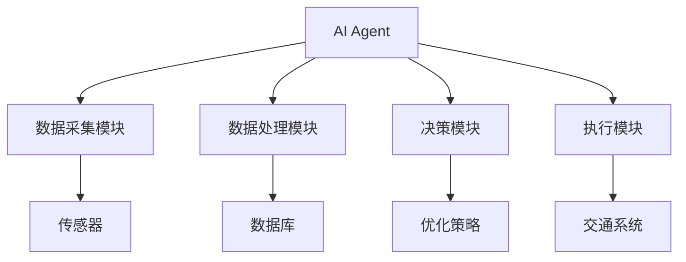
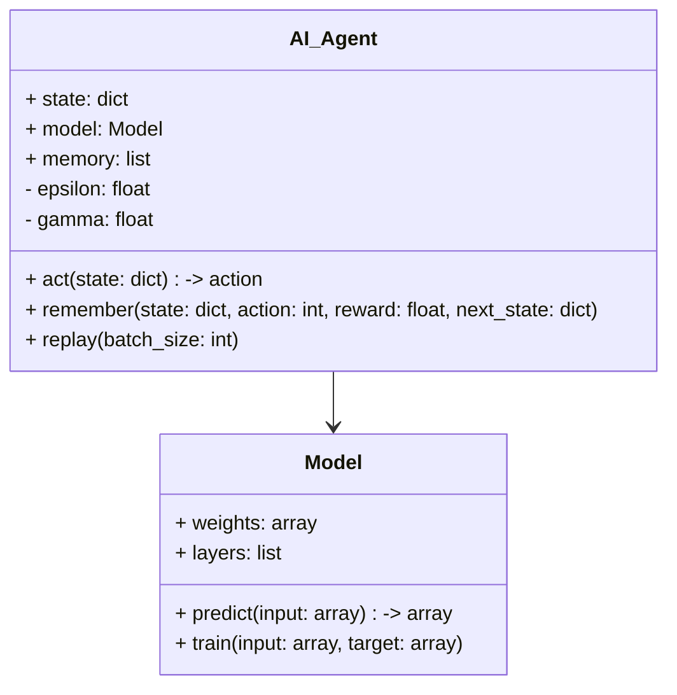
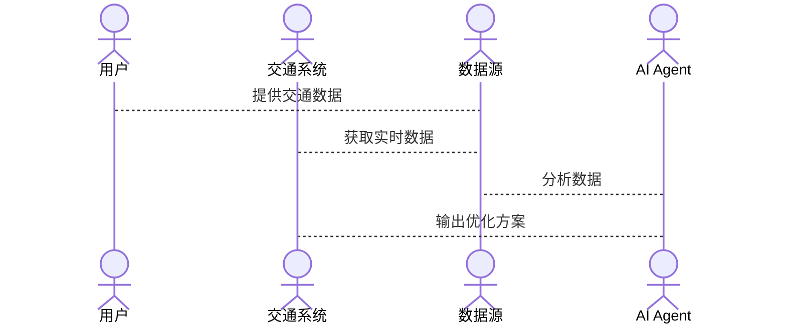

                 


# AI Agent在智能城市交通优化中的应用

## 关键词：AI Agent, 智能交通, 优化算法, 智慧城市, 实时决策

## 摘要：  
随着城市化进程的加快，城市交通问题日益凸显，传统的交通管理方式已难以应对日益复杂的交通需求。AI Agent（人工智能代理）作为一种新兴的技术手段，通过其强大的感知、决策和执行能力，为智能城市交通优化提供了新的解决方案。本文将从AI Agent的基本概念、算法原理、系统架构到实际应用，全面探讨AI Agent在智能城市交通优化中的应用及其未来发展方向。

---

# 第1章: AI Agent在智能城市交通优化中的应用背景

## 1.1 智慧城市建设与交通优化的必要性

### 1.1.1 城市交通问题的背景与现状  
随着城市化进程的加快，城市交通问题日益严峻，主要表现为交通拥堵、资源浪费、环境污染和交通事故频发。传统的交通管理系统依赖于人工干预和固定规则，难以应对动态变化的交通需求。因此，如何利用新兴技术手段优化城市交通系统，成为智慧城市建设中的重要课题。

### 1.1.2 智慧城市建设的核心目标  
智慧城市建设的核心目标是通过智能化的手段，优化资源配置，提高城市运行效率。在交通领域，智慧交通的目标是实现交通系统的智能化、协同化和绿色化。

### 1.1.3 交通优化在智慧城市建设中的重要性  
交通优化是智慧城市建设的重要组成部分，它不仅能够提高交通效率，减少拥堵，还能降低能源消耗和环境污染。通过AI Agent技术，可以实现交通系统的实时优化和动态调整，为智慧城市建设提供有力支持。

## 1.2 AI Agent的基本概念与特点

### 1.2.1 AI Agent的定义与核心功能  
AI Agent是一种能够感知环境、自主决策并执行任务的智能体。在智能城市交通优化中，AI Agent的核心功能包括数据采集、分析、预测和决策。

### 1.2.2 AI Agent在交通优化中的优势  
与传统交通管理系统相比，AI Agent具有以下优势：  
1. **实时性**：能够实时感知交通状况并做出快速响应。  
2. **智能化**：通过机器学习和强化学习，能够不断优化决策策略。  
3. **自主性**：能够在复杂环境中自主决策，减少人工干预。  

### 1.2.3 AI Agent与其他交通优化技术的对比  
AI Agent与传统交通优化技术（如规则引擎、静态优化模型）相比，具有更强的适应性和灵活性。它能够根据实时数据动态调整优化策略，而传统技术则难以应对复杂多变的交通环境。

## 1.3 AI Agent在智能交通中的应用前景

### 1.3.1 AI Agent在交通预测中的潜力  
通过机器学习和大数据分析，AI Agent能够准确预测交通流量和拥堵情况，从而提前采取优化措施。

### 1.3.2 AI Agent在实时交通优化中的作用  
AI Agent能够实时分析交通数据，动态调整信号灯配时、路网规划和交通流量分配，从而提高交通效率。

### 1.3.3 AI Agent在智慧交通生态中的地位  
AI Agent是智慧交通生态系统的核心组成部分，它能够与其他智能设备（如自动驾驶汽车、智能交通信号灯）协同工作，共同构建高效、智能的交通体系。

## 1.4 本章小结  
本章介绍了AI Agent在智能城市交通优化中的应用背景，分析了智慧城市建设的核心目标和交通优化的重要性，详细阐述了AI Agent的基本概念、特点及其在交通优化中的优势，并展望了其应用前景。

---

# 第2章: AI Agent的核心概念与原理

## 2.1 AI Agent的基本原理

### 2.1.1 AI Agent的感知与决策机制  
AI Agent通过传感器、摄像头和其他数据源感知交通环境，利用机器学习算法分析数据，生成决策方案。

### 2.1.2 AI Agent的自主学习能力  
AI Agent能够通过强化学习和深度学习算法不断优化自身的决策模型，提升其在复杂环境中的适应能力。

### 2.1.3 AI Agent的实时响应能力  
AI Agent能够在极短时间内完成数据处理和决策，确保交通优化的实时性和有效性。

## 2.2 AI Agent的核心算法与技术

### 2.2.1 机器学习在AI Agent中的应用  
机器学习算法（如随机森林、支持向量机）用于交通流量预测和模式识别。

### 2.2.2 强化学习在AI Agent中的应用  
强化学习算法（如Q-learning、Deep Q-Network）用于动态调整信号灯配时和路径规划。

### 2.2.3 自然语言处理在AI Agent中的应用  
自然语言处理技术用于解析交通指令和用户反馈，增强AI Agent的交互能力。

## 2.3 AI Agent的实体关系与系统架构

### 2.3.1 实体关系图（ER图）  
以下是AI Agent在智能交通系统中的实体关系图：

```mermaid
erDiagram
    actor 用户
    actor 交通系统
    actor 数据源
    actor AI Agent
    用户 --> 数据源 : 提供交通数据
    交通系统 --> 数据源 : 获取实时数据
    AI Agent --> 数据源 : 分析数据
    AI Agent --> 交通系统 : 输出优化方案
```

### 2.3.2 系统架构图  
以下是AI Agent的系统架构图：



## 2.4 本章小结  
本章详细介绍了AI Agent的核心概念与原理，包括其感知与决策机制、自主学习能力、实时响应能力，以及机器学习、强化学习和自然语言处理等核心算法与技术。同时，通过ER图和系统架构图，清晰展示了AI Agent在智能交通系统中的实体关系和系统架构。

---

# 第3章: AI Agent在智能交通中的算法原理

## 3.1 AI Agent的核心算法流程

### 3.1.1 数据采集与预处理  
AI Agent通过传感器、摄像头和其他数据源采集交通数据，并进行清洗、归一化等预处理步骤。

### 3.1.2 模型训练与优化  
利用机器学习和强化学习算法对数据进行建模和训练，优化模型参数，提升预测准确性和决策效率。

### 3.1.3 实时决策与反馈  
AI Agent根据实时数据生成优化策略，并通过反馈机制不断调整模型参数，提高优化效果。

## 3.2 基于强化学习的AI Agent算法

### 3.2.1 强化学习的基本原理  
强化学习是一种通过试错机制学习最优策略的方法，主要包括状态、动作、奖励和策略四个核心要素。

### 3.2.2 AI Agent在交通优化中的强化学习模型  
以下是一个基于强化学习的AI Agent算法实现示例：

```python
class AI_Agent:
    def __init__(self):
        self.model = self.build_model()
        self.memory = []
        self.gamma = 0.99
        self.epsilon = 1.0
        self.epsilon_min = 0.01
        self.epsilon_decay = 0.995

    def build_model(self):
        # 定义神经网络模型
        model = Sequential()
        model.add(Dense(64, activation='relu', input_dim=10))
        model.add(Dense(32, activation='relu'))
        model.add(Dense(1, activation='linear'))
        model.compile(optimizer='adam', loss='mean_squared_error')
        return model

    def remember(self, state, action, reward, next_state):
        self.memory.append((state, action, reward, next_state))

    def act(self, state):
        if random.random() < self.epsilon:
            return random.randint(0, 2)  # 动作空间：0,1,2
        else:
            return self.model.predict(state)[0]

    def replay(self, batch_size):
        if len(self.memory) < batch_size:
            return
        minibatch = random.sample(self.memory, batch_size)
        for state, action, reward, next_state in minibatch:
            target = reward + self.gamma * np.max(self.model.predict(next_state)[0])
            target_f = self.model.predict(state)
            target_f[0][action] = target
            self.model.fit(state, target_f, epochs=1, verbose=0)
        self.epsilon = max(self.epsilon_min, self.epsilon * self.epsilon_decay)
```

### 3.2.3 算法实现步骤  
1. 初始化AI Agent模型和参数。  
2. 通过传感器采集交通数据并存储。  
3. 根据当前状态选择动作（如调整信号灯配时）。  
4. 执行动作并观察奖励（如减少拥堵）。  
5. 回放经验并更新模型参数。  

## 3.3 基于机器学习的AI Agent算法

### 3.3.1 机器学习的基本原理  
机器学习是一种通过数据训练模型，使其能够进行预测和分类的技术。

### 3.3.2 AI Agent在交通预测中的机器学习模型  
以下是一个基于机器学习的AI Agent算法实现示例：

```python
from sklearn.ensemble import RandomForestRegressor

class ML-Agent:
    def __init__(self):
        self.model = RandomForestRegressor(n_estimators=100)

    def train(self, X, y):
        self.model.fit(X, y)

    def predict(self, X):
        return self.model.predict(X)
```

### 3.3.3 算法实现步骤  
1. 采集和预处理交通数据。  
2. 利用机器学习算法训练模型。  
3. 使用训练好的模型进行交通流量预测。  

## 3.4 本章小结  
本章详细介绍了AI Agent在智能交通中的算法原理，包括数据采集与预处理、模型训练与优化，以及基于强化学习和机器学习的算法实现。通过具体的Python代码示例，展示了AI Agent在交通优化中的应用。

---

# 第4章: AI Agent的系统分析与架构设计

## 4.1 问题场景介绍  
在智能交通系统中，AI Agent需要解决的主要问题包括交通拥堵预测、信号灯优化、路径规划和资源分配等。

## 4.2 系统功能设计  
以下是系统功能设计的类图：



## 4.3 系统架构设计  
以下是系统架构设计的架构图：


## 4.4 系统接口设计  
系统接口设计包括数据输入接口、模型训练接口和优化策略输出接口。

## 4.5 系统交互设计  
以下是系统交互设计的序列图：



## 4.6 本章小结  
本章详细分析了AI Agent在智能交通系统中的系统架构设计，包括功能设计、架构图、接口设计和交互流程。通过Mermaid图，清晰展示了系统各部分之间的关系和交互过程。

---

# 第5章: AI Agent在智能交通中的项目实战

## 5.1 环境安装与配置

### 5.1.1 安装Python环境  
安装Python 3.8及以上版本，并安装必要的库（如TensorFlow、Keras、Scikit-learn等）。

### 5.1.2 安装AI Agent框架  
安装AI Agent框架（如OpenAI Gym、TensorFlow等）。

## 5.2 系统核心功能实现

### 5.2.1 数据采集与预处理  
编写代码采集交通数据并进行预处理。

```python
import pandas as pd
import numpy as np

# 数据采集与预处理
data = pd.read_csv('traffic_data.csv')
data = data.dropna()
data = (data - data.mean()) / data.std()  # 标准化
```

### 5.2.2 模型训练与优化  
训练强化学习模型并进行优化。

```python
from tensorflow.keras import layers

# 强化学习模型
model = Sequential()
model.add(layers.Dense(64, activation='relu', input_dim=10))
model.add(layers.Dense(32, activation='relu'))
model.add(layers.Dense(1, activation='linear'))
model.compile(optimizer='adam', loss='mean_squared_error')
```

### 5.2.3 实时决策与反馈  
实现AI Agent的实时决策功能，并根据反馈不断优化模型。

```python
def update_model(reward):
    # 根据奖励更新模型参数
    pass
```

## 5.3 项目实战案例分析

### 5.3.1 案例背景与目标  
案例背景：某城市中心区域交通拥堵问题严重，希望通过AI Agent技术优化信号灯配时。

### 5.3.2 数据分析与模型训练  
分析交通数据，训练强化学习模型，预测交通流量和拥堵情况。

### 5.3.3 实时优化与效果展示  
通过AI Agent实时调整信号灯配时，观察交通流量的变化和拥堵情况的改善。

## 5.4 本章小结  
本章通过一个实际案例，详细介绍了AI Agent在智能交通中的项目实战过程，包括环境安装、核心功能实现、实时优化与效果展示。

---

# 第6章: AI Agent在智能交通中的最佳实践

## 6.1 最佳实践总结

### 6.1.1 系统设计与优化  
建议在设计AI Agent系统时，充分考虑系统的实时性、可扩展性和可维护性。

### 6.1.2 算法选择与调优  
根据具体场景选择合适的算法，并进行参数调优，提升模型性能。

### 6.1.3 数据采集与处理  
确保数据的准确性和完整性，采用有效的数据预处理方法，提高模型训练效果。

## 6.2 注意事项与常见问题

### 6.2.1 系统性能问题  
AI Agent的实时性和响应速度直接影响优化效果，需注意系统性能的优化。

### 6.2.2 数据隐私与安全  
在数据采集和处理过程中，需注意数据隐私和安全问题，确保符合相关法律法规。

### 6.2.3 系统稳定性与可靠性  
AI Agent系统需要具备高稳定性和可靠性，确保在复杂环境中的正常运行。

## 6.3 拓展阅读与学习资源

### 6.3.1 强化学习相关书籍  
《Deep Reinforcement Learning》、《Reinforcement Learning: Theory and Algorithms》。

### 6.3.2 机器学习相关书籍  
《Hands-On Machine Learning with Scikit-Learn, Keras, and TensorFlow》、《An Introduction to Statistical Learning》。

### 6.3.3 AI Agent相关研究论文  
建议查阅近年来关于AI Agent在智能交通中的应用研究论文，获取最新研究成果。

## 6.4 本章小结  
本章总结了AI Agent在智能交通中的最佳实践，提出了系统设计与优化、算法选择与调优、数据采集与处理等方面的建议，并列举了注意事项和拓展学习资源。

---

# 作者：AI天才研究院/AI Genius Institute & 禅与计算机程序设计艺术 /Zen And The Art of Computer Programming

