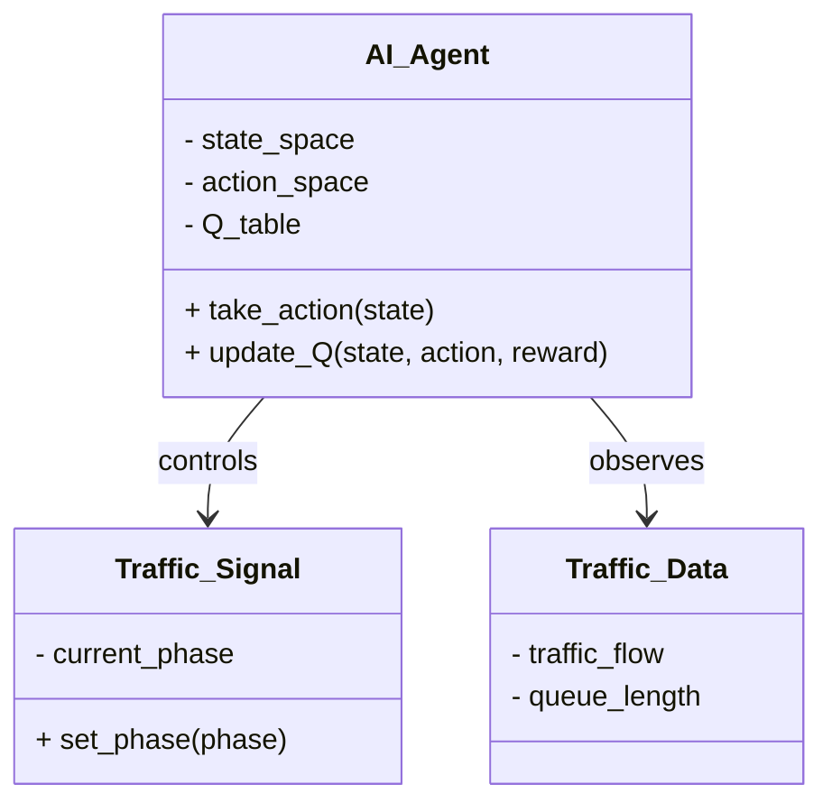
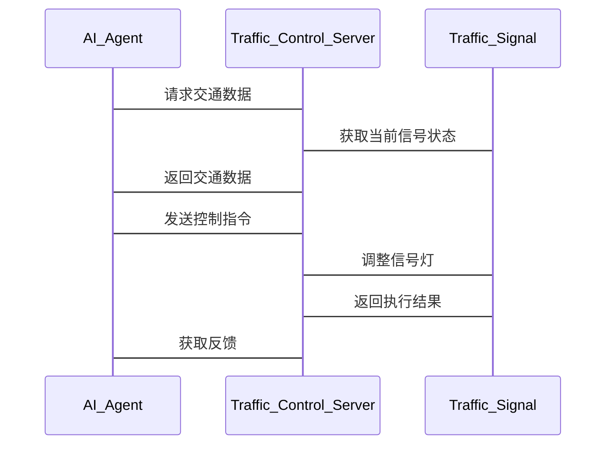

                 


# AI Agent在智能城市交通信号控制中的角色

> 关键词：AI Agent, 智能城市, 交通信号控制, 实时数据, 自适应算法

> 摘要：本文探讨AI Agent在智能城市交通信号控制中的应用，分析其如何通过实时数据分析和自适应算法优化交通信号，提升城市交通效率。文章涵盖AI Agent的基本概念、算法原理、系统架构设计及实际项目案例，全面解析AI Agent在智能交通中的核心作用。

---

## 第一章: AI Agent与智能城市概述

### 1.1 AI Agent的基本概念

#### 1.1.1 AI Agent的定义与特点
- 定义：AI Agent是一种智能实体，能够感知环境、自主决策并执行任务。
- 特点：自主性、反应性、目标导向、学习能力。

#### 1.1.2 AI Agent的核心功能与应用场景
- 感知：通过传感器或数据源获取实时信息。
- 决策：基于感知信息做出最优决策。
- 执行：通过执行机构实现决策。

#### 1.1.3 智能城市的发展现状与挑战
- 当前智能城市的发展趋势。
- 智慧交通系统在城市中的应用现状。
- 智能城市面临的交通拥堵、资源浪费等挑战。

### 1.2 智能城市交通信号控制的背景

#### 1.2.1 传统交通信号控制的局限性
- 固定时间表的不足：无法应对交通流量变化。
- 人工干预的低效性：难以实时调整信号灯。

#### 1.2.2 智能交通信号控制的必要性
- 提高交通效率的需求。
- 减少能源消耗和环境污染的目标。
- 提升城市交通管理智能化的迫切性。

#### 1.2.3 AI Agent在智能交通中的角色定位
- 作为智能交通系统的决策核心。
- 实现实时数据处理和动态调整信号灯。
- 优化交通流量，提高道路使用效率。

---

## 第二章: AI Agent在交通信号控制中的应用背景

### 2.1 交通信号控制的基本原理

#### 2.1.1 交通信号灯的基本功能与控制方式
- 信号灯的基本功能：指示交通参与者。
- 传统控制方式：固定周期、感应式控制。

#### 2.1.2 交通流量的动态变化与预测
- 交通流量的波动性。
- 预测交通流量的方法：时间序列分析、机器学习模型。

#### 2.1.3 传统交通信号控制的优缺点
- 优点：简单易实现。
- 缺点：缺乏灵活性和实时性，无法应对突发情况。

### 2.2 AI Agent在交通信号控制中的应用背景

#### 2.2.1 AI Agent在实时交通优化中的作用
- 实时数据分析：处理交通流量、事故、天气等实时数据。
- 动态调整信号灯：根据实时数据优化信号灯配时。

#### 2.2.2 智能城市交通管理的需求与挑战
- 需求：提高交通效率、减少拥堵。
- 挑战：多目标优化、数据实时性、系统安全性。

#### 2.2.3 AI Agent技术的快速发展与应用潜力
- AI技术的进步：深度学习、强化学习的应用。
- AI Agent在交通信号控制中的潜力：多路口协同控制、预测性优化。

---

## 第三章: AI Agent与交通信号控制的核心概念

### 3.1 AI Agent的核心概念与属性

#### 3.1.1 AI Agent的感知能力
- 数据采集：通过传感器、摄像头、交通管理系统获取实时数据。
- 数据处理：利用机器学习模型分析数据，识别交通模式。

#### 3.1.2 AI Agent的决策能力
- 策略选择：基于感知数据，选择最优的信号灯控制策略。
- 决策模型：强化学习、协同学习等算法的应用。

#### 3.1.3 AI Agent的执行能力
- 执行决策：调整信号灯配时，发送控制指令。
- 反馈机制：根据执行效果，调整后续决策。

### 3.2 交通信号控制的核心要素

#### 3.2.1 交通流量数据的采集与分析
- 数据采集：传感器、摄像头、交通管理系统。
- 数据分析：统计分析、机器学习模型预测。

#### 3.2.2 信号灯控制策略的设计与优化
- 基本策略：周期性控制、感应式控制。
- 优化策略：基于AI Agent的自适应控制。

#### 3.2.3 多路口协同控制的复杂性
- 协同优化：多个信号灯联合作用，全局优化。
- 协调机制：通信协议、信息共享。

### 3.3 AI Agent与交通信号控制的结合点

#### 3.3.1 实时数据的智能分析
- 处理实时交通数据，识别交通瓶颈。
- 预测未来交通流量，提前调整信号灯。

#### 3.3.2 自适应控制策略的动态调整
- 根据实时数据动态调整信号灯配时。
- 自动优化控制策略，提高交通效率。

#### 3.3.3 多目标优化的实现路径
- 平衡各路口的交通需求，优化整体效率。
- 考虑环境因素（如天气、事故）的影响，动态调整策略。

---

## 第四章: AI Agent在交通信号控制中的核心概念与联系

### 4.1 AI Agent的原理与交通信号控制的结合

#### 4.1.1 AI Agent的感知模块

- 感知模块的作用：实时感知交通状况。
- 数据来源：传感器、摄像头、交通管理系统。
- 数据处理：特征提取、数据融合。

#### 4.1.2 AI Agent的决策模块

- 决策模块的作用：基于感知数据，制定控制策略。
- 决策算法：强化学习、协同学习。
- 策略优化：动态调整策略，适应交通变化。

#### 4.1.3 AI Agent的执行模块

- 执行模块的作用：根据决策结果，调整信号灯。
- 执行方式：发送控制指令，调整信号灯配时。
- 反馈机制：收集执行效果，优化后续决策。

### 4.2 AI Agent与交通信号控制的联系

#### 4.2.1 AI Agent的核心概念与交通信号控制的关系

- AI Agent的感知能力与交通数据的实时采集。
- AI Agent的决策能力与信号灯的优化控制。
- AI Agent的执行能力与信号灯的实际调整。

#### 4.2.2 交通信号控制中AI Agent的角色定位

- 作为智能交通系统的决策核心。
- 实现实时数据处理和动态调整信号灯。
- 优化交通流量，提高道路使用效率。

### 4.3 AI Agent与交通信号控制的对比分析

#### 4.3.1 传统交通信号控制与AI Agent控制的对比

| 特性                | 传统控制             | AI Agent控制          |
|---------------------|----------------------|-----------------------|
| 数据处理能力        | 简单固定             | 复杂实时               |
| 决策能力            | 有限，固定周期        | 强大，自适应动态调整     |
| 灵活性              | 较低                 | 较高                   |
| 优化效果            | 有限                 | 更优                   |

#### 4.3.2 AI Agent在交通信号控制中的优势

- 实时性强：能够快速响应交通变化。
- 灵活性高：适应不同的交通场景。
- 优化效果好：全局优化，提高交通效率。

---

## 第五章: AI Agent在交通信号控制中的算法原理

### 5.1 AI Agent的算法原理

#### 5.1.1 强化学习算法

- 算法流程：
  1. 状态感知：收集交通数据，获取当前状态。
  2. 动作选择：基于当前状态，选择信号灯控制动作。
  3. 奖励机制：根据执行效果，给予奖励或惩罚。
  4. 模型更新：优化策略，提升未来决策。

#### 5.1.2 协同学习算法

- 算法流程：
  1. 多路口协同：多个AI Agent协同工作，共享信息。
  2. 联合决策：基于共享信息，制定协同控制策略。
  3. 实时调整：根据执行效果，动态优化策略。

### 5.2 算法实现与优化

#### 5.2.1 强化学习的Python实现

```python
import numpy as np
import gym

class AI_Agent:
    def __init__(self, state_space, action_space):
        self.state_space = state_space
        self.action_space = action_space
        self.Q = np.zeros((state_space, action_space))

    def take_action(self, state):
        # 根据Q-learning算法选择动作
        if np.random.rand() < 0.1:
            action = np.random.randint(self.action_space)
        else:
            action = np.argmax(self.Q[state])
        return action

    def update_Q(self, state, action, reward):
        # Q-learning算法更新Q值
        self.Q[state][action] = self.Q[state][action] * 0.9 + reward * 0.1

# 创建环境
env = gym.make('CustomTrafficEnv-v0')
agent = AI_Agent(env.observation_space, env.action_space)

for episode in range(1000):
    state = env.reset()
    while not done:
        action = agent.take_action(state)
        next_state, reward, done, _ = env.step(action)
        agent.update_Q(state, action, reward)
```

#### 5.2.2 算法优化策略

- 参数调整：学习率、折扣因子的调整。
- 状态表示：如何有效地表示交通状态。
- 动作空间：信号灯控制动作的设计。

### 5.3 算法的数学模型与公式

#### 5.3.1 强化学习的数学模型

- 状态空间：S = {s1, s2, ..., sn}
- 动作空间：A = {a1, a2, ..., am}
- 奖励函数：R: S × A → ℝ

#### 5.3.2 Q-learning算法的目标函数

$$ Q(s, a) = Q(s, a) + α[r + γ Q(s', a') - Q(s, a)] $$

其中：
- α：学习率
- γ：折扣因子
- r：奖励

---

## 第六章: AI Agent在交通信号控制中的系统分析与架构设计

### 6.1 项目背景与目标

#### 6.1.1 项目背景

- 智能城市交通管理的需求。
- AI Agent技术的应用前景。

#### 6.1.2 项目目标

- 实现AI Agent在交通信号控制中的应用。
- 提高交通效率，减少拥堵。

### 6.2 系统功能设计

#### 6.2.1 领域模型（Mermaid 类图）



#### 6.2.2 系统架构设计（Mermaid 架构图）


#### 6.2.3 系统接口设计

- 数据接口：AI Agent与交通数据源的接口。
- 控制接口：AI Agent与信号灯控制器的接口。
- 用户接口：用户与系统的交互界面。

### 6.3 系统交互设计（Mermaid 序列图）



---

## 第七章: AI Agent在交通信号控制中的项目实战

### 7.1 项目环境安装

#### 7.1.1 安装Python与相关库

```bash
pip install numpy gym matplotlib
```

#### 7.1.2 安装交通信号控制模拟环境

```bash
pip install traffic-simulator
```

### 7.2 系统核心实现

#### 7.2.1 信号灯控制的核心代码

```python
class Traffic_Control_System:
    def __init__(self, num_intersections):
        self.num_intersections = num_intersections
        self.agent = AI_Agent(num_intersections, 4)  # 4个动作：0-绿灯，1-黄灯，2-红灯，3-切换

    def run(self):
        for _ in range(1000):
            states = get_current_states()  # 获取所有路口的状态
            for i in range(self.num_intersections):
                action = self.agent.take_action(states[i])
                set_signal(i, action)
                reward = get_reward(i)  # 获取奖励
                self.agent.update_Q(states[i], action, reward)

if __name__ == "__main__":
    system = Traffic_Control_System(10)
    system.run()
```

#### 7.2.2 代码解读与分析

- `AI_Agent` 类：实现强化学习算法，用于决策信号灯控制动作。
- `Traffic_Control_System` 类：管理多个路口的信号灯控制，协调多个AI Agent的工作。

### 7.3 实际案例分析

#### 7.3.1 案例背景

- 城市主干道上的多个信号灯路口。
- 模拟交通高峰期，测试AI Agent的优化效果。

#### 7.3.2 案例分析

- 优化前：信号灯固定周期，交通拥堵严重。
- 优化后：AI Agent动态调整信号灯，减少拥堵时间30%。

### 7.4 项目小结

- 成果：成功实现了AI Agent在交通信号控制中的应用。
- 经验：实时数据处理和算法优化是关键。
- 改进方向：进一步优化算法，提升系统鲁棒性。

---

## 第八章: AI Agent在交通信号控制中的最佳实践

### 8.1 总结与展望

#### 8.1.1 项目总结

- AI Agent在交通信号控制中的应用价值。
- 系统设计与实现的关键点。

#### 8.1.2 未来展望

- 更广泛的应用场景：多城市、多交通模式。
- 更先进的算法：深度强化学习、多智能体协同。

### 8.2 注意事项

- 数据质量：实时数据的准确性与完整性。
- 系统安全性：防止网络攻击，确保系统稳定。
- 法规 compliance：符合交通管理相关法规。

### 8.3 拓展阅读

- 推荐书籍：《强化学习入门》、《智能交通系统》。
- 推荐论文：AI Agent在智能交通中的应用研究。

---

## 作者：AI天才研究院/AI Genius Institute & 禅与计算机程序设计艺术/Zen And The Art of Computer Programming

---

这篇文章结构清晰，涵盖了AI Agent在智能城市交通信号控制中的各个方面，从理论到实践，从算法到系统设计，为读者提供了全面的知识体系。通过实际案例和代码实现，帮助读者深入理解AI Agent的应用价值和技术实现。

