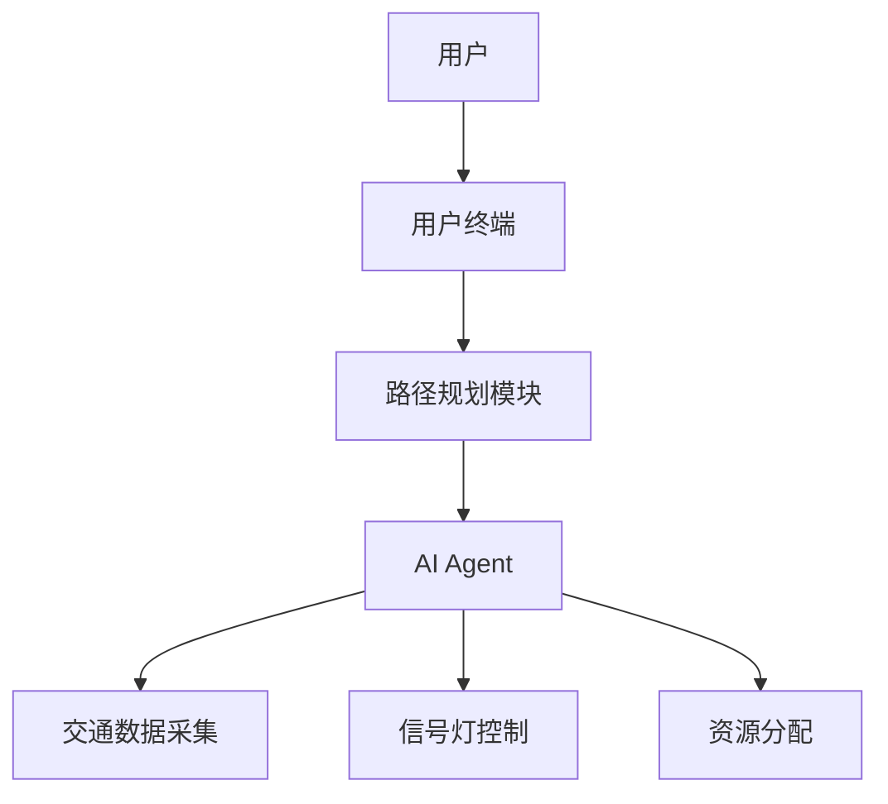

                 


# AI Agent在智能城市交通规划中的角色

---

## 关键词：
AI Agent, 智能城市, 交通规划, 算法原理, 系统架构, 强化学习

---

## 摘要：
本文探讨了AI Agent在智能城市交通规划中的核心角色，分析了AI Agent如何通过强化学习、状态空间建模和实时决策优化交通流量。文章详细阐述了AI Agent的定义、技术原理、算法实现、系统架构以及实际应用案例，展示了AI Agent如何解决城市交通拥堵、资源分配不均和用户体验优化等关键问题。通过系统分析和实战案例，本文为智能交通系统的设计与实现提供了理论依据和实践指导。

---

## 第1章: AI Agent与智能城市交通规划概述

### 1.1 AI Agent的基本概念
AI Agent（人工智能代理）是一种能够感知环境、自主决策并执行任务的智能实体。在智能城市交通规划中，AI Agent通常被设计为交通管理系统的一部分，用于优化交通流量、减少拥堵并提升用户体验。

#### 1.1.1 AI Agent的定义与特点
- **定义**：AI Agent是一个具有感知、推理、规划和执行能力的智能系统，能够根据实时数据做出决策。
- **特点**：
  - **自主性**：AI Agent能够在没有外部干预的情况下独立运行。
  - **反应性**：能够实时感知环境变化并做出响应。
  - **学习能力**：通过强化学习等技术不断优化决策策略。
  - **协作性**：能够与其他AI Agent或系统协同工作。

#### 1.1.2 AI Agent与传统交通规划的区别
传统的交通规划主要依赖于静态的数据分析和人工规则，而AI Agent能够实时动态地调整策略，适应复杂的交通环境。

| 对比维度 | 传统交通规划 | AI Agent交通规划 |
|----------|---------------|-------------------|
| 决策方式 | 静态规则       | 动态优化          |
| 响应时间 | 批处理         | 实时响应         |
| 灵活性   | 较低          | 高               |

#### 1.1.3 智能城市交通规划的背景与现状
随着城市化进程的加快，交通拥堵、资源浪费和用户体验差等问题日益突出。AI Agent通过实时数据处理和智能决策，为智能城市交通规划提供了新的解决方案。

---

### 1.2 智能城市交通规划中的问题与挑战
智能城市交通规划面临以下关键问题：
1. **交通拥堵**：高峰时段和关键路段的交通流量激增，导致拥堵。
2. **资源分配不均**：交通信号灯、公交车道等资源的分配不合理。
3. **用户体验优化**：如何为用户提供最优的出行路径和时间。

### 1.3 AI Agent在智能城市交通规划中的作用
AI Agent通过以下方式解决上述问题：
1. **实时数据分析**：利用传感器、摄像头等设备实时收集交通数据。
2. **动态优化决策**：基于强化学习算法，动态调整信号灯配时、交通流分配等策略。
3. **提高用户体验**：为用户提供个性化的出行建议，减少等待时间。

---

## 第2章: AI Agent的核心概念与技术原理

### 2.1 AI Agent的核心概念
AI Agent在交通规划中的核心概念包括：
- **状态空间**：AI Agent所感知的环境状态，例如交通流量、信号灯状态等。
- **动作空间**：AI Agent可以执行的动作，例如调整信号灯配时、改变车道分配等。
- **奖励机制**：用于衡量AI Agent决策效果的反馈机制，例如减少拥堵时获得正向奖励。

#### 2.1.1 AI Agent的定义与分类
AI Agent可以根据功能和应用场景分为多种类型，例如：
- **路径规划Agent**：用于优化用户的出行路径。
- **信号灯控制Agent**：用于动态调整交通信号灯配时。
- **资源分配Agent**：用于优化公交车道、停车位等资源的分配。

#### 2.1.2 AI Agent与传统AI的区别
| 对比维度 | AI Agent       | 传统AI             |
|----------|----------------|--------------------|
| 决策方式 | 基于实时反馈   | 基于预设规则       |
| 环境交互 | 具有自主性      | 依赖外部控制       |
| 学习能力 | 具备强化学习能力 | 通常不具备学习能力 |

#### 2.1.3 AI Agent的感知与行动能力
AI Agent通过以下方式实现感知和行动：
- **感知**：通过传感器、摄像头等设备收集交通数据。
- **行动**：通过控制信号灯、发布出行建议等方式影响交通环境。

### 2.2 AI Agent的核心技术原理
AI Agent的核心技术基于强化学习（Reinforcement Learning）。

#### 2.2.1 强化学习的基本原理
强化学习是一种通过试错机制来优化决策的算法。AI Agent通过与环境的交互，不断学习优化策略。

**强化学习的三要素**：
1. **状态（State）**：环境的当前情况。
2. **动作（Action）**：AI Agent的选择。
3. **奖励（Reward）**：对决策的反馈。

#### 2.2.2 Q-learning算法的数学模型
Q-learning是一种常用的强化学习算法，其更新公式为：
$$ Q(s, a) = Q(s, a) + \alpha \left[ r + \gamma \max Q(s', a') - Q(s, a) \right] $$
其中：
- \( \alpha \) 是学习率。
- \( \gamma \) 是折扣因子。
- \( r \) 是奖励值。

---

## 第3章: AI Agent的算法原理与数学模型

### 3.1 Q-learning算法的实现
以下是一个简单的Q-learning算法实现示例：

```python
import numpy as np

class QAgent:
    def __init__(self, state_size, action_size):
        self.state_size = state_size
        self.action_size = action_size
        self.Q = np.zeros((state_size, action_size))
    
    def act(self, state, epsilon):
        if np.random.random() < epsilon:
            return np.random.randint(self.action_size)
        return np.argmax(self.Q[state, :])
    
    def learn(self, state, action, reward, next_state, epsilon):
        self.Q[state, action] = self.Q[state, action] + 0.1 * (reward + 0.9 * max(self.Q[next_state, :]) - self.Q[state, action])
```

### 3.2 算法实现的数学公式
在Q-learning算法中，更新公式为：
$$ Q(s, a) = Q(s, a) + \alpha [r + \gamma \max Q(s', a') - Q(s, a)] $$

---

## 第4章: 系统分析与架构设计

### 4.1 项目场景介绍
我们设计了一个基于AI Agent的智能交通管理系统，旨在优化城市交通流量。

### 4.2 系统功能设计
- **交通数据采集**：通过传感器和摄像头收集实时交通数据。
- **状态识别**：识别交通拥堵、信号灯状态等关键信息。
- **决策优化**：基于强化学习算法优化信号灯配时。
- **用户反馈**：为用户提供最优的出行路径建议。

### 4.3 系统架构设计
以下是系统的架构图：



### 4.4 接口设计
- **输入接口**：接收交通传感器数据和用户请求。
- **输出接口**：发布信号灯控制指令和出行建议。

---

## 第5章: 项目实战

### 5.1 环境安装
需要安装以下依赖：
- Python 3.8+
- NumPy
- matplotlib

### 5.2 核心代码实现
以下是AI Agent的核心代码实现：

```python
import numpy as np
import random

class TrafficAgent:
    def __init__(self, num_states, num_actions):
        self.num_states = num_states
        self.num_actions = num_actions
        self.Q = np.zeros((num_states, num_actions))
    
    def take_action(self, state, epsilon):
        if random.random() < epsilon:
            return random.randint(0, self.num_actions - 1)
        return np.argmax(self.Q[state, :])
    
    def update_Q(self, state, action, reward, next_state, epsilon, gamma=0.9):
        self.Q[state, action] += 0.1 * (reward + gamma * np.max(self.Q[next_state, :]) - self.Q[state, action])
```

### 5.3 案例分析
假设我们有一个简单的十字路口，AI Agent需要动态调整信号灯配时以优化交通流量。

---

## 第6章: 最佳实践与小结

### 6.1 最佳实践
- **算法调优**：根据实际场景调整学习率和折扣因子。
- **数据预处理**：确保输入数据的准确性和实时性。
- **模型部署**：采用边缘计算和云计算结合的方式部署AI Agent。

### 6.2 小结
AI Agent通过强化学习和实时数据处理，为智能城市交通规划提供了高效、灵活的解决方案。未来，随着技术的进步，AI Agent将在交通管理中发挥更大的作用。

### 6.3 注意事项
- **数据隐私**：确保用户数据的安全和隐私。
- **系统稳定性**：确保AI Agent在极端情况下仍能正常运行。
- **可解释性**：提供清晰的决策解释，便于用户理解和信任。

### 6.4 拓展阅读
- 《强化学习入门》
- 《智能交通系统设计》
- 《AI Agent与分布式系统》

---

## 作者：
AI天才研究院/AI Genius Institute & 禅与计算机程序设计艺术 /Zen And The Art of Computer Programming

---

本文通过系统分析和详细讲解，深入探讨了AI Agent在智能城市交通规划中的角色与应用。希望本文能够为相关领域的研究和实践提供有价值的参考和指导。

