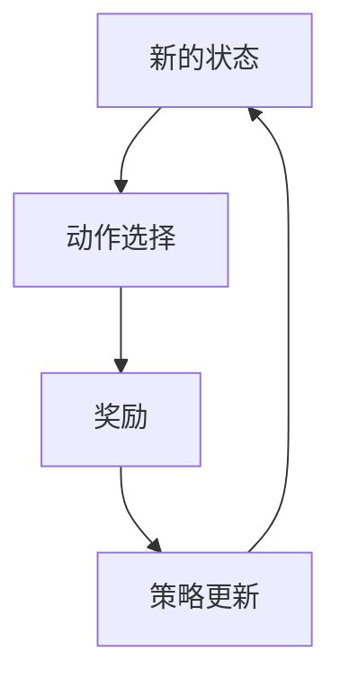
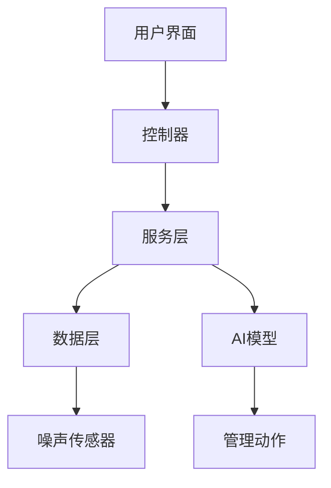

                 


# AI Agent在智能城市噪声管理中的实践

> 关键词：AI Agent, 智能城市, 噪声管理, 强化学习, 系统架构, 项目实战

> 摘要：本文深入探讨了AI Agent在智能城市噪声管理中的应用，从理论基础到实际案例，详细分析了AI Agent如何通过强化学习算法优化城市噪声管理，构建了系统的架构设计，并通过项目实战展示了如何在实际环境中部署和应用这些技术。文章还提供了丰富的图表和代码示例，帮助读者更好地理解和实践AI Agent在智能城市噪声管理中的应用。

---

## 第1章：AI Agent与智能城市噪声管理的背景

### 1.1 问题背景与挑战

城市化进程的加速带来了许多环境问题，其中噪声污染是一个不容忽视的问题。随着城市人口的增加，交通、工业和建筑活动产生的噪声对居民的生活质量造成了严重影响。传统的噪声管理方法依赖于人工监控和简单的自动化设备，效率低下且难以应对复杂的城市环境。

AI Agent（人工智能代理）作为一种能够感知环境、自主决策的智能体，为解决城市噪声管理问题提供了新的思路。AI Agent可以通过实时数据采集、分析和决策，帮助城市管理者更高效地应对噪声污染。

### 1.2 智能城市噪声管理的定义与目标

智能城市噪声管理是指通过智能化的感知、分析和决策系统，对城市环境中的噪声源进行实时监控和管理，以减少噪声污染对居民生活和城市环境的影响。其核心目标包括：

1. 实时监测噪声源的位置和强度。
2. 预测噪声传播路径和影响范围。
3. 自动优化噪声源的管理策略，例如调整交通信号灯或限制工业噪声排放。

### 1.3 AI Agent在噪声管理中的应用前景

AI Agent在噪声管理中的应用前景广阔。通过强化学习和实时数据处理，AI Agent可以实现以下目标：

1. **实时优化**：根据实时噪声数据调整管理策略，例如动态调整交通信号灯以减少交通噪声。
2. **预测与预防**：预测噪声污染的高发区域和时间，提前采取预防措施。
3. **智能决策**：基于历史数据和实时信息，做出最优的噪声管理决策。

---

## 第2章：AI Agent的核心概念与原理

### 2.1 AI Agent的定义与分类

AI Agent是一种能够感知环境、自主决策并采取行动的智能体。它可以分为以下几类：

1. **反应式AI Agent**：基于当前环境输入做出反应，不依赖于内部状态。
2. **认知式AI Agent**：具有复杂的状态表示和决策逻辑，能够进行推理和规划。
3. **学习型AI Agent**：通过机器学习算法不断优化自身的决策策略。

### 2.2 实体关系与系统架构

在智能城市噪声管理中，AI Agent的系统架构可以通过以下实体关系图表示：

```mermaid
er
actor "城市管理者" -->
noise_source "噪声源" -->
sensor "噪声传感器" -->
data_center "数据处理中心" -->
action "管理动作"
```

该架构展示了城市管理者如何通过AI Agent与噪声源、传感器和数据处理中心进行交互，最终实现对噪声的管理。

---

## 第3章：AI Agent的算法原理

### 3.1 基于强化学习的AI Agent算法

#### 3.1.1 算法原理

强化学习是一种通过试错方式优化决策策略的算法。在噪声管理中，AI Agent通过与环境的交互获得奖励，逐步优化自身的决策策略。

以下是强化学习的基本流程：

1. **状态感知**：AI Agent感知当前环境状态，例如噪声传感器的数据。
2. **动作选择**：基于当前状态，AI Agent选择一个动作，例如调整交通信号灯。
3. **奖励机制**：环境对AI Agent的动作给予奖励或惩罚，例如减少噪声污染会获得正奖励。
4. **策略优化**：AI Agent根据奖励调整其决策策略，以最大化长期奖励。

#### 3.1.2 算法流程图



#### 3.1.3 数学模型与公式

强化学习的核心是Q-learning算法，其数学模型如下：

$$ Q(s, a) = Q(s, a) + \alpha \left( r + \gamma \max Q(s', a') - Q(s, a) \right) $$

其中：
- \( Q(s, a) \)：状态 \( s \) 下选择动作 \( a \) 的期望奖励。
- \( \alpha \)：学习率。
- \( r \)：即时奖励。
- \( \gamma \)：折扣因子。
- \( s' \)：新的状态。

---

## 第4章：系统分析与架构设计

### 4.1 问题场景介绍

在智能城市噪声管理中，AI Agent需要处理以下问题场景：

1. **多源噪声干扰**：城市中有多种噪声源，如交通、工业和建筑噪声。
2. **实时性要求高**：噪声管理需要快速响应，以避免噪声污染的扩散。
3. **数据处理复杂**：需要处理大量的噪声传感器数据，并实时分析。

### 4.2 系统功能设计

系统功能设计包括以下部分：

1. **数据采集**：通过噪声传感器采集实时噪声数据。
2. **数据处理**：对噪声数据进行预处理和分析，识别噪声源的位置和强度。
3. **决策制定**：基于强化学习算法，生成最优的噪声管理策略。
4. **执行反馈**：根据决策结果，执行管理动作，并反馈结果到系统。

### 4.3 系统架构设计

以下是系统的架构设计：



### 4.4 系统接口设计

系统接口设计包括以下部分：

1. **传感器接口**：接收噪声传感器的数据。
2. **用户接口**：提供给城市管理者查看噪声数据和管理策略的界面。
3. **模型接口**：与AI模型交互，获取决策结果。

---

## 第5章：项目实战

### 5.1 环境安装

#### 5.1.1 Python环境安装

安装Python和必要的库：

```bash
pip install numpy matplotlib scikit-learn
```

#### 5.1.2 系统核心实现

以下是基于Q-learning算法的核心代码：

```python
import numpy as np
import random

class QLearningAgent:
    def __init__(self, state_space_size, action_space_size):
        self.q_table = np.zeros((state_space_size, action_space_size))
    
    def choose_action(self, state, epsilon=0.1):
        if random.random() < epsilon:
            return random.randint(0, action_space_size-1)
        else:
            return np.argmax(self.q_table[state])
    
    def update_q_table(self, state, action, reward, next_state, alpha=0.1, gamma=0.9):
        self.q_table[state, action] += alpha * (reward + gamma * np.max(self.q_table[next_state]) - self.q_table[state, action])
```

### 5.2 代码实现与解读

#### 5.2.1 算法实现

以下是完整的Q-learning算法实现：

```python
class QLearningAgent:
    def __init__(self, state_space_size, action_space_size):
        self.q_table = np.zeros((state_space_size, action_space_size))
    
    def choose_action(self, state, epsilon=0.1):
        if random.random() < epsilon:
            return random.randint(0, action_space_size-1)
        else:
            return np.argmax(self.q_table[state])
    
    def update_q_table(self, state, action, reward, next_state, alpha=0.1, gamma=0.9):
        self.q_table[state, action] += alpha * (reward + gamma * np.max(self.q_table[next_state]) - self.q_table[state, action])
```

#### 5.2.2 实际案例分析

假设我们有一个简单的城市噪声管理场景，AI Agent需要通过调整交通信号灯来减少交通噪声。以下是具体的实现步骤：

1. **数据采集**：噪声传感器收集交通噪声数据。
2. **状态感知**：AI Agent感知当前噪声水平和交通信号灯状态。
3. **动作选择**：基于Q-learning算法选择最优的交通信号灯调整策略。
4. **奖励机制**：根据噪声减少的幅度给予奖励。
5. **策略优化**：根据奖励更新Q表，优化决策策略。

---

## 第6章：总结与展望

### 6.1 总结

本文详细介绍了AI Agent在智能城市噪声管理中的应用，从理论基础到实际案例，全面分析了AI Agent如何通过强化学习算法优化城市噪声管理。通过系统的架构设计和项目实战，展示了如何在实际环境中部署和应用这些技术。

### 6.2 展望

未来，随着AI技术的不断发展，AI Agent在智能城市噪声管理中的应用将更加广泛和深入。通过结合边缘计算和物联网技术，AI Agent可以实现更高效的噪声管理，为城市居民创造更安静、更舒适的生活环境。

---

## 作者：AI天才研究院/AI Genius Institute & 禅与计算机程序设计艺术 /Zen And The Art of Computer Programming

