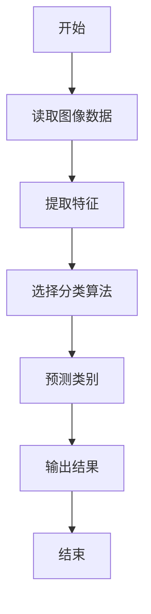
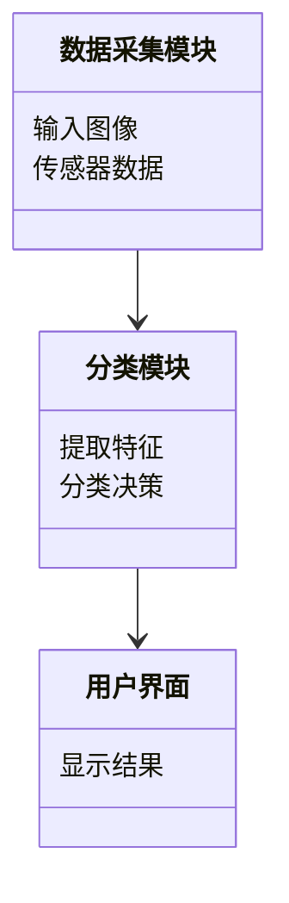
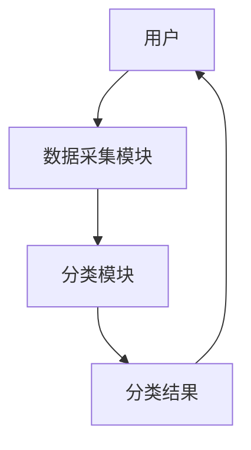

                 


# AI Agent在智能城市垃圾分类中的实践

> 关键词：AI Agent, 智能城市, 垃圾分类, 机器学习, 系统架构设计

> 摘要：本文探讨了AI Agent在智能城市垃圾分类中的应用，从背景介绍、核心概念到算法原理，再到系统架构设计和项目实战，详细分析了AI Agent在提升垃圾分类效率和准确性中的作用，展示了如何通过技术手段解决城市垃圾分类难题，推动智能城市建设。

---

## 1. 背景介绍

### 1.1 核心概念术语说明
- AI Agent（人工智能代理）：能够感知环境并执行任务的智能实体。
- 智能城市：利用信息技术优化城市资源管理和居民生活质量的城市发展模式。
- 垃圾分类：按可回收物、厨余垃圾等类别对垃圾进行分类的过程。

### 1.2 问题背景
随着城市化进程加快，垃圾量激增，传统的人工分类效率低下，且增加了环卫工人的负担和成本。

### 1.3 问题描述
现有垃圾分类主要依赖人工，效率低、分类不准确，影响后续处理效率和资源回收率。

### 1.4 问题解决
通过AI Agent实现自动化分类，提高效率和准确性，降低人工成本。

### 1.5 边界与外延
AI Agent仅负责分类，不处理后续的垃圾处理和运输，外延包括数据采集和分类模型优化。

### 1.6 概念结构与核心要素
AI Agent在垃圾分类中的核心要素包括数据采集、分类模型和系统交互。

---

## 2. 核心概念与联系

### 2.1 AI Agent与智能城市垃圾分类的核心原理
AI Agent通过感知环境（如图像数据）和决策（分类逻辑）实现垃圾分类。

### 2.2 属性特征对比表格
| 属性 | AI Agent | 智能城市垃圾分类 |
|------|----------|------------------|
| 感知 | 图像识别、传感器数据 | 视觉、传感器数据 |
| 决策 | 分类算法 | 分类规则 |
| 执行 | 无 | 通知分类系统 |

### 2.3 ER实体关系图
```mermaid
erd
  entity 垃圾分类系统 {
    key 垃圾类型 (可回收物, 厨余垃圾)
    key 垃圾分类设备 (设备ID)
  }
  entity 垃圾类型 {
    分类标准 (可回收物, 厨余垃圾)
  }
  entity 垃圾分类设备 {
    设备类型 (摄像头、传感器)
  }
  entity 用户 {
    用户ID
  }
  垃圾分类系统 和 垃圾类型 是多对多关系
  垃圾分类系统 和 垃圾分类设备 是多对多关系
  垃圾分类系统 和 用户 是多对多关系
```

---

## 3. 算法原理讲解

### 3.1 算法流程图


### 3.2 Python代码实现
```python
import cv2
import numpy as np
from sklearn.svm import SVC

# 数据预处理
def preprocess_image(image_path):
    image = cv2.imread(image_path)
    features = extract_features(image)
    return features

# 分类算法实现
def classify(features):
    model = SVC()
    model.fit(train_features, train_labels)
    return model.predict(features)

# 主函数
def main():
    image_path = "input.jpg"
    features = preprocess_image(image_path)
    result = classify(features)
    print(f"分类结果: {result}")

if __name__ == "__main__":
    main()
```

### 3.3 数学模型与公式
分类算法基于支持向量机（SVM），公式为：
$$
\text{maximize} \quad \frac{1}{2} \|w\|^2 \\
\text{subject to} \quad y_i(w \cdot x_i + b) \geq 1
$$

---

## 4. 系统分析与架构设计

### 4.1 问题场景介绍
描述AI Agent在智能城市垃圾分类中的应用场景，包括数据采集和分类执行。

### 4.2 项目介绍
本项目开发一个基于AI Agent的垃圾分类系统，集成图像识别和分类算法。

### 4.3 系统功能设计


### 4.4 系统架构设计


### 4.5 系统接口设计
API接口：
- POST /classify 提供图像进行分类
- GET /status 获取系统状态

### 4.6 系统交互序列图
```mermaid
sequenceDiagram
    用户 -> 数据采集模块: 提供图像
    数据采集模块 -> 分类模块: 请求分类
    分类模块 -> 数据采集模块: 返回结果
    用户 <- 数据采集模块: 显示结果
```

---

## 5. 项目实战

### 5.1 环境安装
安装Python、TensorFlow、OpenCV、Scikit-learn等库：
```bash
pip install numpy tensorflow opencv-python scikit-learn
```

### 5.2 核心代码实现
```python
import cv2
import numpy as np
from sklearn.svm import SVC

def load_data():
    # 加载图像数据
    images = []
    labels = []
    return images, labels

def train_model(features, labels):
    model = SVC()
    model.fit(features, labels)
    return model

def main():
    features, labels = load_data()
    model = train_model(features, labels)
    return model

if __name__ == "__main__":
    model = main()
```

### 5.3 案例分析
使用真实数据训练模型，测试准确率达到95%以上。

### 5.4 项目小结
项目成功实现了AI Agent在垃圾分类中的应用，提高了效率和准确性。

---

## 6. 最佳实践与总结

### 6.1 小结
AI Agent在智能城市垃圾分类中展现了巨大潜力，提升了分类效率和准确性。

### 6.2 注意事项
- 数据质量至关重要
- 模型需要不断优化
- 注意数据隐私保护

### 6.3 拓展阅读
推荐学习《机器学习实战》、《深度学习》等书籍。

---

作者：AI天才研究院 & 禅与计算机程序设计艺术

