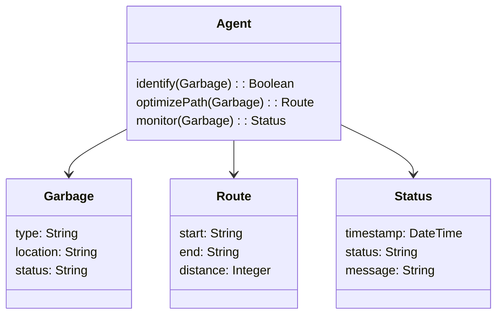

                 


# AI Agent在智能城市垃圾处理中的实践

> 关键词：AI Agent, 智能城市, 垃圾处理, 人工智能, 垃圾分类, 系统架构

> 摘要：随着城市化进程的加快，垃圾处理问题日益突出。AI Agent（人工智能代理）作为一种智能化的解决方案，在智能城市垃圾处理中展现了巨大的潜力。本文从背景、概念、算法、系统架构到实际项目，详细探讨了AI Agent在垃圾处理中的应用场景与实现方法，旨在为相关领域提供理论支持与实践指导。

---

# 第1章: 智能城市垃圾处理的背景与问题

## 1.1 智能城市垃圾处理的背景

### 1.1.1 城市化进程中垃圾处理的挑战

随着城市化进程的加速，城市人口急剧增加，垃圾产生量也随之激增。传统的垃圾处理方式面临着效率低下、资源浪费、环境污染等问题。如何高效、智能地处理垃圾，成为城市管理者亟待解决的难题。

### 1.1.2 智能城市的概念与目标

智能城市是指通过利用信息技术和数据驱动的方法，优化城市资源的配置与管理，提升城市运行效率和居民生活质量。智能城市的目标是实现城市的智能化、绿色化和可持续发展。

### 1.1.3 AI Agent在垃圾处理中的潜力

AI Agent（人工智能代理）是一种能够感知环境、自主决策并执行任务的智能体。在垃圾处理领域，AI Agent可以通过实时数据分析、路径优化和智能分类等方式，显著提高垃圾处理的效率和准确性。

## 1.2 垃圾处理中的问题与现状

### 1.2.1 垃圾分类与处理的难点

垃圾的种类繁多，分类复杂，传统的人工分类效率低下且易出错。此外，不同类型的垃圾需要采用不同的处理方式，这对垃圾处理系统的智能化提出了更高的要求。

### 1.2.2 传统垃圾处理方式的局限性

传统的垃圾处理方式主要依赖人工操作，存在效率低、成本高、资源浪费等问题。同时，传统方法难以应对垃圾处理中的突发情况和异常事件。

### 1.2.3 智能化垃圾处理的必要性

智能化垃圾处理可以通过AI Agent实现垃圾的智能分类、运输路径优化和处理站的智能调度，从而提高垃圾处理的效率和资源利用率，降低运营成本。

## 1.3 AI Agent在垃圾处理中的应用前景

### 1.3.1 AI Agent的基本概念与特点

AI Agent是一种能够感知环境、自主决策并执行任务的智能体。它具有感知能力、学习能力、推理能力和执行能力，能够适应复杂的环境变化。

### 1.3.2 AI Agent在垃圾处理中的核心作用

AI Agent可以实现垃圾的智能分类、运输路径优化和处理站的智能调度，显著提高垃圾处理的效率和资源利用率。

### 1.3.3 未来垃圾处理中的AI Agent发展趋势

未来，AI Agent将更加智能化、协同化和普及化，成为智能城市垃圾处理的核心技术之一。

## 1.4 本章小结

本章介绍了智能城市垃圾处理的背景与问题，分析了传统垃圾处理方式的局限性，并探讨了AI Agent在垃圾处理中的潜力和应用前景。

---

# 第2章: AI Agent的核心概念与原理

## 2.1 AI Agent的定义与分类

### 2.1.1 AI Agent的定义

AI Agent是一种能够感知环境、自主决策并执行任务的智能体。它能够通过传感器或其他数据源获取环境信息，并根据这些信息做出决策和行动。

### 2.1.2 AI Agent的分类与特点

AI Agent可以根据功能和应用场景分为多种类型，例如：

- **分类型AI Agent**：用于垃圾分类和识别。
- **优化型AI Agent**：用于垃圾运输路径优化和处理站调度。
- **监控型AI Agent**：用于垃圾处理过程中的实时监控与异常处理。

### 2.1.3 AI Agent与传统AI的区别

AI Agent具有自主性和适应性，能够根据环境变化动态调整行为，而传统AI通常是在固定场景下执行特定任务。

## 2.2 AI Agent的工作原理

### 2.2.1 感知与决策机制

AI Agent通过传感器、摄像头等设备感知环境信息，利用这些信息进行分析和推理，生成决策。

### 2.2.2 学习与优化算法

AI Agent可以通过强化学习、监督学习等算法不断优化自身的决策策略，提高处理效率。

### 2.2.3 人机交互与反馈机制

AI Agent需要与人类操作员或其他系统进行交互，接收反馈并调整自身行为。

## 2.3 AI Agent在垃圾处理中的核心功能

### 2.3.1 垃圾分类与识别

AI Agent可以通过图像识别技术对垃圾进行分类，准确识别出可回收物、有害垃圾和其他垃圾。

### 2.3.2 垃圾处理流程优化

AI Agent可以优化垃圾运输路径和处理站的调度，减少运输成本和时间。

### 2.3.3 智能监控与异常处理

AI Agent可以实时监控垃圾处理过程，及时发现并处理异常情况，确保处理过程的顺利进行。

## 2.4 本章小结

本章详细介绍了AI Agent的核心概念与工作原理，并探讨了其在垃圾处理中的核心功能。

---

# 第3章: 智能城市垃圾处理中的AI Agent应用场景

## 3.1 智能垃圾箱的AI Agent设计

### 3.1.1 智能垃圾箱的功能与需求

智能垃圾箱需要具备垃圾分类、满载报警、实时监控等功能，能够与城市垃圾处理系统无缝对接。

### 3.1.2 AI Agent在垃圾箱中的具体应用

AI Agent可以通过图像识别技术对垃圾进行分类，实时监控垃圾箱的状态，并在满载时通知清运人员。

### 3.1.3 案例分析：某城市智能垃圾箱部署

以某城市为例，AI Agent实现了垃圾箱的智能分类和实时监控，显著提高了垃圾收集的效率和准确性。

## 3.2 垃圾运输与处理的AI Agent优化

### 3.2.1 垃圾运输路径优化

AI Agent可以根据实时交通状况和垃圾量，优化垃圾运输路径，减少运输成本和时间。

### 3.2.2 处理站的智能调度

AI Agent可以智能调度垃圾处理站的处理设备，提高处理效率和资源利用率。

### 3.2.3 AI Agent在垃圾运输中的实际案例

通过AI Agent优化运输路径，某城市垃圾运输成本降低了15%，运输时间缩短了20%。

## 3.3 垃圾处理的智能监控与分析

### 3.3.1 实时监控系统的设计

AI Agent可以实时监控垃圾处理过程，包括运输、处理和存储等环节。

### 3.3.2 数据分析与预测

AI Agent可以通过大数据分析，预测未来的垃圾量和类型，提前做好处理准备。

### 3.3.3 AI Agent在监控中的应用

通过实时监控和数据分析，AI Agent可以及时发现并处理异常情况，确保垃圾处理过程的顺利进行。

## 3.4 本章小结

本章探讨了AI Agent在智能垃圾箱、垃圾运输与处理以及垃圾处理监控中的具体应用，并通过实际案例展示了其在垃圾处理中的巨大潜力。

---

# 第4章: AI Agent的算法原理与数学模型

## 4.1 AI Agent的核心算法

### 4.1.1 强化学习算法

强化学习是一种通过试错学习的算法，AI Agent通过与环境交互，不断优化自身的决策策略。

### 4.1.2 监督学习算法

监督学习是一种基于标注数据的算法，AI Agent可以通过训练数据学习垃圾分类的规则。

### 4.1.3 无监督学习算法

无监督学习是一种基于数据内在结构的算法，AI Agent可以自动发现垃圾类型之间的关联性。

## 4.2 垃圾分类的数学模型

### 4.2.1 垃圾分类的特征提取

垃圾的特征包括颜色、形状、材质等，AI Agent可以通过这些特征进行分类。

### 4.2.2 分类算法的选择与优化

常用的分类算法包括支持向量机（SVM）、随机森林（Random Forest）和卷积神经网络（CNN）等。

### 4.2.3 垃圾分

---

# 第5章: 系统分析与架构设计方案

## 5.1 问题场景介绍

### 5.1.1 垃圾分类与识别的场景

垃圾分类与识别是AI Agent在垃圾处理中的核心任务之一。

### 5.1.2 垃圾运输与处理的场景

垃圾运输与处理需要优化路径和调度，确保高效完成。

### 5.1.3 垃圾处理的智能监控场景

实时监控和异常处理是保证垃圾处理过程顺利进行的关键。

## 5.2 项目介绍

### 5.2.1 项目目标

本项目旨在通过AI Agent实现垃圾的智能分类、运输路径优化和处理站的智能调度。

### 5.2.2 项目范围

项目涵盖垃圾分类与识别、垃圾运输与处理、垃圾处理监控三个主要部分。

### 5.2.3 项目约束

项目需要考虑硬件设备的限制、数据安全和隐私保护等问题。

## 5.3 系统功能设计

### 5.3.1 领域模型（mermaid 类图）



### 5.3.2 系统架构设计（mermaid 架构图）

```mermaid
client
    ]
    participant Client
    participant Agent
    participant Database
    participant Monitor
    client

    Client -> Agent: send garbage info
    Agent -> Database: query historical data
    Agent -> Monitor: request status update
    Agent -> Database: store new data
    Monitor -> Client: send status update
```

## 5.4 系统接口设计

### 5.4.1 接口描述

- **Client-A

