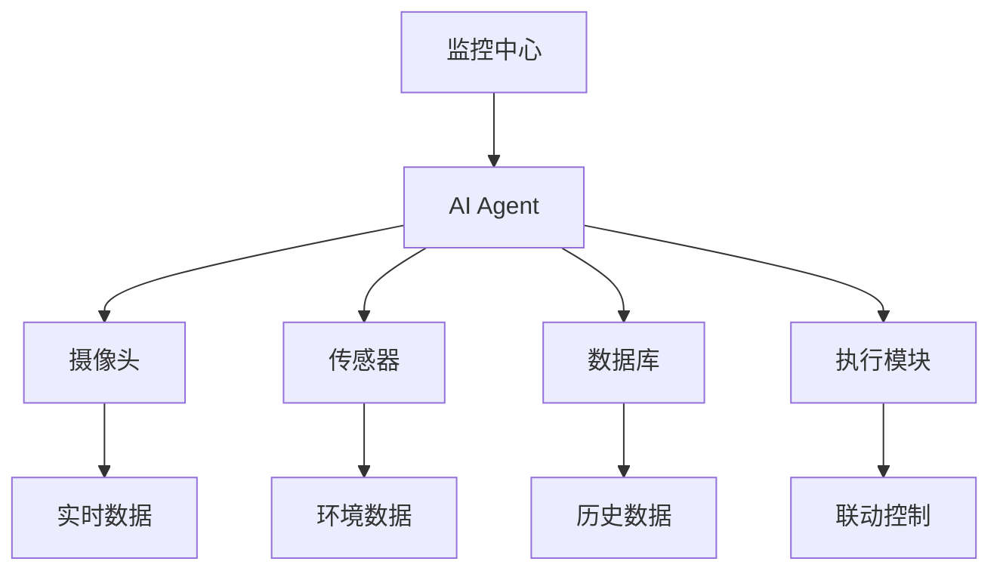

                 


# AI Agent在智能城市安全监控中的角色

## 关键词：AI Agent, 智能城市, 安全监控, 强化学习, 多智能体系统, 物联网, 数据隐私

## 摘要：  
本文探讨AI Agent在智能城市安全监控中的关键作用，分析其核心概念、算法原理、系统架构，并通过实际案例展示其应用价值。文章还提供了代码实现和优化建议，为读者提供全面的视角。

---

# 第一部分: AI Agent在智能城市安全监控中的背景与价值

## 第1章: 智能城市安全监控的背景与挑战

### 1.1 智能城市的发展与安全需求  
- 智能城市的定义与特点  
- 城市安全监控的重要性  
- 当前城市安全监控的主要挑战  

### 1.2 AI Agent的引入及其优势  
- AI Agent的核心概念与特征  
- AI Agent在城市安全监控中的独特优势  
- 与传统监控系统的对比分析  

### 1.3 本章小结  

---

# 第二部分: AI Agent的核心概念与技术原理

## 第2章: AI Agent的核心概念与技术原理

### 2.1 AI Agent的核心概念  
- 知识表示与推理机制  
- 行为决策模型  
- 多智能体协同原理  

### 2.2 AI Agent的算法基础  
- 基于强化学习的AI Agent  
- Q-learning算法的实现原理  
- 算法流程图与代码实现  

### 2.3 AI Agent与相关技术的对比  
- AI Agent与机器学习的差异  
- AI Agent与物联网的结合  
- AI Agent与边缘计算的协同  

### 2.4 本章小结  

---

# 第三部分: AI Agent的算法实现与数学模型

## 第3章: AI Agent的算法实现与数学模型

### 3.1 强化学习算法的数学模型  
- Q-learning的数学公式 $$ Q(s,a) = Q(s,a) + \alpha \times [r + \gamma \times \max Q(s',a') - Q(s,a)] $$
- 算法流程图（使用Mermaid）  

### 3.2 Python代码实现  
```python
import numpy as np
import random

class AI_Agent:
    def __init__(self, state_space, action_space):
        self.state_space = state_space
        self.action_space = action_space
        self.Q_table = {}

    def choose_action(self, state):
        if state not in self.Q_table:
            return random.choice(self.action_space)
        # 探索与利用策略
        epsilon = 0.1
        if random.random() < epsilon:
            return random.choice(self.action_space)
        max_action = max(self.Q_table[state], key=lambda k: self.Q_table[state][k])
        return max_action

    def update_Q_table(self, state, action, reward, next_state):
        if state not in self.Q_table:
            self.Q_table[state] = {a: 0 for a in self.action_space}
        current_Q = self.Q_table[state][action]
        next_max_Q = max(self.Q_table.get(next_state, {}).values(), default=0)
        learning_rate = 0.1
        discount_factor = 0.9
        new_Q = current_Q + learning_rate * (reward + discount_factor * next_max_Q - current_Q)
        self.Q_table[state][action] = new_Q
```

### 3.3 算法优化与实际应用  
- 算法的收敛性分析  
- 算法在实际场景中的表现  
- 参数调优的建议  

---

# 第四部分: AI Agent在智能城市安全监控中的系统架构

## 第4章: 系统架构设计

### 4.1 系统整体架构  
- 数据采集模块（摄像头、传感器）  
- 数据处理模块（特征提取、数据清洗）  
- AI Agent决策模块（行为决策、策略优化）  
- 执行模块（联动控制、反馈机制）  

### 4.2 系统功能设计  
- 实时监控与异常检测  
- 自主决策与行动执行  
- 历史数据分析与优化  

### 4.3 系统架构图（Mermaid）  


### 4.4 接口设计与交互流程  
- API接口规范  
- 典型交互流程图（Mermaid）  

---

# 第五部分: 项目实战与优化建议

## 第5章: 项目实战

### 5.1 环境搭建与依赖安装  
- Python版本要求  
- 依赖库安装：OpenCV、TensorFlow、Scikit-learn  

### 5.2 核心代码实现  
```python
# 实时监控模块
import cv2

def detect_abnormalities(frame, model):
    # 图像预处理
    gray = cv2.cvtColor(frame, cv2.COLOR_BGR2GRAY)
    # 异常检测
    prediction = model.predict(gray)
    return prediction

# AI Agent决策模块
def make_decision(abnormalities, current_state):
    if abnormalities:
        return '触发报警'
    else:
        return '正常运行'
```

### 5.3 实际案例分析  
- 案例一：交通流量监控  
- 案例二：公共安全事件处理  

### 5.4 项目小结  

---

# 第六部分: AI Agent在智能城市安全监控中的优化与展望

## 第6章: 优化建议与未来展望

### 6.1 系统优化建议  
- 数据隐私保护策略  
- 模型泛化能力提升  
- 系统容错性优化  

### 6.2 未来发展方向  
- 更智能的多智能体协同  
- 新兴技术的融合（如区块链）  
- 更广泛的应用场景探索  

### 6.3 本章小结  

---

# 结语

## 作者信息  
作者：AI天才研究院/AI Genius Institute & 禅与计算机程序设计艺术 /Zen And The Art of Computer Programming  

---

## 致谢  
感谢读者的支持与关注，期待与您共同探讨AI Agent在智能城市中的更多可能性。

