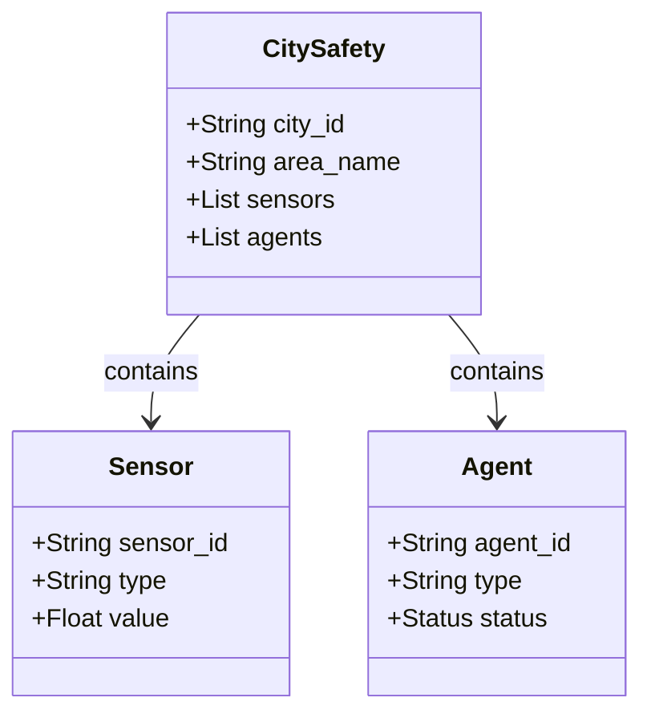
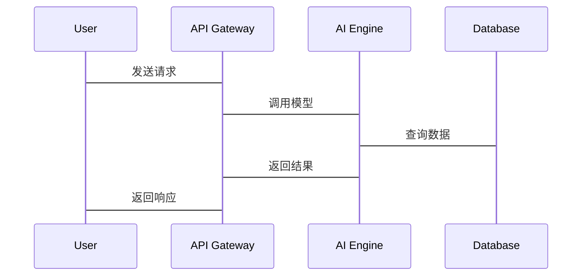

                 


# AI Agent在智能城市安全管理中的角色

## 关键词：AI Agent, 智能城市, 安全管理, 人工智能, 城市安全

## 摘要：AI Agent在智能城市安全管理中的应用是当前技术发展的重点方向。通过分析AI Agent的核心概念、技术原理及其在城市公共安全、交通管理和网络安全等领域的具体应用，本文旨在揭示AI Agent如何通过智能化手段提升城市安全管理水平，解决传统方法难以应对的复杂安全问题。文章还探讨了AI Agent的算法原理和系统架构设计，结合实际案例，展示了AI Agent在智能城市安全管理中的巨大潜力和实际价值。

---

# 第1章：智能城市安全管理的背景与挑战

## 1.1 智能城市的定义与发展

### 1.1.1 智能城市的定义

智能城市是指通过运用物联网、大数据、云计算和人工智能等先进技术，将城市中的各个系统和资源进行整合，以实现城市运行的智能化、高效化和可持续化。智能城市的核心目标是为居民提供更优质的生活环境，同时提高城市管理和资源利用的效率。

### 1.1.2 智能城市的发展历程

智能城市的概念起源于20世纪末，随着信息技术的发展逐步演变为实践。近年来，随着5G、人工智能和物联网技术的飞速进步，智能城市在全球范围内得到了广泛应用。

### 1.1.3 智能城市的安全管理需求

智能城市的安全管理需求主要体现在公共安全、交通安全和网络安全三个方面。随着城市规模的扩大和复杂性的增加，传统的安全管理方式已难以应对新型安全威胁，亟需引入智能化手段。

## 1.2 安全管理的核心问题

### 1.2.1 城市安全管理的主要挑战

城市安全管理面临的主要挑战包括：(1) 犯罪行为的多样化和智能化；(2) 自然灾害的预测和应对；(3) 交通拥堵和交通事故的频繁发生；(4) 网络攻击的日益增多。

### 1.2.2 城市安全的多维度需求

城市安全的多维度需求包括：(1) 实时监测和预警能力；(2) 智能化决策支持；(3) 快速响应和应急处理能力；(4) 多部门协同合作机制。

### 1.2.3 安全管理的复杂性与动态性

安全管理的复杂性体现在威胁来源的多样性和不确定性上。动态性则要求安全管理系统能够实时更新和调整，以应对不断变化的安全威胁。

## 1.3 AI Agent的基本概念与作用

### 1.3.1 AI Agent的定义

AI Agent（人工智能代理）是指能够感知环境、自主决策并采取行动以实现特定目标的智能体。AI Agent通常具备学习、推理、规划和自适应能力。

### 1.3.2 AI Agent的核心特征

AI Agent的核心特征包括：(1) 感知能力；(2) 决策能力；(3) 自主性；(4) 适应性。

### 1.3.3 AI Agent在智能城市中的角色

AI Agent在智能城市中的角色主要体现在：(1) 安全监控与预警；(2) 事件响应与处理；(3) 数据分析与决策支持。

---

## 1.4 本章小结

本章主要介绍了智能城市的发展背景及其安全管理的需求，重点阐述了AI Agent的基本概念和核心作用。通过分析城市安全管理面临的复杂性和动态性，指出了引入AI Agent的必要性和潜在价值。

---

# 第2章：AI Agent的核心概念与技术原理

## 2.1 AI Agent的定义与分类

### 2.1.1 AI Agent的定义

AI Agent是一种能够感知环境、自主决策并采取行动以实现目标的智能实体。

### 2.1.2 AI Agent的分类

AI Agent可以根据智能水平分为：(1) 反应式AI Agent；(2) 规划式AI Agent；(3) 学习式AI Agent；(4) 混合式AI Agent。

### 2.1.3 各类AI Agent的特点与应用场景

- **反应式AI Agent**：实时感知环境并做出反应，适用于需要快速响应的场景，如自动驾驶和实时监控。
- **规划式AI Agent**：基于当前状态和目标，制定行动计划，适用于复杂任务的管理，如物流调度。
- **学习式AI Agent**：通过学习历史数据来改进决策能力，适用于需要长期优化的场景，如能源管理。
- **混合式AI Agent**：结合多种AI Agent的特点，适用于综合性的任务。

## 2.2 AI Agent的工作原理

### 2.2.1 感知与理解

AI Agent通过传感器、摄像头和数据接口等手段感知环境，并利用自然语言处理和计算机视觉技术理解信息。

### 2.2.2 决策与推理

AI Agent基于感知到的信息，结合预设规则和学习模型进行推理，并制定最优决策。

### 2.2.3 执行与反馈

AI Agent根据决策结果执行具体动作，并通过反馈机制不断优化自身的感知和决策能力。

## 2.3 AI Agent的关键技术

### 2.3.1 机器学习

机器学习是AI Agent的核心技术之一，通过训练模型来实现模式识别、分类和预测。

### 2.3.2 自然语言处理

自然语言处理技术使AI Agent能够理解和生成人类语言，适用于客服、信息检索等场景。

### 2.3.3 计算机视觉

计算机视觉技术使AI Agent能够通过图像和视频感知环境，适用于人脸识别、目标检测等任务。

## 2.4 本章小结

本章详细介绍了AI Agent的核心概念、分类和工作原理，并重点阐述了其关键技术——机器学习、自然语言处理和计算机视觉。这些技术共同支撑了AI Agent在智能城市中的广泛应用。

---

# 第3章：AI Agent在智能城市安全管理中的应用场景

## 3.1 城市公共安全的智能化管理

### 3.1.1 犯罪预防与预测

AI Agent可以通过分析历史犯罪数据和实时监控信息，预测潜在的犯罪行为并提前采取预防措施。

### 3.1.2 灾害预警与应急响应

AI Agent能够实时监测环境数据，预测自然灾害的发生，并迅速启动应急响应机制。

### 3.1.3 公共设施的安全监控

AI Agent可以对城市中的公共设施进行实时监控，及时发现并处理异常情况，确保设施的安全运行。

## 3.2 城市交通安全管理

### 3.2.1 智能交通系统的构建

AI Agent可以通过实时数据分析和路径优化，提高交通系统的运行效率。

### 3.2.2 交通事故的预测与处理

AI Agent能够预测交通事故的发生，并迅速制定应急处理方案，减少事故造成的损失。

### 3.2.3 交通流量的优化管理

通过AI Agent的智能调度，可以实现交通流量的优化管理，缓解交通拥堵问题。

## 3.3 城市网络安全防护

### 3.3.1 网络攻击的识别与防御

AI Agent可以通过异常行为分析，识别潜在的网络攻击，并采取相应的防御措施。

### 3.3.2 数据安全的保护

AI Agent能够实时监测数据流量，防止数据泄露和篡改，确保数据的安全性。

### 3.3.3 网络威胁的实时监控

AI Agent可以对网络环境进行实时监控，及时发现并应对潜在的网络威胁。

## 3.4 本章小结

本章重点探讨了AI Agent在城市公共安全、交通管理和网络安全三个主要领域的应用，展示了AI Agent如何通过智能化手段提升城市安全管理的效率和效果。

---

# 第4章：AI Agent的算法原理与数学模型

## 4.1 AI Agent的核心算法

### 4.1.1 机器学习算法

常用的机器学习算法包括支持向量机（SVM）、随机森林（Random Forest）和深度学习模型（如卷积神经网络CNN和循环神经网络RNN）。

### 4.1.2 自然语言处理算法

常用的自然语言处理算法包括词袋模型（Bag of Words）、TF-IDF和神经网络模型（如词嵌入和变换器模型）。

### 4.1.3 计算机视觉算法

常用的计算机视觉算法包括边缘检测、目标检测和图像分割等技术。

## 4.2 算法原理与流程

### 4.2.1 机器学习算法原理

机器学习算法的基本流程包括数据预处理、特征提取、模型训练和模型评估。

### 4.2.2 神经网络模型的数学基础

神经网络模型的数学基础包括激活函数、损失函数和优化算法（如随机梯度下降）。

### 4.2.3 算法的实现步骤

1. 数据收集与预处理：清洗数据、特征工程。
2. 模型选择：选择合适的算法模型。
3. 模型训练：使用训练数据进行模型参数的优化。
4. 模型评估：通过测试数据评估模型的性能。
5. 模型部署：将模型部署到实际应用中。

## 4.3 数学模型与公式

### 4.3.1 线性回归模型

线性回归模型的数学表达式为：
$$ y = \beta_0 + \beta_1x + \epsilon $$

### 4.3.2 逻辑回归模型

逻辑回归模型的数学表达式为：
$$ P(y=1|x) = \frac{1}{1 + e^{-\beta_0 - \beta_1x}} $$

### 4.3.3 神经网络模型

神经网络模型的数学表达式为：
$$ a^{(l)} = \sigma(w^{(l)}a^{(l-1)} + b^{(l)}) $$
其中，$$ \sigma $$表示激活函数。

## 4.4 本章小结

本章详细介绍了AI Agent的核心算法及其数学模型，重点阐述了机器学习、自然语言处理和计算机视觉算法的原理和实现步骤。这些算法为AI Agent在智能城市中的应用提供了坚实的技术基础。

---

# 第5章：系统分析与架构设计

## 5.1 问题场景介绍

智能城市安全管理系统的应用场景包括城市公共安全、交通管理和网络安全等多个方面。

## 5.2 项目介绍

本项目旨在开发一个基于AI Agent的智能城市安全管理系统，实现对城市安全的实时监控和智能决策。

## 5.3 系统功能设计

### 5.3.1 领域模型设计

领域模型类图如下：



### 5.3.2 系统架构设计

系统架构图如下：

```mermaid
graph TD
    UI --> API Gateway
    API Gateway --> Database
    API Gateway --> AI Engine
    AI Engine --> Model Zoo
    Database --> Model Zoo
```

### 5.3.3 系统接口设计

系统接口设计包括：(1) 数据采集接口；(2) 数据分析接口；(3) 决策支持接口；(4) 用户界面接口。

### 5.3.4 系统交互设计

系统交互序列图如下：



## 5.4 本章小结

本章通过系统分析与架构设计，详细描述了基于AI Agent的智能城市安全管理系统的整体架构和功能模块。系统设计充分考虑了各模块的交互和协同工作，为系统的实际开发奠定了基础。

---

# 第6章：项目实战

## 6.1 环境安装

项目实战的环境包括：Python 3.8以上版本、TensorFlow 2.0以上版本、Keras 2.2.5、Pandas 1.3.5、NumPy 1.21.0。

## 6.2 核心代码实现

### 6.2.1 数据预处理代码

```python
import pandas as pd
import numpy as np

# 读取数据
data = pd.read_csv('safety_data.csv')

# 数据清洗
data = data.dropna()
data = data[~data.duplicated()]

# 特征工程
data['time'] = pd.to_datetime(data['time'])
data.set_index('time', inplace=True)
```

### 6.2.2 模型训练代码

```python
import tensorflow as tf
from tensorflow.keras import layers

# 构建模型
model = tf.keras.Sequential([
    layers.Dense(64, activation='relu'),
    layers.Dense(1, activation='sigmoid')
])

# 编译模型
model.compile(optimizer='adam', loss='binary_crossentropy', metrics=['accuracy'])

# 训练模型
model.fit(X_train, y_train, epochs=10, batch_size=32)
```

### 6.2.3 模型评估代码

```python
# 评估模型
loss, accuracy = model.evaluate(X_test, y_test)
print(f'Loss: {loss}, Accuracy: {accuracy}')
```

## 6.3 案例分析与详细解读

### 6.3.1 案例背景

某城市发生了一次严重的交通事故，AI Agent通过实时监控和数据分析，迅速定位了事故原因并制定了应急处理方案。

### 6.3.2 案例实现步骤

1. 数据收集：从传感器和监控系统中收集交通事故的相关数据。
2. 数据分析：利用AI Agent进行数据分析，识别出事故的主要原因。
3. 决策支持：生成应急处理方案，包括交通疏导和救援调度。
4. 反馈优化：根据事故处理的效果，优化AI Agent的决策模型。

## 6.4 本章小结

本章通过项目实战，详细展示了基于AI Agent的智能城市安全管理系统的核心代码实现和实际案例分析。通过具体的代码示例和案例解读，帮助读者更好地理解AI Agent在实际应用中的工作原理和实施步骤。

---

# 第7章：结论与展望

## 7.1 研究总结

AI Agent在智能城市安全管理中的应用展示了其巨大的潜力和价值。通过智能化手段，城市安全管理的效率和效果得到了显著提升。

## 7.2 未来展望

未来，随着人工智能技术的不断发展，AI Agent在智能城市安全管理中的应用将更加广泛和深入。主要研究方向包括：(1) 更加智能化和自适应的AI Agent设计；(2) 多模态数据融合技术的应用；(3) AI Agent与区块链等新兴技术的结合。

---

# 作者：AI天才研究院/AI Genius Institute & 禅与计算机程序设计艺术 /Zen And The Art of Computer Programming

