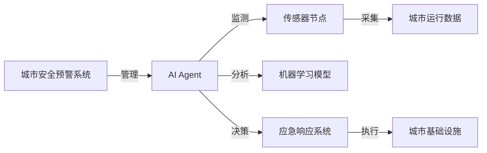

                 


# AI Agent在智能城市安全预警中的角色

> 关键词：AI Agent, 智能城市, 安全预警, 人工智能, 城市安全, 应急响应

> 摘要：本文深入探讨AI Agent在智能城市安全预警中的核心角色，分析其在数据采集、风险评估、应急响应等方面的应用，结合实际案例，揭示其如何通过高效的数据处理和智能决策算法，提升城市安全预警的准确性和实时性，为智能城市建设提供有力的技术支持。

---

## 第一部分: AI Agent与智能城市安全预警的背景介绍

### 第1章: AI Agent与智能城市概述

#### 1.1 AI Agent的基本概念
- **1.1.1 AI Agent的定义**
  - AI Agent（人工智能代理）是一种能够感知环境、自主决策并采取行动的智能实体。
  - 它通过传感器获取信息，利用算法进行分析和推理，做出最优决策。

- **1.1.2 AI Agent的核心特点**
  - **自主性**：能够在没有外部干预的情况下独立运行。
  - **反应性**：能够实时感知环境变化并做出响应。
  - **目标导向**：基于预设目标或用户需求进行决策。
  - **学习能力**：通过机器学习不断优化自身的算法和决策模型。

- **1.1.3 AI Agent与传统自动化的区别**
  - AI Agent具备自主决策能力，能够根据环境变化动态调整行为。
  - 传统自动化依赖于预设规则，无法应对复杂和动态变化的场景。

#### 1.2 智能城市的基本概念
- **1.2.1 智能城市的定义**
  - 智能城市是利用信息技术、大数据、人工智能等技术，实现城市基础设施、公共服务和管理的智能化。

- **1.2.2 智能城市的发展历程**
  - **萌芽阶段**：20世纪末，计算机技术的应用推动了城市管理的初步智能化。
  - **发展阶段**：21世纪初，物联网技术的应用使城市设备实现互联。
  - **成熟阶段**：近年来，AI Agent的出现使城市管理系统具备了自主决策能力。

- **1.2.3 智能城市的典型应用场景**
  - 智慧交通：实时监控交通流量，优化信号灯控制。
  - 智慧安防：利用AI Agent进行人脸识别、异常行为检测。
  - 环境监测：实时监测空气质量、水质，预防污染事件。

#### 1.3 安全预警在智能城市中的重要性
- **1.3.1 城市安全预警的定义**
  - 城市安全预警是指通过技术手段实时监测城市运行状态，预测潜在风险，并采取预防或应急措施。

- **1.3.2 城市安全预警的典型问题**
  - 数据量大且复杂，难以实时处理。
  - 风险预测模型的准确性不足。
  - 应急响应机制不够高效。

- **1.3.3 AI Agent在城市安全预警中的作用**
  - AI Agent能够实时采集和分析大量数据，快速识别潜在风险。
  - 通过机器学习优化风险预测模型，提高预警的准确性。
  - 在发生突发事件时，AI Agent可以快速启动应急响应机制，协调各部门进行联动。

---

### 第2章: AI Agent在智能城市安全预警中的角色

#### 2.1 AI Agent在城市安全预警中的核心任务
- **2.1.1 数据采集与处理**
  - AI Agent通过传感器、摄像头等设备实时采集城市运行数据。
  - 数据清洗、特征提取和预处理，为后续分析提供高质量数据。

- **2.1.2 风险评估与预测**
  - 利用机器学习算法（如决策树、随机森林）进行风险评估。
  - 通过深度学习模型（如LSTM）预测未来风险趋势。

- **2.1.3 应急响应与决策支持**
  - 在风险发生时，AI Agent快速生成应急响应方案。
  - 协调各部门资源，优化应急响应流程。

#### 2.2 AI Agent与城市安全预警系统的结合
- **2.2.1 系统架构概述**
  - 采用分层架构：感知层、网络层、计算层和应用层。
  - 感知层负责数据采集，计算层负责数据处理和分析，应用层负责决策和执行。

- **2.2.2 数据流分析**
  - 数据从感知层上传到计算层进行处理。
  - 处理后的结果反馈到应用层，指导应急响应。

- **2.2.3 人机交互界面设计**
  - 提供直观的可视化界面，方便用户查看实时数据和决策建议。
  - 支持语音交互，提高应急响应效率。

#### 2.3 AI Agent在城市安全预警中的优势
- **2.3.1 高效性**
  - AI Agent能够快速处理大量数据，显著提高预警效率。

- **2.3.2 准确性**
  - 通过机器学习和深度学习算法，AI Agent能够提高风险预测的准确性。

- **2.3.3 实时性**
  - AI Agent实时监控城市运行状态，能够在风险发生前进行预警。

---

## 第三部分: AI Agent在智能城市安全预警中的系统设计与实现

### 第3章: AI Agent的核心原理

#### 3.1 AI Agent的感知与学习机制
- **3.1.1 数据采集与特征提取**
  - 使用传感器和摄像头采集城市运行数据。
  - 通过特征提取算法（如主成分分析）降低数据维度。

- **3.1.2 机器学习算法的应用**
  - 使用支持向量机（SVM）进行分类任务。
  - 使用K-means算法进行聚类分析。

- **3.1.3 深度学习模型的优势**
  - 使用卷积神经网络（CNN）进行图像识别。
  - 使用循环神经网络（RNN）进行时间序列预测。

#### 3.2 AI Agent的决策与推理机制
- **3.2.1 知识表示与推理**
  - 使用知识图谱表示城市运行规则。
  - 通过逻辑推理算法（如DPLL）进行决策。

- **3.2.2 多目标优化算法**
  - 使用遗传算法优化应急响应方案。
  - 使用蚁群算法优化资源分配。

- **3.2.3 贝叶斯网络的应用**
  - 使用贝叶斯网络进行概率推理。
  - 通过贝叶斯推断优化风险评估模型。

#### 3.3 AI Agent的通信与协作机制
- **3.3.1 多智能体系统**
  - 使用多智能体系统（MAS）实现多个AI Agent之间的协作。
  - 通过分布式算法（如分布式计算）进行任务分配。

- **3.3.2 跨Agent通信协议**
  - 使用消息队列（如Kafka）进行实时通信。
  - 通过RESTful API进行服务调用。

- **3.3.3 分布式决策算法**
  - 使用分布式一致性算法（如Paxos）进行决策。
  - 使用分布式计算框架（如Spark）进行数据处理。

---

### 第4章: AI Agent与城市安全预警系统的实体关系

#### 4.1 实体关系图


---

## 第四部分: 项目实战与最佳实践

### 第5章: 项目实战

#### 5.1 智能交通中的实时监测系统
- **5.1.1 环境安装**
  - 安装Python 3.8及以上版本。
  - 安装TensorFlow、Keras、Scikit-learn等库。
  - 配置Jupyter Notebook进行数据可视化。

- **5.1.2 核心代码实现**
```python
import numpy as np
from sklearn import tree

# 数据预处理
data = np.array([[1, 0], [0, 1], [1, 1], [0, 0]])
target = np.array([0, 1, 1, 0])

# 训练决策树模型
model = tree.DecisionTreeClassifier()
model.fit(data, target)

# 预测新数据
new_data = np.array([[1, 0]])
print(model.predict(new_data))  # 输出结果：[0]
```

- **5.1.3 代码解读与分析**
  - 使用决策树算法进行交通流量预测。
  - 通过模型训练和预测，优化信号灯控制策略。

- **5.1.4 实际案例分析**
  - 在某城市交通系统中，AI Agent通过实时监测车流量，优化信号灯控制，减少交通拥堵。

- **5.1.5 项目小结**
  - AI Agent能够显著提高交通系统的运行效率。
  - 通过机器学习算法优化预测模型，提升预警准确性。

### 第6章: 最佳实践

#### 6.1 小结
- AI Agent在智能城市安全预警中的应用前景广阔。
- 通过高效的数据处理和智能决策算法，AI Agent能够显著提升城市安全预警的准确性和实时性。

#### 6.2 注意事项
- 数据隐私和安全问题需要高度重视。
- 需要建立完善的应急响应机制，确保AI Agent在突发情况下的高效应对。

#### 6.3 拓展阅读
- 推荐阅读《人工智能：一种现代方法》。
- 参考GitHub上的AI Agent开源项目，学习实际实现方法。

---

## 作者信息

作者：AI天才研究院/AI Genius Institute  
联系邮箱：contact@ai-genius.org  
官方网站：https://www.ai-genius.org

---

以上是《AI Agent在智能城市安全预警中的角色》的技术博客文章大纲，涵盖了从背景介绍到系统设计再到项目实战的全过程。通过详细讲解AI Agent的核心原理和实际应用，读者可以全面理解其在智能城市安全预警中的重要作用。

