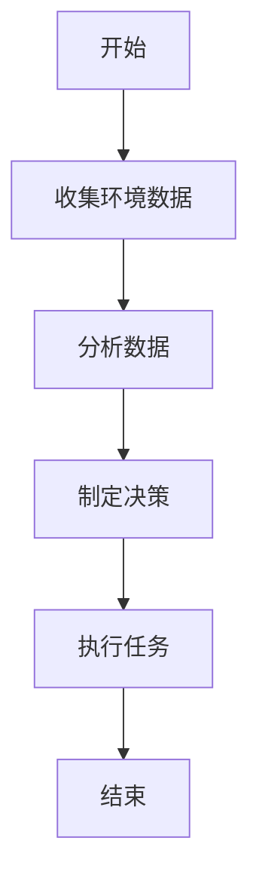
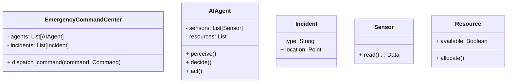
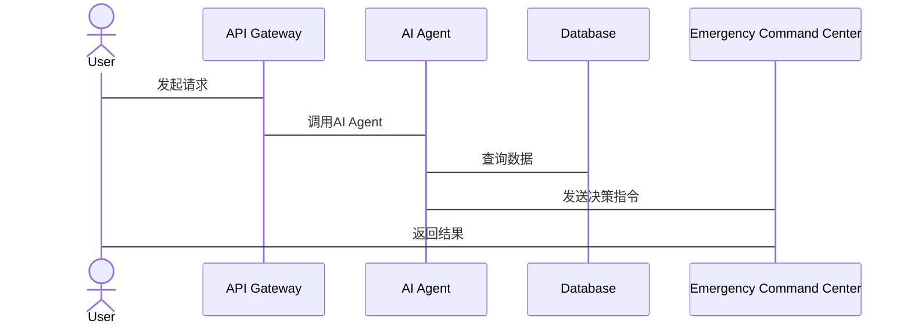

                 


# AI Agent在智能城市应急指挥中的角色

## 关键词
- AI Agent
- 智能城市
- 应急指挥
- 系统架构
- 数学模型

## 摘要
AI Agent在智能城市应急指挥中扮演着至关重要的角色，通过其智能感知、决策和执行能力，能够显著提升城市应对突发事件的能力。本文将详细探讨AI Agent的核心概念、算法原理、系统架构以及实际应用，分析其在智能城市应急指挥中的潜力与挑战，并通过案例分析展示其实际效果。

---

# 第一部分: AI Agent与智能城市应急指挥的背景介绍

## 第1章: 问题背景

### 1.1 智能城市的发展现状
智能城市的发展离不开信息技术的支撑，城市化进程的加快使得城市面临更多的复杂问题，如交通拥堵、资源短缺、公共安全等。应急指挥系统作为城市管理体系的重要组成部分，需要快速响应和处理突发事件。

### 1.2 应急指挥的痛点与挑战
传统应急指挥系统存在信息分散、响应速度慢、决策依赖人工经验等问题。突发事件往往涉及多个部门和系统，协调难度大，容易错失最佳处理时机。

### 1.3 AI Agent在应急指挥中的潜力
AI Agent（人工智能代理）是一种能够自主感知环境、做出决策并执行任务的智能体。通过AI Agent，应急指挥系统可以实现智能化、自动化，提高应对突发事件的效率和准确性。

## 第2章: 问题描述

### 2.1 应急指挥的核心任务
应急指挥的核心任务包括信息收集与分析、决策支持、资源调配、指令下达等。这些任务需要高效的信息处理能力和快速的决策能力。

### 2.2 应急指挥中的信息处理与决策需求
突发事件往往具有突发性、不确定性，信息来源多样且复杂。如何快速整合、分析信息并做出最优决策是应急指挥系统的核心挑战。

### 2.3 AI Agent在应急指挥中的角色定位
AI Agent可以作为应急指挥系统的核心组件，负责信息的实时感知、分析与处理，提供决策支持，并协调各部门的行动。

## 第3章: 问题解决

### 3.1 AI Agent在应急指挥中的解决方案
通过部署AI Agent，应急指挥系统可以实现智能化的信息处理和决策支持。AI Agent能够实时监测城市运行状态，识别潜在风险，并快速响应突发事件。

### 3.2 AI Agent的核心功能与优势
AI Agent具有自主性、反应性、目标导向等特性，能够适应复杂多变的应急场景。其优势包括快速响应、智能决策、多部门协同等。

### 3.3 AI Agent与传统应急指挥系统的对比
传统应急指挥系统依赖人工操作，效率较低且容易出错。AI Agent的引入显著提高了系统的智能化水平，减少了人为错误，提高了应对突发事件的能力。

---

# 第二部分: AI Agent的核心概念与联系

## 第4章: AI Agent的原理与机制

### 4.1 AI Agent的基本原理
AI Agent通过感知环境、分析信息、制定决策并执行行动来完成任务。其核心机制包括信息处理、决策制定和任务执行。

### 4.2 AI Agent的感知、决策与执行机制
- **感知**：通过传感器、摄像头等设备收集环境数据。
- **决策**：基于收集的数据，利用机器学习模型进行分析和预测，制定最优决策。
- **执行**：根据决策结果，调用相关资源或系统执行具体操作。

### 4.3 AI Agent的学习与自适应能力
AI Agent可以通过强化学习、监督学习等方法不断优化自身的决策能力，适应不同的应急场景。

## 第5章: 核心概念属性特征对比

### 5.1 AI Agent与传统Agent的对比
| 特性      | AI Agent                     | 传统Agent                     |
|-----------|-------------------------------|-------------------------------|
| 智能水平   | 高                           | 低                           |
| 学习能力   | 强                           | 弱                           |
| 应用场景   | 复杂、动态的应急场景         | 简单、静态的场景               |

### 5.2 AI Agent与AI模型的对比
| 特性      | AI Agent                     | AI模型                       |
|-----------|-------------------------------|-----------------------------|
| 任务      | 实际操作和决策               | 数据分析和预测               |
| 自主性     | 高                           | 中                           |

### 5.3 AI Agent与应急指挥系统的对比
| 特性      | AI Agent                     | 传统应急指挥系统             |
|-----------|-------------------------------|-----------------------------|
| 智能性     | 高                           | 中                           |
| 响应速度   | 快                           | 较慢                         |
| 适应性     | 强                           | 较弱                         |

## 第6章: ER实体关系图

### 6.1 实体关系图的定义
ER实体关系图用于描述系统中各实体之间的关系，帮助我们理解系统架构。

### 6.2 实体关系图的构建
以下是AI Agent在应急指挥系统中的ER实体关系图：

```mermaid
er
actor: Emergency指挥中心
agent: AI应急代理
incident: 突发事件
resource: 资源
message: 消息
```

### 6.3 实体关系图的分析
- **Emergency指挥中心**：作为系统的主体，负责协调和指挥各部门。
- **AI应急代理**：作为核心组件，负责信息处理和决策。
- **突发事件**：触发应急响应的事件。
- **资源**：包括人力、设备等。
- **消息**：信息传递的载体。

---

# 第三部分: AI Agent的算法原理讲解

## 第7章: 算法原理概述

### 7.1 AI Agent的核心算法
AI Agent的核心算法包括感知算法、决策算法和执行算法。

### 7.2 算法的输入与输出
- **输入**：环境数据、事件信息、资源状态等。
- **输出**：决策指令、行动计划等。

### 7.3 算法的流程
以下是AI Agent的算法流程图：



## 第8章: 算法实现与数学模型

### 8.1 算法实现
以下是AI Agent的核心算法实现：

```python
class AIAgent:
    def __init__(self):
        self.sensors = []  # 传感器
        self.resources = []  # 资源

    def perceive(self):
        # 获取环境数据
        data = [sensor.read() for sensor in self.sensors]
        return data

    def decide(self, data):
        # 分析数据，制定决策
        model = self.load_model()
        decision = model.predict(data)
        return decision

    def act(self, decision):
        # 执行决策
        for resource in self.resources:
            if resource.available:
                resource.allocate()
                break

    def run(self):
        while True:
            data = self.perceive()
            decision = self.decide(data)
            self.act(decision)
```

### 8.2 数学模型
AI Agent的决策过程可以通过以下数学模型描述：

$$
\text{决策} = \arg\max_{a} Q(s, a)
$$

其中，\( Q(s, a) \) 是状态-动作值函数，\( s \) 是当前状态，\( a \) 是动作。

---

# 第四部分: 系统分析与架构设计

## 第9章: 问题场景介绍

### 9.1 应急指挥系统的核心问题
- 信息分散，难以整合。
- 决策依赖人工经验，效率低下。
- 部门协同困难，响应速度慢。

## 第10章: 系统功能设计

### 10.1 领域模型类图
以下是领域模型类图：



### 10.2 系统架构设计
以下是系统架构设计图：


### 10.3 系统交互序列图
以下是系统交互序列图：



---

# 第五部分: 项目实战

## 第11章: 环境安装与系统实现

### 11.1 环境安装
- 安装Python 3.8+
- 安装相关库：numpy, scikit-learn, mermaid.py

### 11.2 核心代码实现
以下是AI Agent的核心代码实现：

```python
import numpy as np
from sklearn.model_selection import train_test_split
from sklearn.linear_model import LinearRegression

class AIAgent:
    def __init__(self, data):
        self.data = data
        self.model = self.train_model()

    def train_model(self):
        # 数据预处理
        X = np.array(self.data['features']).reshape(-1, 1)
        y = np.array(self.data['target'])
        X_train, X_test, y_train, y_test = train_test_split(X, y, test_size=0.2)
        # 训练模型
        model = LinearRegression()
        model.fit(X_train, y_train)
        return model

    def predict(self, new_data):
        # 预测
        X_new = np.array(new_data).reshape(-1, 1)
        return self.model.predict(X_new)
```

### 11.3 案例分析
假设某城市发生地震，AI Agent能够快速分析地震波传播路径，预测受灾区域，并协调救援资源进行救援。

---

# 第六部分: 最佳实践与小结

## 第12章: 最佳实践

### 12.1 开发建议
- 确保数据的实时性和准确性。
- 使用高效的算法和模型，优化系统性能。
- 定期测试和优化系统，确保其稳定性和可靠性。

### 12.2 注意事项
- 数据隐私和安全问题需要高度重视。
- 系统的容错性和可扩展性需要充分考虑。
- 确保AI Agent与人类操作员的有效协同。

## 第13章: 小结与展望

AI Agent在智能城市应急指挥中的应用前景广阔，随着技术的不断进步，AI Agent将更加智能化、自主化，为城市应急指挥提供更强大的支持。

---

# 作者：AI天才研究院 & 禅与计算机程序设计艺术

通过本文的详细阐述，我们可以看到AI Agent在智能城市应急指挥中的重要性及其潜力。未来，随着人工智能技术的不断发展，AI Agent将在更多领域发挥重要作用。

