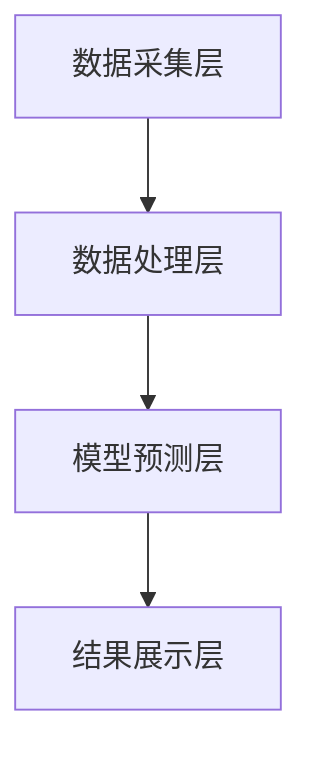
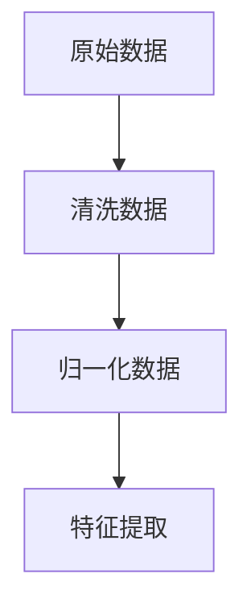
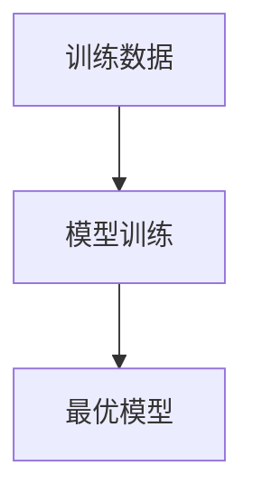
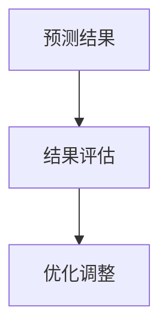
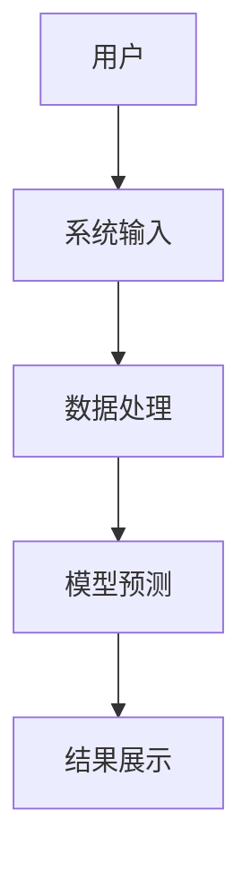
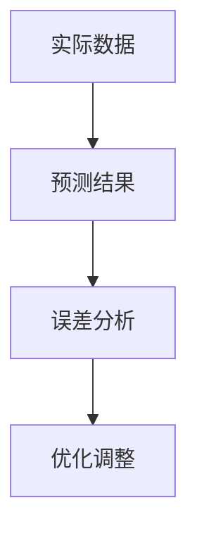

                 


# 《AI Agent在智能城市能源消耗预测中的实践》

> **关键词**: AI Agent, 智能城市, 能源消耗预测, 机器学习, 时间序列分析

> **摘要**: 本文详细探讨了AI Agent在智能城市能源消耗预测中的应用，从理论基础到算法实现，再到系统设计与项目实战，全面分析了AI Agent如何提升能源消耗预测的准确性与效率。通过机器学习模型和时间序列分析，结合实际案例，展示了AI Agent在智能城市中的实际应用价值。

---

## 第5章: 基于机器学习的能源消耗预测

### 5.1 算法原理

#### 5.1.1 线性回归模型

线性回归是一种简单但强大的预测模型，适用于线性关系的数据。其核心思想是找到一条最佳拟合直线，使得预测值与实际值之间的误差最小。

**数学模型**:

$$ y = \beta_0 + \beta_1x + \epsilon $$

其中，$\beta_0$是截距，$\beta_1$是斜率，$\epsilon$是误差项。

#### 5.1.2 支持向量回归(SVR)

支持向量回归是一种基于支持向量机(SVM)的回归模型，适用于非线性关系的数据。

**数学模型**:

$$ y = f(x) = \sum_{i=1}^n \alpha_i y_i K(x, x_i) + b $$

其中，$\alpha_i$是拉格朗日乘子，$K(x, x_i)$是核函数，$b$是偏置项。

#### 5.1.3 随机森林回归

随机森林是一种基于决策树的集成学习方法，具有较强的鲁棒性和抗过拟合能力。

**数学模型**:

随机森林通过构建多个决策树并进行投票或平均来得到最终预测结果。

### 5.2 时间序列分析模型

#### 5.2.1 ARIMA模型

ARIMA（自回归积分滑动平均模型）是一种常用的时间序列预测模型，适用于具有趋势和季节性的数据。

**数学模型**:

$$ (1 - L)^d X_t = \mu + \theta(L) \cdot (1 - L)^d \epsilon_t $$

其中，$L$是延迟算子，$d$是差分阶数，$\mu$是均值，$\theta(L)$是滑动平均多项式。

#### 5.2.2 LSTM网络

LSTM（长短期记忆网络）是一种基于循环神经网络的变体，特别适合处理时间序列数据。

**数学模型**:

$$ \ gate_t = \sigma(W_g x_t + U_g h_{t-1} + b_g) $$
$$ \ candidate_t = \tanh(W_c x_t + U_c h_{t-1} + b_c) $$
$$ h_t = gate_t \cdot candidate_t $$
$$ o_t = \sigma(W_o x_t + U_o h_t + b_o) $$
$$ f_t = o_t \cdot h_t $$

其中，$\sigma$是sigmoid函数，$\tanh$是双曲正切函数。

### 5.3 算法对比与选择

通过对不同算法的优缺点分析，选择最适合能源消耗预测的模型。例如，对于短期预测，LSTM可能更适合，而对于长期预测，ARIMA可能更有效。

---

## 第6章: 基于AI Agent的能源消耗预测系统架构设计

### 6.1 系统总体架构

系统架构分为数据采集层、数据处理层、模型预测层和结果展示层。

**系统架构图**:



### 6.2 关键模块设计

#### 6.2.1 数据预处理模块

负责清洗、归一化和特征提取。

**数据预处理流程图**:



#### 6.2.2 模型训练模块

基于训练数据，训练最优预测模型。

**模型训练流程图**:



#### 6.2.3 预测结果分析模块

对预测结果进行评估和优化。

**结果分析流程图**:



### 6.3 系统交互流程

用户输入预测请求，系统返回预测结果。

**系统交互流程图**:



---

## 第7章: 项目实战——AI Agent能源消耗预测系统实现

### 7.1 环境安装

安装所需的Python库，如numpy、pandas、scikit-learn、keras、tensorflow等。

### 7.2 核心代码实现

#### 7.2.1 数据预处理

```python
import numpy as np
import pandas as pd

# 读取数据
data = pd.read_csv('energy_consumption.csv')

# 数据清洗
data.dropna(inplace=True)
data = data[~data.isin([np.nan, np.inf, -np.inf]).any(axis=1)]

# 特征提取
features = data[['temperature', 'humidity', 'time']]
labels = data['consumption']
```

#### 7.2.2 模型训练与预测

```python
from sklearn.ensemble import RandomForestRegressor
from sklearn.model_selection import train_test_split
from sklearn.metrics import mean_squared_error

# 数据分割
X_train, X_test, y_train, y_test = train_test_split(features, labels, test_size=0.2, random_state=42)

# 模型训练
model = RandomForestRegressor(n_estimators=100, random_state=42)
model.fit(X_train, y_train)

# 模型预测
y_pred = model.predict(X_test)
print('均方误差:', mean_squared_error(y_test, y_pred))
```

#### 7.2.3 LSTM网络实现

```python
from tensorflow.keras.models import Sequential
from tensorflow.keras.layers import LSTM, Dense

# 数据预处理为时间序列格式
data = data['consumption'].values
data = data.reshape((-1, 1))

# 划分训练集和测试集
train_size = int(len(data) * 0.8)
train_data = data[:train_size]
test_data = data[train_size:]

# 构建LSTM模型
model = Sequential()
model.add(LSTM(50, input_shape=(None, 1)))
model.add(Dense(1))
model.compile(loss='mean_squared_error', optimizer='adam')

# 训练模型
model.fit(train_data, epochs=50, verbose=0)

# 预测结果
predicted = model.predict(test_data)
```

### 7.3 实际案例分析

以某城市某季度的能源消耗数据为例，展示模型的预测效果。

**案例分析图**:



---

## 第8章: 总结与展望

### 8.1 全文总结

本文详细探讨了AI Agent在智能城市能源消耗预测中的应用，从理论到实践，全面分析了AI Agent的优势和实现方法。

### 8.2 未来展望

随着AI技术的不断发展，AI Agent在能源消耗预测中的应用将更加广泛和深入。未来的研究方向包括更复杂的模型优化、多源数据融合、实时预测等。

### 8.3 最佳实践 tips

- 数据预处理是关键，确保数据质量。
- 选择合适的模型，结合业务需求。
- 定期更新模型，适应数据变化。

### 8.4 作者简介

作者：AI天才研究院/AI Genius Institute & 禅与计算机程序设计艺术/Zen And The Art of Computer Programming

---

通过本文的详细讲解，读者可以全面理解AI Agent在智能城市能源消耗预测中的实践应用，掌握相关算法和系统设计的方法。

