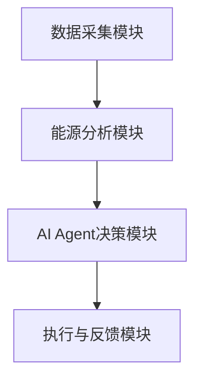

                 


# AI Agent在智能城市能源管理中的实践

> 关键词：AI Agent, 智能城市, 能源管理, 人工智能, 能源优化

> 摘要：本文详细探讨了AI Agent在智能城市能源管理中的应用，从理论基础到实际实践，分析了AI Agent的核心原理、系统架构、算法实现以及在能源管理中的具体应用场景。通过实际案例和代码实现，展示了AI Agent如何优化能源分配、预测能源需求和减少能源浪费，为智能城市可持续发展提供技术支持。

---

## 第一部分：AI Agent与智能城市能源管理概述

### 第1章：AI Agent与智能城市能源管理的背景与概念

#### 1.1 AI Agent的基本概念
AI Agent（人工智能代理）是指能够感知环境、自主决策并执行任务的智能实体。它具备以下核心特征：
- **自主性**：能够在没有外部干预的情况下独立运作。
- **反应性**：能够实时感知环境变化并做出反应。
- **目标导向**：基于目标驱动行为，优化决策以实现目标。
- **学习能力**：通过数据和经验不断优化自身的算法和决策模型。

AI Agent可以分为以下几类：
1. **简单反射型代理**：基于当前输入直接做出反应，适用于简单的决策任务。
2. **基于模型的反射型代理**：利用内部模型和环境信息进行决策，适用于复杂任务。
3. **目标驱动型代理**：以特定目标为导向，优化决策以实现目标。
4. **实用驱动型代理**：以效用函数为优化目标，权衡不同选择的优劣。

AI Agent广泛应用于自动驾驶、智能助手、机器人控制等领域。

---

#### 1.2 智能城市能源管理的背景
随着城市化进程的加快，能源需求急剧增长，能源浪费和环境污染问题日益严重。智能城市能源管理的目标是通过智能化技术优化能源分配、减少浪费、提高能源利用效率。然而，能源管理涉及多个领域，包括电力、燃气、热能等，且需要实时处理海量数据，这对传统的管理方式提出了巨大挑战。

AI Agent的引入为智能城市能源管理提供了新的解决方案。它能够实时感知能源需求、预测能源消耗、优化能源分配，并通过自主决策减少能源浪费。

---

#### 1.3 AI Agent在智能城市能源管理中的作用
AI Agent在智能城市能源管理中的作用主要体现在以下几个方面：
1. **优化能源分配**：AI Agent能够根据实时能源需求和供应情况，优化能源分配策略，确保能源供需平衡。
2. **能源预测与规划**：通过历史数据和机器学习算法，AI Agent可以准确预测未来能源需求，制定合理的能源规划。
3. **减少能源浪费**：AI Agent能够实时监控能源消耗情况，发现浪费点并及时调整策略，减少能源浪费。

---

## 第二部分：AI Agent的核心原理与技术

### 第2章：AI Agent的核心原理

#### 2.1 AI Agent的基本原理
AI Agent的核心原理包括以下几个方面：
1. **信息感知**：通过传感器、数据源等获取环境信息。
2. **数据处理**：对获取的数据进行清洗、特征提取和数据建模。
3. **决策与行动**：基于数据和模型，AI Agent做出决策并执行行动。
4. **学习与优化**：通过反馈机制不断优化自身的算法和决策模型。

#### 2.2 AI Agent的算法基础
AI Agent的算法基础主要包括以下几种：
1. **强化学习**：通过试错机制，AI Agent在与环境的交互中学习最优策略。
2. **监督学习**：基于标注数据，训练AI Agent识别特定模式。
3. **无监督学习**：通过聚类、降维等技术，发现数据中的潜在结构。

#### 2.3 AI Agent的数学模型
AI Agent的数学模型是其决策和学习的基础。例如，强化学习中的Q-learning算法可以用以下公式表示：

$$ Q(s, a) = r + \gamma \max_{a'} Q(s', a') $$

其中，$s$是当前状态，$a$是当前动作，$r$是奖励，$\gamma$是折扣因子，$s'$是下一个状态。

---

## 第三部分：智能城市能源管理的系统架构

### 第3章：智能城市能源管理系统的架构设计

#### 3.1 系统组成与功能模块
智能城市能源管理系统主要包括以下几个功能模块：
1. **数据采集模块**：负责采集能源消耗数据。
2. **能源分析模块**：对数据进行分析和建模。
3. **AI Agent决策模块**：基于分析结果做出决策。
4. **执行与反馈模块**：执行决策并反馈结果。

#### 3.2 系统架构图
以下是智能城市能源管理系统的架构图：



#### 3.3 系统接口设计
系统接口设计需要考虑以下几点：
1. **数据接口**：定义数据格式和传输协议。
2. **API接口**：提供标准API供其他系统调用。
3. **通信协议**：选择适合的通信协议，如HTTP、MQTT等。

---

## 第四部分：AI Agent在智能城市能源管理中的应用实践

### 第4章：AI Agent在智能城市能源管理中的算法实现

#### 4.1 强化学习算法在能源管理中的应用
强化学习是一种非常适合能源管理的算法。以下是一个简单的强化学习实现示例：

```python
import numpy as np
import gym

env = gym.make('EnergyManagement-v0')
env.seed(42)

# 初始化策略参数
theta = np.random.randn(2, 1)

# 定义策略函数
def policy(state):
    return np.dot(state, theta)

# 强化学习算法实现
for episode in range(1000):
    state = env.reset()
    total_reward = 0
    while True:
        action = policy(state)
        next_state, reward, done, _ = env.step(action)
        total_reward += reward
        if done:
            break
        state = next_state
    print(f'Episode {episode}: Reward = {total_reward}')
```

#### 4.2 能源预测模型的构建与优化
能源预测模型可以通过机器学习算法实现。以下是一个简单的能源预测模型：

```python
from sklearn.linear_model import LinearRegression

# 数据预处理
X = df[['temperature', 'humidity']]
y = df['energy_consumption']

# 模型训练
model = LinearRegression()
model.fit(X, y)

# 模型预测
print(model.predict(X))
```

#### 4.3 能源分配优化的AI Agent实现
以下是一个能源分配优化的AI Agent实现示例：

```python
class AI-Agent:
    def __init__(self):
        self.target = 'minimize energy waste'
        self.current_state = 'low demand'

    def perceive(self, environment):
        # 获取环境数据
        self.current_state = environment.get_current_state()

    def decide(self):
        # 基于当前状态做出决策
        if self.current_state == 'low demand':
            return 'reduce production'
        else:
            return 'increase production'

    def act(self, decision):
        # 执行决策
        print(f'Executing decision: {decision}')
```

---

## 第五部分：项目实战

### 第5章：AI Agent在智能城市能源管理中的项目实现

#### 5.1 环境安装
需要安装以下环境和工具：
1. Python 3.8+
2. Gym库：`pip install gym`
3. Matplotlib库：`pip install matplotlib`

#### 5.2 核心代码实现
以下是核心代码实现：

```python
import gym
import matplotlib.pyplot as plt

# 定义环境
class EnergyManagementEnv(gym.Env):
    def __init__(self):
        super().__init__()
        self.action_space = gym.spaces.Discrete(2)
        self.observation_space = gym.spaces.Box(low=0, high=100, shape=(1,))

    def reset(self):
        self.state = np.random.randint(0, 100, size=(1,))
        return self.state

    def step(self, action):
        # 假设动作为0或1，分别代表减少或增加能源生产
        if action == 0:
            reward = 1
        else:
            reward = -1
        self.state = np.random.randint(0, 100, size=(1,))
        return self.state, reward, False, {}

# 初始化环境
env = EnergyManagementEnv()
env.seed(42)

# 定义AI Agent策略
def policy(observation):
    if observation[0] < 50:
        return 0
    else:
        return 1

# 算法实现
for _ in range(10):
    state = env.reset()
    total_reward = 0
    done = False
    while not done:
        action = policy(state)
        next_state, reward, done, _ = env.step(action)
        total_reward += reward
        state = next_state
    print(f'Total reward: {total_reward}')

plt.plot(rewards)
plt.xlabel('Episode')
plt.ylabel('Total Reward')
plt.show()
```

#### 5.3 案例分析与解读
通过上述代码实现，我们可以看到AI Agent在智能城市能源管理中的应用效果。例如，当能源需求较低时，AI Agent会选择减少能源生产，从而降低能源浪费。而当需求较高时，AI Agent会选择增加能源生产，以满足需求。

---

## 第六部分：总结与展望

### 第6章：总结与展望

#### 6.1 总结
本文详细探讨了AI Agent在智能城市能源管理中的应用，从理论基础到实际实践，分析了AI Agent的核心原理、系统架构、算法实现以及在能源管理中的具体应用场景。通过实际案例和代码实现，展示了AI Agent如何优化能源分配、预测能源需求和减少能源浪费。

#### 6.2 展望
未来，随着AI技术的不断发展，AI Agent在智能城市能源管理中的应用将更加广泛和深入。例如，结合边缘计算和物联网技术，AI Agent可以实现更实时、更高效的能源管理。此外，通过多智能体协作，AI Agent可以进一步优化能源分配和管理效率。

---

## 作者：AI天才研究院 & 禅与计算机程序设计艺术

