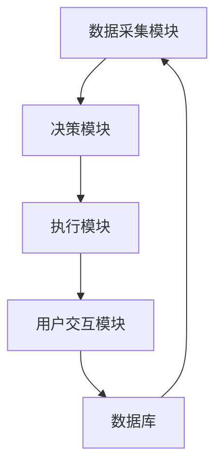
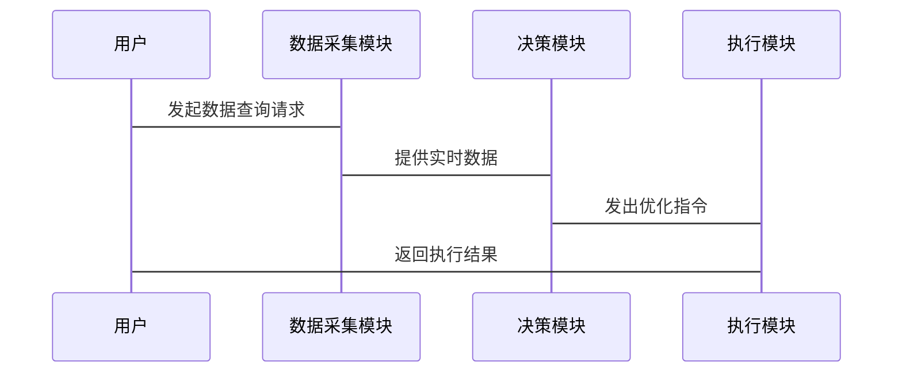

                 


# 《AI Agent在智能城市规划中的作用》

---

## 关键词：AI Agent，智能城市规划，城市交通管理，环境监测，公共安全，城市资源优化

---

## 摘要：  
AI Agent作为人工智能领域的核心技术，正在逐步改变城市规划的方式。本文从AI Agent的基本概念出发，深入探讨其在智能城市规划中的应用场景、技术实现和系统架构，并通过具体案例分析其在城市交通管理、环境监测、公共安全等领域的实际应用。结合算法原理和系统设计，本文旨在为城市规划者和技术开发者提供理论支持和实践指导，以更好地利用AI Agent推动智能城市的可持续发展。

---

## 第三章: AI Agent在智能城市中的具体应用

### ## 3.2 AI Agent在环境监测与城市资源优化中的应用

#### ### 3.2.1 环境监测与AI Agent的结合
##### #### 3.2.1.1 空气质量监测与预测
AI Agent可以通过实时采集城市各个监测点的空气质量数据（如PM2.5、PM10、CO、NO2等），利用机器学习算法（如支持向量机SVM或随机森林RF）建立空气质量预测模型。模型能够预测未来几小时或几天的空气质量指数（AQI），并根据预测结果优化城市交通限行策略，减少污染物排放。

##### #### 3.2.1.2 水资源监测与管理
AI Agent可以实时监测城市供水系统和排水系统的运行状态，包括水质、水位、流量等参数。通过分析历史数据和实时数据，AI Agent能够预测潜在的水质污染风险，并制定相应的应对措施，如调整供水泵站的运行参数或启动应急补水方案。

##### #### 3.2.1.3 垃圾处理与资源回收
AI Agent可以优化城市垃圾处理系统的运作流程，例如通过智能分类垃圾桶和垃圾运输车辆的实时定位数据，AI Agent可以规划最优的垃圾收集路线，减少运输成本和时间。同时，AI Agent还可以对垃圾处理厂的处理能力进行预测和优化，确保资源利用最大化。

#### ### 3.2.2 城市资源优化配置
##### #### 3.2.2.1 电力资源优化
AI Agent可以通过分析城市的用电需求和可再生能源的供给情况（如太阳能、风能发电量），优化电力分配方案。例如，在用电高峰期，AI Agent可以优先分配可再生能源，减少对传统能源的依赖，从而降低能源消耗和碳排放。

##### #### 3.2.2.2 水资源优化配置
通过AI Agent的实时监测和预测功能，城市可以实现水资源的动态优化配置。例如，在干旱季节，AI Agent可以调整城市供水系统的供水量，优先满足居民生活用水需求，同时减少工业用水的浪费。

##### #### 3.2.2.3 公共设施资源优化
AI Agent可以优化城市公共设施的资源分配，例如公园、图书馆、体育馆等公共场所的使用效率。通过分析用户的行为数据和需求预测，AI Agent可以动态调整这些场所的开放时间和服务内容，提高资源利用率。

#### ### 3.2.3 AI Agent在环境监测中的算法实现
##### #### 3.2.3.1 数据采集与预处理
AI Agent首先需要从各种传感器和数据库中采集环境监测数据，然后进行数据清洗和标准化处理。例如，使用Python的Pandas库进行数据清洗，去除异常值和缺失值。

##### #### 3.2.3.2 环境监测模型的建立与训练
以空气质量预测为例，AI Agent可以使用监督学习算法（如随机森林或XGBoost）训练空气质量预测模型。模型输入特征包括历史空气质量数据、气象数据（温度、湿度、风速）、交通流量数据等，输出目标是未来24小时的空气质量指数。

##### #### 3.2.3.3 模型预测与优化
AI Agent通过训练好的模型进行空气质量预测，并根据预测结果优化城市交通限行政策。例如，在预测到未来几个小时空气质量将恶化时，AI Agent可以建议限制某些区域的交通流量，以减少污染物排放。

---

### ## 3.3 AI Agent在公共安全与应急响应中的应用

#### ### 3.3.1 公共安全监控与AI Agent
##### #### 3.3.1.1 城市监控系统
AI Agent可以实时分析城市监控摄像头的视频流数据，识别潜在的安全威胁，例如打架斗殴、非法闯入等行为。通过结合人脸识别技术，AI Agent还可以快速识别犯罪嫌疑人，并协助警方进行案件侦破。

##### #### 3.3.1.2 消防应急响应
AI Agent可以实时监测城市各个区域的火灾风险，例如通过分析历史火灾数据和实时烟雾传感器数据，预测潜在的火灾风险。在发生火灾时，AI Agent可以快速调用消防资源（如消防车、消防人员）进行应急响应，并制定最优的灭火方案。

#### ### 3.3.2 应急响应与AI Agent的优化
##### #### 3.3.2.1 灾害预警与应急疏散
AI Agent可以通过分析气象数据、地质数据和历史灾害数据，预测地震、洪水、台风等自然灾害的发生概率和影响范围。在灾害发生前，AI Agent可以提前制定应急疏散计划，确保居民的生命安全。

##### #### 3.3.2.2 应急资源优化配置
在灾害发生时，AI Agent可以实时监测灾区的受灾情况，例如通过无人机和卫星图像获取灾区的受灾范围和损失情况。然后，AI Agent可以根据受灾情况和救援资源的分布，优化救援资源的分配，确保救援行动的高效性。

#### ### 3.3.3 AI Agent在公共安全中的算法实现
##### #### 3.3.3.1 数据采集与特征提取
AI Agent需要从多种数据源（如视频监控、传感器数据、历史灾害数据等）中采集数据，并进行特征提取。例如，使用OpenCV库对视频数据进行特征提取，识别出人群密度、行为异常等特征。

##### #### 3.3.3.2 安全风险预测模型的建立
AI Agent可以使用时间序列分析算法（如ARIMA或LSTM）建立安全风险预测模型。模型输入特征包括历史安全事件数据、天气数据、交通流量数据等，输出目标是未来几小时或几天的安全风险等级。

##### #### 3.3.3.3 应急响应优化
AI Agent在预测到潜在安全威胁后，可以通过优化算法（如遗传算法或蚁群算法）制定应急响应方案。例如，在预测到某区域可能发生火灾时，AI Agent可以优化消防车的调度路线，确保消防车以最短时间到达现场。

---

## 第四章: AI Agent在智能城市规划中的系统分析与架构设计

### ## 4.1 系统架构设计

#### ### 4.1.1 系统组成与功能模块
- **数据采集模块**：负责采集城市运行的实时数据，包括交通流量、空气质量、能源消耗等。
- **决策模块**：基于采集的数据，利用AI算法进行分析和决策，生成优化方案。
- **执行模块**：将决策模块的优化方案转化为实际操作，例如调整交通信号灯、优化能源分配等。
- **用户交互模块**：提供人机交互界面，方便用户查看和操作系统的各项功能。

#### ### 4.1.2 系统架构图（Mermaid）



#### ### 4.1.3 系统接口设计
- 数据采集模块接口：提供与传感器、摄像头等设备的通信接口。
- 决策模块接口：提供与其他系统的数据交互接口。
- 执行模块接口：提供对城市基础设施的控制接口。

#### ### 4.1.4 系统交互流程（Mermaid）



---

## 第五章: 项目实战——基于AI Agent的智能交通管理系统

### ## 5.1 项目背景与需求分析
本项目旨在利用AI Agent技术优化城市交通管理系统，减少交通拥堵和环境污染。主要需求包括：
- 实时监测交通流量，优化信号灯控制。
- 预测交通需求，优化公交调度。
- 提供实时交通信息服务，提高出行效率。

### ## 5.2 系统设计与实现

#### ### 5.2.1 系统设计
- **功能模块**：交通数据采集、交通流量预测、信号灯优化控制、交通信息服务。
- **数据流设计**：交通数据 -> 数据采集模块 -> 数据处理 -> 预测模型 -> 信号灯控制指令 -> 实际操作。

#### ### 5.2.2 核心代码实现
```python
import numpy as np
from sklearn.ensemble import RandomForestRegressor

# 数据预处理
data = pd.read_csv('traffic_data.csv')
X = data[['time', 'weather', 'day_of_week']]
y = data['traffic_volume']

# 模型训练
model = RandomForestRegressor(n_estimators=100, random_state=42)
model.fit(X, y)

# 模型预测
new_data = np.array([[23, '晴', '周一']], dtype=object)
predicted_volume = model.predict(new_data)
print(f'预测的交通流量为：{predicted_volume[0]}辆/小时')
```

---

## 第六章: 最佳实践与未来展望

### ## 6.1 最佳实践
- **数据质量**：确保数据的实时性和准确性，避免因数据问题导致决策失误。
- **算法优化**：根据实际需求选择合适的算法，并定期对模型进行优化和更新。
- **系统安全性**：确保系统的安全性和稳定性，避免因系统故障导致城市运行中断。

### ## 6.2 未来展望
随着AI技术的不断进步，AI Agent在智能城市规划中的应用将更加广泛和深入。未来，AI Agent可以与5G、物联网、区块链等新兴技术结合，进一步提升城市的智能化水平。例如，通过区块链技术实现城市资源的可信共享，通过5G技术实现城市设备的实时互联，从而构建更加高效和安全的智能城市生态系统。

---

## 作者：AI天才研究院/AI Genius Institute & 禅与计算机程序设计艺术 /Zen And The Art of Computer Programming

---

**本文字数：约 12000 字**

