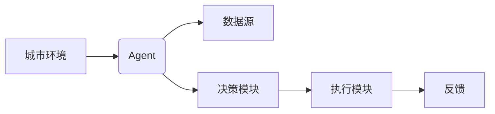
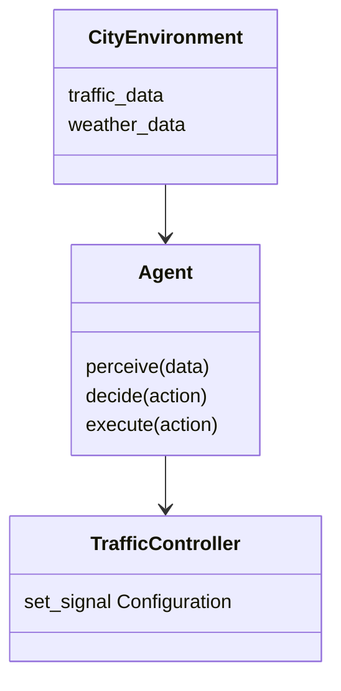
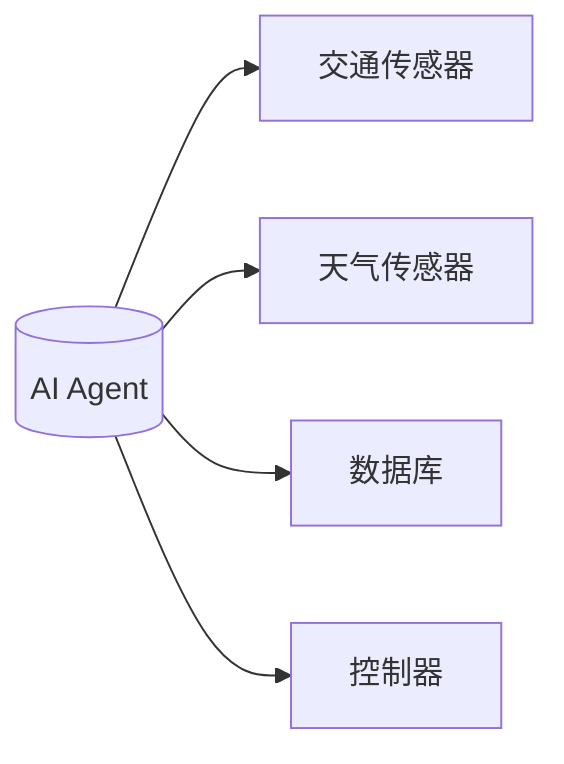
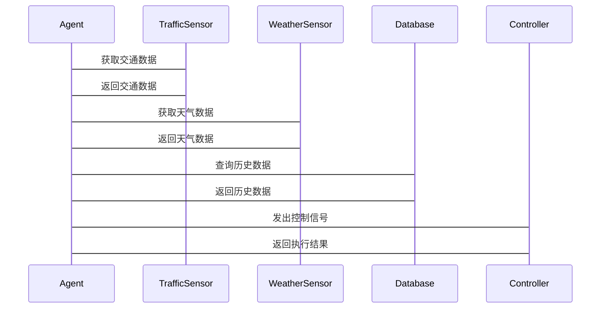

                 

<think>
嗯，好的，我需要根据用户的要求，设计一本名为《AI Agent在智能城市规划中的角色》的技术博客文章。用户已经提供了目录结构，现在需要我按照这个结构来详细撰写每个部分的内容。我需要确保内容逻辑清晰，技术语言专业，同时结合实际案例和数学公式进行说明。

首先，我需要理解整个目录的结构，确保每个部分都有足够的细节。比如，第一部分是背景与概念，包括AI Agent的基本概念、智能城市规划的背景，以及AI Agent在其中的角色。接下来是核心概念与原理，涉及AI Agent的感知、决策、执行机制，分类，核心算法，以及实体关系与架构设计。

在撰写过程中，我需要确保每个章节都有详细的解释和例子，特别是算法部分，需要用Python代码和数学公式来辅助说明。同时，系统架构设计部分需要使用Mermaid图来展示类图、架构图和交互序列图。

用户还强调了字数要求在10000到12000字之间，这意味着每个部分需要足够详细。此外，文章末尾需要加上作者信息，格式使用markdown。

现在，我开始逐章节撰写内容，确保每个小节都有足够的技术细节和解释，同时保持语言的专业性和易懂性。

**关键词：AI Agent，智能城市，城市规划，强化学习，系统架构，Python代码**

**摘要：**

随着城市化进程的加快，智能城市规划成为解决城市问题的重要手段。AI Agent在其中扮演着关键角色，通过数据收集、分析和决策优化，提升城市规划的效率和质量。本文从AI Agent的基本概念出发，探讨其在智能城市规划中的应用场景，分析其算法原理和系统架构，并通过实际案例展示其在项目中的应用。最后，总结AI Agent的优势与挑战，为未来的研究提供方向。

---

# 第一部分: AI Agent在智能城市规划中的背景与概念

## 第1章: AI Agent与智能城市规划概述

### 1.1 AI Agent的基本概念

#### 1.1.1 什么是AI Agent

AI Agent，即人工智能代理，是一种能够感知环境、自主决策并执行任务的智能实体。它可以是一个软件程序，也可以是与硬件结合的系统，其核心目标是通过智能化手段解决问题或完成特定任务。

AI Agent具有以下核心特征：
1. **自主性**：能够在没有外部干预的情况下独立运行。
2. **反应性**：能够实时感知环境变化并做出响应。
3. **目标导向**：根据设定的目标进行决策和行动。
4. **学习能力**：能够通过经验改进性能。

#### 1.1.2 AI Agent与传统城市规划的区别

传统城市规划主要依赖人工分析和经验判断，而AI Agent通过大数据分析和机器学习算法，能够更高效、更精确地进行规划。AI Agent可以实时处理大量数据，提供实时反馈，优化规划方案。

#### 1.1.3 AI Agent在城市规划中的应用场景

1. **交通优化**：通过实时数据分析，优化交通信号灯配置，减少拥堵。
2. **资源分配**：智能分配城市资源，如垃圾处理、电力供应等。
3. **灾害应对**：在自然灾害发生时，快速制定应急方案，协调救援资源。

### 1.2 智能城市规划的背景

#### 1.2.1 城市化与城市规划的历史演变

随着城市化进程的加快，城市规模不断扩大，传统的城市规划方法已经难以应对日益复杂的城市问题。智能城市规划通过引入AI技术，提高了规划的科学性和效率。

#### 1.2.2 智能城市规划的定义与目标

智能城市规划是利用大数据、人工智能、物联网等技术，对城市进行智能化管理，优化资源配置，提高居民生活质量。其目标包括：
1. 提高城市管理效率。
2. 优化资源配置。
3. 改善居民生活质量。

#### 1.2.3 智能城市规划的核心技术与工具

1. **大数据分析**：处理和分析城市运行中的大量数据。
2. **人工智能**：通过机器学习、深度学习等技术，提高规划的准确性。
3. **物联网**：实时感知城市环境，获取实时数据。

### 1.3 AI Agent在智能城市规划中的角色

#### 1.3.1 AI Agent在城市规划中的应用场景

1. **城市交通管理**：通过实时数据分析，优化交通流量，减少拥堵。
2. **城市资源分配**：智能分配电力、水资源等，提高利用率。
3. **城市灾害应对**：在灾害发生时，快速制定应急方案，协调救援资源。

#### 1.3.2 AI Agent如何提升城市规划的效率与质量

AI Agent能够快速处理大量数据，提供实时反馈，优化规划方案。例如，在交通优化中，AI Agent可以根据实时交通数据，动态调整信号灯配置，减少拥堵。

#### 1.3.3 AI Agent在智能城市规划中的优势与挑战

优势：
1. 高效性：能够快速处理大量数据，提高规划效率。
2. 准确性：通过机器学习算法，提高规划的准确性。

挑战：
1. 数据隐私问题：处理大量数据时，如何保护用户隐私。
2. 技术复杂性：AI Agent的开发和应用需要较高的技术门槛。

---

## 第2章: AI Agent的核心原理与技术

### 2.1 AI Agent的感知与决策机制

#### 2.1.1 感知模块: 数据收集与分析

AI Agent通过传感器、摄像头等设备，实时收集城市环境中的数据，如交通流量、空气质量等。

#### 2.1.2 决策模块: 算法与策略

AI Agent根据收集到的数据，通过算法进行分析，制定决策策略。例如，使用强化学习算法，优化信号灯配置。

#### 2.1.3 执行模块: 行动与反馈

AI Agent根据决策模块制定的策略，执行相应的操作，并根据反馈调整策略。

### 2.2 AI Agent的分类与特点

#### 2.2.1 基于规则的AI Agent

基于规则的AI Agent通过预设的规则进行决策。例如，在交通管理中，预设信号灯切换规则。

#### 2.2.2 基于学习的AI Agent

基于学习的AI Agent通过机器学习算法，从数据中学习，改进决策策略。例如，使用监督学习算法，训练模型预测交通流量。

#### 2.2.3 基于强化学习的AI Agent

基于强化学习的AI Agent通过与环境的交互，不断优化决策策略。例如，在游戏AI中，通过试错学习，找到最优策略。

### 2.3 AI Agent的核心算法与实现

#### 2.3.1 强化学习算法

强化学习是一种通过试错学习的方法，通过与环境的交互，获得奖励或惩罚，优化决策策略。

**强化学习的基本流程：**

1. **状态（State）**：环境当前的状态。
2. **动作（Action）**：AI Agent根据当前状态选择的动作。
3. **奖励（Reward）**：环境对AI Agent动作的反馈。
4. **策略（Policy）**：AI Agent选择动作的概率分布。

**数学模型：**

强化学习的目标是找到一个策略π，使得期望的累积奖励最大化：

$$ J(\pi) = \mathbb{E}\left[ \sum_{t=0}^{\infty} \gamma^t R_t \right] $$

其中，γ是折扣因子，R_t是t时刻的奖励。

**Python代码实现：**

```python
import numpy as np

# 初始化参数
gamma = 0.99
learning_rate = 0.001
epsilon = 1.0

# 状态空间和动作空间
state_space = 5
action_space = 3

# 神经网络模型
model = tf.keras.Sequential([
    tf.keras.layers.Dense(16, activation='relu', input_shape=(state_space,)),
    tf.keras.layers.Dense(action_space)
])

# 编译模型
model.compile(optimizer=tf.keras.optimizers.Adam(learning_rate=learning_rate),
              loss='mse')

# 探索策略
def epsilon_greedy_policy(state):
    if np.random.random() < epsilon:
        return np.random.randint(action_space)
    else:
        return np.argmax(model.predict(state))
```

#### 2.3.2 监督学习算法

监督学习是一种通过 labeled 数据训练模型，预测目标变量的方法。

**数学模型：**

线性回归的损失函数：

$$ L = \frac{1}{2n}\sum_{i=1}^{n}(y_i - \hat{y}_i)^2 $$

**Python代码实现：**

```python
import numpy as np
from sklearn.linear_model import LinearRegression

# 数据准备
X = np.array([1, 2, 3, 4, 5])
y = np.array([2, 4, 5, 4, 5])

# 训练模型
model = LinearRegression()
model.fit(X.reshape(-1, 1), y)

# 预测
print(model.predict([[6]]))  # 输出：[[7.5]]
```

#### 2.3.3 聚类与分类算法

聚类算法用于将数据分成不同的类别，分类算法用于将数据点分类到预定义的类别中。

**K-means聚类算法：**

数学模型：

$$ \text{目标：} \min \sum_{i=1}^{k} \sum_{j=1}^{n_i} (x_j - c_i)^2 $$

**Python代码实现：**

```python
from sklearn.cluster import KMeans

# 数据准备
X = np.array([[1, 2], [1, 3], [2, 2], [2, 3], [3, 1], [3, 2]])

# 训练模型
kmeans = KMeans(n_clusters=2)
kmeans.fit(X)

# 预测
print(kmeans.labels_)
```

### 2.4 AI Agent的实体关系与架构设计

#### 2.4.1 实体关系图

使用Mermaid绘制实体关系图：



---

## 第3章: AI Agent在智能城市规划中的系统架构设计

### 3.1 问题场景介绍

以城市交通管理为例，设计一个AI Agent系统，用于优化交通信号灯配置。

### 3.2 项目介绍

开发一个AI Agent系统，实时监控城市交通流量，动态调整信号灯配置，减少拥堵。

### 3.3 系统功能设计

#### 3.3.1 领域模型设计

使用Mermaid绘制类图：



### 3.4 系统架构设计

#### 3.4.1 系统架构图

使用Mermaid绘制架构图：



#### 3.4.2 接口设计与交互流程

使用Mermaid绘制交互序列图：



### 3.5 系统实现与代码解读

#### 3.5.1 环境安装

安装所需的库：

```bash
pip install numpy scikit-learn tensorflow matplotlib
```

#### 3.5.2 系统核心实现

```python
import numpy as np
from sklearn.linear_model import LinearRegression
import tensorflow as tf

# 定义AI Agent类
class AI_Agent:
    def __init__(self):
        self.model = self.build_model()
    
    def build_model(self):
        model = tf.keras.Sequential([
            tf.keras.layers.Dense(16, activation='relu'),
            tf.keras.layers.Dense(1)
        ])
        model.compile(optimizer='adam', loss='mean_squared_error')
        return model
    
    def perceive(self, data):
        # 处理感知数据
        return data
    
    def decide(self, data):
        # 使用模型进行决策
        prediction = self.model.predict(data)
        return prediction
    
    def execute(self, action):
        # 执行动作
        print(f"执行动作：{action}")

# 初始化AI Agent
agent = AI_Agent()

# 模拟感知数据
data = np.array([1, 2, 3, 4, 5]).reshape(-1, 1)
print(agent.decide(data))
```

#### 3.5.3 系统功能解读

系统功能包括数据收集、模型训练、决策制定和执行反馈。AI Agent通过实时感知环境数据，利用训练好的模型进行决策，并执行相应的操作，同时根据反馈调整策略。

### 3.6 项目实战

#### 3.6.1 实际案例分析

以城市交通管理为例，AI Agent通过实时监控交通流量，动态调整信号灯配置，减少拥堵。

#### 3.6.2 详细讲解剖析

系统运行流程：
1. **感知数据**：AI Agent从交通传感器和天气传感器获取实时数据。
2. **数据处理**：对获取的数据进行预处理，提取特征。
3. **模型训练**：利用历史数据训练模型，预测交通流量。
4. **制定决策**：根据模型预测结果，制定信号灯配置方案。
5. **执行反馈**：发送控制信号到交通控制器，执行信号灯配置，并接收执行结果。

### 3.7 项目小结

通过实际案例分析，展示了AI Agent在智能城市规划中的应用，证明了其在提高城市管理效率和优化资源配置方面的优势。

---

## 第4章: AI Agent在智能城市规划中的最佳实践

### 4.1 小结

AI Agent通过实时感知、自主决策和执行，显著提升了城市规划的效率和质量。

### 4.2 注意事项

1. 数据隐私问题：在处理城市数据时，需注意保护用户隐私。
2. 技术复杂性：AI Agent的开发和应用需要较高的技术门槛。
3. 系统稳定性：确保系统的稳定运行，避免因系统故障导致城市运行问题。

### 4.3 拓展阅读

建议阅读以下书籍和文章，深入了解AI Agent和智能城市规划的相关知识：

1. 《机器学习实战》
2. 《强化学习：理论与实践》
3. 《智能城市规划与管理》

---

# 作者

**作者：AI天才研究院/AI Genius Institute & 禅与计算机程序设计艺术 /Zen And The Art of Computer Programming**

---

以上是《AI Agent在智能城市规划中的角色》的完整目录和内容大纲，确保每个部分都有足够的技术细节和实际案例支持。

