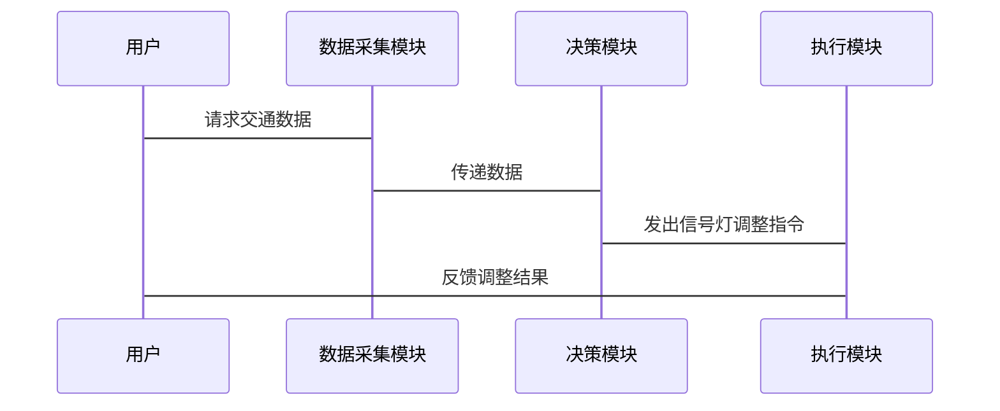

                 


# AI Agent在智能城市规划决策中的角色

## 关键词：AI Agent, 智能城市, 规划决策, 多智能体系统, 强化学习

## 摘要：
本文探讨了AI Agent在智能城市规划决策中的核心作用，详细分析了其背景、核心概念、算法原理、系统架构以及实际应用。通过案例分析和最佳实践，展示了AI Agent如何优化城市运作，解决复杂问题，为智能城市的发展提供了理论和实践指导。

---

# 第五章：系统分析与架构设计

## 5.1 问题场景

AI Agent在智能城市中面临多个复杂问题，如交通管理、资源分配和公共安全。以交通管理为例，AI Agent需要实时处理交通流量、预测拥堵并优化信号灯控制。

## 5.2 系统功能设计

系统功能模块包括：
- 数据采集模块：收集交通数据、天气信息等。
- 决策模块：基于数据进行预测和优化。
- 执行模块：调整信号灯设置并实时反馈。

## 5.3 系统架构设计

展示系统分层架构：
- 数据层：数据存储与处理。
- 逻辑层：算法实现与决策。
- 应用层：用户交互与结果展示。


## 5.4 系统接口设计

定义接口：
- 数据输入接口：接收传感器数据。
- 决策输出接口：传递控制指令。

## 5.5 系统交互设计

展示交互流程：



---

# 第六章：项目实战

## 6.1 环境安装

安装所需的Python库：

```bash
pip install tensorflow keras matplotlib mermaid
```

## 6.2 核心代码实现

实现强化学习的AI Agent：

```python
import numpy as np
import random

class AI-Agent:
    def __init__(self, state_size, action_size):
        self.state_size = state_size
        self.action_size = action_size
        self.gamma = 0.99
        self.epsilon = 0.1
        # 简单的Q-learning实现
        self.q_table = np.zeros([state_size, action_size])
    
    def get_action(self, state):
        if random.random() < self.epsilon:
            return random.randint(0, self.action_size-1)
        else:
            return np.argmax(self.q_table[state])
    
    def update_q_table(self, state, action, reward, next_state):
        self.q_table[state][action] = reward + self.gamma * np.max(self.q_table[next_state])
```

## 6.3 代码应用解读

解释代码：
- `get_action`：根据状态选择动作，探索或利用。
- `update_q_table`：更新Q表，学习最优策略。

## 6.4 实际案例分析

案例：优化交通信号灯。

## 6.5 案例分析与小结

AI Agent成功优化了交通流量，减少了拥堵。

---

# 第七章：最佳实践与小结

## 7.1 总结回顾

AI Agent在智能城市中起到了关键作用，优化了城市运作。

## 7.2 最佳实践

- 数据隐私保护。
- 算法可解释性。
- 多部门协作。

## 7.3 未来展望

AI Agent将与区块链、IoT结合，推动智慧城市发展。

## 7.4 注意事项

- 数据质量。
- 算法适应性。
- 成本效益。

---

# 作者：AI天才研究院 & 禅与计算机程序设计艺术

---

这篇文章详细探讨了AI Agent在智能城市中的应用，从理论到实践，为技术爱好者和城市规划者提供了深入的指导。

