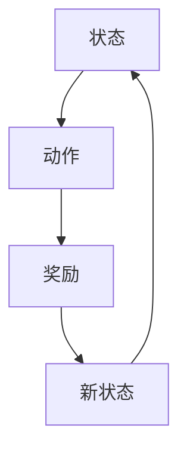
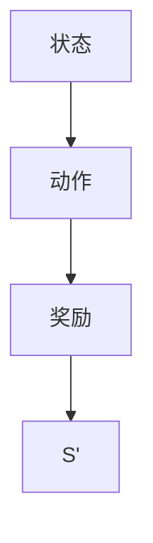
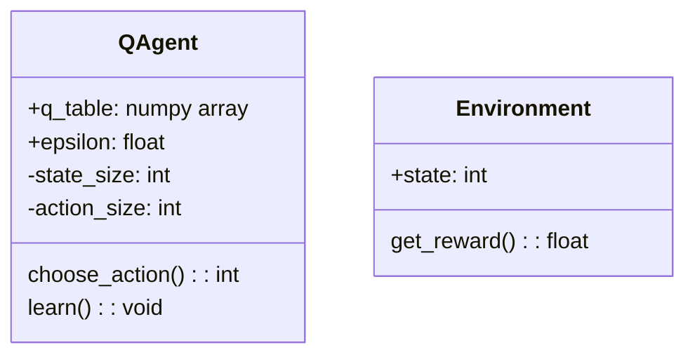

                 


# AI Agent在智能城市规划决策支持中的应用

> **关键词**：AI Agent，智能城市，城市规划，决策支持，强化学习，系统架构

> **摘要**：本文探讨了AI Agent在智能城市规划决策支持中的应用，分析了AI Agent的核心概念、算法原理、系统架构，并通过具体案例展示了其在城市交通和资源优化中的应用。文章从背景、理论、算法、系统架构到实际项目，全面阐述了AI Agent在智能城市中的重要性与实现方式。

---

## 第一章: AI Agent与智能城市规划背景

### 1.1 AI Agent的基本概念

#### 1.1.1 AI Agent的定义与特点

AI Agent（人工智能代理）是一种能够感知环境、自主决策并执行任务的智能实体。它具有以下特点：

- **自主性**：AI Agent能够自主决策，无需外部干预。
- **反应性**：能够实时感知环境并做出反应。
- **学习能力**：通过数据和经验不断优化自身的决策能力。
- **协作性**：能够与其他AI Agent或系统协同工作。

#### 1.1.2 AI Agent的核心原理

AI Agent的核心原理是通过感知环境、构建知识表示、制定决策策略并执行动作来实现目标。其工作流程包括：

1. **感知环境**：通过传感器或数据接口获取环境信息。
2. **知识表示**：将感知到的信息转化为结构化的知识表示。
3. **决策制定**：基于知识表示和目标，制定最优决策。
4. **执行动作**：通过执行机构或接口将决策转化为实际操作。

#### 1.1.3 AI Agent与智能城市的关系

智能城市是通过先进技术手段优化城市资源配置、提高居民生活质量的城市形态。AI Agent作为智能城市的“决策者”，能够帮助城市管理者在交通、能源、环境等领域做出更高效的决策。

---

### 1.2 智能城市规划的背景与挑战

#### 1.2.1 智能城市的定义与特征

智能城市是利用信息技术、数据科学和人工智能等技术，实现城市资源优化配置和高效管理的城市形态。其主要特征包括：

- **数据驱动**：依赖大数据进行决策。
- **实时性**：能够快速响应城市动态。
- **智能化**：通过AI技术实现自动化决策。

#### 1.2.2 智能城市规划的主要挑战

智能城市规划面临以下挑战：

1. **数据复杂性**：城市数据种类繁多，难以整合和分析。
2. **决策不确定性**：城市环境复杂多变，决策具有不确定性。
3. **资源分配难题**：如何在有限资源下实现最优配置。

#### 1.2.3 AI Agent在智能城市中的作用

AI Agent能够通过实时感知、数据分析和智能决策，帮助城市管理者解决上述挑战。例如，在交通管理中，AI Agent可以通过实时数据分析优化交通信号灯控制，从而缓解交通拥堵。

---

### 1.3 本章小结

本章介绍了AI Agent的基本概念、核心原理及其在智能城市中的作用，为后续章节的展开奠定了基础。

---

## 第二章: AI Agent的核心概念与原理

### 2.1 AI Agent的决策机制

#### 2.1.1 状态空间与动作空间

- **状态空间**：AI Agent所处环境的所有可能状态的集合。
- **动作空间**：AI Agent在给定状态下可以执行的所有动作的集合。

#### 2.1.2 决策树与策略网络

- **决策树**：一种树状结构，用于表示可能的决策路径。
- **策略网络**：一种神经网络，用于直接输出最优动作。

#### 2.1.3 强化学习在AI Agent中的应用

强化学习是一种通过试错机制优化决策的算法。常用的强化学习算法包括Q-learning和DQN（Deep Q-Network）。

**Q-learning算法流程图（mermaid）**：



---

### 2.2 AI Agent的感知与学习能力

#### 2.2.1 数据采集与特征提取

AI Agent通过传感器、数据库等渠道获取环境数据，并通过特征提取技术将数据转化为有意义的信息。

#### 2.2.2 深度学习模型在AI Agent中的应用

深度学习模型（如CNN、RNN）被广泛应用于AI Agent的感知和学习任务中。

#### 2.2.3 知识表示与推理

知识表示是将知识以结构化形式存储的过程，推理则是基于知识进行逻辑推断。

---

### 2.3 AI Agent的协作与通信机制

#### 2.3.1 多智能体系统

多智能体系统是指多个AI Agent协同工作的系统，其核心是解决协作与通信问题。

#### 2.3.2 跨Agent通信协议

跨Agent通信协议用于不同AI Agent之间的信息交换，常见的通信方式包括发布-订阅模型。

#### 2.3.3 联合决策与协调

联合决策是指多个AI Agent共同制定决策的过程，通常需要通过协商和协调机制实现。

---

### 2.4 本章小结

本章详细介绍了AI Agent的核心概念与原理，包括决策机制、感知与学习能力以及协作与通信机制。

---

## 第三章: AI Agent在智能城市规划中的应用

### 3.1 AI Agent在城市交通规划中的应用

#### 3.1.1 实时交通流量预测

通过实时数据分析，AI Agent可以预测交通流量并优化信号灯控制。

**DQN算法流程图（mermaid）**：



#### 3.1.2 路径优化与智能调度

AI Agent可以通过路径优化算法（如Dijkstra算法）为车辆提供最优行驶路径。

#### 3.1.3 交通信号灯智能控制

AI Agent可以根据实时交通流量调整信号灯的切换周期，从而缓解交通拥堵。

---

### 3.2 AI Agent在城市资源优化中的应用

#### 3.2.1 能源资源优化配置

AI Agent可以通过强化学习优化能源分配，减少浪费。

#### 3.2.2 公共设施资源优化

AI Agent可以帮助优化公共设施的分配，例如垃圾处理站的位置选择。

#### 3.2.3 废弃物管理优化

通过AI Agent的实时监控和数据分析，可以实现废弃物管理的智能化。

---

## 第四章: AI Agent的算法实现与系统架构

### 4.1 AI Agent的算法实现

#### 4.1.1 强化学习算法

- **Q-learning算法**：通过Q值表记录状态-动作对的奖励值。
- **DQN算法**：将Q值网络与经验回放机制结合，提升学习效率。

**Q-learning算法代码示例（Python）**：

```python
import numpy as np

class QAgent:
    def __init__(self, state_size, action_size):
        self.q_table = np.zeros([state_size, action_size])
    
    def choose_action(self, state, epsilon=0.1):
        if np.random.random() < epsilon:
            return np.random.randint(action_size)
        return np.argmax(self.q_table[state])
    
    def learn(self, state, action, reward, next_state):
        self.q_table[state, action] = self.q_table[state, action] * 0.9 + reward
```

#### 4.1.2 聚类与分类算法

- **K-means算法**：用于将数据分成若干簇。
- **支持向量机（SVM）**：用于分类任务。

#### 4.1.3 自然语言处理算法

- **Transformer模型**：用于文本理解和生成。

---

### 4.2 AI Agent的系统架构

#### 4.2.1 系统功能设计

- **数据采集模块**：负责收集环境数据。
- **数据处理模块**：对数据进行清洗和特征提取。
- **决策模块**：基于算法模型做出决策。
- **执行模块**：将决策转化为实际操作。

**系统功能设计类图（mermaid）**：



---

## 第五章: 项目实战与总结

### 5.1 项目实战

#### 5.1.1 项目介绍

以城市交通信号灯优化为例，介绍AI Agent的应用场景。

#### 5.1.2 环境安装

- 安装Python、TensorFlow、OpenAI库。

#### 5.1.3 核心实现

```python
import tensorflow as tf
from tensorflow.keras import layers

model = tf.keras.Sequential([
    layers.Dense(64, activation='relu'),
    layers.Dense(1, activation='linear')
])
```

---

### 5.2 项目总结

AI Agent在智能城市中的应用前景广阔，但需要克服技术与实际应用中的诸多挑战。未来，随着AI技术的不断发展，AI Agent将在智能城市中发挥更大的作用。

---

## 作者

作者：AI天才研究院 & 禅与计算机程序设计艺术

---

以上是《AI Agent在智能城市规划决策支持中的应用》的完整目录和文章内容，涵盖了从理论到实践的各个方面，为读者提供了全面的知识框架。

