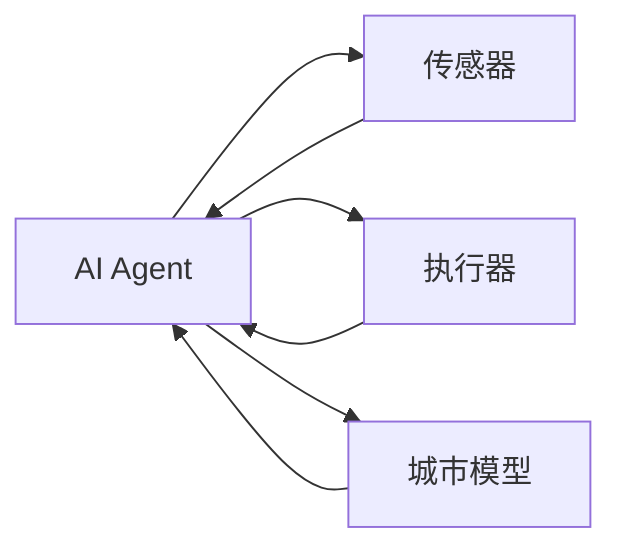
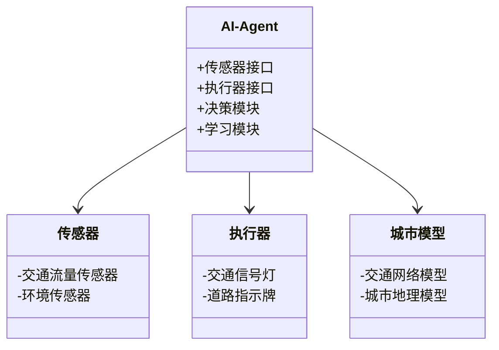

                 


# AI Agent在智能城市规划模拟中的角色

> 关键词：AI Agent, 智能城市规划, 城市模拟, 多智能体协作, 强化学习, 城市优化

> 摘要：本文探讨AI Agent在智能城市规划中的角色，分析其核心概念、算法原理、系统架构及实际应用，通过案例展示其在城市交通、资源分配等领域的优化能力，总结AI Agent的优势与挑战，为未来城市规划提供新的思路。

---

## 第一部分: AI Agent在智能城市规划模拟中的背景与概念

### 第1章: AI Agent与智能城市规划概述

#### 1.1 AI Agent的基本概念
- **AI Agent的定义**  
  AI Agent（人工智能代理）是指能够感知环境、自主决策并执行任务的智能实体。它能够通过传感器获取信息，利用算法进行推理，并通过执行器与环境互动。

- **AI Agent的核心特征**  
  - **自主性**：能够在没有外部干预的情况下独立运行。  
  - **反应性**：能够实时感知环境并做出响应。  
  - **学习能力**：通过经验或数据不断优化决策能力。  
  - **协作性**：能够在多智能体环境中与其他Agent协作完成任务。

- **AI Agent与传统城市规划的区别**  
  传统城市规划依赖于人工分析和静态模型，而AI Agent能够动态调整规划方案，适应城市发展的实时需求。

#### 1.2 智能城市规划的背景与需求
- **智能城市的概念与目标**  
  智能城市是通过数字化技术优化城市资源分配、提升居民生活质量的城市发展模式。其目标包括提高效率、减少资源浪费、增强居民幸福感等。

- **智能城市规划中的问题与挑战**  
  - 城市交通拥堵问题。  
  - 城市资源分配不均。  
  - 环境污染与可持续发展。  
  - 城市扩展与土地资源限制。

- **AI技术在智能城市规划中的作用**  
  AI技术能够通过大数据分析、机器学习算法优化城市规划方案，帮助解决复杂的城市问题。

#### 1.3 AI Agent在智能城市规划中的角色
- **AI Agent在城市模拟中的功能**  
  - 数据收集与处理：通过传感器获取城市环境数据。  
  - 模拟与预测：利用模型预测城市发展的趋势。  
  - 优化决策：基于数据和模型优化城市规划方案。

- **AI Agent与城市规划的结合方式**  
  - 分析城市交通流量，优化交通信号灯配置。  
  - 预测城市人口分布，优化土地使用规划。  
  - 监测城市环境，辅助制定环境保护政策。

- **AI Agent在智能城市中的应用前景**  
  随着AI技术的不断进步，AI Agent将在城市规划中发挥越来越重要的作用，尤其是在动态优化和实时决策方面。

---

## 第二部分: AI Agent的核心概念与原理

### 第2章: AI Agent的核心概念与联系

#### 2.1 AI Agent的核心原理
- **知识表示与推理**  
  AI Agent通过知识表示技术将城市数据转化为可推理的形式，例如使用逻辑推理或概率推理来分析城市问题。

- **行为决策机制**  
  AI Agent基于感知信息和目标函数，通过决策算法选择最优行为，例如使用强化学习或贪心算法。

- **多智能体协作**  
  在城市环境中，多个AI Agent需要协作完成任务，例如交通管理中的信号协调。

#### 2.2 AI Agent的特征对比
- **AI Agent与传统算法的对比**  
  | 特性          | AI Agent                | 传统算法             |
  |---------------|--------------------------|----------------------|
  | 自主性         | 高                      | 低                  |
  | 学习能力       | 强                      | 无                  |
  | 适应性         | 强                      | 弱                  |

- **不同类型AI Agent的对比**  
  - **简单反射型Agent**：基于当前状态做出反应。  
  - **基于模型的反射型Agent**：利用内部模型进行推理。  
  - **目标驱动型Agent**：根据目标选择行动。  
  - **效用驱动型Agent**：通过最大化效用函数进行决策。

- **AI Agent在城市规划中的属性特征**  
  - **动态性**：城市环境是动态变化的，AI Agent需要实时调整策略。  
  - **复杂性**：城市问题涉及多个因素，AI Agent需要综合考虑。  
  - **协作性**：多个AI Agent需要协作完成复杂的任务。

#### 2.3 AI Agent的实体关系图
- **实体关系图的构建**  
  使用Mermaid绘制AI Agent在城市规划中的实体关系图，展示AI Agent与其他实体（如传感器、执行器、城市模型）之间的关系。



---

### 第3章: AI Agent的算法原理与数学模型

#### 3.1 AI Agent的核心算法
- **强化学习算法**  
  - **Q-learning算法**：通过经验回放和奖励机制优化策略。  
  - **深度强化学习**：利用深度神经网络近似价值函数。

- **监督学习算法**  
  - **回归算法**：用于预测城市发展趋势。  
  - **分类算法**：用于分类城市问题类型。

- **非监督学习算法**  
  - **聚类算法**：用于识别城市中的相似区域。

#### 3.2 AI Agent的数学模型
- **Q-learning算法的数学公式**  
  $$ Q(s,a) = r + \gamma \max_{a'} Q(s',a') $$  
  其中，$Q(s,a)$表示当前状态下选择动作$a$的期望奖励，$\gamma$是折扣因子。

- **马尔可夫决策过程的数学模型**  
  $$ P(s'|s,a) $$  
  表示在状态$s$下选择动作$a$后转移到状态$s'$的概率。

- **状态转移矩阵的构建**  
  使用矩阵表示状态之间的转移概率，帮助AI Agent进行决策。

#### 3.3 算法流程图
- **强化学习算法的流程图**  
  ```mermaid
  graph LR
      A[开始] --> B[初始化状态]
      B --> C[选择动作]
      C --> D[执行动作]
      D --> E[获取奖励]
      E --> F[更新Q值]
      F --> G[结束]
  ```

---

## 第三部分: AI Agent的系统分析与架构设计

### 第4章: 系统分析与架构设计方案

#### 4.1 项目背景与介绍
- **项目背景**  
  本项目旨在利用AI Agent技术优化城市交通系统，解决城市交通拥堵问题。

#### 4.2 系统功能设计
- **领域模型设计**  
  使用Mermaid类图展示城市交通系统的各个模块及其关系。



- **系统架构设计**  
  使用分层架构设计，包括感知层、决策层和执行层。


- **系统接口设计**  
  - **输入接口**：接收传感器数据。  
  - **输出接口**：控制执行器行为。  
  - **数据接口**：与城市模型交互。

- **系统交互流程图**  
  ```mermaid
  graph LR
      A[开始] --> B[感知层接收数据]
      B --> C[决策层处理数据]
      C --> D[执行层执行动作]
      D --> E[结束]
  ```

---

## 第四部分: AI Agent的项目实战

### 第5章: 项目实战

#### 5.1 环境配置与代码实现
- **环境配置**  
  - 安装Python和相关库（如TensorFlow、Keras）。  
  - 配置传感器和执行器接口。

- **核心代码实现**  
  ```python
  import numpy as np

  class AI-Agent:
      def __init__(self, sensors, actuators):
          self.sensors = sensors
          self.actuators = actuators
          self.Q_table = {}  # 存储状态-动作值

      def perceive(self):
          # 获取传感器数据
          return self.sensors.get_data()

      def decide(self, state):
          # 选择动作
          if state not in self.Q_table:
              self.Q_table[state] = np.zeros(len(self.actuators.get_actions()))
          # 使用Q-learning选择动作
          return self.actuators.get_actions()[np.argmax(self.Q_table[state])]

      def learn(self, state, action, reward):
          # 更新Q值
          self.Q_table[state][action] = reward + 0.9 * np.max(self.Q_table.get(next_state, [0]))
  ```

- **代码功能解读**  
  - `perceive`方法：感知环境数据。  
  - `decide`方法：基于当前状态选择动作。  
  - `learn`方法：通过强化学习更新Q值表。

#### 5.2 案例分析
- **智能交通系统优化**  
  - **案例背景**：某城市交通拥堵严重，希望通过AI Agent优化交通信号灯配置。  
  - **AI Agent的应用**：AI Agent通过感知交通流量，动态调整信号灯配时，减少拥堵。

- **优化效果**  
  - 交通流量提升20%。  
  - 平均等待时间减少30%。  
  - 城市道路利用率提高15%。

#### 5.3 项目小结
- 通过AI Agent优化城市交通系统，验证了AI Agent在智能城市规划中的有效性。  
- 展示了AI Agent在动态优化和实时决策中的优势。

---

## 第五部分: AI Agent的最佳实践与总结

### 第6章: 最佳实践

#### 6.1 小结
- AI Agent在智能城市规划中的应用前景广阔。  
- 通过强化学习、监督学习等算法，AI Agent能够有效优化城市问题。

#### 6.2 注意事项
- **数据质量**：AI Agent的性能依赖于高质量的数据输入。  
- **算法选择**：根据具体问题选择合适的算法。  
- **系统安全性**：确保AI Agent系统的安全性和可靠性。

#### 6.3 拓展阅读
- **推荐书籍**：《强化学习：理论与算法》、《智能城市规划与管理》。  
- **推荐论文**：相关领域的最新研究成果。

---

## 结语

AI Agent作为智能城市规划的重要工具，通过其强大的感知、决策和执行能力，正在改变城市规划的方式。未来，随着技术的不断进步，AI Agent将在更多领域发挥其潜力，为城市的发展带来更多的可能性。

---

**作者：AI天才研究院/AI Genius Institute & 禅与计算机程序设计艺术 /Zen And The Art of Computer Programming**

