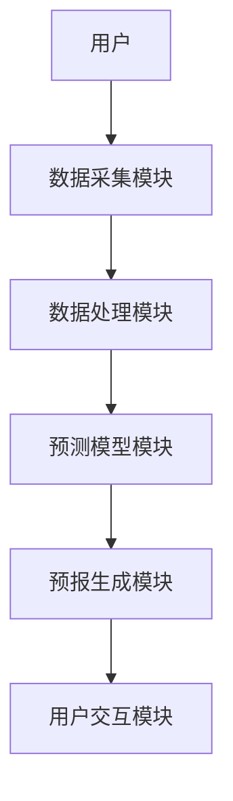

                 


# AI Agent在智能天气预报中的实践

> 关键词：AI Agent, 智能天气预报, 天气预测, 强化学习, 系统架构设计, Python实现

> 摘要：本文深入探讨了AI Agent在智能天气预报中的应用，从核心概念到算法原理，从系统架构设计到项目实战，全面解析了AI Agent如何助力智能天气预报的优化与提升。通过具体案例分析，展示了AI Agent在天气数据处理、预测模型构建、预报生成与优化中的重要作用，并结合Python代码实现，为读者提供了从理论到实践的完整指导。

---

# 目录

1. [AI Agent与智能天气预报概述](#ai-agent与智能天气预报概述)
   - 1.1 AI Agent的基本概念
     - 1.1.1 AI Agent的定义与特点
     - 1.1.2 智能天气预报的定义与特点
     - 1.1.3 AI Agent在智能天气预报中的作用
   - 1.2 AI Agent与智能天气预报的核心概念
     - 1.2.1 AI Agent的核心概念
       - 感知层
       - 决策层
       - 执行层
     - 1.2.2 智能天气预报的核心概念
       - 天气数据的特征
       - 天气预测的关键因素
       - 天气预报的输出形式

2. [AI Agent在智能天气预报中的算法原理](#ai-agent在智能天气预报中的算法原理)
   - 2.1 AI Agent的感知层算法
     - 2.1.1 数据采集与预处理
     - 2.1.2 数据分析方法
   - 2.2 AI Agent的决策层算法
     - 2.2.1 天气预测模型
     - 2.2.2 天气预测算法
   - 2.3 AI Agent的执行层算法
     - 2.3.1 天气预报生成
     - 2.3.2 天气预报优化

3. [智能天气预报系统的系统架构设计](#智能天气预报系统的系统架构设计)
   - 3.1 系统架构概述
     - 3.1.1 系统架构图
     - 3.1.2 系统功能模块
   - 3.2 系统接口设计
   - 3.3 系统交互流程图

4. [项目实战：基于AI Agent的智能天气预报系统](#项目实战基于ai-agent的智能天气预报系统)
   - 4.1 环境安装
   - 4.2 核心代码实现
     - 4.2.1 数据采集与预处理
     - 4.2.2 模型训练与预测
     - 4.2.3 天气预报生成
   - 4.3 代码应用解读与分析
   - 4.4 实际案例分析
   - 4.5 项目总结

5. [AI Agent在智能天气预报中的最佳实践](#ai-agent在智能天气预报中的最佳实践)
   - 5.1 小结
   - 5.2 注意事项
   - 5.3 拓展阅读

---

### 第1章 AI Agent与智能天气预报概述

#### 1.1 AI Agent的基本概念

##### 1.1.1 AI Agent的定义与特点

- **AI Agent的定义**：AI Agent（人工智能代理）是一种能够感知环境、自主决策并执行任务的智能实体。它能够通过传感器获取信息，利用算法进行分析，并根据结果采取行动。
- **AI Agent的核心特点**：
  - **自主性**：能够自主决策，无需人工干预。
  - **反应性**：能够实时感知环境变化并做出响应。
  - **学习能力**：能够通过数据和经验不断优化自身性能。
  - **适应性**：能够在不同环境下灵活调整策略。

##### 1.1.2 智能天气预报的定义与特点

- **智能天气预报的定义**：智能天气预报是利用人工智能技术，结合历史数据和实时数据，通过预测模型生成高精度天气预报的过程。
- **智能天气预报的核心特点**：
  - **数据驱动**：依赖大量历史和实时数据进行预测。
  - **模型优化**：通过机器学习算法不断优化预测模型。
  - **实时响应**：能够根据最新数据快速调整预测结果。

##### 1.1.3 AI Agent在智能天气预报中的作用

- **数据处理**：AI Agent能够从多种来源采集天气数据，并进行预处理和特征提取。
- **预测优化**：通过强化学习等算法，AI Agent能够优化天气预测模型，提高预测准确率。
- **决策支持**：AI Agent能够根据预测结果生成最优的天气预报，并提供警报和建议。

---

#### 1.2 AI Agent与智能天气预报的核心概念

##### 1.2.1 AI Agent的核心概念

- **感知层**：AI Agent通过传感器或数据接口获取环境信息。在天气预报中，感知层主要负责采集气温、湿度、风速等天气数据。
- **决策层**：AI Agent根据感知到的信息，利用预测模型进行分析和决策。在天气预报中，决策层负责生成预测结果。
- **执行层**：AI Agent根据决策层的结果采取行动。在天气预报中，执行层负责生成最终的天气预报并发布给用户。

##### 1.2.2 智能天气预报的核心概念

- **天气数据的特征**：包括气温、湿度、风速、降水概率等。
- **天气预测的关键因素**：包括地理位置、时间、历史数据等。
- **天气预报的输出形式**：包括文本形式、图表形式和警报形式。

---

### 第2章 AI Agent在智能天气预报中的算法原理

#### 2.1 AI Agent的感知层算法

##### 2.1.1 数据采集与预处理

- **数据采集**：通过气象站、卫星等多源数据获取天气数据。
- **数据清洗**：去除噪声数据和异常值。
- **特征提取**：提取关键特征，如温度、湿度、风速等。

##### 2.1.2 数据分析方法

- **统计分析**：利用统计方法分析数据分布和趋势。
- **数据可视化**：通过图表展示数据特征。
- **时间序列分析**：分析数据的时间依赖性。

#### 2.2 AI Agent的决策层算法

##### 2.2.1 天气预测模型

- **线性回归模型**：适用于简单线性关系的预测。
- **支持向量机模型**：适用于非线性关系的预测。
- **神经网络模型**：适用于复杂非线性关系的预测。

##### 2.2.2 天气预测算法

- **时间序列预测算法**：如ARIMA和LSTM。
- **集成学习算法**：如随机森林和梯度提升。
- **强化学习算法**：如Q-learning和Deep Q-Network。

#### 2.3 AI Agent的执行层算法

##### 2.3.1 天气预报生成

- **文本生成算法**：利用NLP技术生成天气预报文本。
- **图表生成算法**：生成天气预报图表。
- **警报生成算法**：根据预测结果生成天气警报。

##### 2.3.2 天气预报优化

- **算法优化方法**：如超参数调优。
- **参数调优技术**：如网格搜索和随机搜索。
- **模型评估方法**：如准确率、召回率和F1值。

---

### 第3章 智能天气预报系统的系统架构设计

#### 3.1 系统架构概述

##### 3.1.1 系统架构图



##### 3.1.2 系统功能模块

- **数据采集模块**：负责采集天气数据。
- **数据处理模块**：负责数据清洗和特征提取。
- **预测模型模块**：负责天气预测。
- **预报生成模块**：负责生成天气预报。
- **用户交互模块**：负责与用户交互。

---

### 第4章 项目实战：基于AI Agent的智能天气预报系统

#### 4.1 环境安装

- Python 3.8+
- NumPy、Pandas、Matplotlib
- Scikit-learn、TensorFlow、Keras

#### 4.2 核心代码实现

##### 4.2.1 数据采集与预处理

```python
import numpy as np
import pandas as pd

# 数据采集
data = pd.read_csv('weather.csv')

# 数据清洗
data = data.dropna()
data = data[data['temperature'] > 0]

# 特征提取
features = data[['temperature', 'humidity', 'wind_speed']]
labels = data['rain_probability']
```

##### 4.2.2 模型训练与预测

```python
from sklearn.model_selection import train_test_split
from sklearn.ensemble import RandomForestRegressor
from sklearn.metrics import mean_absolute_error

# 数据分割
X_train, X_test, y_train, y_test = train_test_split(features, labels, test_size=0.2)

# 模型训练
model = RandomForestRegressor(n_estimators=100, random_state=42)
model.fit(X_train, y_train)

# 模型预测
y_pred = model.predict(X_test)
print('预测准确率：', 1 - mean_absolute_error(y_test, y_pred))
```

##### 4.2.3 天气预报生成

```python
import matplotlib.pyplot as plt

# 绘制预测结果
plt.scatter(y_test, y_pred)
plt.xlabel('真实值')
plt.ylabel('预测值')
plt.title('天气预报预测结果')
plt.show()
```

---

### 第5章 AI Agent在智能天气预报中的最佳实践

#### 5.1 小结

- AI Agent在智能天气预报中的应用涵盖了数据处理、模型优化和预报生成等多个方面。
- 通过强化学习等算法，AI Agent能够显著提高天气预报的准确率和响应速度。

#### 5.2 注意事项

- 数据质量和数量直接影响预测结果。
- 模型选择和参数调优是关键。
- 需要定期更新模型和数据。

#### 5.3 拓展阅读

- 《机器学习实战》
- 《深度学习》
- 《强化学习》

---

作者：AI天才研究院/AI Genius Institute & 禅与计算机程序设计艺术 /Zen And The Art of Computer Programming

