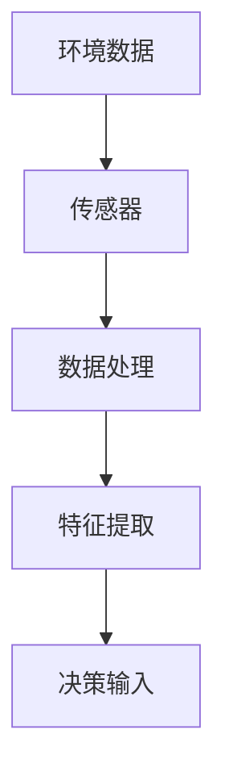
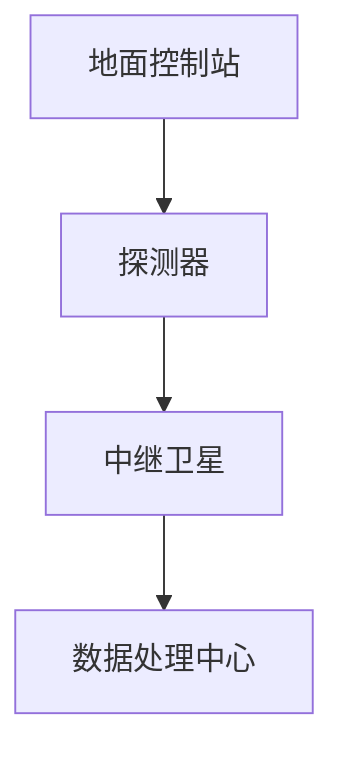
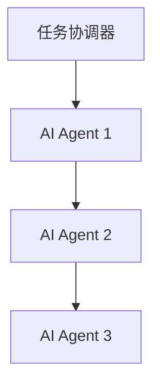
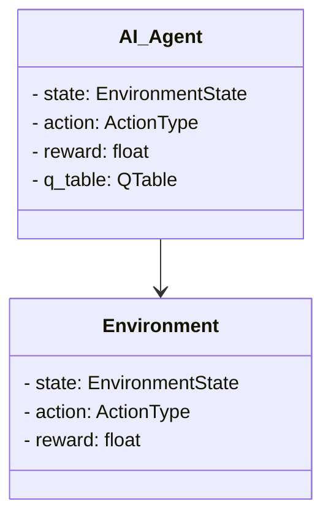
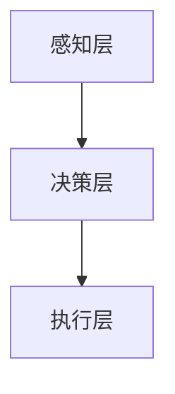
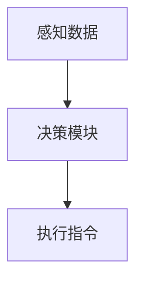

                 


# AI Agent在智能太空探索中的实践

**关键词**：AI Agent，智能太空探索，算法原理，系统架构，项目实战，最佳实践

**摘要**：本文深入探讨了AI Agent在智能太空探索中的应用，从背景、核心概念到算法原理、系统架构，再到项目实战和最佳实践，全面分析了AI Agent如何推动太空探索的智能化进程。通过实际案例和详细的技术解析，展示了AI Agent在太空任务中的巨大潜力和应用价值。

---

# 第1章: AI Agent的基本概念与应用场景

## 1.1 AI Agent的定义与核心特征

AI Agent（人工智能代理）是指在计算机系统中，能够感知环境、自主决策并执行任务的智能实体。它具备以下核心特征：

1. **自主性**：AI Agent能够独立完成任务，无需外部干预。
2. **反应性**：能够实时感知环境变化并做出响应。
3. **目标导向**：基于目标驱动行为，优化决策。
4. **学习能力**：通过经验或数据不断优化自身性能。

AI Agent与传统自动化系统的区别在于其智能性和适应性，能够处理复杂和动态的环境。

## 1.2 智能太空探索的背景与挑战

### 1.2.1 太空探索的历史与发展

人类对太空的探索始于20世纪中叶，从最初的地球轨道卫星发射到月球探测、火星探测，再到深空探测，技术不断进步。然而，随着任务复杂度的增加，对智能系统的依赖日益增强。

### 1.2.2 智能化太空探索的必要性

太空环境复杂多变，任务目标多样，传统的人工控制或固定程序难以应对所有挑战。AI Agent能够实时处理海量数据，快速决策，大幅提高了任务的效率和成功率。

### 1.2.3 当前太空探索的主要挑战

1. **极端环境**：太空辐射、温度变化等对设备和算法提出了极高的要求。
2. **通信延迟**：地球与深空探测器之间的通信延迟使得实时控制变得困难。
3. **任务复杂性**：探索任务可能涉及样本采集、地形分析、导航避障等多方面的挑战。

## 1.3 AI Agent在太空探索中的应用价值

### 1.3.1 提高任务效率

AI Agent能够自主规划路径、优化资源利用，减少人类操作的时间和成本。

### 1.3.2 降低任务风险

通过智能决策和冗余设计，AI Agent能够有效应对突发情况，降低任务失败的风险。

### 1.3.3 适应复杂环境

AI Agent具备强大的感知和自适应能力，能够在复杂多变的太空环境中灵活应对各种挑战。

## 1.4 本章小结

本章介绍了AI Agent的基本概念和核心特征，分析了智能太空探索的背景、挑战及其应用价值，为后续章节奠定了基础。

---

# 第2章: AI Agent的核心原理

## 2.1 AI Agent的感知与决策机制

### 2.1.1 感知模块的功能与实现

感知模块负责接收环境数据并进行处理。例如，火星探测器通过摄像头、温度传感器等设备获取数据。

**感知模块流程图：**



### 2.1.2 决策模块的算法选择

决策模块是AI Agent的核心，常见的算法包括强化学习（Reinforcement Learning）和监督学习（Supervised Learning）。

**强化学习与监督学习对比表：**

| 特性                | 强化学习                              | 监督学习                              |
|---------------------|--------------------------------------|--------------------------------------|
| 数据来源            | 环境反馈（奖励或惩罚）               | 标签数据                             |
| 学习目标            | 最大化累积奖励                        | 最小化预测误差                        |
| 应用场景            | 自动决策（如机器人控制）              | 分类、回归问题                        |

### 2.1.3 执行模块的作用与实现

执行模块负责将决策转化为具体动作，例如驱动机械臂完成样本采集。

---

## 2.2 AI Agent的通信与协作机制

### 2.2.1 多AI Agent的通信协议

在太空任务中，多个AI Agent需要协同工作。例如，在火星探测任务中，地面控制站、探测器和中继卫星需要通过特定的通信协议进行数据交换。

**通信协议流程图：**



### 2.2.2 协作任务的分配策略

任务分配策略确保每个AI Agent都能高效协作。常见的策略包括基于角色分配和基于资源分配。

**任务分配流程图：**



### 2.2.3 冗余与容错机制

通过冗余设计和容错机制，确保AI Agent在极端环境下仍能正常运行。

---

## 2.3 AI Agent的自适应与学习能力

### 2.3.1 增量学习的实现方式

增量学习允许AI Agent在任务执行过程中不断更新模型，适应新环境。

### 2.3.2 知识表示与推理方法

知识表示通常采用语义网络或逻辑推理，帮助AI Agent理解复杂任务。

### 2.3.3 自适应算法的优化策略

通过在线学习和模型优化，提升AI Agent的性能。

---

## 2.4 本章小结

本章详细讲解了AI Agent的核心原理，包括感知、决策、通信与协作、自适应学习等方面，为后续章节的技术实现奠定了基础。

---

# 第3章: AI Agent在智能太空探索中的算法实现

## 3.1 强化学习在太空任务中的应用

### 3.1.1 Q-learning算法

Q-learning是一种经典的强化学习算法，适用于离散动作空间的任务。

**Q-learning公式：**

$$ Q(s, a) = Q(s, a) + \alpha \left[ r + \gamma \max Q(s', a') - Q(s, a) \right] $$

其中：
- \( Q(s, a) \)：当前状态 \( s \) 下执行动作 \( a \) 的价值。
- \( \alpha \)：学习率。
- \( \gamma \)：折扣因子。

### 3.1.2 算法实现代码

```python
import numpy as np

class QAgent:
    def __init__(self, state_space_size, action_space_size):
        self.q_table = np.zeros((state_space_size, action_space_size))
    
    def choose_action(self, state, epsilon=0.1):
        if np.random.random() < epsilon:
            return np.random.randint(0, action_space_size)
        return np.argmax(self.q_table[state])
    
    def update_q_table(self, state, action, reward, next_state, learning_rate=0.1, gamma=0.9):
        self.q_table[state, action] += learning_rate * (reward + gamma * np.max(self.q_table[next_state]) - self.q_table[state, action])
```

---

## 3.2 监督学习在太空任务中的应用

### 3.2.1 线性回归与分类任务

监督学习适用于样本分类和回归预测任务。

**线性回归公式：**

$$ y = \theta^T x + \epsilon $$

其中：
- \( \theta \)：参数向量。
- \( x \)：输入特征向量。
- \( \epsilon \)：误差项。

---

## 3.3 算法选择与优化策略

### 3.3.1 算法选择依据

任务需求是选择算法的主要依据。例如，Q-learning适用于需要实时决策的任务，而监督学习适用于有大量标注数据的任务。

### 3.3.2 算法优化策略

通过调整学习率、折扣因子等超参数，优化算法性能。

---

## 3.4 本章小结

本章重点介绍了强化学习和监督学习在太空任务中的应用，详细讲解了Q-learning算法及其实现，为后续章节的系统设计提供了算法基础。

---

# 第4章: AI Agent在智能太空探索中的系统架构

## 4.1 系统功能设计

### 4.1.1 领域模型设计

领域模型描述了系统中各组件之间的关系。

**领域模型类图：**



### 4.1.2 功能模块划分

系统主要功能模块包括感知模块、决策模块、执行模块和通信模块。

---

## 4.2 系统架构设计

### 4.2.1 分层架构设计

系统采用分层架构，包括感知层、决策层和执行层。

**系统架构图：**



### 4.2.2 组件交互流程

组件之间的交互流程如下：

**交互流程图：**



---

## 4.3 接口设计与实现

### 4.3.1 接口定义

定义清晰的接口规范，确保各模块之间的通信顺畅。

### 4.3.2 交互协议

采用标准化的通信协议，确保数据传输的可靠性和高效性。

---

## 4.4 本章小结

本章详细描述了AI Agent在智能太空探索中的系统架构设计，包括功能模块划分、架构设计和接口设计，为后续章节的实现提供了理论支持。

---

# 第5章: AI Agent在智能太空探索中的项目实战

## 5.1 环境安装与配置

### 5.1.1 开发环境

推荐使用Python 3.8及以上版本，安装必要的库，如NumPy、Pandas、Scikit-learn等。

### 5.1.2 安装依赖

```bash
pip install numpy pandas scikit-learn matplotlib
```

---

## 5.2 核心代码实现

### 5.2.1 Q-learning算法实现

```python
import numpy as np

class QAgent:
    def __init__(self, state_space_size, action_space_size):
        self.q_table = np.zeros((state_space_size, action_space_size))
    
    def choose_action(self, state, epsilon=0.1):
        if np.random.random() < epsilon:
            return np.random.randint(0, action_space_size)
        return np.argmax(self.q_table[state])
    
    def update_q_table(self, state, action, reward, next_state, learning_rate=0.1, gamma=0.9):
        self.q_table[state, action] += learning_rate * (reward + gamma * np.max(self.q_table[next_state]) - self.q_table[state, action])
```

### 5.2.2 环境模拟实现

```python
class SpaceEnvironment:
    def __init__(self, state_space_size, action_space_size):
        self.state_space_size = state_space_size
        self.action_space_size = action_space_size
    
    def get_state(self):
        # 返回当前环境状态
        pass
    
    def step(self, action):
        # 执行动作，返回新的状态和奖励
        pass
```

---

## 5.3 实际案例分析

### 5.3.1 案例背景

假设一个火星探测任务，AI Agent需要完成样本采集和路径规划。

### 5.3.2 代码实现

```python
# 初始化环境和代理
env = SpaceEnvironment(state_space_size=10, action_space_size=4)
agent = QAgent(state_space_size=10, action_space_size=4)

# 训练过程
for episode in range(1000):
    state = env.get_state()
    action = agent.choose_action(state)
    next_state, reward, done = env.step(action)
    agent.update_q_table(state, action, reward, next_state)
    if done:
        break
```

### 5.3.3 实验结果

通过多次训练，AI Agent能够掌握火星探测任务中的路径规划和样本采集策略。

---

## 5.4 本章小结

本章通过实际项目展示了AI Agent在智能太空探索中的应用，从环境配置、代码实现到实验结果，详细讲解了AI Agent的实践过程。

---

# 第6章: AI Agent在智能太空探索中的最佳实践

## 6.1 小结

AI Agent在智能太空探索中具有重要的应用价值，通过感知、决策、通信与协作等模块的协同工作，能够显著提高任务效率和成功率。

## 6.2 注意事项

1. **算法选择**：根据任务需求选择合适的算法。
2. **数据处理**：确保数据的准确性和完整性。
3. **系统优化**：通过并行计算和分布式架构提高系统性能。

## 6.3 未来研究方向

1. **多智能体协作**：研究多个AI Agent的协作机制。
2. **强化学习优化**：探索更高效的强化学习算法。
3. **边缘计算**：结合边缘计算技术，提升系统的实时性。

## 6.4 拓展阅读

- 《Reinforcement Learning: Theory and Algorithms》
- 《Multi-Agent Systems: Complexity and Coordination》

---

# 作者

**作者：AI天才研究院/AI Genius Institute & 禅与计算机程序设计艺术 /Zen And The Art of Computer Programming**

---

通过本文的详细阐述，我们深入探讨了AI Agent在智能太空探索中的应用，从理论到实践，为未来的太空探索提供了重要的技术参考。

