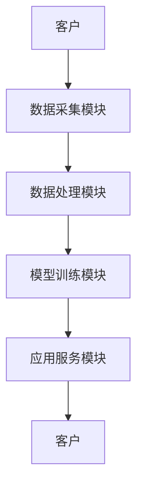
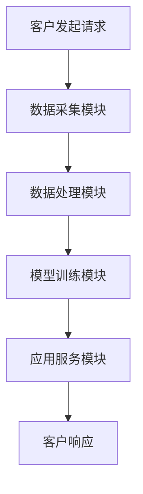

                 


# AI Agent在智能客户关系管理中的作用

## 关键词：
AI Agent, 智能CRM, 客户关系管理, 自然语言处理, 机器学习

## 摘要：
客户关系管理（CRM）是企业管理和优化客户关系的核心工具，而AI Agent（人工智能代理）的引入为CRM带来了智能化的革新。本文将深入探讨AI Agent在智能客户关系管理中的作用，涵盖其核心技术、算法原理、系统架构以及实际项目中的应用。通过分析CRM的背景与挑战，结合自然语言处理和机器学习等技术，揭示AI Agent如何优化客户互动、提升客户体验和提供数据驱动的决策支持。本文旨在为企业提供一个全面的技术指南，帮助他们在智能CRM领域中实现更高效的客户管理。

---

# 第1章: 智能客户关系管理的背景与挑战

## 1.1 客户关系管理（CRM）的基本概念

### 1.1.1 CRM的定义与核心目标
客户关系管理（Customer Relationship Management, CRM）是指企业通过管理与客户之间的关系，以提高客户满意度、忠诚度和企业收益为目标的一系列策略和工具。CRM的核心目标包括：

- **客户信息管理**：整合和管理客户的详细信息，包括联系方式、购买记录、偏好等。
- **客户互动管理**：通过多种渠道（如邮件、电话、社交媒体）与客户进行交互，并记录和分析这些互动。
- **客户行为分析**：基于客户数据，预测客户行为，识别潜在需求。
- **客户体验优化**：通过个性化服务和高效沟通，提升客户满意度和忠诚度。

### 1.1.2 CRM在企业管理中的重要性
CRM在企业管理中的作用不可忽视：

- **提高客户满意度**：通过个性化的服务和高效的响应，客户感受到被重视，从而提高满意度。
- **提升销售效率**：通过客户数据分析，精准定位潜在客户，提高销售转化率。
- **优化资源配置**：通过客户数据的整合和分析，优化营销策略，减少资源浪费。
- **增强客户忠诚度**：通过持续的优质服务，建立长期稳定的客户关系。

### 1.1.3 传统CRM的局限性与痛点
尽管CRM在企业管理中发挥着重要作用，但传统CRM也存在一些局限性：

- **数据孤岛**：不同部门和系统之间的数据无法有效整合，导致信息不一致和资源浪费。
- **缺乏智能化**：传统CRM主要依赖人工操作，难以高效处理大量数据和复杂需求。
- **客户体验不足**：传统CRM难以实现真正的个性化服务，客户互动效率较低。
- **数据处理能力有限**：面对海量数据，传统CRM在处理速度和分析深度上存在瓶颈。

## 1.2 AI Agent的定义与特点

### 1.2.1 AI Agent的基本定义
AI Agent（人工智能代理）是一种能够感知环境、执行任务并做出决策的智能系统。AI Agent的核心目标是通过自动化和智能化的方式，帮助用户完成特定任务或提供支持。在智能客户关系管理中，AI Agent通常以聊天机器人、语音助手或推荐系统等形式出现。

### 1.2.2 AI Agent的核心特点与优势
AI Agent在智能客户关系管理中的特点和优势包括：

- **智能化**：通过机器学习和自然语言处理技术，AI Agent能够理解和分析客户的语言和行为，提供智能化的响应。
- **自动化**：AI Agent能够自动处理大量的客户请求和数据，减少人工干预，提高效率。
- **实时响应**：AI Agent能够实时与客户互动，提供快速的响应和解决方案。
- **个性化服务**：通过分析客户的偏好和行为，AI Agent能够提供个性化的服务和推荐，提升客户体验。
- **数据驱动**：AI Agent能够从大量数据中提取有价值的信息，帮助企业和决策者做出更明智的决策。

### 1.2.3 AI Agent与传统CRM的区别
AI Agent与传统CRM的主要区别在于智能化和自动化能力：

- **数据处理能力**：AI Agent能够处理和分析海量数据，提供深度洞察，而传统CRM主要依赖人工操作，数据处理能力有限。
- **客户互动效率**：AI Agent能够实时与客户互动，提供高效的响应，而传统CRM依赖人工处理，互动效率较低。
- **个性化服务**：AI Agent能够根据客户的个性化需求提供定制化服务，而传统CRM难以实现真正的个性化。
- **决策支持**：AI Agent能够通过数据分析提供数据驱动的决策支持，而传统CRM主要依赖人工经验。

## 1.3 AI Agent在智能客户关系管理中的作用

### 1.3.1 提高客户互动效率
AI Agent通过自动化和智能化的方式，显著提高了客户互动效率。例如，AI Agent可以自动处理客户的查询和请求，快速响应客户的需求，减少客户等待时间。

### 1.3.2 优化客户体验
AI Agent通过个性化服务和智能化决策，优化了客户的整体体验。例如，AI Agent可以根据客户的偏好和行为，提供个性化的推荐和定制化的服务，增强客户满意度和忠诚度。

### 1.3.3 数据驱动的决策支持
AI Agent通过分析海量数据，提供数据驱动的决策支持。例如，AI Agent可以通过客户行为分析，预测客户的潜在需求和购买倾向，帮助企业制定更精准的营销策略。

## 1.4 本章小结
本章介绍了智能客户关系管理的基本概念、传统CRM的局限性以及AI Agent的核心特点和作用。通过对比分析，明确了AI Agent在智能CRM中的重要性，为后续章节的技术探讨奠定了基础。

---

# 第2章: AI Agent的核心技术

## 2.1 自然语言处理（NLP）技术

### 2.1.1 NLP的基本概念与应用
自然语言处理（NLP）是人工智能的核心技术之一，旨在使计算机能够理解和处理人类语言。在智能客户关系管理中，NLP技术主要用于以下方面：

- **文本分类**：将客户文本分为不同的类别，例如情感分析、垃圾邮件检测等。
- **实体识别**：从文本中提取关键实体，例如人名、地名、组织名等。
- **情感分析**：分析客户文本中的情感倾向，例如正面、负面或中性。
- **语义理解**：理解文本的语义含义，例如意图识别、问答系统等。

### 2.1.2 常见的NLP算法与模型
以下是常见的NLP算法和模型：

- **分词算法**：将文本分割成词语或短语，例如jieba分词。
- **实体识别算法**：基于机器学习的实体识别模型，例如条件随机场（CRF）。
- **情感分析算法**：基于机器学习的文本分类模型，例如支持向量机（SVM）。
- **语义理解模型**：基于深度学习的模型，例如BERT、GPT等。

### 2.1.3 NLP在客户关系管理中的应用
在智能CRM中，NLP技术主要用于以下场景：

- **客户咨询与支持**：通过NLP技术，AI Agent可以自动理解客户的咨询内容，并提供相应的解决方案。
- **情感分析**：通过分析客户的反馈文本，识别客户的情感倾向，帮助企业优化服务。
- **客户意图识别**：通过分析客户的语言，识别客户的意图，例如购买意向、投诉意向等。

## 2.2 机器学习（ML）技术

### 2.2.1 机器学习的基本概念与分类
机器学习是人工智能的核心技术之一，旨在通过数据训练模型，使其能够进行预测和决策。机器学习主要分为以下几类：

- **监督学习**：基于标记的数据进行训练，例如分类和回归任务。
- **无监督学习**：基于未标记的数据进行训练，例如聚类和降维任务。
- **强化学习**：通过与环境的交互，学习最优策略。

### 2.2.2 常见的机器学习算法
以下是一些常见的机器学习算法：

- **线性回归**：用于回归任务，例如预测客户生命周期价值。
- **支持向量机（SVM）**：用于分类任务，例如客户 churn 分类。
- **随机森林**：用于分类和回归任务，例如客户分群。

### 2.2.3 机器学习在客户关系管理中的应用
在智能CRM中，机器学习技术主要用于以下场景：

- **客户分群**：基于客户的特征和行为，将客户分为不同的群体，例如高价值客户、潜在流失客户等。
- **客户 churn 预测**：通过机器学习模型，预测客户流失的可能性，并采取相应的措施。
- **客户行为预测**：通过机器学习模型，预测客户的购买行为和偏好。

## 2.3 智能决策支持系统

### 2.3.1 智能决策支持系统的定义与特点
智能决策支持系统（IDSS）是一种基于人工智能技术的决策支持系统，旨在通过数据驱动的方式，为决策者提供支持。其特点包括：

- **数据驱动**：基于大量数据进行分析和预测。
- **智能化**：通过机器学习和NLP技术，实现智能化的决策支持。
- **实时性**：能够实时处理数据和提供决策支持。

### 2.3.2 数据驱动的决策支持流程
数据驱动的决策支持流程通常包括以下步骤：

1. **数据采集**：从多个渠道采集客户数据，例如CRM系统、社交媒体、销售数据等。
2. **数据预处理**：清洗和整理数据，确保数据质量和一致性。
3. **数据分析**：通过机器学习和NLP技术，分析数据并提取有价值的信息。
4. **决策支持**：基于分析结果，提供决策建议和优化方案。

### 2.3.3 AI Agent在决策支持中的应用
在智能CRM中，AI Agent可以通过以下方式提供决策支持：

- **客户画像构建**：通过分析客户的特征和行为，构建客户画像，帮助企业更好地理解客户。
- **销售预测**：通过机器学习模型，预测客户的购买行为，优化销售策略。
- **风险预警**：通过分析客户的潜在风险，提前预警并采取措施。

## 2.4 本章小结
本章介绍了AI Agent的核心技术，包括自然语言处理（NLP）、机器学习（ML）以及智能决策支持系统。通过分析这些技术的特点和应用场景，明确了AI Agent在智能CRM中的技术基础和实现方式。

---

# 第3章: AI Agent的核心算法与流程

## 3.1 自然语言处理算法

### 3.1.1 分词算法
分词算法是NLP技术中的基础算法，用于将连续的文本分割成词语或短语。常见的分词算法包括：

- **基于规则的分词**：例如基于词典的分词方法。
- **基于统计的分词**：例如基于条件随机场（CRF）的分词方法。
- **基于深度学习的分词**：例如基于LSTM的分词方法。

### 3.1.2 实体识别算法
实体识别算法用于从文本中提取关键实体，例如人名、地名、组织名等。常见的实体识别算法包括：

- **基于规则的实体识别**：通过预定义的规则进行匹配。
- **基于机器学习的实体识别**：例如基于CRF的实体识别。
- **基于深度学习的实体识别**：例如基于LSTM的实体识别。

### 3.1.3 情感分析算法
情感分析算法用于分析文本中的情感倾向，例如正面、负面或中性。常见的情感分析算法包括：

- **基于规则的情感分析**：通过预定义的规则进行情感分类。
- **基于机器学习的情感分析**：例如基于SVM的情感分析。
- **基于深度学习的情感分析**：例如基于LSTM的情感分析。

## 3.2 机器学习算法

### 3.2.1 线性回归算法
线性回归是一种常用的回归算法，用于预测连续型变量。其数学模型可以表示为：

$$ y = \beta_0 + \beta_1 x + \epsilon $$

其中，$y$ 是目标变量，$x$ 是自变量，$\beta_0$ 和 $\beta_1$ 是回归系数，$\epsilon$ 是误差项。

### 3.2.2 支持向量机（SVM）算法
支持向量机是一种常用的分类算法，用于对数据进行分类。其数学模型可以表示为：

$$ y = \text{sign}(w \cdot x + b) $$

其中，$w$ 是权重向量，$x$ 是输入向量，$b$ 是偏置项，$\text{sign}$ 是符号函数。

### 3.2.3 随机森林算法
随机森林是一种基于决策树的集成算法，用于分类和回归任务。其核心思想是通过随机采样和投票机制，提高模型的准确性和稳定性。

## 3.3 深度学习算法

### 3.3.1 卷积神经网络（CNN）
卷积神经网络是一种常用的深度学习模型，主要用于图像识别和文本处理。其数学模型可以表示为：

$$ y = f(\text{Conv}(x) + \text{Pool}(y)) $$

其中，$\text{Conv}$ 是卷积操作，$\text{Pool}$ 是池化操作，$f$ 是激活函数。

### 3.3.2 循环神经网络（RNN）
循环神经网络是一种常用的深度学习模型，主要用于序列数据的处理。其数学模型可以表示为：

$$ h_t = \text{激活函数}(W_{hh} h_{t-1} + W_{xh} x_t) $$

$$ y_t = \text{激活函数}(W_{hy} h_t) $$

其中，$h_t$ 是隐藏状态，$x_t$ 是输入，$W_{hh}$ 和 $W_{xh}$ 是权重矩阵，$W_{hy}$ 是输出权重矩阵。

### 3.3.3 Transformer模型
Transformer模型是一种基于注意力机制的深度学习模型，主要用于自然语言处理任务。其数学模型可以表示为：

$$ \text{Attention}(Q, K, V) = \text{softmax}\left(\frac{QK^T}{\sqrt{d_k}}\right)V $$

其中，$Q$ 是查询向量，$K$ 是键向量，$V$ 是值向量，$d_k$ 是键向量的维度。

## 3.4 AI Agent的算法流程

### 3.4.1 数据预处理流程
数据预处理是AI Agent算法流程中的重要步骤，包括以下步骤：

1. **数据清洗**：去除重复数据、缺失值和异常值。
2. **数据转换**：将数据转换为适合模型训练的形式，例如文本分词、数值归一化等。
3. **数据标注**：对数据进行标注，例如情感分析中的正面、负面和中性标签。

### 3.4.2 模型训练流程
模型训练是AI Agent算法流程的核心步骤，包括以下步骤：

1. **选择算法**：根据任务需求选择合适的算法，例如情感分析选择SVM，文本分类选择随机森林。
2. **训练模型**：使用训练数据训练模型，调整模型参数以优化性能。
3. **评估模型**：通过验证集评估模型的性能，例如准确率、召回率、F1分数等。

### 3.4.3 模型部署与应用
模型部署是AI Agent算法流程的最后一步，包括以下步骤：

1. **模型保存**：将训练好的模型保存下来，以便后续调用。
2. **模型集成**：将多个模型集成，例如投票集成、堆叠集成，以提高模型的准确性和稳定性。
3. **模型应用**：将模型部署到实际应用中，例如聊天机器人、推荐系统等。

## 3.5 本章小结
本章详细介绍了AI Agent的核心算法，包括自然语言处理算法、机器学习算法和深度学习算法，并讨论了AI Agent的算法流程。通过这些算法的实现，AI Agent能够高效地处理客户数据，提供智能化的决策支持。

---

# 第4章: AI Agent的系统架构设计

## 4.1 系统模块划分

### 4.1.1 数据采集模块
数据采集模块负责从多个渠道采集客户数据，例如CRM系统、社交媒体、销售数据等。数据采集模块通常包括以下功能：

- **数据源管理**：管理不同的数据源，例如数据库、API接口等。
- **数据采集**：从数据源中采集数据，例如API调用、文件读取等。
- **数据存储**：将采集到的数据存储到数据仓库或数据库中。

### 4.1.2 数据处理模块
数据处理模块负责对采集到的数据进行预处理，例如清洗、转换和标注。数据处理模块通常包括以下功能：

- **数据清洗**：去除重复数据、缺失值和异常值。
- **数据转换**：将数据转换为适合模型训练的形式，例如文本分词、数值归一化等。
- **数据标注**：对数据进行标注，例如情感分析中的正面、负面和中性标签。

### 4.1.3 模型训练模块
模型训练模块负责对处理后的数据进行模型训练，选择合适的算法并调整模型参数以优化性能。模型训练模块通常包括以下功能：

- **算法选择**：根据任务需求选择合适的算法，例如情感分析选择SVM，文本分类选择随机森林。
- **模型训练**：使用训练数据训练模型，调整模型参数以优化性能。
- **模型评估**：通过验证集评估模型的性能，例如准确率、召回率、F1分数等。

### 4.1.4 应用服务模块
应用服务模块负责将训练好的模型部署到实际应用中，例如聊天机器人、推荐系统等。应用服务模块通常包括以下功能：

- **模型部署**：将训练好的模型保存下来，以便后续调用。
- **模型集成**：将多个模型集成，例如投票集成、堆叠集成，以提高模型的准确性和稳定性。
- **模型应用**：将模型部署到实际应用中，例如聊天机器人、推荐系统等。

## 4.2 系统功能设计

### 4.2.1 客户信息管理功能
客户信息管理功能负责管理和维护客户信息，例如客户档案、联系方式等。客户信息管理功能通常包括以下功能：

- **客户档案管理**：维护客户的详细信息，例如姓名、联系方式、购买记录等。
- **客户分群**：基于客户的特征和行为，将客户分为不同的群体，例如高价值客户、潜在流失客户等。
- **客户画像构建**：通过分析客户的特征和行为，构建客户画像，帮助企业更好地理解客户。

### 4.2.2 自动回复与交互功能
自动回复与交互功能负责通过AI Agent与客户进行自动交互，例如回答客户问题、处理客户请求等。自动回复与交互功能通常包括以下功能：

- **自然语言理解**：通过NLP技术，理解客户的语言和意图，例如意图识别、实体识别等。
- **自动回复**：根据客户的请求，生成相应的回复内容，例如回答问题、提供建议等。
- **交互记录**：记录与客户的交互过程，例如聊天记录、回复内容等。

### 4.2.3 数据分析与报告功能
数据分析与报告功能负责对客户数据进行分析和处理，生成数据报告，例如客户行为分析、销售预测等。数据分析与报告功能通常包括以下功能：

- **数据可视化**：通过图表等形式，直观地展示数据分析结果，例如柱状图、折线图等。
- **数据报告生成**：基于数据分析结果，生成数据报告，例如客户分群报告、销售预测报告等。
- **数据驱动的决策支持**：基于数据分析结果，提供决策支持，例如优化营销策略、提升客户满意度等。

## 4.3 系统架构设计

### 4.3.1 领域模型设计
领域模型设计是系统架构设计的重要部分，用于描述系统的功能和数据流。领域模型设计通常包括以下步骤：

- **需求分析**：明确系统的需求和目标，例如客户信息管理、自动回复与交互等。
- **功能分析**：将需求分解为具体的功能模块，例如客户信息管理、数据分析与报告等。
- **数据流设计**：设计数据在系统中的流动过程，例如数据采集、数据处理、模型训练等。

### 4.3.2 系统架构设计
系统架构设计是系统设计的核心部分，用于描述系统的整体结构和模块之间的关系。系统架构设计通常包括以下步骤：

- **模块划分**：将系统划分为多个模块，例如数据采集模块、数据处理模块、模型训练模块等。
- **模块交互设计**：设计模块之间的交互关系，例如数据采集模块向数据处理模块传递数据，模型训练模块向应用服务模块提供模型等。
- **系统集成设计**：设计系统集成的方式，例如API接口、消息队列等。

## 4.4 系统接口设计

### 4.4.1 API接口设计
API接口设计是系统设计的重要部分，用于模块之间的通信和数据交换。API接口设计通常包括以下步骤：

- **接口定义**：定义API接口的输入和输出参数，例如HTTP请求头、请求体、响应头、响应体等。
- **接口文档编写**：编写API接口的文档，包括接口的功能、使用方法、参数说明等。
- **接口测试**：通过测试用例，验证API接口的功能和性能，例如使用Postman进行测试。

### 4.4.2 消息队列设计
消息队列设计是系统设计中的另一种通信方式，用于异步处理和解耦模块。消息队列设计通常包括以下步骤：

- **消息队列选择**：选择合适的消息队列技术，例如Kafka、RabbitMQ等。
- **消息队列配置**：配置消息队列的参数，例如队列名称、生产者和消费者的数量等。
- **消息处理流程设计**：设计消息的处理流程，例如生产者发送消息到队列，消费者从队列中获取消息并进行处理。

## 4.5 系统交互设计

### 4.5.1 交互流程设计
交互流程设计是系统设计中的重要部分，用于描述用户与系统之间的交互过程。交互流程设计通常包括以下步骤：

- **用户需求分析**：明确用户的需求和期望，例如客户希望与AI Agent进行交互，获取个性化的服务和建议。
- **交互流程设计**：设计用户与系统之间的交互流程，例如用户发起请求，系统响应请求等。
- **交互界面设计**：设计用户与系统之间的交互界面，例如聊天界面、确认界面等。

### 4.5.2 交互界面设计
交互界面设计是系统设计中的关键部分，用于提升用户体验和操作效率。交互界面设计通常包括以下步骤：

- **界面需求分析**：明确界面的需求和目标，例如客户希望与AI Agent进行交互，获取个性化的服务和建议。
- **界面设计**：设计界面的布局、颜色、字体等，使其符合用户体验设计的原则。
- **界面测试**：通过用户测试，验证界面的可用性和易用性，例如进行用户访谈、用户测试等。

## 4.6 本章小结
本章详细介绍了AI Agent的系统架构设计，包括系统模块划分、系统功能设计、系统架构设计、系统接口设计和系统交互设计。通过这些设计，AI Agent能够高效地处理客户数据，提供智能化的决策支持。

---

# 第5章: AI Agent的项目实战

## 5.1 项目背景与目标

### 5.1.1 项目背景
本项目旨在通过AI Agent技术，优化企业的客户关系管理，提升客户体验和企业收益。项目背景包括：

- **客户数据分散**：企业的客户数据分散在不同的系统和渠道中，难以进行统一管理和分析。
- **客户互动效率低**：传统CRM依赖人工操作，客户互动效率较低，难以满足客户的实时需求。
- **客户体验不足**：传统CRM难以实现真正的个性化服务，客户体验有待提升。

### 5.1.2 项目目标
本项目的总体目标是实现一个基于AI Agent的智能CRM系统，具体目标包括：

- **客户信息管理**：整合和管理客户的详细信息，包括联系方式、购买记录、偏好等。
- **客户互动管理**：通过多种渠道（如邮件、电话、社交媒体）与客户进行交互，并记录和分析这些互动。
- **客户行为分析**：基于客户数据，预测客户行为，识别潜在需求。
- **客户体验优化**：通过个性化服务和高效沟通，提升客户满意度和忠诚度。

## 5.2 项目环境与工具

### 5.2.1 开发环境
本项目采用以下开发环境：

- **操作系统**：Linux（推荐）或Windows。
- **编程语言**：Python。
- **开发工具**：Jupyter Notebook、PyCharm、VS Code等。

### 5.2.2 数据源
本项目的数据源包括：

- **客户数据**：包括客户的基本信息、购买记录、互动历史等。
- **文本数据**：包括客户的咨询、反馈、评论等。

### 5.2.3 第三方库
本项目使用的第三方库包括：

- **自然语言处理库**：jieba、spaCy、nltk。
- **机器学习库**：scikit-learn、xgboost、lightgbm。
- **深度学习库**：TensorFlow、Keras、PyTorch。
- **数据处理库**：pandas、numpy。
- **数据可视化库**：matplotlib、seaborn。
- **消息队列**：Kafka、RabbitMQ。
- **数据库**：MySQL、MongoDB。
- **API框架**：Flask、Django。

## 5.3 项目核心实现

### 5.3.1 数据预处理代码
以下是数据预处理的Python代码示例：

```python
import pandas as pd
import numpy as np

# 加载数据
data = pd.read_csv('customer_data.csv')

# 数据清洗
data.dropna(inplace=True)  # 去除缺失值
data.drop_duplicates(inplace=True)  # 去除重复数据

# 数据转换
data['age'] = data['age'].astype(int)  # 将年龄字段转换为整数

# 数据标注
data['label'] = data['label'].replace({'positive': 1, 'negative': 0})  # 将标签转换为二进制
```

### 5.3.2 模型训练代码
以下是模型训练的Python代码示例：

```python
from sklearn.model import SVC
from sklearn.feature_extraction.text import TfidfVectorizer
from sklearn.pipeline import Pipeline

# 创建特征提取和模型训练管道
pipeline = Pipeline([
    ('tfidf', TfidfVectorizer()),
    ('svc', SVC())
])

# 训练模型
pipeline.fit(X_train, y_train)
```

### 5.3.3 系统架构代码
以下是系统架构的Mermaid图示例：



### 5.3.4 交互流程代码
以下是交互流程的Mermaid图示例：



## 5.4 项目案例分析与实现

### 5.4.1 案例分析
以客户情感分析为例，分析客户的反馈文本，识别客户的情感倾向。例如，客户反馈“我对你们的服务非常满意”，情感倾向为正面。

### 5.4.2 代码实现
以下是情感分析的Python代码示例：

```python
from sklearn.svm import SVC
from sklearn.feature_extraction.text import TfidfVectorizer

# 创建特征提取和模型训练管道
pipeline = Pipeline([
    ('tfidf', TfidfVectorizer()),
    ('svc', SVC())
])

# 训练模型
pipeline.fit(X_train, y_train)

# 预测情感
predicted = pipeline.predict(X_test)
```

### 5.4.3 实际案例分析
通过分析客户的反馈数据，识别客户的情感倾向，例如正面、负面或中性。根据分析结果，优化客户服务策略，例如针对负面客户提供额外支持，提高客户满意度。

## 5.5 项目优化与建议

### 5.5.1 项目优化
- **模型优化**：通过超参数调优、模型集成等方法，提高模型的准确性和稳定性。
- **系统优化**：通过优化系统架构和流程，提高系统的响应速度和处理能力。
- **用户体验优化**：通过优化交互界面和流程，提升客户的使用体验和满意度。

### 5.5.2 项目建议
- **数据隐私保护**：在处理客户数据时，注意数据隐私保护，遵守相关法律法规。
- **模型更新**：定期更新模型，确保模型的准确性和适应性。
- **系统维护**：定期维护系统，修复漏洞，优化性能。

## 5.6 本章小结
本章通过一个实际的项目案例，详细介绍了AI Agent的项目实战过程，包括项目背景、项目环境、项目核心实现、项目案例分析与实现、项目优化与建议等。通过这些实战经验，读者可以更好地理解和应用AI Agent技术。

---

# 第6章: 总结与展望

## 6.1 全文总结
本文详细探讨了AI Agent在智能客户关系管理中的作用，涵盖了核心技术、算法原理、系统架构和项目实战等方面。通过分析CRM的背景与挑战，结合自然语言处理和机器学习等技术，揭示了AI Agent如何优化客户互动、提升客户体验和提供数据驱动的决策支持。

## 6.2 未来展望
随着人工智能技术的不断发展，AI Agent在智能客户关系管理中的应用前景广阔。未来的研究和应用方向包括：

- **多模态交互**：结合语音、视频等多种交互方式，提供更丰富的客户互动体验。
- **实时决策支持**：通过实时数据分析，提供更精准的决策支持。
- **个性化服务**：通过深度学习和强化学习技术，提供更个性化的客户服务。
- **数据隐私保护**：在数据处理和分析中，更加注重数据隐私保护，遵守相关法律法规。

## 6.3 最佳实践Tips
- **数据质量**：确保数据的准确性和完整性，避免因数据质量问题影响模型性能。
- **模型优化**：通过超参数调优和模型集成，提高模型的准确性和稳定性。
- **用户体验**：注重用户体验设计，提供直观、易用的交互界面，提升客户的使用体验和满意度。
- **持续学习**：定期更新模型和系统，保持技术的先进性和适应性。

## 6.4 本章小结
本文总结了全文的主要内容，展望了AI Agent在智能客户关系管理中的未来发展方向，并给出了最佳实践的建议。通过这些总结和展望，读者可以更好地理解AI Agent的应用价值和未来发展。

---

# 作者：AI天才研究院/AI Genius Institute & 禅与计算机程序设计艺术 /Zen And The Art of Computer Programming

---

以上是《AI Agent在智能客户关系管理中的作用》的技术博客文章的完整大纲和内容。

