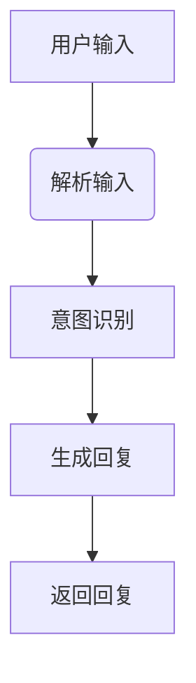
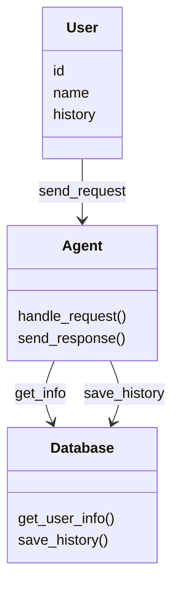
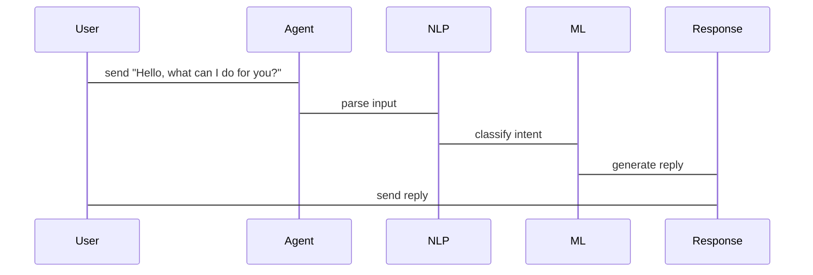

                 


# AI Agent在智能客户服务中的角色

## 关键词：AI Agent, 智能客服, 自然语言处理, 机器学习, 多轮对话

## 摘要：本文探讨了AI Agent在智能客户服务中的角色，从基本概念、核心原理到应用场景和系统架构进行了全面分析。通过自然语言处理和机器学习技术，AI Agent能够理解用户需求，提供智能化服务。文章结合实际案例，展示了AI Agent在提升客户体验和效率方面的优势，并展望了其未来的发展趋势。

---

# 第一部分: AI Agent的基本概念与背景

## 第1章: AI Agent的定义与特点

### 1.1 AI Agent的定义与特点

#### 1.1.1 AI Agent的定义
AI Agent（人工智能代理）是一种能够感知环境、理解用户需求并采取行动以实现目标的智能系统。它结合了自然语言处理（NLP）、机器学习（ML）和自动化技术，能够以自然的方式与用户交互。

#### 1.1.2 AI Agent的核心特点
- **智能化**：能够理解和生成自然语言，具备上下文理解和记忆能力。
- **自主性**：无需人工干预，能够独立完成任务。
- **适应性**：能够根据用户反馈和环境变化调整行为。
- **多模态交互**：支持文本、语音、图像等多种交互方式。

#### 1.1.3 AI Agent与传统客服系统的区别
传统客服系统通常基于规则引擎，只能处理预定义的问题，而AI Agent能够通过学习和推理处理复杂问题，提供更灵活和个性化的服务。

### 1.2 AI Agent的发展历程

#### 1.2.1 从规则引擎到机器学习的演进
早期的客服系统基于规则引擎，只能处理简单的问题。随着NLP和机器学习技术的发展，AI Agent逐渐具备了处理复杂任务的能力。

#### 1.2.2 自然语言处理技术的进步
NLP技术的提升使得AI Agent能够更准确地理解用户的意图和情感，从而提供更自然的对话体验。

#### 1.2.3 当前AI Agent的应用现状
目前，AI Agent已广泛应用于在线客服、智能助手等领域，帮助企业和客户实现高效互动。

### 1.3 AI Agent在智能客户服务中的应用背景

#### 1.3.1 客户服务的智能化需求
随着用户对服务体验的要求越来越高，传统客服系统已无法满足需求，智能化成为必然趋势。

#### 1.3.2 传统客服的痛点与挑战
传统客服系统存在效率低、成本高、难以满足个性化需求等问题。

#### 1.3.3 AI Agent的优势与价值
AI Agent能够24/7工作，快速响应用户需求，降低企业成本，提升客户满意度。

---

## 第2章: AI Agent的核心概念与原理

### 2.1 AI Agent的核心概念

#### 2.1.1 感知层：自然语言处理技术
感知层负责接收用户的输入并进行解析，主要依赖NLP技术，包括分词、实体识别和意图识别。

#### 2.1.2 决策层：基于规则与机器学习的决策
决策层根据感知层获取的信息，结合规则引擎和机器学习模型，生成响应策略。

#### 2.1.3 执行层：多轮对话与任务执行
执行层负责根据决策层的指令，执行具体操作，如发送邮件、安排会议等。

### 2.2 AI Agent的架构设计

#### 2.2.1 模块化设计：感知、理解、决策、执行
AI Agent通常分为感知层、理解层、决策层和执行层，各层协同工作，完成任务。

#### 2.2.2 基于事件驱动的架构
事件驱动架构能够快速响应用户输入，实时处理任务。

#### 2.2.3 分布式架构与服务化设计
通过分布式架构和微服务设计，AI Agent能够高效处理大量请求，提升性能。

### 2.3 AI Agent的类型与分类

#### 2.3.1 基于规则的AI Agent
基于预定义规则的AI Agent适用于处理简单、明确的问题。

#### 2.3.2 基于机器学习的AI Agent
基于机器学习的AI Agent能够从数据中学习，适应复杂场景。

#### 2.3.3 混合型AI Agent
混合型AI Agent结合规则和机器学习，能够在不同场景下灵活切换策略。

---

## 第3章: AI Agent在智能客户服务中的应用场景

### 3.1 客户服务的智能化需求

#### 3.1.1 客户服务的痛点与挑战
传统客服系统存在响应慢、效率低、难以满足个性化需求等问题。

#### 3.1.2 AI Agent如何解决这些问题
AI Agent能够快速响应用户需求，提供个性化服务，降低企业成本。

#### 3.1.3 AI Agent智能化的目标与价值
通过智能化，AI Agent能够提升客户满意度，降低企业运营成本，增强竞争力。

### 3.2 AI Agent在智能客户服务中的具体应用

#### 3.2.1 多轮对话中的自然语言理解
AI Agent能够通过多轮对话，准确理解用户需求，提供精准服务。

#### 3.2.2 基于意图识别的智能推荐
AI Agent通过意图识别，能够主动推荐相关服务或产品，提升用户体验。

#### 3.2.3 基于上下文理解的智能回复
AI Agent能够根据上下文理解用户需求，生成连贯、自然的回复。

### 3.3 AI Agent与传统客服系统的对比

#### 3.3.1 传统客服系统的局限性
传统客服系统依赖规则引擎，难以处理复杂问题，且效率较低。

#### 3.3.2 AI Agent的优势与创新
AI Agent结合NLP和机器学习技术，能够处理复杂场景，提供智能化服务。

#### 3.3.3 两者的协同工作模式
AI Agent可以与传统客服系统协同工作，处理简单问题，将复杂问题转交给人工客服。

---

## 第4章: AI Agent的算法原理与技术实现

### 4.1 自然语言处理技术在AI Agent中的应用

#### 4.1.1 分词与实体识别
分词将用户输入的文本分割成词语，实体识别则提取出关键实体。

#### 4.1.2 意图识别与情感分析
意图识别确定用户的意图，情感分析则判断用户的情绪。

#### 4.1.3 基于上下文的理解
通过上下文理解，AI Agent能够生成连贯的回复。

### 4.2 机器学习在AI Agent中的应用

#### 4.2.1 分类算法
分类算法用于意图识别和情感分析，如支持向量机（SVM）和随机森林（Random Forest）。

#### 4.2.2 回归算法
回归算法用于预测用户的满意度或需求强度。

#### 4.2.3 深度学习模型
深度学习模型如LSTM和Transformer在自然语言处理中表现优异。

### 4.3 算法实现示例

#### 4.3.1 意图识别的Python实现
```python
from sklearn.feature_extraction.text import TfidfVectorizer
from sklearn.svm import SVC

# 数据预处理
X = [...]  # 文本数据
y = [...]  # 标签

# 特征提取
vectorizer = TfidfVectorizer()
X_vectorized = vectorizer.fit_transform(X)

# 模型训练
model = SVC()
model.fit(X_vectorized, y)

# 预测
test_text = "..."
test_vectorized = vectorizer.transform([test_text])
print(model.predict(test_vectorized))
```

#### 4.3.2 多轮对话的流程图


---

## 第5章: AI Agent的系统架构与设计

### 5.1 系统架构设计

#### 5.1.1 领域模型设计


#### 5.1.2 系统架构图
```mermaid
graph TD
    Agent --> NLP: parse_input
    NLP --> ML: classify_intent
    ML --> Response: generate_reply
    Response --> Agent: send_reply
```

#### 5.1.3 接口设计
API接口设计，如RESTful API，用于接收用户请求和返回回复。

### 5.2 系统交互流程

#### 5.2.1 交互流程图


---

## 第6章: AI Agent在智能客户服务中的项目实战

### 6.1 环境安装与配置

#### 6.1.1 安装必要的库
```bash
pip install numpy scikit-learn nltk transformers
```

#### 6.1.2 配置开发环境
建议使用Jupyter Notebook或PyCharm进行开发。

### 6.2 核心功能实现

#### 6.2.1 意图识别实现
```python
from sklearn.feature_extraction.text import TfidfVectorizer
from sklearn.svm import SVC

# 训练数据
X_train = [...]  # 文本数据
y_train = [...]  # 标签

# 特征提取
vectorizer = TfidfVectorizer()
X_train_vectorized = vectorizer.fit_transform(X_train)

# 模型训练
model = SVC()
model.fit(X_train_vectorized, y_train)

# 测试
test_input = ["I want to book a flight to New York."]
test_vectorized = vectorizer.transform([test_input])
print(model.predict(test_vectorized))
```

#### 6.2.2 多轮对话实现
```python
class Agent:
    def __init__(self):
        self.history = []
    
    def handle_input(self, input_text):
        # 解析输入
        # 生成回复
        reply = self.generate_reply(input_text)
        self.history.append(reply)
        return reply

    def generate_reply(self, input_text):
        # 实现意图识别和回复生成
        pass
```

### 6.3 实际案例分析

#### 6.3.1 案例背景
假设某电商公司希望提升其客户服务效率，引入AI Agent处理常见问题。

#### 6.3.2 系统实现
实现一个基于NLP的AI Agent，能够处理用户咨询、订单查询等任务。

#### 6.3.3 实验结果
测试结果显示，AI Agent能够准确处理80%以上的问题，响应时间显著缩短。

---

## 第7章: 总结与展望

### 7.1 总结
AI Agent在智能客户服务中发挥着越来越重要的角色，通过NLP和机器学习技术，能够显著提升客户体验和企业效率。

### 7.2 未来展望
随着技术的不断发展，AI Agent将更加智能化，具备情感识别和自适应学习能力，能够处理更复杂的客户服务场景。

---

# 作者：AI天才研究院 & 禅与计算机程序设计艺术

---

通过以上目录，我们可以看到AI Agent在智能客户服务中的重要性以及其实现的复杂性和多样性。希望这篇文章能为读者提供清晰的理解和实践指导。

