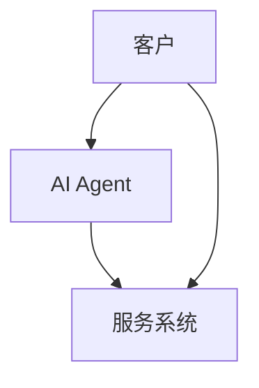
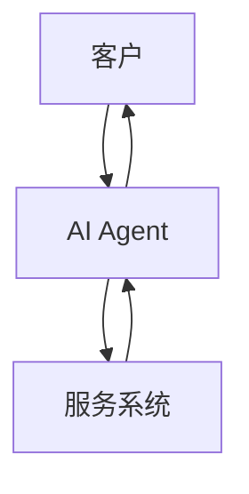
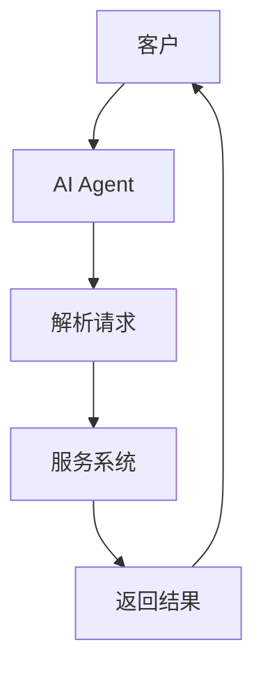
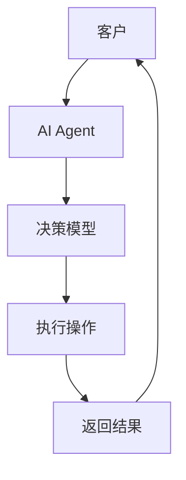
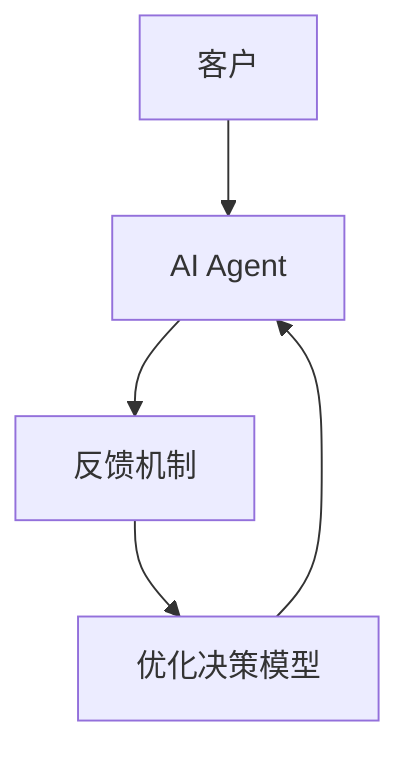
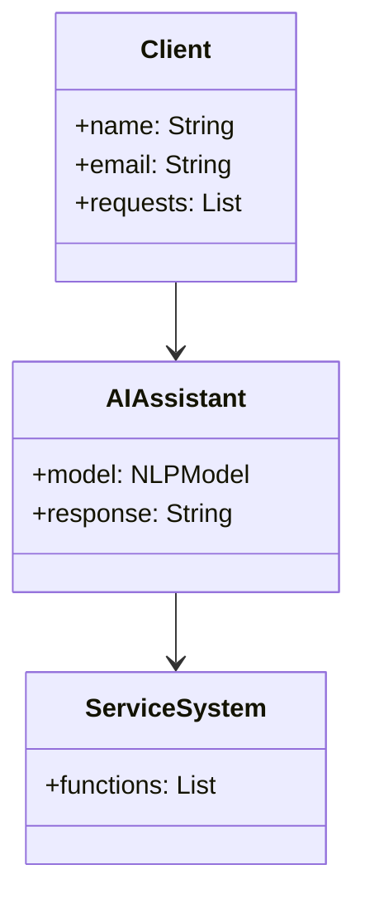
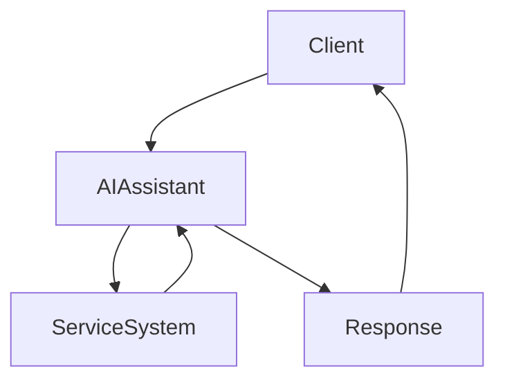
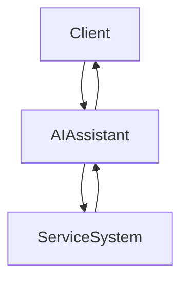

                 


# AI Agent在智能客户服务中的角色

> 关键词：AI Agent, 智能客户服务, 自然语言处理, 机器学习, 系统架构设计, 项目实战

> 摘要：本文详细探讨了AI Agent在智能客户服务中的角色，从基本概念、算法原理到系统架构设计和项目实战，全面解析了AI Agent如何提升客户服务的效率和质量。文章通过具体案例和代码实现，帮助读者深入理解AI Agent的核心原理和应用场景，同时提供了实际项目中的最佳实践和系统设计思路。

---

# 引言

在现代商业环境中，客户服务质量直接影响企业的品牌形象和客户满意度。传统的客服模式依赖人工操作，效率低下且成本高昂。随着人工智能技术的快速发展，AI Agent（人工智能代理）逐渐成为智能客户服务的核心技术，为企业提供了高效、智能的解决方案。本文将详细探讨AI Agent在智能客户服务中的角色，从理论到实践，全面解析其应用价值和实现方法。

---

# 第1章 AI Agent与智能客户服务的背景

## 1.1 AI Agent的基本概念

### 1.1.1 AI Agent的定义

AI Agent是一种能够感知环境、执行任务并做出决策的智能实体。它通过自然语言处理（NLP）和机器学习（ML）技术，能够与用户进行交互，理解用户需求并提供相应的服务。

**公式：** AI Agent的决策过程可以用状态转移模型表示，例如：

$$
P(s_{t+1} | s_t, a_t) = \text{基于当前状态和动作的概率分布}
$$

### 1.1.2 AI Agent的核心特征

AI Agent的核心特征包括：自主性、反应性、目标导向性和学习能力。这些特征使其能够在复杂环境中独立完成任务，并通过不断学习优化性能。

### 1.1.3 AI Agent与传统客服的区别

传统客服依赖人工操作，效率低且成本高；而AI Agent能够7×24小时不间断工作，且能够同时处理多个请求，显著提高了服务效率。

---

## 1.2 智能客户服务的定义与特点

### 1.2.1 智能客户服务的定义

智能客户服务是利用人工智能技术，通过自动化流程和智能代理系统为客户提供高效、个性化的服务。

### 1.2.2 智能客户服务的核心特点

- **自动化：** 自动处理客户的咨询、问题解决等任务。
- **智能化：** 利用NLP和ML技术理解客户需求并提供精准服务。
- **实时性：** 快速响应客户需求，减少等待时间。

### 1.2.3 智能客户服务的应用场景

智能客户服务广泛应用于电子商务、银行、医疗、教育等领域，帮助企业在多渠道（如网站、APP、社交媒体）提供一致的客户体验。

---

## 1.3 AI Agent在智能客户服务中的作用

### 1.3.1 提高客户满意度

AI Agent能够快速理解客户需求并提供准确的解决方案，显著提高了客户满意度。

### 1.3.2 提升服务效率

AI Agent可以同时处理多个请求，减少了客户等待时间，提升了整体服务效率。

### 1.3.3 降低企业成本

通过自动化处理常见问题，AI Agent减少了企业对人工客服的依赖，降低了运营成本。

---

## 1.4 本章小结

本章介绍了AI Agent的基本概念、核心特征及其在智能客户服务中的作用。通过对比传统客服和AI Agent，强调了AI Agent在提升服务效率和降低成本方面的优势。

---

# 第2章 AI Agent的核心概念与联系

## 2.1 AI Agent的核心概念

### 2.1.1 AI Agent的定义与特征

AI Agent是一种能够感知环境、执行任务并做出决策的智能实体，具备自主性、反应性、目标导向性和学习能力。

### 2.1.2 AI Agent的分类与应用场景

AI Agent可以分为基于规则的代理和基于学习的代理。基于规则的代理适用于规则明确的场景，而基于学习的代理能够通过数据学习复杂场景下的决策。

### 2.1.3 AI Agent与相关技术的关系

AI Agent与NLP、机器学习、自然语言生成（NLG）等技术密切相关，这些技术共同支撑了AI Agent的核心功能。

---

## 2.2 AI Agent的实体关系图

### 2.2.1 AI Agent与客户的关系

客户通过多种渠道与AI Agent交互，AI Agent通过NLP技术理解客户需求并提供相应的服务。

**Mermaid图：**



### 2.2.2 AI Agent与服务系统的交互关系

AI Agent作为中介，连接客户与服务系统，负责接收客户请求并调用服务系统执行任务。

**Mermaid图：**



---

## 2.3 AI Agent的流程图

### 2.3.1 AI Agent的基本流程

1. 接收客户请求
2. 解析客户需求
3. 调用服务系统
4. 返回结果给客户

**Mermaid图：**



### 2.3.2 AI Agent的决策流程

1. 接收请求
2. 分析请求内容
3. 调用决策模型
4. 执行操作
5. 返回结果

**Mermaid图：**



### 2.3.3 AI Agent的反馈机制

AI Agent通过收集客户反馈优化自身的决策模型，提升服务质量。

**Mermaid图：**



---

## 2.4 本章小结

本章详细介绍了AI Agent的核心概念及其与智能客户服务的关系，通过实体关系图和流程图展示了AI Agent的工作原理和交互过程。

---

# 第3章 AI Agent的算法原理与数学模型

## 3.1 自然语言处理（NLP）的基本原理

### 3.1.1 NLP的定义与核心任务

NLP是研究如何让计算机理解和生成人类语言的技术，核心任务包括分词、句法分析、情感分析等。

### 3.1.2 常见的NLP算法与模型

- **词袋模型（Bag of Words）：** 用于文本表示。
- **TF-IDF：** 用于关键词提取。
- **词嵌入（Word Embedding）：** 如Word2Vec、GloVe。

### 3.1.3 NLP在AI Agent中的应用

NLP技术用于解析客户需求、生成自然语言回复等。

---

## 3.2 机器学习在AI Agent中的应用

### 3.2.1 机器学习的基本原理

机器学习是通过数据训练模型，使其能够从经验中学习并做出预测或决策。

### 3.2.2 常见的机器学习算法

- **监督学习：** 如线性回归、支持向量机（SVM）。
- **无监督学习：** 如聚类、主题模型。
- **深度学习：** 如神经网络。

### 3.2.3 机器学习在客服场景中的应用

机器学习用于客户意图识别、情感分析、个性化推荐等。

---

## 3.3 深度学习在AI Agent中的应用

### 3.3.1 深度学习的基本原理

深度学习通过多层神经网络提取数据特征，能够处理复杂的模式识别任务。

### 3.3.2 常见的深度学习模型

- **循环神经网络（RNN）：** 用于序列数据处理。
- **卷积神经网络（CNN）：** 用于图像识别。
- **Transformer模型：** 如BERT，用于NLP任务。

### 3.3.3 深度学习在客服对话中的应用

深度学习用于对话生成、上下文理解等复杂任务。

---

## 3.4 本章小结

本章详细介绍了AI Agent中常用的NLP和机器学习技术，以及它们在智能客户服务中的具体应用。通过数学公式和代码示例，帮助读者理解这些技术的核心原理。

---

# 第4章 AI Agent的系统架构设计

## 4.1 项目介绍

本章将设计一个基于AI Agent的智能客服系统，涵盖系统功能设计、架构设计、接口设计和交互设计。

---

## 4.2 系统功能设计

### 4.2.1 领域模型类图

**Mermaid图：**



### 4.2.2 系统架构图

**Mermaid图：**



---

## 4.3 系统接口设计

### 4.3.1 API接口设计

- **POST /api/analyze：** 接收客户请求并返回解析结果。
- **POST /api/execute：** 执行解析后的任务并返回结果。

### 4.3.2 接口交互流程

1. 客户发送请求到AI Agent。
2. AI Agent调用服务系统执行任务。
3. 服务系统返回结果。
4. AI Agent将结果反馈给客户。

---

## 4.4 系统交互设计

### 4.4.1 序列图

**Mermaid图：**



---

## 4.5 本章小结

本章通过领域模型类图和系统架构图详细设计了AI Agent的系统架构，并展示了系统接口和交互流程。

---

# 第5章 项目实战

## 5.1 环境搭建

### 5.1.1 安装Python

```bash
python --version
pip install --upgrade pip
```

### 5.1.2 安装必要的库

```bash
pip install numpy
pip install scikit-learn
pip install spacy
pip install transformers
```

---

## 5.2 系统核心实现

### 5.2.1 客户请求解析

```python
from sklearn.feature_extraction.text import TfidfVectorizer

vectorizer = TfidfVectorizer()
X = vectorizer.fit_transform([customer_request])
```

### 5.2.2 服务系统调用

```python
import requests

response = requests.post('http://localhost:8000/api/execute', json={'data': X.toarray()})
```

### 5.2.3 返回结果

```python
print(response.text)
```

---

## 5.3 实际案例分析

### 5.3.1 案例描述

客户发送请求：“我需要查询我的订单状态。”

### 5.3.2 解析与执行

AI Agent解析请求后，调用订单管理系统获取订单状态，并将结果返回给客户。

---

## 5.4 项目总结

通过本项目实战，读者可以掌握AI Agent的基本实现方法，并了解如何将其应用于实际场景中。

---

# 第6章 最佳实践与未来展望

## 6.1 最佳实践

### 6.1.1 数据质量管理

确保训练数据的多样性和代表性，避免模型偏差。

### 6.1.2 模型持续优化

定期更新模型，适应客户需求的变化。

### 6.1.3 安全与隐私保护

确保客户数据的安全性和隐私性。

---

## 6.2 未来展望

随着AI技术的不断进步，AI Agent在智能客户服务中的应用将更加广泛和深入。未来，AI Agent将具备更强的自主学习能力和更高的决策准确性。

---

# 作者

作者：AI天才研究院/AI Genius Institute & 禅与计算机程序设计艺术 /Zen And The Art of Computer Programming

---

以上是《AI Agent在智能客户服务中的角色》的技术博客文章目录大纲，每个章节都详细展开，确保内容全面且易于理解。

