                 


# AI Agent在智能家居自动化中的应用

> 关键词：AI Agent，智能家居，自动化控制，智能设备，人工智能，物联网

> 摘要：本文详细探讨了AI Agent在智能家居自动化中的应用，从基本概念、核心原理到具体应用、系统设计以及项目实战，全面分析了AI Agent如何推动智能家居的智能化发展。通过理论与实践相结合的方式，本文为读者提供了从入门到深入的技术指导。

---

# 第一部分: AI Agent与智能家居自动化概述

## 第1章: AI Agent与智能家居自动化概述

### 1.1 AI Agent的基本概念

#### 1.1.1 AI Agent的定义与特点

AI Agent（人工智能代理）是指具有感知环境、做出决策、执行任务能力的智能体。它能够通过传感器获取信息，利用算法进行分析和推理，并通过执行器完成任务。AI Agent的核心特点包括：

- **自主性**：能够自主决策和行动，无需人工干预。
- **反应性**：能够实时感知环境变化并做出反应。
- **学习能力**：通过数据和经验不断优化自身行为。
- **协作性**：能够与其他智能体或系统协同工作。

#### 1.1.2 智能家居自动化的基本概念

智能家居自动化是指通过物联网技术将家中的设备、系统和数据连接起来，实现智能化管理。智能家居自动化的目标是提高居住舒适度、安全性、能源效率和生活便利性。

#### 1.1.3 AI Agent在智能家居中的应用前景

随着人工智能和物联网技术的快速发展，AI Agent在智能家居中的应用前景广阔。通过AI Agent，智能家居能够实现更智能化的设备控制、更个性化的用户服务以及更高效的资源管理。

---

### 1.2 智能家居自动化的核心概念

#### 1.2.1 智能家居的定义与组成部分

智能家居是由多种智能设备、传感器、执行器和控制平台组成的系统，通过物联网技术实现设备之间的互联互通。智能家居的主要组成部分包括：

- **设备层**：如智能灯泡、智能插座、智能门锁等。
- **网络层**：如Wi-Fi、蓝牙、 ZigBee等通信协议。
- **服务层**：如智能音箱、智能家居App、云端服务平台等。

#### 1.2.2 智能家居自动化的目标与优势

智能家居自动化的目标是通过智能化的管理，实现家庭设备的自动化控制、能源的高效利用以及家庭安全的全面保障。其优势包括：

- **提高生活便利性**：用户可以通过手机App或语音助手远程控制家中设备。
- **降低能源消耗**：通过智能调节设备使用时间，降低能源浪费。
- **提升安全性**：通过智能监控和报警系统，保障家庭安全。

#### 1.2.3 AI Agent在智能家居自动化中的角色

AI Agent在智能家居自动化中扮演着核心角色。它不仅能够感知环境信息，还能通过学习和优化算法做出最佳决策，并通过执行器完成任务。AI Agent的应用场景包括：

- **设备控制**：如智能灯泡的开关控制、空调温度调节。
- **数据处理**：如分析家庭用电数据，优化能源使用。
- **人机交互**：如通过语音助手与用户进行交互，理解用户需求并执行命令。

---

## 1.3 本章小结

本章主要介绍了AI Agent和智能家居自动化的基本概念，分析了AI Agent在智能家居中的应用前景。通过本章的学习，读者可以理解AI Agent在智能家居中的重要性以及其在智能家居自动化中的核心作用。

---

# 第二部分: AI Agent的核心原理与技术

## 第2章: AI Agent的核心原理

### 2.1 AI Agent的决策机制

#### 2.1.1 基于概率推理的决策模型

基于概率推理的决策模型是一种通过计算事件发生的概率来做出决策的模型。例如，当AI Agent需要决定是否开启空调时，它可以根据当前室温、天气预报等信息，计算出开启空调的概率，并根据概率结果做出决策。

**流程图示例（使用Mermaid）**:

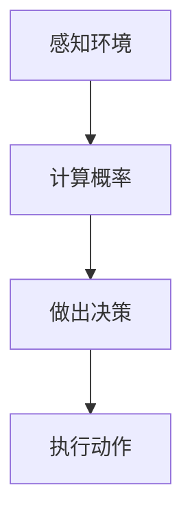

#### 2.1.2 基于强化学习的决策算法

基于强化学习的决策算法是一种通过不断试错来优化决策的算法。例如，AI Agent可以通过尝试不同的动作（如调整空调温度），并根据反馈（如用户满意度）来优化其决策策略。

**强化学习公式**:

$$ Q(s, a) = Q(s, a) + \alpha (r + \gamma V(s')) - Q(s, a) $$

其中：
- \( Q(s, a) \)：当前状态下采取动作 \( a \) 的价值。
- \( \alpha \)：学习率。
- \( r \)：奖励值。
- \( \gamma \)：折扣因子。
- \( V(s') \)：下一个状态 \( s' \) 的价值。

---

#### 2.1.3 基于规则引擎的决策方法

基于规则引擎的决策方法是一种通过预定义规则来做出决策的方法。例如，AI Agent可以根据预设的规则（如“如果室温超过25摄氏度，则开启空调”）来做出决策。

**规则引擎示例**:

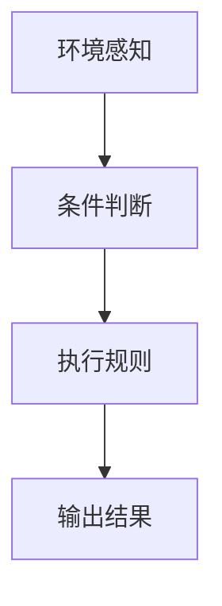

---

### 2.2 AI Agent的学习与优化

#### 2.2.1 监督学习在AI Agent中的应用

监督学习是一种通过训练数据和标签来学习模型的算法。例如，AI Agent可以通过监督学习算法（如线性回归、支持向量机）来学习如何根据用户的行为模式预测用户的下一步操作。

**监督学习流程图示例**:

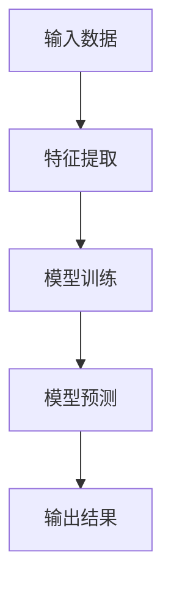

---

#### 2.2.2 无监督学习在AI Agent中的应用

无监督学习是一种通过分析数据的内在结构来发现数据规律的算法。例如，AI Agent可以通过无监督学习算法（如聚类分析、主成分分析）来分析用户的使用习惯，发现潜在的模式。

**无监督学习流程图示例**:

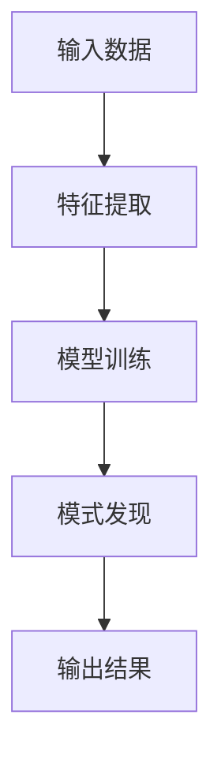

---

#### 2.2.3 强化学习在AI Agent中的应用

强化学习是一种通过试错和反馈来优化决策的算法。例如，AI Agent可以通过强化学习算法（如Q-learning、Deep Q-Network）来优化其在智能家居中的控制策略。

**强化学习流程图示例**:

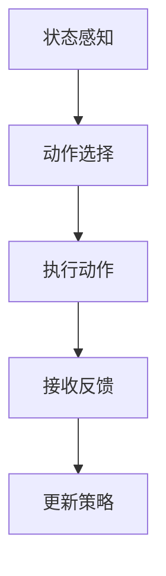

---

### 2.3 AI Agent的通信与协作

#### 2.3.1 多智能体系统的基本概念

多智能体系统是指由多个智能体组成的系统，智能体之间通过通信和协作完成任务。在智能家居中，AI Agent可以通过多智能体系统实现设备之间的协同工作。

**多智能体系统示例**:

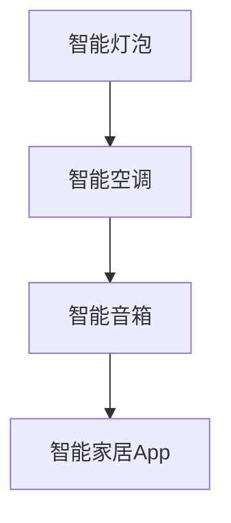

---

#### 2.3.2 智能体之间的通信协议

智能体之间的通信协议是实现协作的关键。常用的通信协议包括：

- **HTTP**：用于Web服务之间的通信。
- **MQTT**：用于物联网设备之间的通信。
- **CoAP**：用于资源受限设备之间的通信。

---

#### 2.3.3 智能体协作的实现方法

智能体协作可以通过以下方法实现：

- **基于规则的协作**：通过预定义规则实现协作。
- **基于规划的协作**：通过智能体之间的规划和协商实现协作。
- **基于学习的协作**：通过强化学习等算法实现协作。

---

## 2.4 本章小结

本章详细介绍了AI Agent的核心原理，包括决策机制、学习与优化以及通信与协作。通过本章的学习，读者可以理解AI Agent如何通过感知、学习和协作来实现智能化的决策和行动。

---

# 第三部分: AI Agent在智能家居中的具体应用

## 第3章: 智能家居设备的自动化控制

### 3.1 智能家居设备的分类与功能

#### 3.1.1 照明设备的自动化控制

照明设备的自动化控制可以通过AI Agent实现智能调光、定时开关等功能。例如，AI Agent可以根据室内外光线强度自动调节灯光亮度。

**照明设备控制流程图示例**:

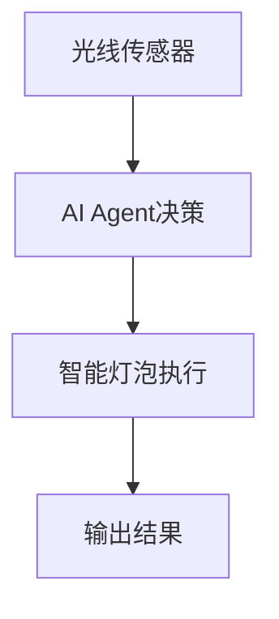

---

#### 3.1.2 窗帘与遮阳设备的自动化控制

窗帘与遮阳设备的自动化控制可以通过AI Agent实现智能开关、定时调节等功能。例如，AI Agent可以根据天气预报和室内外光线强度自动调节窗帘的开合状态。

**窗帘设备控制流程图示例**:

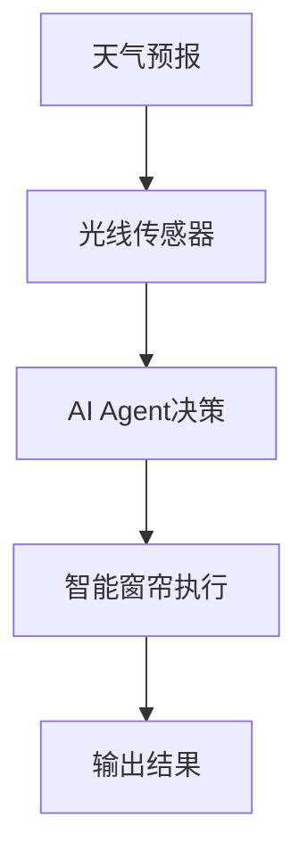

---

#### 3.1.3 家庭安防设备的自动化控制

家庭安防设备的自动化控制可以通过AI Agent实现智能监控、报警联动等功能。例如，AI Agent可以根据监控摄像头和门窗传感器的状态自动触发报警信息。

**家庭安防设备控制流程图示例**:

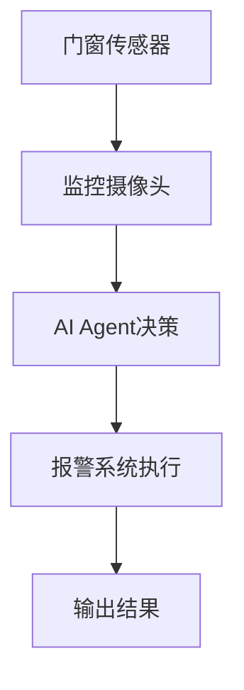

---

### 3.2 AI Agent对智能家居设备的控制流程

#### 3.2.1 设备状态的感知与反馈

AI Agent通过传感器感知设备的当前状态，并将感知到的信息反馈给系统。例如，AI Agent可以通过温度传感器感知室温，并将室温信息反馈给系统。

---

#### 3.2.2 控制指令的生成与执行

AI Agent根据感知到的环境信息和预设的规则生成控制指令，并通过执行器完成指令的执行。例如，AI Agent可以根据室温信息生成空调调节指令，并通过空调执行器完成温度调节。

---

#### 3.2.3 设备状态的实时监控与调整

AI Agent可以实时监控设备的运行状态，并根据反馈信息动态调整控制策略。例如，AI Agent可以根据空调运行状态和室温变化动态调整空调运行模式。

---

## 3.3 本章小结

本章详细介绍了AI Agent在智能家居设备自动化控制中的具体应用，包括照明设备、窗帘设备和家庭安防设备的自动化控制。通过本章的学习，读者可以理解AI Agent如何通过感知、决策和执行实现智能家居设备的智能化控制。

---

# 第四部分: 系统分析与架构设计

## 第4章: 智能家居自动化系统的架构设计

### 4.1 系统总体架构

#### 4.1.1 系统分层架构

智能家居自动化系统的总体架构可以分为设备层、网络层、服务层和用户层。每一层都有其特定的功能和职责。

**系统分层架构示例**:

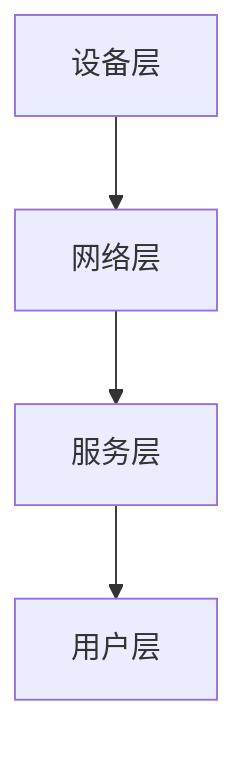

---

#### 4.1.2 系统组件之间的关系

系统组件之间的关系可以通过模块化设计来实现。例如，设备层的智能灯泡可以通过网络层的Wi-Fi模块与服务层的AI Agent进行通信。

**系统组件关系示例**:

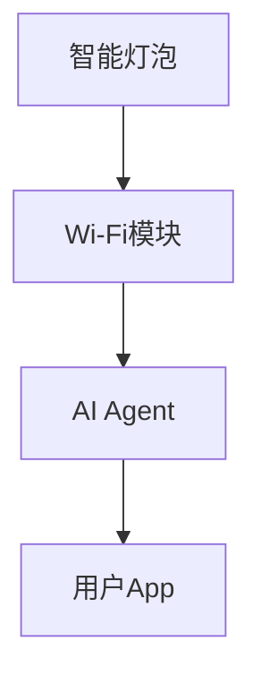

---

#### 4.1.3 系统的可扩展性设计

系统的可扩展性设计是通过模块化设计和插件式架构来实现的。例如，AI Agent可以通过插件扩展其功能，以支持更多的设备和场景。

---

### 4.2 系统功能模块设计

#### 4.2.1 设备管理模块

设备管理模块负责管理智能家居中的设备，包括设备的添加、删除、配置和状态监控。

**设备管理模块功能示例**:

- 设备添加：支持通过App或Web界面添加新的智能设备。
- 设备配置：支持通过App或Web界面配置设备的参数和功能。
- 设备监控：支持实时监控设备的运行状态和数据。

---

#### 4.2.2 用户交互模块

用户交互模块负责与用户进行交互，包括用户界面、语音交互和远程控制。

**用户交互模块功能示例**:

- 用户界面：支持通过App或Web界面与用户进行交互。
- 语音交互：支持通过智能音箱或语音助手与用户进行交互。
- 远程控制：支持通过手机或电脑远程控制智能家居设备。

---

#### 4.2.3 任务调度模块

任务调度模块负责调度和管理系统的任务，包括任务的创建、执行和终止。

**任务调度模块功能示例**:

- 任务创建：支持通过App或Web界面创建新的任务。
- 任务执行：支持通过AI Agent执行任务。
- 任务终止：支持通过App或Web界面终止任务的执行。

---

### 4.3 系统通信协议设计

#### 4.3.1 智能家居设备的通信协议

智能家居设备的通信协议包括：

- **Wi-Fi**：用于设备之间的无线通信。
- **Bluetooth**：用于设备之间的短距离通信。
- **ZigBee**：用于设备之间的低功耗通信。

---

#### 4.3.2 AI Agent与设备之间的通信机制

AI Agent与设备之间的通信机制可以通过以下方式实现：

- **HTTP**：通过HTTP协议进行设备控制。
- **MQTT**：通过MQTT协议进行设备控制。
- **CoAP**：通过CoAP协议进行设备控制。

---

#### 4.3.3 系统的网络安全设计

系统的网络安全设计是通过加密通信、身份验证和访问控制来实现的。例如，AI Agent可以通过SSL/TLS加密通信来保障数据的安全性。

---

## 4.4 本章小结

本章详细介绍了智能家居自动化系统的总体架构、功能模块和通信协议设计。通过本章的学习，读者可以理解AI Agent如何通过系统架构和功能模块实现智能家居自动化控制。

---

# 第五部分: 项目实战与案例分析

## 第5章: 智能家居自动化系统的开发实战

### 5.1 项目环境搭建

#### 5.1.1 开发工具的安装与配置

开发工具的安装与配置是智能家居自动化系统开发的基础。常用的开发工具包括：

- **Python**：用于AI Agent的开发和实现。
- **MQTT Broker**：用于设备之间的通信。
- **Hass.io**：用于智能家居系统的集成和部署。

---

#### 5.1.2 智能家居设备的接入与测试

智能家居设备的接入与测试是智能家居自动化系统开发的重要步骤。例如，可以通过Hass.io将智能灯泡、智能插座等设备接入系统，并通过测试工具（如curl、mosquitto_sub）进行设备控制和数据获取。

---

#### 5.1.3 AI Agent框架的选择与部署

AI Agent框架的选择与部署是智能家居自动化系统开发的关键。常用的AI Agent框架包括：

- **OpenAI Gym**：用于强化学习算法的实现。
- **Proxymate**：用于多智能体系统的实现。
- **Rasa**：用于对话式AI Agent的实现。

---

### 5.2 系统核心功能的实现

#### 5.2.1 设备状态监测

设备状态监测是智能家居自动化系统的核心功能之一。例如，AI Agent可以通过传感器获取设备的实时状态，并通过反馈机制优化其控制策略。

**设备状态监测代码示例**:

```python
import mqtt

def on_message(client, userdata, message):
    print("received message: ", str(message.payload.decode()))
    # 处理状态信息

client = mqtt.Client()
client.on_message = on_message
client.connect("localhost", 1883)
client.subscribe("home/+/sensor")
client.loop_forever()
```

---

#### 5.2.2 设备控制

设备控制是智能家居自动化系统的另一核心功能。例如，AI Agent可以通过发送控制指令到设备，实现设备的开关控制和参数调节。

**设备控制代码示例**:

```python
import mqtt

def control_device(device_id, command):
    client = mqtt.Client()
    client.connect("localhost", 1883)
    client.publish(f"home/{device_id}/control", command)
    client.disconnect()

control_device("light_1", "ON")
```

---

#### 5.2.3 任务调度

任务调度是智能家居自动化系统的重要功能。例如，AI Agent可以通过任务调度模块实现定时任务和条件任务的调度。

**任务调度代码示例**:

```python
import schedule
import time

def job():
    print("Running job...")

schedule.every(5).seconds.do(job)

while True:
    schedule.run_pending()
    time.sleep(1)
```

---

### 5.3 案例分析

#### 5.3.1 家庭能源管理系统的案例分析

家庭能源管理系统是一个典型的智能家居自动化系统。通过AI Agent，家庭能源管理系统可以实现能源的智能化管理，包括能源消耗监测、能源使用优化和能源设备控制。

**家庭能源管理系统流程图示例**:

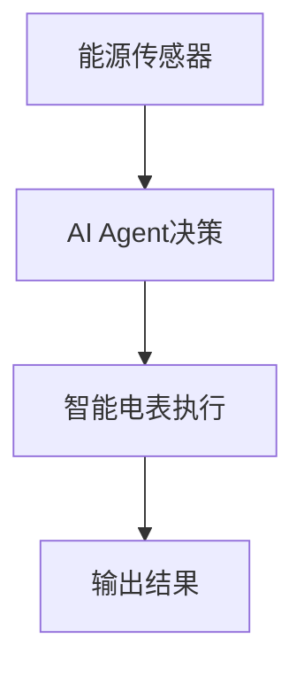

---

## 5.4 本章小结

本章通过实际项目开发，详细介绍了智能家居自动化系统的环境搭建、核心功能实现以及案例分析。通过本章的学习，读者可以掌握AI Agent在智能家居自动化系统中的具体应用。

---

# 第六部分: 总结与展望

## 第6章: 总结与展望

### 6.1 总结

本文详细探讨了AI Agent在智能家居自动化中的应用，从基本概念到具体应用，从系统设计到项目实战，全面分析了AI Agent如何推动智能家居的智能化发展。通过理论与实践相结合的方式，本文为读者提供了从入门到深入的技术指导。

---

### 6.2 展望

随着人工智能和物联网技术的快速发展，AI Agent在智能家居自动化中的应用前景广阔。未来，AI Agent可以通过以下方式进一步提升其在智能家居中的应用：

- **更智能的决策算法**：通过深度学习、强化学习等算法，提升AI Agent的决策能力和智能化水平。
- **更高效的通信协议**：通过优化通信协议，提升智能家居设备之间的通信效率和安全性。
- **更丰富的应用场景**：通过拓展应用场景，实现智能家居设备的更广泛、更智能的协同工作。

---

## 作者

作者：AI天才研究院/AI Genius Institute & 禅与计算机程序设计艺术/Zen And The Art of Computer Programming

