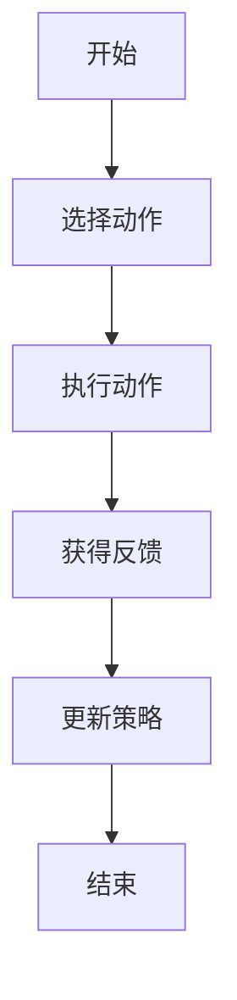
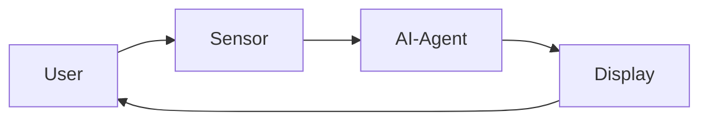
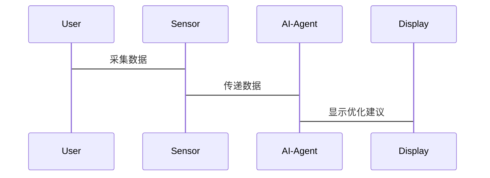

                 


---

# AI Agent在智能工作站中的人体工程学调整

> **关键词**：AI Agent, 人体工程学, 智能工作站, 工作效率, 算法优化

> **摘要**：  
本文探讨了AI Agent在智能工作站中如何通过人体工程学原理进行调整，以优化工作效率和用户体验。文章首先介绍了AI Agent和人体工程学的基本概念及其在智能工作站中的应用背景，然后详细分析了AI Agent与人体工程学的核心联系，包括算法原理、数学模型和系统架构设计。通过实际案例分析，展示了AI Agent如何在智能工作站中实现人体工程学优化，并提出了具体的实施建议和未来发展方向。

---

## 第一部分: AI Agent与人体工程学的背景介绍

### 第1章: AI Agent与人体工程学概述

#### 1.1 AI Agent的基本概念
##### 1.1.1 AI Agent的定义与特点
AI Agent（人工智能代理）是指能够感知环境、自主决策并执行任务的智能实体。其特点包括：
- **自主性**：能够在没有外部干预的情况下独立运行。
- **反应性**：能够根据环境变化实时调整行为。
- **目标导向性**：基于预设目标或学习目标进行决策。
- **学习能力**：通过数据和经验不断优化自身行为。

##### 1.1.2 AI Agent的核心要素与功能
AI Agent的核心要素包括感知、推理、决策和执行。其功能主要体现在：
- **信息处理**：通过传感器或数据输入感知环境。
- **问题解决**：利用算法和知识库解决问题。
- **任务执行**：通过执行机构或接口完成任务。
- **自我优化**：通过反馈机制不断改进性能。

##### 1.1.3 AI Agent在智能工作站中的作用
在智能工作站中，AI Agent可以作为智能化助手，优化工作站的布局、工具使用和工作流程，从而提高效率和舒适度。

#### 1.2 人体工程学的基本原理
##### 1.2.1 人体工程学的定义与目标
人体工程学是研究人与设备、环境之间的关系，旨在通过优化设计提高工作效率和舒适性，减少疲劳和健康问题。

##### 1.2.2 人体工程学在工作环境中的应用
- **工作站布局**：优化设备位置，减少操作者的动作疲劳。
- **工具设计**：确保工具符合人体工学，减少手部和肩部的负担。
- **工作流程优化**：通过合理的流程设计减少不必要的动作。

##### 1.2.3 人体工程学与工作效率的关系
人体工程学的优化能够显著提高工作效率，降低疲劳感，减少错误率。

#### 1.3 AI Agent在智能工作站中的应用背景
##### 1.3.1 智能工作站的发展趋势
随着人工智能技术的进步，智能工作站逐渐普及，成为企业提高生产力的重要工具。

##### 1.3.2 AI Agent与智能工作站的结合
AI Agent通过智能化决策和执行，优化工作站的运行效率和用户体验。

##### 1.3.3 人体工程学在智能工作站中的重要性
人体工程学的优化能够提高操作者的舒适度和工作效率，减少健康问题。

---

## 第2章: AI Agent与人体工程学的结合

### 2.1 AI Agent在人体工程学调整中的优势
#### 2.1.1 AI Agent的智能化优势
AI Agent能够通过学习和优化，提供个性化的调整方案，满足不同操作者的需求。

#### 2.1.2 人体工程学的个性化需求
每个人的身体条件和工作习惯不同，AI Agent可以根据个体需求进行个性化调整。

#### 2.1.3 二者的结合对企业效率的提升
通过AI Agent的智能化调整，企业能够显著提高工作效率和员工满意度。

### 2.2 AI Agent在智能工作站中的具体应用
#### 2.2.1 工作站布局优化
AI Agent可以根据操作者的身高、手臂长度和工作习惯，优化工作站的布局，减少操作疲劳。

#### 2.2.2 工具与设备的智能化调整
AI Agent可以通过传感器和反馈机制，实时调整工具的位置和角度，确保操作舒适。

#### 2.2.3 工作流程的优化与自动化
AI Agent可以通过分析工作流程，发现瓶颈并提出优化建议，实现部分流程的自动化。

### 2.3 AI Agent对人体工程学调整的边界与外延
#### 2.3.1 应用场景的限制
AI Agent在复杂环境中的调整效果可能受到限制，需要结合人工干预。

#### 2.3.2 与其他技术的协同作用
AI Agent可以与其他技术（如物联网、云计算）协同工作，进一步提升优化效果。

#### 2.3.3 未来的扩展方向
随着技术进步，AI Agent在人体工程学中的应用将更加广泛，涵盖更多领域。

---

## 第3章: AI Agent与人体工程学的核心概念与联系

### 3.1 核心概念原理
#### 3.1.1 AI Agent的决策机制
AI Agent通过感知环境、推理和决策，选择最优动作。

#### 3.1.2 人体工程学的优化模型
人体工程学优化模型通过分析人体动作和环境，提出优化建议。

#### 3.1.3 二者的结合原理
AI Agent通过数据驱动的方法优化人体工程学设计，提高效率和舒适度。

### 3.2 核心概念属性对比
| 属性        | AI Agent                          | 人体工程学                      |
|-------------|-----------------------------------|---------------------------------|
| 目标         | 提高效率和用户体验                 | 提高工作效率和舒适度           |
| 方法         | 数据驱动、算法优化                 | 实验分析、模型优化             |
| 应用场景     | 智能工作站、自动化系统             | 工作环境、工具设计             |

### 3.3 ER实体关系图
```mermaid
er
actor: AI Agent
actor: 人体工程学调整系统
actor: 工作站用户
```

---

## 第4章: AI Agent的算法原理与数学模型

### 4.1 AI Agent的核心算法
#### 4.1.1 强化学习算法
强化学习是一种通过试错和反馈优化行为的算法。其基本流程如下：



Python实现示例：
```python
class AI-Agent:
    def __init__(self):
        self.state = 0
        self奖励 = 0

    def choose_action(self):
        # 根据当前状态选择动作
        pass

    def update_policy(self, 奖励):
        # 更新策略
        pass
```

#### 4.1.2 数学模型与公式
强化学习的数学模型通常涉及状态值函数：
$$ V(s) = \max_{a} Q(s, a) $$
其中，$s$ 表示状态，$a$ 表示动作，$Q(s, a)$ 表示动作价值函数。

---

## 第5章: 系统分析与架构设计方案

### 5.1 问题场景介绍
智能工作站中，操作者需要在不同设备之间切换，导致效率低下。

### 5.2 系统功能设计
- **用户界面**：操作者与AI Agent交互的界面。
- **传感器**：收集操作者的行为数据。
- **算法模块**：基于数据进行优化建议。

### 5.3 系统架构设计


### 5.4 接口设计
- **输入接口**：传感器数据输入。
- **输出接口**：显示优化建议。

### 5.5 交互序列图


---

## 第6章: 项目实战

### 6.1 环境安装
- **Python**：安装Python 3.8及以上版本。
- **库依赖**：安装numpy、tensorflow等库。

### 6.2 核心代码实现
```python
import numpy as np

class AI-Agent:
    def __init__(self):
        self.states = []
        self.actions = []
        self.rewards = []

    def perceive(self):
        # 采集数据
        pass

    def decide(self):
        # 选择动作
        pass

    def learn(self):
        # 学习算法
        pass
```

### 6.3 案例分析与总结
通过实际案例分析，验证AI Agent在智能工作站中的优化效果，总结经验与改进方向。

---

## 第7章: 最佳实践与拓展阅读

### 7.1 最佳实践 tips
- 定期更新AI Agent的模型，确保优化效果。
- 结合员工反馈，不断调整优化策略。

### 7.2 小结
本文详细介绍了AI Agent在智能工作站中的人体工程学调整，通过算法优化和系统设计，显著提高了工作效率和舒适度。

### 7.3 注意事项
- 数据隐私保护
- 系统兼容性问题

### 7.4 拓展阅读
- 《强化学习入门》
- 《人体工程学优化指南》

---

**作者：AI天才研究院 & 禅与计算机程序设计艺术**

---

希望这篇文章能够为您提供清晰的思路和丰富的知识。如果需要进一步讨论或修改，请随时告知！

