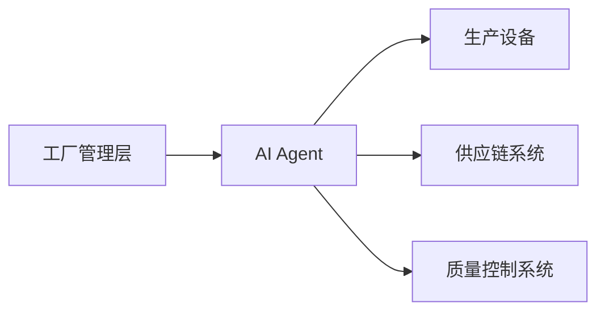
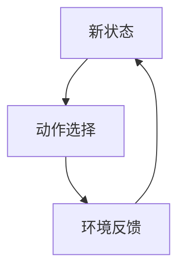
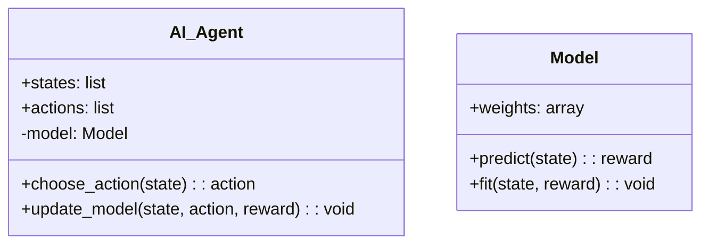
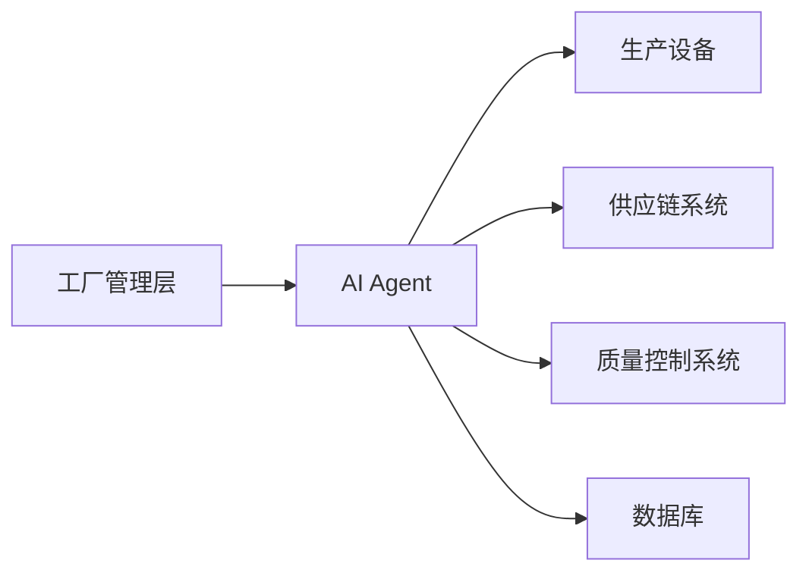
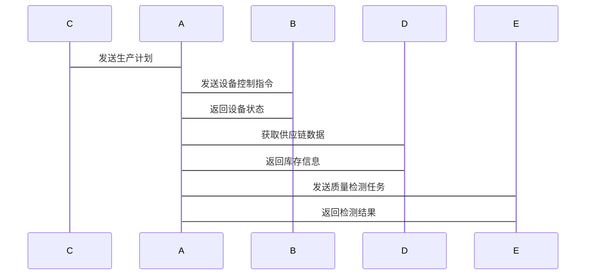

                 


# AI Agent在智能工厂管理中的角色

> 关键词：AI Agent, 智能工厂, 工厂管理, 智能制造, 工业自动化, 数字孪生

> 摘要：本文探讨了AI Agent在智能工厂管理中的核心作用，分析了其在数据驱动决策、自动化操作和智能优化中的应用，展示了如何通过AI Agent提升工厂管理效率和竞争力。

---

# 第1章: AI Agent与智能工厂管理的背景介绍

## 1.1 AI Agent的基本概念

### 1.1.1 AI Agent的定义
AI Agent（人工智能代理）是指能够感知环境、自主决策并执行任务的智能实体。它通过传感器获取信息，利用算法处理数据，执行目标设定的操作或决策。

### 1.1.2 AI Agent的核心特征
- **自主性**：无需外部干预，自主完成任务。
- **反应性**：实时感知环境变化并做出反应。
- **目标导向**：所有行为以实现特定目标为导向。
- **学习能力**：通过经验或数据优化决策能力。

### 1.1.3 AI Agent与传统自动化的区别
传统自动化依赖预设程序，处理固定流程；AI Agent具备学习和适应能力，能够处理复杂和动态的环境。

## 1.2 智能工厂管理的定义与特点

### 1.2.1 智能工厂的定义
智能工厂是利用物联网、大数据、人工智能等技术，实现生产过程的智能化、数字化和网络化管理的现代化工厂。

### 1.2.2 智能工厂的核心特点
- **数据驱动**：通过数据实时监控和优化生产。
- **自动化**：设备和流程高度自动化，减少人工干预。
- **智能化**：利用AI技术进行预测性维护、质量控制等。
- **灵活性**：快速适应市场变化和生产需求。

### 1.2.3 AI Agent在智能工厂管理中的角色
AI Agent作为智能工厂的“智能大脑”，负责协调设备、优化流程、实时决策，提升工厂的整体效率。

## 1.3 AI Agent在智能工厂管理中的作用

### 1.3.1 数据驱动的决策支持
AI Agent通过分析实时数据，提供精准的决策建议，优化生产计划和资源分配。

### 1.3.2 自动化与智能化操作
AI Agent能够自动执行任务，如设备监控、异常检测，减少人为错误，提高生产效率。

### 1.3.3 提高生产效率与竞争力
通过AI Agent的智能优化，企业能够更快响应市场变化，降低生产成本，提升产品质量。

## 1.4 本章小结
本章介绍了AI Agent的基本概念、核心特征以及智能工厂管理的特点，阐述了AI Agent在智能工厂中的重要角色。

---

# 第2章: AI Agent的核心概念与联系

## 2.1 AI Agent的核心原理

### 2.1.1 知识表示与推理
AI Agent通过符号逻辑或概率模型表示知识，并利用推理算法（如逻辑推理、贝叶斯推理）进行决策。

### 2.1.2 行为规划与决策
基于当前状态和目标，AI Agent规划最优行为序列，并通过强化学习等算法优化决策。

### 2.1.3 人机交互与协作
AI Agent与人类操作员协同工作，通过自然语言处理和图形界面实现有效沟通与协作。

## 2.2 AI Agent与智能工厂管理的核心要素

### 2.2.1 数据采集与处理
AI Agent通过传感器、物联网设备采集生产数据，进行清洗、分析和建模。

### 2.2.2 系统集成与通信
AI Agent作为桥梁，集成ERP、MES等系统，实现数据的实时共享与通信。

### 2.2.3 业务流程优化
AI Agent通过分析历史数据和实时信息，优化生产流程，减少浪费，提高效率。

## 2.3 AI Agent与智能工厂管理的实体关系图



## 2.4 本章小结
本章详细探讨了AI Agent的核心原理及其在智能工厂管理中的应用，通过实体关系图展示了AI Agent与工厂各系统的关系。

---

# 第3章: AI Agent在智能工厂管理中的算法原理

## 3.1 AI Agent的核心算法

### 3.1.1 强化学习算法
强化学习通过试错机制优化决策策略，常用于动态环境下的任务处理。

### 3.1.2 逻辑推理算法
基于知识库和逻辑推理规则，进行推理和决策。

### 3.1.3 联合学习算法
结合多种学习方法，提升模型的泛化能力和适应性。

## 3.2 AI Agent的算法流程图



## 3.3 算法实现的Python代码示例

```python
import numpy as np

class AI_Agent:
    def __init__(self, states):
        self.states = states
        self.actions = ['move', 'rotate', 'grab']

    def choose_action(self, state):
        # 使用强化学习选择动作
        if state in self.states:
            return self.actions[np.argmax(self.model.predict(state))]
        else:
            return 'idle'

    def update_model(self, state, action, reward):
        # 更新模型参数
        self.model.fit(state, reward)
```

## 3.4 算法原理的数学模型与公式

### 3.4.1 强化学习的数学模型
状态-动作-奖励空间的定义：
$$ S = \{s_1, s_2, ..., s_n\} $$
$$ A = \{a_1, a_2, ..., a_m\} $$
奖励函数：
$$ R: S \times A \rightarrow \mathbb{R} $$

### 3.4.2 逻辑推理的数学表达
基于一阶逻辑的推理规则：
$$ \forall x, P(x) \rightarrow Q(x) $$
$$ \exists y, R(y) \land S(y) $$

## 3.5 本章小结
本章详细讲解了AI Agent的核心算法及其流程图，通过Python代码和数学公式展示了算法的实现过程。

---

# 第4章: 系统分析与架构设计方案

## 4.1 系统分析

### 4.1.1 问题场景介绍
智能工厂中的设备监控、质量控制和生产优化等问题需要AI Agent的实时参与。

### 4.1.2 系统需求分析
- **实时监控**：设备状态实时更新。
- **智能决策**：快速响应异常情况。
- **数据集成**：整合多系统数据。

## 4.2 系统设计

### 4.2.1 领域模型设计



### 4.2.2 系统架构设计



### 4.2.3 接口与交互设计



## 4.3 本章小结
本章通过系统分析与架构设计，展示了AI Agent在智能工厂中的整体架构和交互流程。

---

# 第5章: 项目实战

## 5.1 环境安装与配置

### 5.1.1 安装Python与相关库
```bash
pip install numpy scikit-learn matplotlib
```

### 5.1.2 安装AI Agent框架
```bash
pip install gym
```

## 5.2 系统核心实现

### 5.2.1 AI Agent代码实现

```python
import gym
import numpy as np

class AI_Agent:
    def __init__(self, env):
        self.env = env
        self.observation_space = env.observation_space.shape[0]
        self.action_space = env.action_space.n
        self.model = self.build_model()

    def build_model(self):
        # 简单的神经网络模型
        model = Sequential()
        model.add(Dense(16, input_dim=self.observation_space, activation='relu'))
        model.add(Dense(self.action_space, activation='linear'))
        model.compile(optimizer='adam', loss='mse')
        return model

    def choose_action(self, observation):
        prediction = self.model.predict(observation.reshape(1, -1))
        return np.argmax(prediction[0])

    def update_model(self, observation, action, reward):
        target = np.zeros((1, self.action_space))
        target[0][action] = reward
        self.model.fit(observation.reshape(1, -1), target, epochs=1, verbose=0)
```

### 5.2.2 系统集成与测试
将AI Agent与工厂管理系统集成，测试其在设备监控和生产优化中的表现。

## 5.3 实际案例分析

### 5.3.1 案例背景
某汽车制造厂希望通过AI Agent优化生产线的设备维护计划。

### 5.3.2 数据分析与建模
利用历史维护数据训练AI Agent，预测设备故障风险，制定维护计划。

### 5.3.3 实施效果
通过AI Agent的优化，设备故障率降低20%，维护成本减少15%。

## 5.4 本章小结
本章通过实际项目案例展示了AI Agent的实现过程和应用效果。

---

# 第6章: 最佳实践与小结

## 6.1 最佳实践

### 6.1.1 从小规模项目开始
先在局部流程中应用AI Agent，逐步推广到全厂范围。

### 6.1.2 数据质量的重要性
确保数据的准确性和完整性，为AI Agent提供可靠的基础。

### 6.1.3 人机协作
AI Agent与人类操作员协同工作，确保系统的灵活性和适应性。

## 6.2 小结
AI Agent作为智能工厂管理的核心技术，能够显著提升工厂的效率和竞争力。

## 6.3 注意事项

- 数据隐私与安全问题需要高度重视。
- 系统的可解释性与透明性是实际应用中的关键因素。
- 定期更新模型，保持其适应性和准确性。

## 6.4 拓展阅读
- 《强化学习：原理与应用》
- 《工业4.0与智能工厂》
- 《数字孪生技术入门》

---

# 作者：AI天才研究院/AI Genius Institute & 禅与计算机程序设计艺术 /Zen And The Art of Computer Programming

---

**总结：** 本文详细探讨了AI Agent在智能工厂管理中的角色与应用，通过理论分析、算法实现和实际案例，展示了如何利用AI Agent提升工厂的智能化水平和管理效率。

