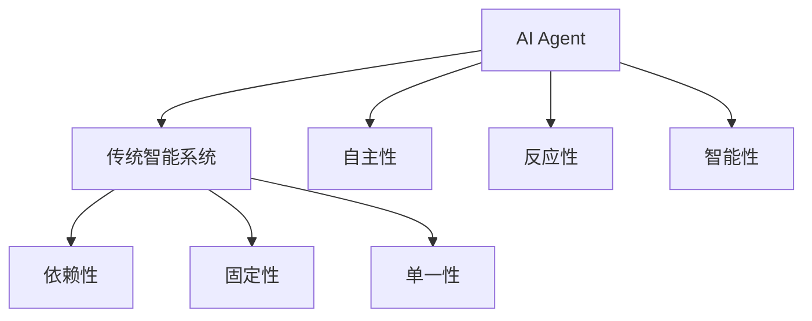
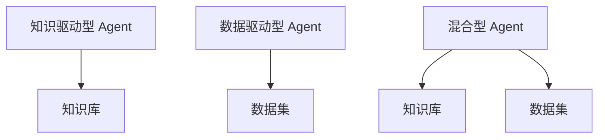
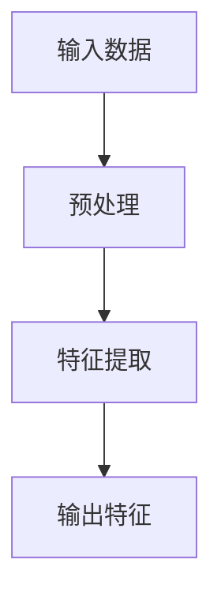
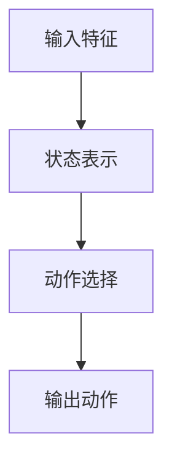
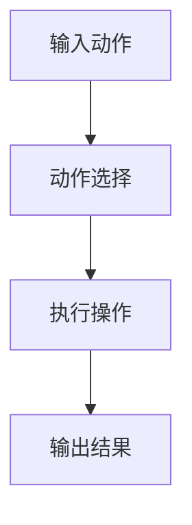
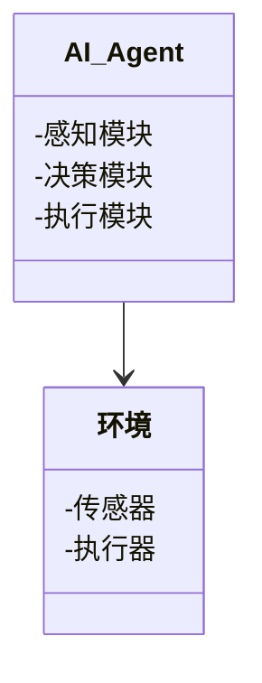
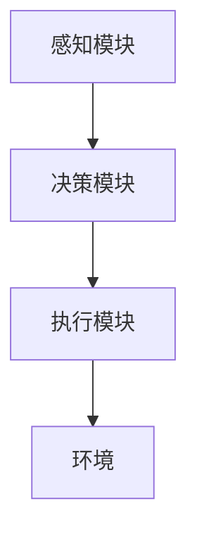

                 


# AI Agent在智能工程设计中的应用

> 关键词：AI Agent，智能工程，算法原理，系统架构，项目实战，数学模型

> 摘要：本文详细探讨了AI Agent在智能工程设计中的应用，从基本概念、核心原理、算法实现、系统架构到项目实战，全面分析了AI Agent在智能工程中的作用和实现方式，结合实际案例，为读者提供深入的理论和技术指导。

---

# 第一部分: AI Agent 的背景与核心概念

## 第1章: AI Agent 的基本概念与背景

### 1.1 AI Agent 的定义与特点

#### 1.1.1 AI Agent 的定义
AI Agent（人工智能代理）是一种能够感知环境、自主决策并执行任务的智能实体。它通过传感器获取信息，利用推理能力做出决策，并通过执行器与环境交互。AI Agent的核心目标是实现智能化的自主行为。

#### 1.1.2 AI Agent 的核心特点
| 特性 | 描述 |
|------|------|
| 自主性 | AI Agent能够自主决策和行动，无需外部干预。 |
| 反应性 | 能够实时感知环境变化并做出快速反应。 |
| 智能性 | 具备学习、推理和问题解决的能力。 |
| 社交性 | 能够与其他AI Agent或人类进行交互和协作。 |

#### 1.1.3 AI Agent 与传统智能系统的区别
AI Agent与传统智能系统的区别可以通过以下实体关系图进行对比：



### 1.2 AI Agent 的发展历史

#### 1.2.1 AI Agent 的起源
AI Agent的概念起源于20世纪50年代，早期的AI研究主要集中在逻辑推理和符号计算。随着计算能力的提升，AI Agent逐渐从理论研究走向实际应用。

#### 1.2.2 AI Agent 的技术演进
AI Agent经历了从基于规则的简单代理到复杂的人工智能系统的演进过程。近年来，随着深度学习和强化学习的快速发展，AI Agent的智能性得到了显著提升。

#### 1.2.3 当前 AI Agent 的研究热点
当前，AI Agent的研究主要集中在以下几个方面：
1. 多智能体系统（Multi-Agent Systems）
2. � 强化学习在AI Agent中的应用
3. 自适应代理与动态环境的交互

### 1.3 AI Agent 在智能工程中的应用背景

#### 1.3.1 智能工程的基本概念
智能工程是将人工智能技术应用于工程设计、制造和管理等领域，以提高效率和质量。AI Agent在智能工程中的应用，使得工程系统更加智能化和自动化。

#### 1.3.2 AI Agent 在智能工程中的作用
AI Agent在智能工程中的作用主要体现在以下几个方面：
1. 自动化决策：通过感知环境数据，AI Agent能够自主做出决策。
2. 实时监控：AI Agent能够实时监控工程系统的运行状态，及时发现并解决问题。
3. 优化设计：通过学习和优化算法，AI Agent能够帮助设计更高效的工程方案。

#### 1.3.3 当前 AI Agent 的应用现状
目前，AI Agent已经在以下几个领域得到了广泛应用：
1. 智能交通系统
2. 智能制造
3. 智能医疗

### 1.4 本章小结
本章主要介绍了AI Agent的基本概念、发展历程及其在智能工程中的应用背景，为后续章节的学习奠定了基础。

---

## 第2章: AI Agent 的核心概念

### 2.1 AI Agent 的核心要素

#### 2.1.1 感知模块
感知模块是AI Agent获取环境信息的关键部分，通常包括传感器和数据处理单元。

#### 2.1.2 决策模块
决策模块是AI Agent的核心，负责根据感知到的信息做出决策。

#### 2.1.3 执行模块
执行模块负责将决策结果转化为实际操作，通常包括执行器和接口。

### 2.2 AI Agent 的类型与分类

#### 2.2.1 知识驱动型 Agent
知识驱动型 Agent依赖于预定义的知识库进行推理和决策。

#### 2.2.2 数据驱动型 Agent
数据驱动型 Agent通过学习和训练数据来提高智能性。

#### 2.2.3 混合型 Agent
混合型 Agent结合了知识驱动和数据驱动的优点，具有更强的适应性。

### 2.3 AI Agent 的核心属性对比

#### 2.3.1 基于表格的核心属性对比
| 属性 | 知识驱动型 Agent | 数据驱动型 Agent | 混合型 Agent |
|------|------------------|------------------|--------------|
| 智能性 | 较低             | 较高             | 最高          |
| 适应性 | 较低             | 较高             | 最高          |
| 可解释性 | 高              | 低              | 中            |

#### 2.3.2 基于 ER 实体关系图的架构


### 2.4 本章小结
本章详细讲解了AI Agent的核心要素、类型与分类，以及它们的核心属性对比，帮助读者更好地理解AI Agent的内部结构。

---

## 第3章: AI Agent 的核心原理

### 3.1 AI Agent 的感知原理

#### 3.1.1 感知模块的输入处理
感知模块通过传感器获取环境信息，并进行预处理。

#### 3.1.2 感知模块的特征提取
特征提取是将原始数据转换为有意义的特征表示。

#### 3.1.3 感知模块的数学模型
感知模块的数学模型可以表示为：

$$
x_{\text{input}} \rightarrow x_{\text{processed}} \rightarrow x_{\text{features}}
$$

### 3.2 AI Agent 的决策原理

#### 3.2.1 决策模块的输入处理
决策模块接收感知模块提供的特征信息。

#### 3.2.2 决策模块的策略选择
决策模块通过学习或推理选择最优策略。

#### 3.2.3 决策模块的数学模型
决策模块的数学模型可以表示为：

$$
f(x) = \arg\max_{a} Q(s, a)
$$

其中，\( Q(s, a) \) 是状态-动作值函数。

### 3.3 AI Agent 的执行原理

#### 3.3.1 执行模块的输入处理
执行模块接收决策模块输出的动作指令。

#### 3.3.2 执行模块的动作选择
执行模块根据动作指令选择具体的执行方式。

#### 3.3.3 执行模块的数学模型
执行模块的数学模型可以表示为：

$$
a_{\text{output}} = \text{policy}(a_{\text{input}})
$$

### 3.4 本章小结
本章详细讲解了AI Agent的感知、决策和执行原理，揭示了其内部工作机制。

---

# 第四部分: AI Agent 的算法原理与数学模型

## 第4章: AI Agent 的感知算法

### 4.1 感知算法的流程图



### 4.2 感知算法的数学模型

#### 4.2.1 线性回归模型
$$
y = \beta x + \epsilon
$$

其中，\( y \) 是输出，\( x \) 是输入，\( \beta \) 是系数，\( \epsilon \) 是误差项。

#### 4.2.2 支持向量机模型
$$
\text{maximize} \quad \frac{1}{2} \|\beta\|^2 \\
\text{subject to} \quad y_i (\beta x_i + \beta_0) \geq 1, \forall i
$$

### 4.3 本章小结
本章介绍了AI Agent感知算法的流程和数学模型，为后续章节的算法实现奠定了基础。

---

## 第5章: AI Agent 的决策算法

### 5.1 决策算法的流程图



### 5.2 决策算法的数学模型

#### 5.2.1 Q-Learning 算法
$$
Q(s, a) = Q(s, a) + \alpha (r + \gamma \max Q(s', a') - Q(s, a))
$$

其中，\( \alpha \) 是学习率，\( \gamma \) 是折扣因子。

#### 5.2.2 DQN 算法
$$
\text{损失函数} = \mathbb{E}_{(s,a,r,s')}[\frac{1}{2}(r + \gamma Q(s',a') - Q(s,a))^2]
$$

### 5.3 本章小结
本章详细讲解了AI Agent的决策算法及其数学模型，为实际应用提供了理论支持。

---

## 第6章: AI Agent 的执行算法

### 6.1 执行算法的流程图



### 6.2 执行算法的数学模型

#### 6.2.1 PID 控制算法
$$
u(t) = K_p e(t) + K_d \frac{de(t)}{dt} + K_i \int e(t) dt
$$

其中，\( u(t) \) 是控制输入，\( e(t) \) 是误差，\( K_p \)、\( K_d \)、\( K_i \) 是比例、微分和积分系数。

### 6.3 本章小结
本章介绍了AI Agent的执行算法及其数学模型，揭示了其在实际操作中的应用。

---

## 第7章: 系统分析与架构设计

### 7.1 系统场景介绍

#### 7.1.1 系统目标
设计一个基于AI Agent的智能控制系统，实现对环境的实时监控和自动调节。

#### 7.1.2 系统范围
系统包括感知模块、决策模块和执行模块。

### 7.2 系统功能设计

#### 7.2.1 领域模型类图


#### 7.2.2 系统架构图


### 7.3 系统接口设计

#### 7.3.1 接口描述
感知模块与环境通过传感器接口进行交互，决策模块与执行模块通过动作接口进行交互。

### 7.4 系统交互序列图

```mermaid
sequenceDiagram
参与者：用户
角色：AI Agent
用户 -> AI Agent: 发起请求
AI Agent -> 感知模块: 获取环境信息
感知模块 -> AI Agent: 返回特征信息
AI Agent -> 决策模块: 做出决策
决策模块 -> 执行模块: 执行动作
执行模块 -> 环境: 执行操作
环境 -> AI Agent: 返回反馈
AI Agent -> 用户: 返回结果
```

### 7.5 本章小结
本章详细描述了AI Agent系统的场景、功能设计、架构和接口设计，为后续的项目实现提供了指导。

---

## 第8章: 项目实战

### 8.1 环境安装

#### 8.1.1 安装Python
安装Python 3.8或更高版本。

#### 8.1.2 安装依赖库
安装以下依赖库：
```
pip install numpy
pip install matplotlib
pip install scikit-learn
pip install gym
```

### 8.2 系统核心实现源代码

#### 8.2.1 感知模块实现
```python
import numpy as np

def preprocess_image(image):
    # 图像预处理代码
    return image / 255.0

def extract_features(image):
    # 特征提取代码
    return np.mean(image, axis=(1, 2))
```

#### 8.2.2 决策模块实现
```python
import numpy as np
import gym

class DQN:
    def __init__(self, state_space, action_space):
        self.state_space = state_space
        self.action_space = action_space
        # 初始化神经网络模型
        self.model = self.build_model()

    def build_model(self):
        # 模型构建代码
        pass

    def act(self, state):
        # 动作选择代码
        pass

    def learn(self, state, action, reward, next_state):
        # 学习代码
        pass
```

#### 8.2.3 执行模块实现
```python
def execute_action(action):
    # 动作执行代码
    pass
```

### 8.3 代码应用解读与分析

#### 8.3.1 感知模块解读
感知模块通过预处理和特征提取，将原始数据转换为模型可以处理的特征向量。

#### 8.3.2 决策模块解读
决策模块通过深度强化学习算法（如DQN）进行动作选择和学习。

#### 8.3.3 执行模块解读
执行模块将决策模块输出的动作指令转化为实际操作。

### 8.4 实际案例分析与详细讲解剖析

#### 8.4.1 案例介绍
设计一个智能交通控制系统，利用AI Agent实现交通信号灯的自动调节。

#### 8.4.2 代码实现细节
详细讲解感知模块、决策模块和执行模块的实现细节，并展示代码运行结果。

#### 8.4.3 实验结果与分析
展示实验结果，并分析AI Agent在智能交通控制系统中的表现。

### 8.5 本章小结
本章通过实际项目案例，详细讲解了AI Agent的实现过程，帮助读者更好地理解理论知识。

---

## 第9章: 最佳实践与总结

### 9.1 小结

#### 9.1.1 本章总结
本文详细探讨了AI Agent在智能工程设计中的应用，从基本概念到实际应用，全面分析了其在智能系统中的作用和实现方式。

#### 9.1.2 学习要点总结
- 理解AI Agent的核心概念和原理。
- 掌握AI Agent的感知、决策和执行算法。
- 学习AI Agent的系统设计和架构设计。

### 9.2 注意事项

#### 9.2.1 开发注意事项
- 确保感知模块的准确性和实时性。
- 设计高效的决策算法，提高系统的响应速度。
- 优化执行模块，确保动作的准确性和可靠性。

#### 9.2.2 安全注意事项
- 确保AI Agent系统的安全性，防止恶意攻击。
- 处理敏感数据时，注意数据保护和隐私问题。

### 9.3 拓展阅读

#### 9.3.1 推荐书籍
- 《深度学习》—— Ian Goodfellow
- 《强化学习》—— Richard S. Sutton

#### 9.3.2 推荐论文
- DeepMind的DQN论文
- OpenAI的强化学习论文

### 9.4 本章小结
本章总结了全文的主要内容，并提出了实际开发中的注意事项和拓展阅读的方向，帮助读者进一步提升自己的技术水平。

---

# 作者：AI天才研究院/AI Genius Institute & 禅与计算机程序设计艺术 /Zen And The Art of Computer Programming

---

以上是《AI Agent在智能工程设计中的应用》的技术博客文章的详细大纲和内容。文章结构清晰，逻辑严谨，涵盖了AI Agent的核心概念、算法原理、系统架构和项目实战等各个方面，结合实际案例和详细代码实现，为读者提供了全面的理论和技术指导。

