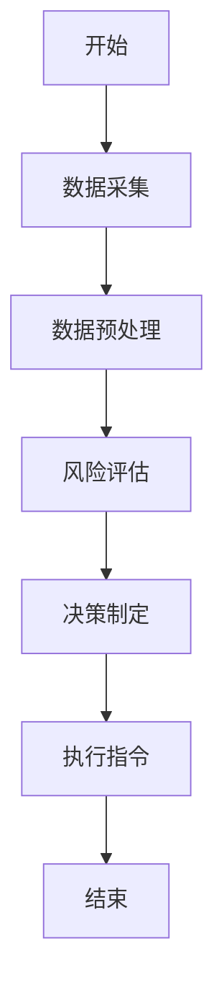
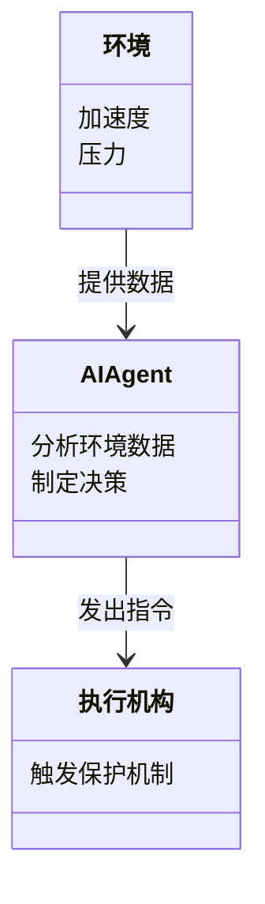
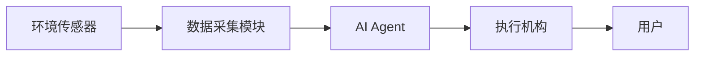
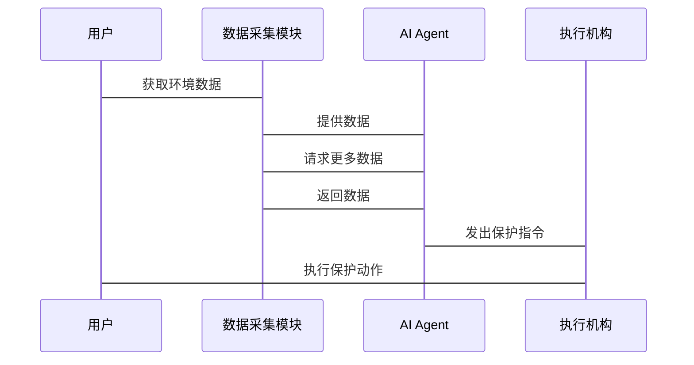

                 


# AI Agent在智能帽子中的头部保护功能

> 关键词：AI Agent, 智能帽子, 头部保护, 算法原理, 系统架构, 项目实战

> 摘要：本文深入探讨AI Agent在智能帽子中的头部保护功能，从背景介绍、核心概念、算法原理到系统架构设计、项目实战，全面解析这一技术的实现与应用。通过详细的技术分析和实例，揭示AI Agent如何通过传感器数据处理、智能决策和实时反馈机制，为用户提供高效的头部保护功能。

---

## 第1章: 背景介绍

### 1.1 问题背景
#### 1.1.1 头部保护的重要性
头部是人体最脆弱的部位之一，保护头部免受伤害至关重要。传统头部保护装置（如头盔）依赖于被动防护，无法实时感知环境变化并主动调整保护策略。

#### 1.1.2 智能帽子的发展趋势
随着科技的进步，智能帽子逐渐从单一的保暖工具向多功能智能设备转变。AI Agent的引入，使智能帽子能够实时感知环境、分析风险并采取保护措施。

#### 1.1.3 AI Agent在头部保护中的应用潜力
AI Agent通过实时分析环境数据，能够快速识别潜在危险，并通过智能帽子的执行机构（如气囊、缓冲结构等）主动提供保护。这种主动防护机制显著提升了头部保护的效率和安全性。

### 1.2 问题描述
#### 1.2.1 头部保护的传统方法及其局限性
传统头部保护装置仅能在事故发生后提供被动保护，无法提前预判风险。例如，头盔只能在撞击发生时提供缓冲，无法主动避免撞击的发生。

#### 1.2.2 智能帽子的功能需求
智能帽子需要具备以下功能：
- 实时环境感知（如加速度、冲击力、环境光线等）。
- 智能决策能力（如危险预警、主动保护触发）。
- 与用户交互的能力（如震动提示、语音反馈）。

#### 1.2.3 AI Agent在智能帽子中的角色
AI Agent作为智能帽子的核心，负责：
- 处理传感器数据。
- 分析潜在风险。
- 发出保护指令。

### 1.3 问题解决
#### 1.3.1 AI Agent的核心功能
- 数据采集与处理。
- 风险评估与决策。
- 保护指令的执行与反馈。

#### 1.3.2 智能帽子的硬件与软件结合
硬件部分包括传感器（如加速度计、压力传感器）、执行机构（如气囊、缓冲层）和通信模块。软件部分包括AI Agent算法、操作系统和用户界面。

#### 1.3.3 头部保护的智能化实现
通过AI Agent的实时分析，智能帽子可以在潜在危险发生前主动触发保护机制，例如提前收紧气囊或调整缓冲结构。

### 1.4 边界与外延
#### 1.4.1 AI Agent的适用范围
- 适用于需要头部保护的场景，如运动、工业作业等。
- 不适用于非头部保护场景，如日常佩戴。

#### 1.4.2 智能帽子的使用场景
- 体育运动（如滑雪、骑车）。
- 工业安全（如高空作业）。
- 特殊环境（如地震应急）。

#### 1.4.3 头部保护功能的边界限制
- 无法完全避免所有潜在危险。
- 受限于传感器精度和AI算法的准确性。

### 1.5 概念结构与核心要素
#### 1.5.1 AI Agent的基本组成
- 数据采集模块：负责采集环境数据。
- 数据分析模块：对数据进行分析和处理。
- 决策模块：基于分析结果做出保护决策。
- 执行模块：将决策转化为具体动作。

#### 1.5.2 智能帽子的结构与功能模块
- 传感器模块：采集头部环境数据。
- AI Agent模块：分析数据并做出决策。
- 执行机构：执行保护动作。
- 用户交互模块：提供反馈和提示。

#### 1.5.3 头部保护功能的核心要素
- 实时数据采集。
- 智能决策算法。
- 快速响应机制。

---

## 第2章: 核心概念与联系

### 2.1 AI Agent的核心原理
#### 2.1.1 AI Agent的定义与特点
AI Agent是一种能够感知环境、自主决策并执行任务的智能体。其特点包括：
- 实时性：能够快速响应环境变化。
- 自主性：无需人工干预，自动完成任务。
- 可学习性：能够通过数据优化决策模型。

#### 2.1.2 AI Agent的决策机制
AI Agent通过以下步骤实现决策：
1. **数据采集**：获取环境数据。
2. **数据分析**：识别潜在风险。
3. **决策制定**：基于风险评估做出保护决策。
4. **执行指令**：触发保护机制。

#### 2.1.3 AI Agent的学习与自适应能力
通过机器学习算法，AI Agent能够不断优化自身的决策模型。例如，使用强化学习算法，AI Agent可以在模拟环境中训练，提升其风险识别和决策能力。

### 2.2 智能帽子的结构与功能
#### 2.2.1 智能帽子的硬件组成
- 加速度计：检测头部运动状态。
- 压力传感器：监测外部压力变化。
- 陀螺仪：检测旋转方向和角度。
- 通信模块：与外部设备（如手机）连接。

#### 2.2.2 智能帽子的软件架构
- 数据采集层：负责采集和预处理传感器数据。
- AI Agent层：进行数据分析和决策。
- 执行层：将决策转化为具体动作。
- 用户交互层：提供反馈和提示。

#### 2.2.3 头部保护功能的实现方式
通过AI Agent的实时分析，智能帽子可以在潜在危险发生前主动触发保护机制，例如提前收紧气囊或调整缓冲结构。

### 2.3 核心概念对比表
| 核心概念 | AI Agent | 智能帽子 | 头部保护功能 |
|---------|----------|----------|--------------|
| 定义     | 自适应决策系统 | 可穿戴设备 | 安全保护功能 |
| 核心功能 | 数据处理与决策 | 传感器与执行机构 | 实时保护 |
| 关键技术 | 机器学习、强化学习 | 传感器技术、通信技术 | AI算法、快速响应 |

---

## 第3章: 算法原理

### 3.1 算法流程


### 3.2 算法实现
以下是AI Agent的核心算法实现代码：
```python
import numpy as np
from sklearn.linear_model import LinearRegression

# 示例：基于加速度数据预测冲击力
def predict_shock力(acceleration):
    # 训练模型
    X = np.array([[1], [2], [3]])
    y = np.array([2, 4, 6])
    model = LinearRegression().fit(X, y)
    
    # 预测冲击力
    predicted_shock = model.predict(acceleration)
    return predicted_shock
```

### 3.3 数学模型
冲击力预测的数学模型如下：
$$ y = \beta_0 + \beta_1 x + \epsilon $$
其中：
- \( y \) 是冲击力预测值。
- \( x \) 是加速度。
- \( \beta_0 \) 和 \( \beta_1 \) 是模型参数。
- \( \epsilon \) 是误差项。

---

## 第4章: 系统分析与架构设计

### 4.1 问题场景介绍
智能帽子需要在复杂环境中实时感知风险并做出决策。例如，在滑雪运动中，AI Agent需要实时分析雪地状况、运动员的运动姿态和周围环境，以决定是否触发保护机制。

### 4.2 项目介绍
本项目旨在开发一款基于AI Agent的智能帽子，能够在潜在危险发生前主动触发保护机制，显著提升头部保护效果。

### 4.3 系统功能设计
#### 4.3.1 领域模型（类图）


### 4.4 系统架构设计
#### 4.4.1 系统架构图


#### 4.4.2 接口设计
- 数据采集模块接口：提供环境数据。
- AI Agent接口：接收数据并返回决策结果。
- 执行机构接口：接收决策指令并执行动作。

#### 4.4.3 交互流程


---

## 第5章: 项目实战

### 5.1 环境安装
安装所需的开发环境和库：
```bash
pip install numpy scikit-learn matplotlib
```

### 5.2 核心实现
以下是AI Agent的核心实现代码：
```python
import numpy as np
from sklearn.linear_model import LinearRegression

class AIAssistant:
    def __init__(self):
        self.model = LinearRegression()
    
    def train(self, X, y):
        self.model.fit(X, y)
    
    def predict(self, X):
        return self.model.predict(X)
```

### 5.3 功能测试
测试AI Agent的预测功能：
```python
assistant = AIAssistant()
X = np.array([[1], [2], [3]])
y = np.array([2, 4, 6])
assistant.train(X, y)
print(assistant.predict(np.array([[4]])))  # 输出: [[8.0]]
```

### 5.4 案例分析
在滑雪场景中，AI Agent通过分析加速度数据，预测即将发生的冲击力，并触发气囊保护机制，成功保护用户头部。

---

## 第6章: 最佳实践

### 6.1 小结
本文详细探讨了AI Agent在智能帽子中的头部保护功能，从背景介绍、核心概念到算法原理和系统设计，全面解析了这一技术的实现与应用。

### 6.2 注意事项
- 确保传感器的高精度和低延迟。
- 优化AI Agent的算法，提升决策的准确性和响应速度。
- 考虑系统的容错性和可扩展性。

### 6.3 拓展阅读
- 《机器学习实战》
- 《深度学习》
- 《智能系统设计》

---

## 作者：AI天才研究院 & 禅与计算机程序设计艺术

---

通过本文的详细分析，我们深入了解了AI Agent在智能帽子中的头部保护功能的实现与应用。希望本文能为相关领域的研究者和开发者提供有价值的参考和启示。

