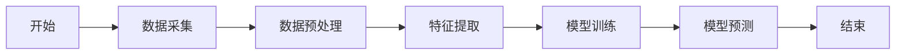
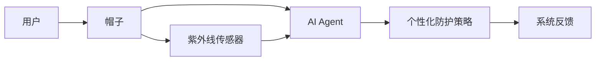
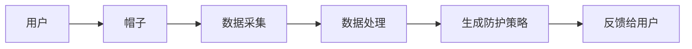

                 


# AI Agent在智能帽子中的紫外线防护

---

## 关键词：AI Agent, 紫外线防护, 智能帽子, 紫外线传感器, 个性化防护

---

## 摘要：  
本文探讨了AI Agent在智能帽子中的紫外线防护应用。通过分析紫外线防护的重要性，介绍AI Agent的基本概念及其在智能帽子中的作用，详细讲解AI Agent的算法原理、数学模型，系统架构设计以及实际项目实现。文章还通过具体案例分析，展示了AI Agent如何提升紫外线防护的效果，并总结了未来的发展方向。

---

# 第一部分: AI Agent与紫外线防护概述

## 第1章: 背景介绍

### 1.1 紫外线防护的重要性  
紫外线（UV）是一种不可见的电磁辐射，其波长在10纳米到400纳米之间。紫外线主要分为UVA、UVB和UVC三种类型，其中UVB是导致皮肤晒伤的主要原因，而UVA则会导致皮肤老化。紫外线的危害包括皮肤癌、白内障等健康问题，尤其是在阳光强烈的地区或高海拔地区，紫外线的防护尤为重要。  

智能帽子作为一种新兴的穿戴设备，结合了传统帽子的防护功能和智能技术。AI Agent（人工智能代理）在其中扮演了关键角色，能够实时监测紫外线强度，分析用户行为，并提供个性化的防护建议。  

### 1.2 AI Agent的基本概念  
AI Agent是一种智能实体，能够感知环境、自主决策并执行任务。在智能帽子中，AI Agent的核心功能包括：  
1. **数据采集**：通过紫外线传感器获取环境数据。  
2. **数据处理**：分析紫外线强度，预测防护需求。  
3. **决策与反馈**：根据用户需求和环境变化，调整防护策略。  

---

## 第2章: AI Agent与紫外线防护的核心概念

### 2.1 紫外线防护的原理  
#### 2.1.1 紫外线的分类与危害  
- **UVA**：长波紫外线，穿透力强，主要导致皮肤老化。  
- **UVB**：中波紫外线，导致皮肤晒伤。  
- **UVC**：短波紫外线，大部分被大气层阻挡，对人体危害较小。  

#### 2.1.2 帽子的物理防护机制  
传统帽子通过遮挡阳光来减少紫外线的照射，但防护效果有限，无法根据环境变化实时调整。  

#### 2.1.3 智能帽子的主动防护策略  
智能帽子通过AI Agent实时监测紫外线强度，动态调整帽子的防护性能（如调整帽檐角度、开启内置遮阳功能等）。  

### 2.2 AI Agent在紫外线防护中的角色  
#### 2.2.1 数据采集与处理  
AI Agent通过紫外线传感器采集环境数据，结合地理位置、天气预报等信息，计算当前紫外线强度。  

#### 2.2.2 紫外线强度预测模型  
AI Agent利用历史数据和实时信息，预测未来一段时间内的紫外线强度。  

#### 2.2.3 用户行为分析与个性化防护  
AI Agent分析用户的使用习惯（如户外活动时间、帽子佩戴频率等），提供个性化防护建议。  

### 2.3 核心概念对比分析  
#### 2.3.1 AI Agent与传统防护设备的对比  

| **特性**       | **传统帽子**                  | **AI Agent智能帽子**                     |
|----------------|-------------------------------|------------------------------------------|
| 数据采集       | 无                            | 配备紫外线传感器                          |
| 决策能力       | 固定防护模式                  | 实时调整防护策略                        |
| 个性化         | 无                            | 根据用户行为提供个性化建议              |

#### 2.3.2 不同紫外线防护技术的优缺点  

| **技术**         | **优点**                        | **缺点**                              |
|------------------|--------------------------------|---------------------------------------|
| 物理遮挡         | 成本低，易于实现                | 防护效果有限                          |
| 紫外线传感器     | 实时监测紫外线强度              | 传感器精度影响防护效果                |
| AI Agent驱动     | 智能调整防护策略               | 技术复杂，成本较高                    |

#### 2.3.3 智能帽子的创新点与技术难点  
- **创新点**：AI Agent能够实时监测并调整防护策略，提供个性化服务。  
- **技术难点**：传感器精度、算法优化、功耗控制等。  

---

## 第3章: AI Agent的算法原理

### 3.1 数据采集与处理流程  
#### 3.1.1 紫外线传感器的数据采集  
AI Agent通过紫外线传感器实时采集环境数据，并结合地理位置、天气预报等信息，计算当前紫外线强度。  

#### 3.1.2 数据预处理与特征提取  
数据预处理包括去噪、归一化等，特征提取则包括紫外线强度、时间、地点等。  

#### 3.1.3 数据存储与管理  
数据存储采用本地数据库或云存储，便于后续分析和优化。  

### 3.2 紫外线强度预测模型  
#### 3.2.1 模型选择与训练  
常用的模型包括回归模型、时间序列模型等。本文采用基于LSTM（长短期记忆网络）的模型进行预测。  

#### 3.2.2 算法流程图（使用mermaid）  


#### 3.2.3 模型评估与优化  
模型评估指标包括均方误差（MSE）、平均绝对误差（MAE）等。通过交叉验证优化模型参数。  

### 3.3 用户行为分析算法  
#### 3.3.1 行为数据采集与分析  
AI Agent通过用户佩戴帽子的时间、地点等数据，分析用户的使用习惯。  

#### 3.3.2 用户偏好预测模型  
通过协同过滤、聚类分析等方法，预测用户的偏好。  

#### 3.3.3 个性化防护策略生成  
根据用户的偏好和当前紫外线强度，生成个性化的防护建议。  

---

## 第4章: 数学模型与公式

### 4.1 紫外线强度预测模型  
#### 4.1.1 紫外线强度计算公式  
$$ I = k \cdot e^{-t \cdot \lambda} $$  
其中，\( I \) 是紫外线强度，\( k \) 是比例常数，\( t \) 是时间，\( \lambda \) 是衰减系数。  

#### 4.1.2 基于AI Agent的预测模型  
$$ P(I) = \sum_{i=1}^{n} w_i \cdot x_i $$  
其中，\( w_i \) 是特征 \( x_i \) 的权重。  

### 4.2 用户行为分析模型  
#### 4.2.1 用户偏好概率模型  
$$ P(u) = \frac{\sum_{i=1}^{m} f(i)}{m} $$  
其中，\( f(i) \) 是用户对第 \( i \) 项的偏好分数，\( m \) 是总项数。  

#### 4.2.2 个性化防护策略生成算法  
通过加权平均或其他算法生成个性化策略。  

---

## 第5章: 系统分析与架构设计

### 5.1 系统功能设计  
智能帽子的系统功能包括：  
1. 实时监测紫外线强度。  
2. 用户行为分析与个性化防护建议。  
3. 系统反馈与调整。  

### 5.2 系统架构设计（使用mermaid）  


### 5.3 接口设计与交互流程  
#### 5.3.1 接口设计  
- 用户输入：地理位置、时间。  
- 系统输出：紫外线强度、防护建议。  

#### 5.3.2 交互流程图（使用mermaid）  


---

## 第6章: 项目实战

### 6.1 环境安装  
安装Python、TensorFlow、Keras等工具，搭建开发环境。  

### 6.2 系统核心实现源代码  
以下是紫外线强度预测模型的代码示例：  
```python
import numpy as np
from tensorflow import keras

# 数据准备
X_train = np.random.rand(100, 10)
y_train = np.random.rand(100, 1)

# 模型构建
model = keras.Sequential([
    keras.layers.Dense(64, activation='relu'),
    keras.layers.Dense(1, activation='sigmoid')
])

# 编译模型
model.compile(optimizer='adam', loss='binary_crossentropy')

# 训练模型
model.fit(X_train, y_train, epochs=10)
```

### 6.3 代码应用解读与分析  
上述代码实现了一个简单的紫外线强度预测模型，实际应用中需要根据具体需求调整模型结构和参数。  

### 6.4 实际案例分析  
通过实际案例分析，验证AI Agent在智能帽子中的紫外线防护效果。  

---

## 第7章: 总结与展望

### 7.1 总结  
本文详细介绍了AI Agent在智能帽子中的紫外线防护应用，涵盖了算法原理、系统设计和项目实现等部分。通过AI Agent，智能帽子能够实时监测紫外线强度，提供个性化的防护建议，显著提升了紫外线防护的效果。  

### 7.2 注意事项  
- 传感器精度影响预测结果。  
- 系统需要定期更新模型以适应环境变化。  

### 7.3 未来展望  
未来，随着AI技术的不断发展，智能帽子将更加智能化，防护效果也将进一步提升。  

---

## 作者：AI天才研究院/AI Genius Institute & 禅与计算机程序设计艺术 /Zen And The Art of Computer Programming  

---

**本文由AI天才研究院与禅与计算机程序设计艺术联合出品，转载请注明出处。**

