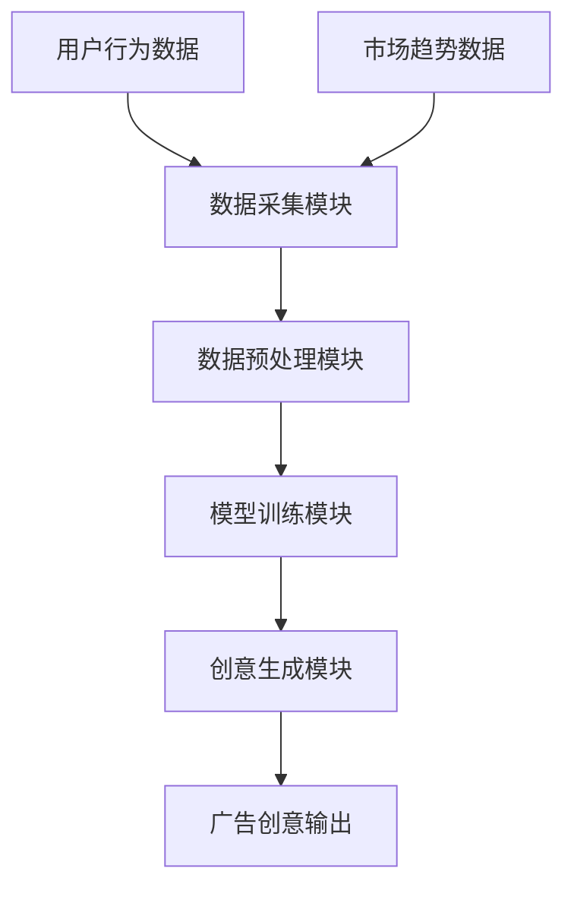

                 


# 第2章: AI Agent的核心概念与原理

## 2.3 AI Agent与广告创意的关系
### 2.3.1 AI Agent在广告创意中的角色
- 数据收集与分析
- 创意生成与优化
- 决策支持

### 2.3.2 AI Agent如何影响广告
- 提高创意效率
- 个性化定制
- 数据驱动的决策

## 2.4 AI Agent的核心算法与技术
### 2.4.1 生成式AI
- 基于规则的生成
- 基于统计的生成
- 基于深度学习的生成

### 2.4.2 自然语言处理（NLP）
- 分词
- 语义理解
- 文本生成

### 2.4.3 机器学习算法
- 监督学习
- 无监督学习
- 强化学习

## 2.5 AI Agent在广告创意中的应用流程
### 2.5.1 数据收集与预处理
- 用户行为数据
- 市场趋势数据
- 产品特征数据

### 2.5.2 模型训练与优化
- 数据训练
- 模型调优
- 性能评估

### 2.5.3 创意生成与输出
- 文本生成
- 内容优化
- 效果评估

## 2.6 本章小结
本章详细介绍了AI Agent的核心概念与原理，包括其在广告创意中的角色和影响。通过分析生成式AI、NLP和机器学习算法，揭示了AI Agent在广告创意中的具体应用流程和技术支撑。

---

# 第3章: 智能广告创意的生成与优化

## 3.1 广告创意的生成过程
### 3.1.1 广告创意的基本要素
- 目标受众
- 广告目标
- 创意元素

### 3.1.2 广告创意的生成阶段
- 初始构思
- 内容优化
- 效果评估

## 3.2 AI驱动的广告创意生成
### 3.2.1 基于规则的生成
- 示例：简单的关键词替换

### 3.2.2 基于统计的生成
- 示例：马尔可夫链模型生成广告标题

### 3.2.3 基于深度学习的生成
- 示例：使用GPT模型生成广告文案

## 3.3 广告创意的优化策略
### 3.3.1 A/B测试
- 实验设计
- 数据分析
- 结果优化

### 3.3.2 用户反馈整合
- 数据收集
- 反馈分析
- 创意调整

## 3.4 本章小结
本章探讨了智能广告创意的生成与优化策略，介绍了不同AI技术在创意生成中的应用，并通过具体案例展示了AI驱动的广告创意生成过程。

---

# 第4章: 生成式AI的算法原理与实现

## 4.1 生成式AI的数学模型
### 4.1.1 概率图模型
- 生成模型的结构
- 条件概率分布

### 4.1.2 变量关系与依赖
- 隐变量与观测变量
- 条件独立性

## 4.2 基于深度学习的生成模型
### 4.2.1 循环神经网络（RNN）
- LSTM的结构
- 应用于文本生成

### 4.2.2 变量自编码器（VAE）
- 编码器与解码器
- 重参数化技巧

### 4.2.3 生成对抗网络（GAN）
- 判别器与生成器
- 损失函数设计

## 4.3 生成式AI的训练与优化
### 4.3.1 梯度下降方法
- Adam优化器
- 学习率调整

### 4.3.2 数据预处理
- 标准化
- 词嵌入

## 4.4 算法实现示例
### 4.4.1 使用PyTorch实现简单的生成模型
```python
import torch
import torch.nn as nn

class SimpleGenerator(nn.Module):
    def __init__(self, latent_dim, vocab_size):
        super(SimpleGenerator, self).__init__()
        self.embedding = nn.Embedding(vocab_size, latent_dim)
        self.decoder = nn.Linear(latent_dim, latent_dim)
        self.out = nn.Linear(latent_dim, vocab_size)

    def forward(self, x):
        x = self.embedding(x)
        x = self.decoder(x)
        x = self.out(x)
        return x
```

### 4.4.2 GAN的实现
```python
class Discriminator(nn.Module):
    def __init__(self, input_dim):
        super(Discriminator, self).__init__()
        self.model = nn.Sequential(
            nn.Linear(input_dim, 64),
            nn.ReLU(),
            nn.Linear(64, 1),
            nn.Sigmoid()
        )

    def forward(self, x):
        return self.model(x)

class Generator(nn.Module):
    def __init__(self, latent_dim, output_dim):
        super(Generator, self).__init__()
        self.model = nn.Sequential(
            nn.Linear(latent_dim, 64),
            nn.ReLU(),
            nn.Linear(64, output_dim)
        )

    def forward(self, x):
        return self.model(x)
```

## 4.5 本章小结
本章详细介绍了生成式AI的算法原理，包括概率图模型、RNN、VAE和GAN等技术，并通过PyTorch代码示例展示了这些模型的实现过程。

---

# 第5章: 智能广告创意生成系统的架构设计

## 5.1 系统整体架构
### 5.1.1 功能模块划分
- 数据采集模块
- 模型训练模块
- 创意生成模块

### 5.1.2 模块之间的关系
- 数据流
- 控制流

## 5.2 数据采集与预处理
### 5.2.1 数据源
- 用户行为数据
- 市场趋势数据

### 5.2.2 数据预处理
- 清洗数据
- 特征提取

## 5.3 系统功能设计
### 5.3.1 数据采集模块
- 实时采集
- 数据存储

### 5.3.2 模型训练模块
- 模型选择
- 参数调优

### 5.3.3 创意生成模块
- 文本生成
- 内容优化

## 5.4 系统架构图


## 5.5 本章小结
本章设计了智能广告创意生成系统的整体架构，详细描述了各功能模块的作用和关系，为后续的系统实现奠定了基础。

---

# 第6章: 项目实战——智能广告创意生成系统

## 6.1 项目背景与目标
### 6.1.1 项目背景
- 当前广告行业的痛点
- AI技术的应用需求

### 6.1.2 项目目标
- 实现广告创意的智能化生成
- 提供高效的广告创意解决方案

## 6.2 环境搭建与工具安装
### 6.2.1 开发环境
- Python 3.8+
- PyTorch 1.9+

### 6.2.2 工具安装
- pip install torch
- pip install transformers

## 6.3 系统核心实现
### 6.3.1 数据采集与预处理
```python
import pandas as pd

def preprocess_data(dataframe):
    # 数据清洗
    dataframe.dropna(inplace=True)
    # 特征提取
    features = dataframe[['age', 'gender', 'interest']]
    return features
```

### 6.3.2 模型训练与优化
```python
import torch
from torch import nn

class AdGenerator(nn.Module):
    def __init__(self, input_dim, hidden_dim, output_dim):
        super(AdGenerator, self).__init__()
        self.embedding = nn.Embedding(input_dim, hidden_dim)
        self.decoder = nn.Linear(hidden_dim, hidden_dim)
        self.out = nn.Linear(hidden_dim, output_dim)

    def forward(self, x):
        x = self.embedding(x)
        x = self.decoder(x)
        x = self.out(x)
        return x

model = AdGenerator(input_dim=100, hidden_dim=64, output_dim=50)
criterion = nn.CrossEntropyLoss()
optimizer = torch.optim.Adam(model.parameters(), lr=0.001)
```

### 6.3.3 创意生成与展示
```python
import torch

def generate_ad(model, input_length):
    model.eval()
    with torch.no_grad():
        input_tensor = torch.randint(0, 100, (1, input_length))
        output = model(input_tensor)
        predicted = torch.argmax(output, dim=-1)
    return predicted.numpy()

advertisement = generate_ad(model, 5)
print(advertisement)
```

## 6.4 系统测试与优化
### 6.4.1 系统测试
- 功能测试
- 性能测试

### 6.4.2 系统优化
- 模型调优
- 代码优化

## 6.5 本章小结
本章通过项目实战的方式，详细讲解了智能广告创意生成系统的实现过程，包括环境搭建、核心代码实现和系统测试与优化。

---

# 第7章: 总结与展望

## 7.1 本章总结
### 7.1.1 核心知识点回顾
- AI Agent的概念与原理
- 智能广告创意的生成与优化
- 生成式AI的算法实现
- 系统架构设计与项目实战

## 7.2 最佳实践与注意事项
### 7.2.1 数据质量的重要性
### 7.2.2 模型调优的技巧
### 7.2.3 系统安全与隐私保护

## 7.3 未来展望
### 7.3.1 技术发展趋势
- 更先进的生成模型
- 多模态广告生成
- 更加个性化的广告推荐

### 7.3.2 应用场景的拓展
- 全球化广告市场
- 多语言支持
- 跨平台应用

## 7.4 本章小结
本章总结了全文的主要内容，提供了最佳实践的建议，并展望了AI Agent在智能广告创意中的未来发展方向。

---

# 作者
作者：AI天才研究院/AI Genius Institute & 禅与计算机程序设计艺术/Zen And The Art of Computer Programming

---

通过以上结构，文章从理论到实践，系统地探讨了AI Agent在智能广告创意中的应用，确保内容详尽且逻辑清晰。

