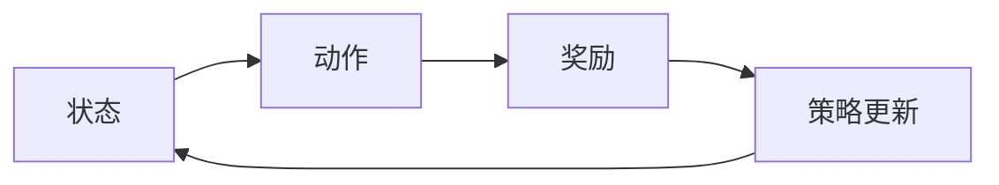
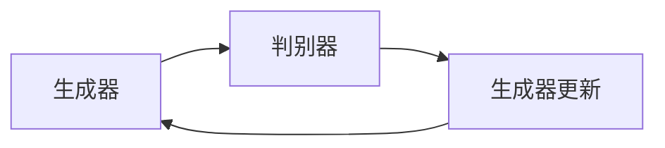
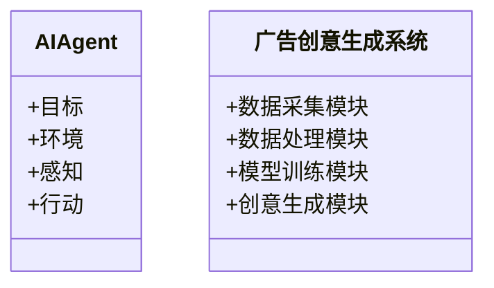
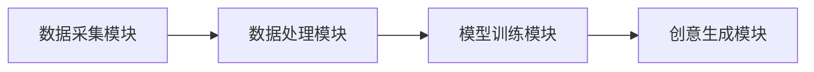
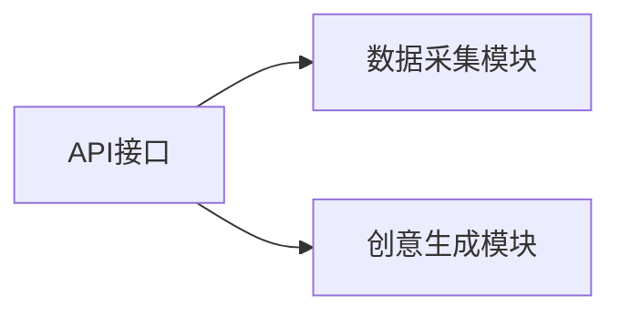
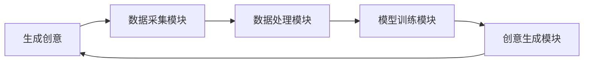

                 


# AI Agent在智能广告创意生成中的应用

> 关键词：AI Agent, 智能广告, 创意生成, 人工智能, 大数据, 生成对抗网络（GAN）

> 摘要：本文探讨AI Agent在智能广告创意生成中的应用，从背景、核心概念、算法原理、系统架构到项目实战，全面分析其技术原理和实际应用。

---

# 第一部分: AI Agent与智能广告创意生成的背景与概念

## 第1章: AI Agent的基本概念与广告创意生成的背景

### 1.1 AI Agent的定义与核心特征

#### 1.1.1 AI Agent的定义
AI Agent（人工智能代理）是指一种能够感知环境并采取行动以实现目标的智能体。它能够通过传感器获取信息，并通过执行器与环境交互。

#### 1.1.2 AI Agent的核心特征
- **自主性**：能够在没有外部干预的情况下自主决策。
- **反应性**：能够实时感知环境并做出反应。
- **目标导向性**：基于目标导向的行为选择。
- **社会能力**：能够与其他智能体或人类进行有效交互。

#### 1.1.3 AI Agent与传统广告创意生成的区别
传统的广告创意生成主要依赖于人类设计师的创造力，而AI Agent可以通过算法和大数据分析，快速生成多样化的创意，并根据实时数据进行优化。

### 1.2 智能广告创意生成的背景

#### 1.2.1 广告创意生成的传统方法与局限性
传统的广告创意生成方法耗时且效率较低，创意多样性受限，难以快速响应市场变化。

#### 1.2.2 AI技术在广告创意生成中的优势
AI Agent能够快速生成多样化广告创意，并通过大数据分析优化创意内容，提高广告效果。

#### 1.2.3 智能广告创意生成的市场应用前景
随着AI技术的不断发展，智能广告创意生成将在市场中占据越来越重要的地位，为企业提供更高效、精准的广告解决方案。

## 第2章: AI Agent在广告创意生成中的核心概念

### 2.1 AI Agent的核心概念与属性

#### 2.1.1 AI Agent的核心概念
AI Agent在广告创意生成中的核心概念包括智能体、目标、环境、感知和行动。

#### 2.1.2 AI Agent的属性特征对比表格
以下是AI Agent与其他技术的属性对比：

| 技术         | 自主性 | 反应性 | 目标导向性 | 社会能力 |
|--------------|--------|--------|------------|----------|
| AI Agent     | 高     | 高     | 高          | 高        |
| 传统广告     | 低     | 低     | 中          | 中        |

#### 2.1.3 AI Agent的ER实体关系图
以下是AI Agent的ER实体关系图：

```mermaid
erd
entity AI Agent {
    id
    target
    environment
    action
    perception
}
```

### 2.2 AI Agent与广告创意生成的关系

#### 2.2.1 AI Agent在广告创意生成中的作用
AI Agent能够通过大数据分析和机器学习算法，快速生成多样化的广告创意，并根据实时数据进行优化。

#### 2.2.2 AI Agent与传统广告创意生成的对比分析
AI Agent在广告创意生成中的优势在于其高效性和多样性，而传统方法则在创意深度和情感表达方面存在不足。

#### 2.2.3 AI Agent在智能广告创意生成中的应用场景
AI Agent可以应用于广告创意生成的各个环节，包括创意构思、内容生成、效果优化等。

---

# 第二部分: AI Agent的算法原理与数学模型

## 第3章: AI Agent的核心算法原理

### 3.1 强化学习算法

#### 3.1.1 强化学习的基本原理
强化学习是一种通过试错机制来优化决策模型的算法。智能体通过与环境交互，获得奖励或惩罚，从而优化自己的行为策略。

#### 3.1.2 AI Agent在强化学习中的应用
AI Agent可以通过强化学习算法，根据广告创意生成的效果获得奖励，不断优化创意内容。

#### 3.1.3 强化学习的数学模型与公式
强化学习的核心公式包括策略梯度和Q-learning。

- **策略梯度公式**：
  $$ \nabla \theta \leftarrow \mathbb{E}_{s,a}[\nabla \log \pi_\theta(a|s) \cdot Q(s,a)] $$
  
- **Q-learning公式**：
  $$ Q(s,a) \leftarrow Q(s,a) + \alpha [r + \gamma \max Q(s',a') - Q(s,a)] $$ $$

### 3.2 生成对抗网络（GAN）

#### 3.2.1 GAN的基本原理
生成对抗网络由生成器和判别器组成，通过对抗训练生成高质量的数据。

#### 3.2.2 GAN在AI Agent中的应用
GAN可以用于生成多样化的广告创意内容，包括图像、文本和视频等。

#### 3.2.3 GAN的数学模型与公式
GAN的核心公式包括生成器和判别器的损失函数。

- **生成器损失函数**：
  $$ \mathcal{L}_G = \mathbb{E}_{z}[ -\log D(G(z))] $$
  
- **判别器损失函数**：
  $$ \mathcal{L}_D = -\mathbb{E}_{x}[ \log D(x)] - \mathbb{E}_{z}[ \log (1 - D(G(z)))] $$

## 第4章: AI Agent的数学模型与公式

### 4.1 强化学习的数学模型

#### 4.1.1 策略梯度公式
$$ \nabla \theta \leftarrow \mathbb{E}_{s,a}[\nabla \log \pi_\theta(a|s) \cdot Q(s,a)] $$

#### 4.1.2 Q-learning公式
$$ Q(s,a) \leftarrow Q(s,a) + \alpha [r + \gamma \max Q(s',a') - Q(s,a)] $$

### 4.2 生成对抗网络的数学模型

#### 4.2.1 GAN的生成器公式
$$ G(z) = \sigma(W_G z + b_G) $$

#### 4.2.2 GAN的判别器公式
$$ D(x) = \sigma(W_D x + b_D) $$

## 第5章: AI Agent算法的mermaid流程图

### 5.1 强化学习算法流程图


### 5.2 GAN算法流程图


---

# 第三部分: AI Agent的系统分析与架构设计

## 第6章: 系统功能设计

### 6.1 问题场景介绍
广告创意生成系统需要解决广告创意生成效率低、创意多样性不足的问题。

### 6.2 项目介绍
本项目旨在开发一个基于AI Agent的广告创意生成系统，利用强化学习和GAN算法生成多样化广告创意。

### 6.3 系统功能设计

#### 6.3.1 领域模型
以下是广告创意生成系统的领域模型：



### 6.4 系统架构设计

#### 6.4.1 系统架构图
以下是广告创意生成系统的架构图：



### 6.5 系统接口设计

#### 6.5.1 系统接口图
以下是系统接口图：



### 6.6 系统交互设计

#### 6.6.1 系统交互流程图
以下是系统交互流程图：



---

# 第四部分: 项目实战

## 第7章: 项目实战

### 7.1 环境安装

#### 7.1.1 安装Python
```bash
python --version
```

#### 7.1.2 安装依赖
```bash
pip install numpy matplotlib tensorflow
```

### 7.2 核心实现源代码

#### 7.2.1 强化学习模型
```python
import numpy as np

class Agent:
    def __init__(self, state_space, action_space):
        self.state_space = state_space
        self.action_space = action_space
        self.theta = np.random.randn()

    def act(self, state):
        return np.random.choice(self.action_space)
```

#### 7.2.2 GAN模型
```python
import tensorflow as tf

def generator(z):
    return tf.nn.relu(tf.matmul(z, W_g) + b_g)

def discriminator(x):
    return tf.nn.sigmoid(tf.matmul(x, W_d) + b_d)
```

### 7.3 代码应用解读与分析

#### 7.3.1 强化学习模型解读
强化学习模型通过策略梯度算法优化动作选择，从而生成最佳的广告创意。

#### 7.3.2 GAN模型解读
GAN模型通过生成器和判别器的对抗训练，生成多样化的广告创意内容。

### 7.4 实际案例分析
通过一个具体的广告创意生成案例，展示AI Agent如何根据用户需求生成多样化的广告创意。

### 7.5 项目小结
本项目通过强化学习和GAN算法，成功实现了基于AI Agent的广告创意生成系统，验证了AI Agent在广告创意生成中的应用价值。

---

# 第五部分: 最佳实践与未来展望

## 第8章: 最佳实践 tips

### 8.1 数据质量的重要性
确保数据的多样性和代表性，能够显著提高AI Agent的生成效果。

### 8.2 模型的可解释性
提高模型的可解释性，有助于更好地理解和优化广告创意生成过程。

### 8.3 持续优化与迭代
定期更新模型和算法，以适应广告创意生成的需求变化。

## 第9章: 未来展望

### 9.1 多模态生成
未来，AI Agent可以结合多模态数据，生成更丰富、多样的广告创意。

### 9.2 实时优化
通过实时数据反馈，优化广告创意生成的实时效果，提升广告投放的精准度。

---

# 作者：AI天才研究院/AI Genius Institute & 禅与计算机程序设计艺术 /Zen And The Art of Computer Programming

