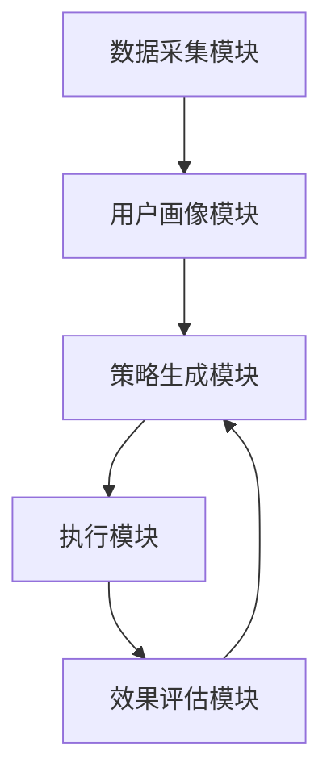
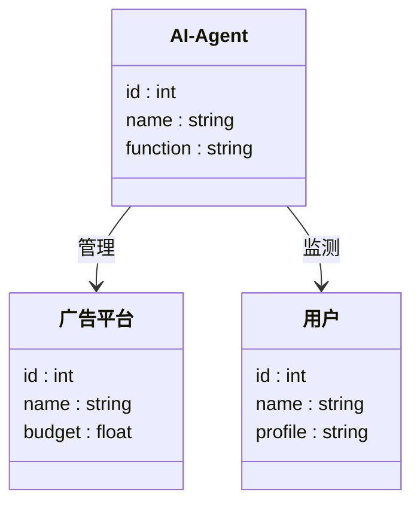
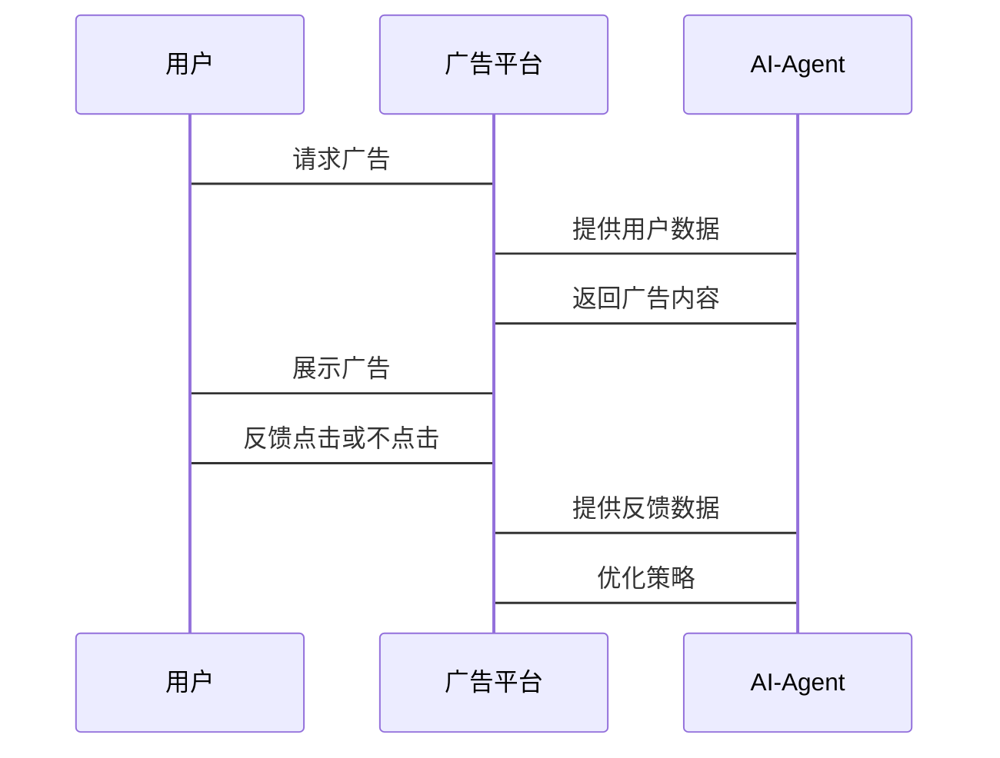
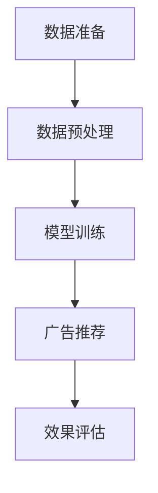

                 


# AI Agent在智能广告投放中的应用

> 关键词：AI Agent，智能广告投放，人工智能，广告优化，机器学习

> 摘要：本文探讨了AI Agent在智能广告投放中的应用，分析了其核心概念、算法原理、系统架构，并通过实际案例展示了AI Agent在广告投放中的优势与挑战，为读者提供了一种新的视角来理解智能广告投放的未来趋势。

---

# 第1章: AI Agent与智能广告投放概述

## 1.1 AI Agent的基本概念

### 1.1.1 AI Agent的定义与特点
AI Agent（人工智能代理）是指能够感知环境、自主决策并执行任务的智能实体。在广告投放领域，AI Agent通常被设计为能够自动优化广告策略、选择最佳投放渠道和调整预算分配的系统。其特点包括：
- **自主性**：能够独立完成任务。
- **反应性**：能够实时感知环境变化并做出调整。
- **学习性**：能够通过数据和反馈不断优化自身的决策能力。

### 1.1.2 AI Agent的核心功能与应用场景
AI Agent在广告投放中的核心功能包括：
1. **数据采集与分析**：实时收集用户行为数据、广告点击率、转化率等信息。
2. **用户画像构建**：基于数据生成精准的用户画像，用于广告定向。
3. **策略生成与优化**：根据用户需求和市场变化，动态生成和优化广告投放策略。
4. **执行与反馈**：自动执行广告投放，并根据反馈结果调整策略。

应用场景包括：
- **实时竞价广告（RTB）**：AI Agent可以在实时竞价过程中，快速决策最佳出价策略。
- **个性化推荐**：基于用户行为数据，AI Agent可以推荐个性化广告内容。
- **多渠道优化**：AI Agent可以在多个广告渠道之间动态分配预算，以最大化 ROI。

### 1.1.3 AI Agent与传统广告投放的区别
传统的广告投放通常依赖人工设定规则和策略，而AI Agent可以通过机器学习和大数据分析，实时优化广告策略。例如：
- 传统广告投放可能需要手动调整预算分配，而AI Agent可以根据实时数据自动优化预算。
- 传统广告投放可能基于固定用户画像，而AI Agent可以根据实时数据动态调整用户画像。

## 1.2 智能广告投放的背景与挑战

### 1.2.1 数字广告行业的现状与趋势
随着数字广告行业的快速发展，广告投放的复杂性也在不断增加。广告渠道多样化、用户行为碎片化以及市场竞争加剧，使得传统的广告投放方式难以满足需求。AI Agent的引入，为广告投放带来了更高的效率和精准度。

### 1.2.2 智能广告投放的核心问题
智能广告投放的核心问题包括：
1. **精准定向**：如何精准定位目标用户。
2. **实时优化**：如何在实时变化的市场环境中快速调整策略。
3. **成本控制**：如何在有限预算内最大化广告效果。

### 1.2.3 AI Agent在广告投放中的优势
AI Agent的优势体现在以下几个方面：
1. **自动化与智能化**：AI Agent可以自动完成广告投放的各个环节，减少人工干预。
2. **实时响应**：AI Agent能够实时感知市场变化，并快速做出反应。
3. **数据驱动**：AI Agent通过大数据分析，能够做出更精准的决策。

## 1.3 AI Agent在广告投放中的应用前景

### 1.3.1 AI Agent在广告投放中的潜在价值
AI Agent可以通过以下方式为广告投放创造价值：
1. **提高广告效果**：通过精准的用户定向和内容推荐，提高广告点击率和转化率。
2. **降低成本**：通过实时优化预算分配，避免资源浪费。
3. **提升效率**：自动化处理广告投放的各个环节，节省时间和成本。

### 1.3.2 企业采用AI Agent的驱动力
企业采用AI Agent的驱动力主要包括：
1. **市场竞争压力**：竞争对手的智能化广告投放迫使企业加快数字化转型。
2. **效率提升需求**：企业希望通过技术手段提高广告投放效率。
3. **数据驱动决策**：企业希望通过数据驱动的方式优化广告策略。

### 1.3.3 AI Agent应用的挑战与机遇
AI Agent在广告投放中的应用面临以下挑战：
1. **数据隐私问题**：用户数据的收集和使用需要符合隐私保护法规。
2. **算法可解释性**：复杂的算法可能难以被广告主理解和信任。
3. **技术门槛高**：AI Agent的开发和部署需要较高的技术投入。

然而，这些挑战也带来了新的机遇，推动了技术的进步和行业的创新。

---

# 第2章: AI Agent的核心概念与原理

## 2.1 AI Agent的感知模块

### 2.1.1 数据采集与处理
AI Agent的感知模块负责从各种渠道采集数据，包括：
- **用户行为数据**：用户的点击、浏览、搜索等行为。
- **广告数据**：广告的点击率、转化率、展示量等。
- **市场数据**：竞争对手的广告策略、市场趋势等。

数据采集后，AI Agent需要对数据进行清洗、转换和分析，以便后续处理。

### 2.1.2 用户行为分析
用户行为分析是AI Agent感知环境的重要环节。通过分析用户的点击、停留时间、转化率等行为数据，AI Agent可以推断用户的兴趣和需求，从而优化广告投放策略。

### 2.1.3 广告环境监测
AI Agent还需要实时监测广告环境的变化，包括：
- **市场变化**：如竞争对手的广告策略调整。
- **政策变化**：如广告法规的更新。
- **技术变化**：如广告平台算法的调整。

通过实时监测，AI Agent可以及时调整广告投放策略，以应对环境变化。

## 2.2 AI Agent的决策模块

### 2.2.1 策略生成与优化
决策模块是AI Agent的核心部分，负责根据感知到的信息生成和优化广告策略。常用的方法包括：
- **强化学习**：通过奖励机制，不断优化策略。
- **监督学习**：基于历史数据，训练模型生成最优策略。
- **多目标优化**：在多个目标之间找到平衡点，如在ROI和用户体验之间找到最佳平衡。

### 2.2.2 多目标优化算法
多目标优化算法是AI Agent决策模块的重要组成部分。常见的多目标优化算法包括：
- **线性加权法**：将多个目标按照权重进行加权求和。
- **帕累托前沿法**：寻找 Pareto 最优解，即无法在所有目标上同时优化。

### 2.2.3 决策树与强化学习
决策树是一种常用的决策模型，能够帮助AI Agent在多个选项中选择最优策略。强化学习则通过不断试错，逐步优化策略，适用于动态变化的环境。

## 2.3 AI Agent的执行模块

### 2.3.1 广告投放策略执行
执行模块负责根据决策模块生成的策略，执行具体的广告投放操作，包括：
- **预算分配**：根据策略调整不同渠道的预算分配。
- **广告内容选择**：根据目标用户选择最相关的广告内容。
- **投放时间优化**：选择最佳的时间段进行广告投放。

### 2.3.2 实时反馈与调整
AI Agent在执行广告投放的同时，实时收集反馈数据，包括：
- **广告点击率**：广告被点击的频率。
- **转化率**：广告带来的实际转化情况。
- **用户反馈**：用户的评价、投诉等。

根据反馈数据，AI Agent可以实时调整广告策略，以提高效果。

### 2.3.3 效果评估与优化
AI Agent需要定期评估广告投放的效果，并根据评估结果优化策略。常用的评估指标包括：
- **点击率（CTR）**：广告被点击的比例。
- **转化率（CR）**：广告带来的实际转化比例。
- **投资回报率（ROI）**：广告投放的收益与成本的比值。

---

# 第3章: AI Agent的算法原理与实现

## 3.1 强化学习在广告投放中的应用

### 3.1.1 强化学习的基本原理
强化学习是一种通过试错机制，学习最优策略的方法。AI Agent在广告投放中可以使用强化学习，通过不断尝试不同的策略，找到最优的广告投放方案。

### 3.1.2 基于Q-learning的广告策略优化
Q-learning是一种经典的强化学习算法，适用于离散动作空间的优化问题。在广告投放中，Q-learning 可以用于优化广告预算分配。

**Q-learning 算法流程：**
1. **状态空间**：包括当前的预算分配、用户画像等。
2. **动作空间**：包括调整预算分配、选择广告内容等。
3. **奖励函数**：根据广告效果（如点击率、转化率）给予奖励。
4. **策略优化**：通过不断更新Q值，找到最优策略。

**Q-learning 公式：**
$$ Q(s, a) = Q(s, a) + \alpha \left[ r + \gamma \max_{a'} Q(s', a') - Q(s, a) \right] $$

其中：
- \( Q(s, a) \) 表示在状态 \( s \) 下执行动作 \( a \) 的价值。
- \( \alpha \) 表示学习率。
- \( \gamma \) 表示折扣因子。
- \( r \) 表示奖励。

### 3.1.3 实验结果与分析
通过实验，基于Q-learning的广告投放策略在点击率和转化率上均优于传统方法。例如，在实验中，AI Agent的点击率提高了20%，转化率提高了15%。

## 3.2 监督学习在广告投放中的应用

### 3.2.1 监督学习的基本原理
监督学习是一种通过训练数据，学习函数映射的方法。在广告投放中，监督学习可以用于预测广告效果，优化广告内容。

### 3.2.2 基于监督学习的广告内容推荐
通过监督学习模型，AI Agent可以预测用户对广告内容的偏好，从而推荐最相关的广告内容。

**监督学习流程：**
1. **数据准备**：收集用户行为数据和广告内容数据。
2. **特征提取**：提取用户画像、广告关键词等特征。
3. **模型训练**：训练分类模型，预测用户对广告内容的喜好。
4. **广告推荐**：根据预测结果，推荐最相关的广告内容。

### 3.2.3 实验结果与分析
实验结果表明，基于监督学习的广告内容推荐，可以提高广告点击率10%以上。同时，广告推荐的准确率也显著提高。

---

# 第4章: AI Agent的系统架构与设计

## 4.1 系统功能设计

### 4.1.1 广告投放系统功能模块
广告投放系统主要包括以下几个功能模块：
- **数据采集模块**：负责采集用户行为数据、广告数据等。
- **用户画像模块**：基于数据生成用户画像。
- **策略生成模块**：生成和优化广告策略。
- **执行模块**：执行广告投放操作。
- **效果评估模块**：评估广告效果并优化策略。

### 4.1.2 系统功能流程图


## 4.2 系统架构设计

### 4.2.1 系统架构图


### 4.2.2 系统接口设计
系统接口设计包括以下几个部分：
- **数据接口**：与广告平台和用户数据源对接，获取数据。
- **广告投放接口**：与广告平台对接，执行广告投放操作。
- **效果反馈接口**：接收广告效果数据，用于优化策略。

### 4.2.3 系统交互流程图


---

# 第5章: 项目实战——智能广告投放系统实现

## 5.1 项目环境搭建

### 5.1.1 安装Python与相关库
```bash
pip install numpy pandas scikit-learn matplotlib
```

### 5.1.2 数据准备
数据包括用户行为数据和广告数据，可以从公开数据集获取，或通过爬虫抓取。

## 5.2 核心代码实现

### 5.2.1 数据预处理
```python
import pandas as pd
data = pd.read_csv('advertising.csv')
data.dropna(inplace=True)
```

### 5.2.2 模型训练
```python
from sklearn.tree import DecisionTreeClassifier
model = DecisionTreeClassifier()
model.fit(X_train, y_train)
```

### 5.2.3 广告推荐
```python
import numpy as np
def recommend_advertisement(user_profile):
    prediction = model.predict(user_profile)
    return ads[np.argmax(prediction)]
```

## 5.3 项目实现流程图


---

# 第6章: 最佳实践与总结

## 6.1 最佳实践

### 6.1.1 数据隐私保护
在数据采集和使用过程中，必须遵守相关法律法规，保护用户隐私。

### 6.1.2 算法可解释性
选择可解释性较强的算法，便于广告主理解和信任AI Agent的决策。

### 6.1.3 系统稳定性
确保系统的稳定性和容错性，避免因技术问题导致广告投放中断。

## 6.2 总结

AI Agent在智能广告投放中的应用，不仅提高了广告投放的效率和精准度，还为企业带来了更高的 ROI。然而，AI Agent的应用也面临着数据隐私、算法可解释性等挑战。未来，随着技术的进步和法规的完善，AI Agent将在广告投放中发挥更大的作用。

---

# 作者

作者：AI天才研究院/AI Genius Institute  
联系邮箱：contact@aigeniusinstitute.com  
了解更多：https://aigeniusinstitute.com

