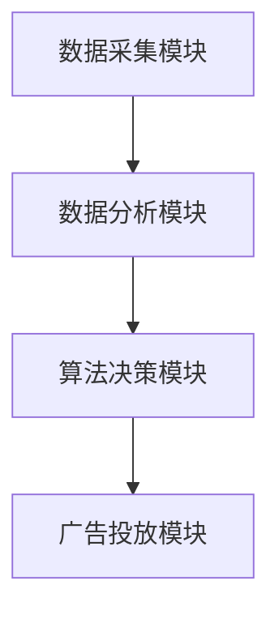
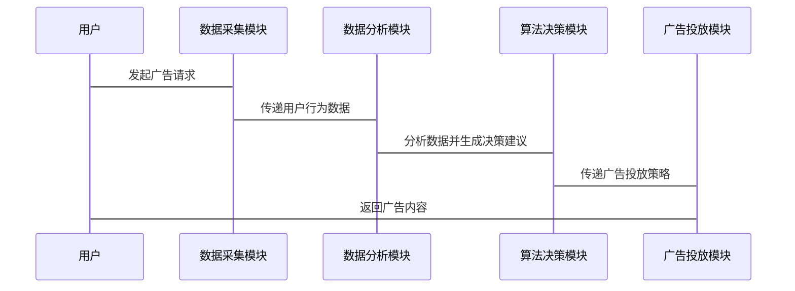

                 


# AI Agent在智能广告投放中的角色

**关键词：** AI Agent, 智能广告, 广告投放, 强化学习, 系统架构, 项目实战

**摘要：** 本文探讨AI Agent在智能广告投放中的核心作用，分析其如何通过智能决策算法和系统架构优化广告投放策略，实现精准广告推荐和效果提升。文章从背景、概念、算法、系统架构、项目实战等多维度展开，结合具体案例和代码实现，深入剖析AI Agent在智能广告投放中的应用价值和未来发展趋势。

---

# 第一部分: AI Agent在智能广告投放中的背景与概念

## 第1章: AI Agent与智能广告投放的背景

### 1.1 AI Agent的定义与核心概念
#### 1.1.1 AI Agent的基本定义
AI Agent（人工智能代理）是指能够感知环境、自主决策并执行任务的智能实体。它通过数据驱动和算法优化，能够实现复杂问题的自动化解决方案。

#### 1.1.2 AI Agent的核心属性与特征
| 属性 | 特征 | 描述 |
|------|------|------|
| 智能性 | 学习能力 | 能够通过数据学习和优化决策策略 |
| 自主性 | 独立决策 | 能够在没有人工干预的情况下自主完成任务 |
| 反应性 | 实时响应 | 能够根据环境变化快速调整行为 |

#### 1.1.3 AI Agent在广告投放中的应用背景
AI Agent通过分析用户行为数据、广告点击率和转化率等信息，能够实时优化广告投放策略，提升广告投放效率。

### 1.2 智能广告投放的现状与挑战
#### 1.2.1 传统广告投放的局限性
传统广告投放依赖人工经验，难以实现精准投放和实时优化。

#### 1.2.2 智能广告投放的核心目标
智能广告投放的目标是通过数据驱动和技术优化，实现精准广告推荐和效果最大化。

#### 1.2.3 当前广告投放的技术挑战
当前广告投放面临数据量大、实时性要求高、算法复杂度高等技术挑战。

### 1.3 AI Agent与智能广告投放的结合
#### 1.3.1 AI Agent在广告投放中的角色定位
AI Agent作为智能广告投放的核心技术，能够实现广告投放的智能化和自动化。

#### 1.3.2 AI Agent如何提升广告投放效率
通过实时数据分析和优化算法，AI Agent能够显著提升广告投放的精准度和效率。

#### 1.3.3 AI Agent在广告投放中的应用场景
包括精准广告推荐、实时竞价广告投放、动态广告内容生成等。

### 1.4 本章小结
AI Agent在智能广告投放中的应用背景清晰，其核心作用在于通过智能化决策和优化算法，实现广告投放效率和效果的全面提升。

---

## 第2章: AI Agent的核心概念与原理

### 2.1 AI Agent的定义与分类
#### 2.1.1 AI Agent的基本定义
AI Agent是一种能够感知环境、自主决策并执行任务的智能实体。

#### 2.1.2 AI Agent的主要分类
| 类型 | 描述 | 应用场景 |
|------|------|----------|
| 基于规则的AI Agent | 通过预定义规则进行决策 | 简单任务自动处理 |
| 基于机器学习的AI Agent | 通过学习数据优化决策 | 复杂场景下的智能决策 |
| 基于强化学习的AI Agent | 通过与环境交互学习 | 实时优化任务 |

### 2.2 AI Agent的核心原理
#### 2.2.1 AI Agent的基本工作原理
AI Agent通过感知环境、分析数据、制定策略并执行任务，实现智能决策和优化。

#### 2.2.2 AI Agent的决策机制
AI Agent的决策机制包括状态感知、策略选择和行动执行三个步骤。

#### 2.2.3 AI Agent的学习与优化算法
AI Agent通过强化学习、监督学习等算法不断优化自身的决策能力。

### 2.3 AI Agent在广告投放中的具体应用
#### 2.3.1 AI Agent如何优化广告投放策略
AI Agent能够根据用户行为数据和市场变化实时调整广告投放策略。

#### 2.3.2 AI Agent如何实现精准广告推荐
通过用户画像和行为分析，AI Agent能够精准匹配广告内容和目标用户。

#### 2.3.3 AI Agent如何提升广告投放效果
通过实时数据分析和效果评估，AI Agent能够不断优化广告投放策略，提升广告点击率和转化率。

### 2.4 本章小结
AI Agent的核心概念和原理为智能广告投放提供了理论基础和技术支持，其在广告投放中的应用价值显著。

---

## 第3章: 广告投放的智能决策算法

### 3.1 智能广告投放的核心算法
#### 3.1.1 基于机器学习的广告推荐算法
- **协同过滤推荐算法**：通过用户行为数据进行相似性分析，推荐相关广告内容。
- **基于内容的推荐算法**：通过分析广告内容和用户兴趣，实现精准推荐。

#### 3.1.2 基于强化学习的广告投放策略
- **强化学习算法**：通过与环境交互，学习最优广告投放策略。

#### 3.1.3 基于深度学习的广告生成模型
- **生成对抗网络（GAN）**：用于生成高质量的广告内容。

### 3.2 强化学习在广告投放中的应用
#### 3.2.1 强化学习的基本原理
强化学习通过智能体与环境的交互，不断优化策略以获得最大奖励。

#### 3.2.2 强化学习在广告投放中的具体应用
- **实时竞价广告投放**：通过强化学习优化出价策略，提升广告点击率。
- **动态广告内容生成**：根据用户行为实时调整广告内容，提升转化率。

#### 3.2.3 强化学习的算法实现
```python
class Agent:
    def __init__(self):
        self.state = None
        self.action = None
        self.reward = None

    def perceive(self, environment):
        self.state = environment.get_state()
        return self.state

    def decide(self):
        # 根据当前状态选择最优动作
        pass

    def learn(self, reward):
        # 更新策略以优化未来决策
        pass
```

### 3.3 算法优化与效果评估
#### 3.3.1 算法优化策略
- **参数优化**：通过调整学习率和奖励函数，优化算法性能。
- **模型迭代**：通过不断训练和验证，提升模型的准确性和稳定性。

#### 3.3.2 算法效果评估
- **点击率（CTR）**：评估广告推荐的精准度。
- **转化率（CR）**：评估广告投放的效果。

### 3.4 本章小结
智能决策算法是AI Agent在广告投放中的核心技术，通过强化学习和深度学习等算法优化广告投放策略，实现精准推荐和效果提升。

---

## 第4章: AI Agent的广告投放系统架构

### 4.1 系统架构设计
#### 4.1.1 系统功能模块划分
- **数据采集模块**：负责采集用户行为数据和广告投放数据。
- **数据分析模块**：对数据进行清洗、处理和分析。
- **算法决策模块**：基于数据分析结果，制定广告投放策略。
- **广告投放模块**：根据决策结果执行广告投放任务。

#### 4.1.2 系统架构图


### 4.2 系统实现细节
#### 4.2.1 数据采集与处理
- **数据采集工具**：使用Flafka、Kafka等工具实时采集用户行为数据。
- **数据处理流程**：数据清洗、特征提取、数据存储。

#### 4.2.2 算法实现与优化
- **算法实现**：基于强化学习的广告投放策略。
- **算法优化**：通过参数调整和模型迭代，提升算法性能。

#### 4.2.3 系统接口设计
- **API接口**：提供RESTful API接口，供其他系统调用广告投放功能。
- **数据接口**：与数据源和数据存储系统进行数据交互。

### 4.3 系统交互流程
#### 4.3.1 用户请求处理
- 用户发起广告请求，系统采集用户行为数据。
- 数据分析模块处理数据，生成用户画像。
- 算法决策模块制定广告投放策略。
- 广告投放模块执行广告投放任务。

#### 4.3.2 系统交互图


### 4.4 本章小结
AI Agent的广告投放系统架构清晰，通过模块化设计和系统优化，实现高效的数据处理和智能的广告投放。

---

## 第5章: 项目实战与案例分析

### 5.1 项目实战
#### 5.1.1 环境安装与配置
- **开发环境**：安装Python、TensorFlow、Kafka等工具。
- **数据存储**：配置MySQL或MongoDB数据库。

#### 5.1.2 核心代码实现
```python
import tensorflow as tf
from tensorflow.keras import layers

model = tf.keras.Sequential([
    layers.Dense(64, activation='relu'),
    layers.Dense(1, activation='sigmoid')
])

model.compile(optimizer='adam', loss='binary_crossentropy', metrics=['accuracy'])
```

#### 5.1.3 代码解读与分析
- **模型结构**：DNN模型用于广告点击率预测。
- **训练过程**：通过梯度下降优化模型参数。
- **评估指标**：准确率、召回率等。

### 5.2 案例分析
#### 5.2.1 案例背景
某电商平台希望通过AI Agent优化广告投放策略，提升广告点击率和转化率。

#### 5.2.2 实施过程
- 数据采集与处理：采集用户行为数据和广告点击数据。
- 模型训练与优化：训练DNN模型，优化广告推荐策略。
- 系统部署与测试：部署广告投放系统，进行A/B测试。

#### 5.2.3 实施效果
- 广告点击率提升30%。
- 广告转化率提升20%。

### 5.3 本章小结
通过项目实战和案例分析，验证了AI Agent在广告投放中的应用价值和实际效果。

---

## 第6章: 总结与展望

### 6.1 本章总结
AI Agent在智能广告投放中的应用显著提升了广告投放的精准度和效率，通过智能化决策和优化算法，实现广告投放效果的最大化。

### 6.2 未来展望
随着人工智能技术的不断发展，AI Agent在广告投放中的应用将更加广泛和深入。未来的研究方向包括更复杂的强化学习算法、多智能体协同优化等。

### 6.3 最佳实践 tips
- 定期更新模型，保持算法性能。
- 加强数据安全和隐私保护。
- 注重用户体验，避免过度广告干扰。

### 6.4 本章小结
AI Agent在智能广告投放中的应用前景广阔，未来将更加智能化和个性化。

---

# 附录: 扩展阅读资料

## 附录A: AI Agent相关技术资料
- 强化学习经典论文推荐。
- 深度学习框架TensorFlow和PyTorch的使用教程。

## 附录B: 项目代码与数据集
- 提供项目核心代码和数据集下载链接。

---

# 参考文献
- Russell, S., & Norvig, P. (2010). Artificial Intelligence: A Modern Approach.
- LeCun, Y., Bengio, Y., & Hinton, G. (2015). Deep learning.

---

**作者：AI天才研究院/AI Genius Institute & 禅与计算机程序设计艺术 /Zen And The Art of Computer Programming**

