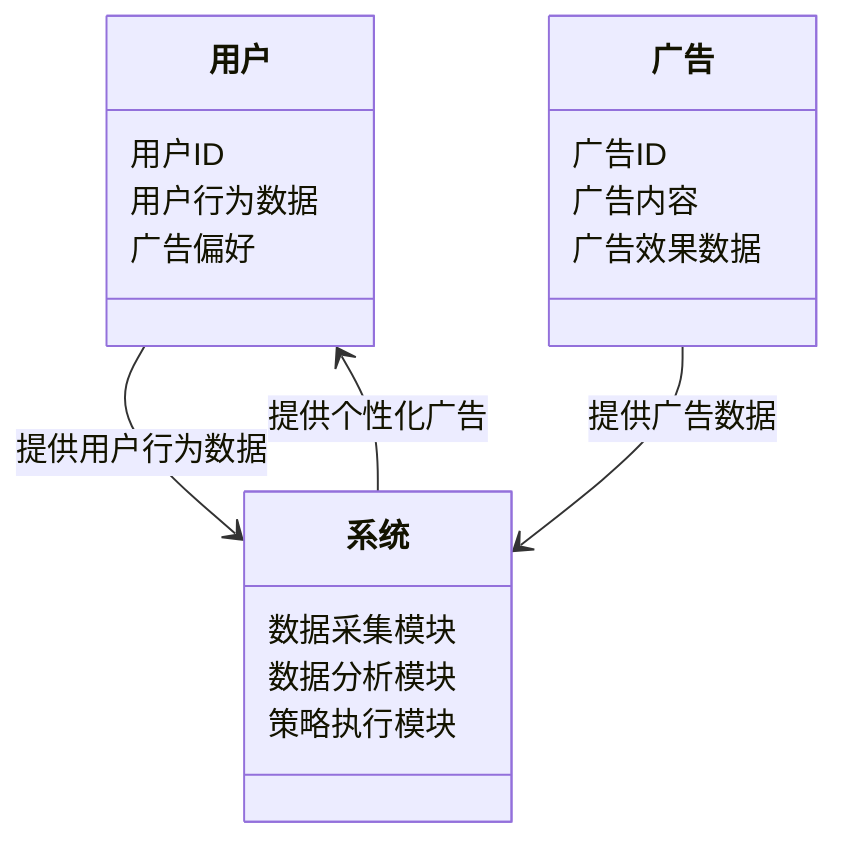
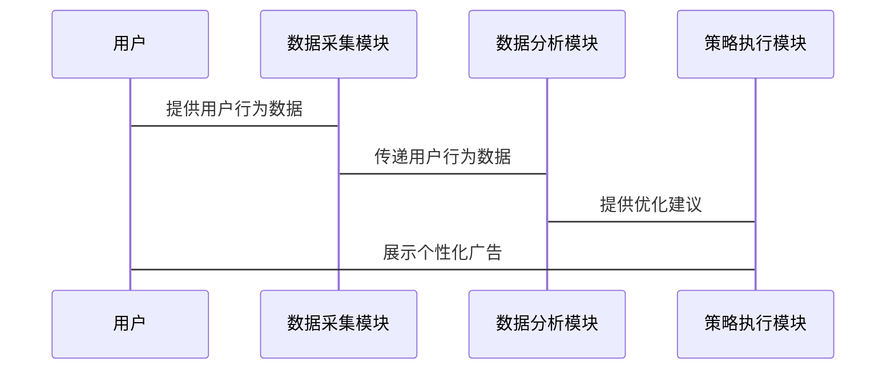

                 


# AI Agent在智能广告投放优化中的应用

## 关键词：AI Agent, 广告投放优化, 强化学习, 算法原理, 系统架构设计

## 摘要：  
本文探讨了AI Agent在智能广告投放优化中的应用，从背景、核心概念到算法原理、系统设计，再到项目实战和最佳实践，全面解析AI Agent如何通过数据驱动和智能决策优化广告投放效果，提升广告投放效率。

---

# 第1章: AI Agent与智能广告投放概述

## 1.1 AI Agent的基本概念

### 1.1.1 什么是AI Agent
AI Agent（人工智能代理）是指能够感知环境、自主决策并执行任务的智能体。它通过数据输入、模型推理和决策输出，帮助用户实现特定目标。

### 1.1.2 AI Agent的核心特征
- **自主性**：能够自主决策和行动。
- **反应性**：能够实时感知环境变化并调整策略。
- **学习能力**：通过数据和反馈不断优化自身模型。

### 1.1.3 AI Agent与传统广告投放的区别
- **传统广告投放**：基于规则和人工经验进行广告选择和投放。
- **AI Agent广告投放**：基于数据和机器学习算法进行自动化决策和优化。

## 1.2 智能广告投放的现状与挑战

### 1.2.1 广告投放的传统模式
- **人工决策**：依赖广告投放人员的经验进行广告选择。
- **投放效果受限**：难以应对复杂多变的市场环境。

### 1.2.2 当前广告投放的主要问题
- **数据利用不足**：无法充分挖掘用户行为数据进行精准投放。
- **效率低下**：人工操作耗时，难以快速响应市场变化。
- **精准度不足**：传统投放方式难以实现个性化广告推荐。

### 1.2.3 智能广告投放的必要性
- **提升广告效果**：通过AI技术实现精准投放和动态优化。
- **提高投放效率**：自动化操作降低人工成本，提升投放速度。

## 1.3 AI Agent在广告投放中的应用背景

### 1.3.1 数据驱动的广告优化
通过收集和分析用户行为数据，AI Agent能够实时调整广告策略，优化广告效果。

### 1.3.2 AI Agent在广告投放中的优势
- **精准决策**：基于数据和模型进行精准广告选择和优化。
- **动态调整**：根据实时数据反馈快速调整广告策略。
- **高效执行**：自动化操作提升广告投放效率。

### 1.3.3 未来广告投放的趋势
- **智能化**：AI Agent将成为广告投放的核心技术。
- **个性化**：广告内容将更加个性化，满足用户需求。
- **实时化**：广告投放将更加注重实时反馈和动态调整。

## 1.4 本章小结
本章介绍了AI Agent的基本概念和广告投放的传统模式，分析了当前广告投放的主要问题，并提出了AI Agent在广告投放中的应用背景及其优势。

---

# 第2章: AI Agent的核心原理

## 2.1 AI Agent的基本原理

### 2.1.1 AI Agent的决策机制
AI Agent通过感知环境、分析数据、制定策略和执行行动来实现广告优化。其决策机制包括数据输入、模型推理和策略输出三个步骤。

### 2.1.2 基于强化学习的AI Agent
强化学习是一种通过试错机制来优化决策的方法。AI Agent通过与环境互动，不断调整策略以最大化目标函数（如广告点击率或转化率）。

### 2.1.3 AI Agent的自我优化能力
AI Agent能够通过反馈机制不断优化自身模型，提升广告投放效果。例如，通过A/B测试优化广告文案和投放策略。

## 2.2 广告投放优化的核心要素

### 2.2.1 用户行为分析
AI Agent通过分析用户点击、浏览、购买等行为数据，精准识别用户需求和偏好。

### 2.2.2 广告效果评估
广告效果评估包括点击率（CTR）、转化率、展示量等指标。AI Agent通过这些指标评估广告投放效果，并进行动态优化。

### 2.2.3 广告预算分配
AI Agent能够根据广告效果预测和预算约束，优化广告预算分配，最大化广告投放收益。

## 2.3 AI Agent与广告优化的结合

### 2.3.1 AI Agent在广告投放中的角色
AI Agent可以作为广告投放的决策者，实时调整广告文案、投放位置和预算分配。

### 2.3.2 AI Agent如何优化广告策略
通过分析用户行为数据和广告效果数据，AI Agent能够识别最优广告策略，并进行实时调整。

### 2.3.3 AI Agent的实时决策能力
AI Agent能够根据实时数据反馈快速调整广告策略，例如根据用户实时行为动态调整广告内容和投放位置。

## 2.4 本章小结
本章详细介绍了AI Agent的核心原理，包括其决策机制和自我优化能力，并探讨了AI Agent在广告投放中的角色及其优化广告策略的能力。

---

# 第3章: AI Agent的算法原理

## 3.1 基于强化学习的AI Agent算法

### 3.1.1 强化学习的基本概念
强化学习是一种机器学习方法，通过试错机制优化决策。AI Agent通过与环境互动，学习最优策略。

### 3.1.2 AI Agent的Q-learning算法
Q-learning是一种经典的强化学习算法，通过更新Q值表来优化决策。Q值表记录了在每个状态下采取每个动作的期望奖励。

### 3.1.3 算法的优化与改进
为了提高Q-learning的效率，可以采用经验回放和目标网络等方法，减少探索-利用矛盾，提高学习效率。

### 3.1.4 算法的实现步骤
1. 初始化Q值表。
2. 与环境互动，获取状态和奖励。
3. 更新Q值表。
4. 重复步骤2和3，直到收敛。

### 3.1.5 算法的优化策略
- **经验回放**：将经验存储在回放缓冲区，随机抽取进行训练，减少样本偏差。
- **目标网络**：使用两个网络，主网络负责决策，目标网络负责更新，减少权重更新的剧烈波动。

### 3.1.6 算法的性能评估
通过训练过程中的奖励变化曲线评估算法性能，收敛速度和最终收益是评估算法优劣的重要指标。

## 3.2 广告投放优化的数学模型

### 3.2.1 广告效果的评估指标
广告效果的评估指标包括点击率（CTR）、转化率、展示量、点击率等。

### 3.2.2 广告预算分配的数学模型
广告预算分配可以通过优化问题建模，目标是最小化成本或最大化收益。例如，优化目标函数可以表示为：

$$
\min_{x} \sum_{i=1}^{n} c_i x_i \quad \text{subject to} \quad \sum_{i=1}^{n} r_i x_i \geq R
$$

其中，$c_i$是广告$i$的成本，$r_i$是广告$i$的收益，$R$是目标总收益，$x_i$是广告$i$的投放预算。

### 3.2.3 基于A/B测试的优化模型
A/B测试是一种常用的广告优化方法，通过对比不同广告策略的效果，选择最优策略。例如，可以将用户分为两组，一组展示广告A，另一组展示广告B，通过统计分析确定哪个广告效果更好。

## 3.3 算法的实现与优化

### 3.3.1 算法的实现步骤
1. 数据预处理：清洗和特征工程。
2. 模型训练：使用强化学习算法训练AI Agent。
3. 策略评估：通过A/B测试评估广告策略效果。
4. 策略优化：根据评估结果优化广告策略。

### 3.3.2 算法的优化策略
- **数据增强**：通过数据增强技术扩展训练数据，提高模型泛化能力。
- **模型融合**：结合多个模型的优势，提升广告投放效果。
- **实时反馈机制**：根据实时数据快速调整广告策略，提高投放效率。

### 3.3.3 算法的性能评估
通过训练过程中的奖励变化曲线评估算法性能，收敛速度和最终收益是评估算法优劣的重要指标。

## 3.4 本章小结
本章详细介绍了基于强化学习的AI Agent算法，包括Q-learning算法的实现步骤和优化策略，并探讨了广告投放优化的数学模型和优化策略。

---

# 第4章: AI Agent的系统分析与架构设计

## 4.1 系统分析

### 4.1.1 广告投放优化系统介绍
广告投放优化系统是一个基于AI Agent的智能广告投放平台，通过数据驱动和智能决策优化广告投放效果。

### 4.1.2 系统的功能需求
- 数据采集：收集用户行为数据和广告投放数据。
- 数据分析：分析用户行为和广告效果，生成优化建议。
- 策略执行：根据优化建议自动调整广告策略，实现智能投放。

### 4.1.3 系统的约束条件
- 数据隐私：确保用户数据隐私和安全。
- 计算资源：系统需要足够的计算资源支持实时处理和优化。

## 4.2 系统架构设计

### 4.2.1 领域模型设计
领域模型是系统的核心逻辑模型，描述了系统的功能和交互关系。通过Mermaid类图可以清晰地展示领域模型中的类及其关系。



### 4.2.2 系统架构设计
系统架构设计是系统实现的基础，需要考虑系统的可扩展性、可维护性和高性能。通过Mermaid架构图可以清晰地展示系统的各个模块及其关系。


### 4.2.3 系统接口设计
系统接口设计是系统与其他模块交互的桥梁。通过Mermaid序列图可以展示系统与外部模块的交互过程。



## 4.3 本章小结
本章详细介绍了广告投放优化系统的功能需求和系统架构设计，展示了领域模型和系统架构图，明确了系统的各个模块及其关系。

---

# 第5章: AI Agent在广告投放优化中的项目实战

## 5.1 环境安装与配置

### 5.1.1 系统环境
- 操作系统：Linux/Windows/MacOS
- Python版本：3.6+

### 5.1.2 工具安装
- Python库：numpy, pandas, scikit-learn, tensorflow
- 开发环境：Jupyter Notebook, VS Code

### 5.1.3 数据准备
需要收集用户行为数据和广告效果数据，数据格式可以是CSV或JSON。

## 5.2 系统核心功能实现

### 5.2.1 数据预处理
- 数据清洗：去除无效数据，处理缺失值。
- 特征工程：提取用户行为特征和广告特征，例如用户点击率、广告点击率等。

```python
import pandas as pd
import numpy as np

# 数据加载
data = pd.read_csv('ad_data.csv')

# 数据清洗
data.dropna(inplace=True)

# 特征工程
data['click_rate'] = data['clicks'] / data['impressions']
```

### 5.2.2 模型训练
- 训练AI Agent模型，使用强化学习算法优化广告策略。

```python
import tensorflow as tf
from tensorflow.keras import layers

# 模型定义
model = tf.keras.Sequential([
    layers.Dense(64, activation='relu'),
    layers.Dense(1, activation='sigmoid')
])

# 模型编译
model.compile(optimizer='adam', loss='binary_crossentropy', metrics=['accuracy'])

# 模型训练
model.fit(X_train, y_train, epochs=10, batch_size=32)
```

### 5.2.3 策略优化
- 根据模型预测结果优化广告策略，例如调整广告投放位置和预算分配。

### 5.2.4 系统实现
实现广告投放优化系统，包括数据采集、数据分析和策略执行模块。

## 5.3 项目实战案例分析

### 5.3.1 案例背景
假设我们有一个广告投放平台，需要优化广告点击率和转化率。

### 5.3.2 数据分析
通过分析用户行为数据，识别高价值用户群体，优化广告投放策略。

### 5.3.3 策略优化
基于AI Agent模型预测结果，优化广告文案和投放位置，提升广告效果。

### 5.3.4 实验结果
通过A/B测试对比优化前后的广告效果，验证AI Agent的优化能力。

## 5.4 本章小结
本章通过项目实战展示了AI Agent在广告投放优化中的具体应用，详细介绍了系统的实现过程和优化策略。

---

# 第6章: AI Agent广告投放优化的最佳实践

## 6.1 最佳实践

### 6.1.1 数据质量管理
确保数据的准确性和完整性，是AI Agent优化广告策略的基础。

### 6.1.2 模型选择与优化
选择合适的模型，并通过调参和优化提升模型性能。

### 6.1.3 系统监控与维护
实时监控系统运行状态，及时发现和解决系统故障。

## 6.2 小结

### 6.2.1 项目总结
总结项目实施过程中的经验和教训，为后续优化提供参考。

### 6.2.2 技术展望
展望AI Agent在广告投放优化中的未来发展方向，例如更复杂的强化学习算法和更高效的计算框架。

## 6.3 注意事项

### 6.3.1 数据隐私保护
确保用户数据的隐私和安全，遵守相关法律法规。

### 6.3.2 系统性能优化
通过技术手段优化系统性能，提升广告投放效率。

### 6.3.3 模型解释性
提升AI Agent模型的解释性，方便广告投放人员理解和调整策略。

## 6.4 拓展阅读

### 6.4.1 强化学习经典论文
推荐阅读强化学习领域的经典论文，深入了解强化学习的理论基础。

### 6.4.2 AI Agent在其他领域的应用
探索AI Agent在其他领域的应用，如金融投资、游戏AI等，拓宽知识面。

## 6.5 本章小结
本章总结了AI Agent广告投放优化的最佳实践，提供了数据质量管理、模型选择与优化等实用建议，并展望了未来的发展方向。

---

# 作者：AI天才研究院/AI Genius Institute & 禅与计算机程序设计艺术 /Zen And The Art of Computer Programming

