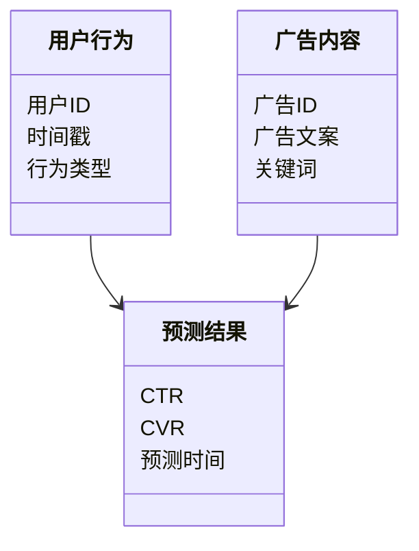
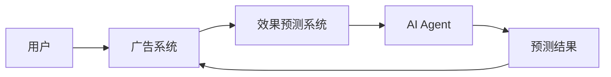
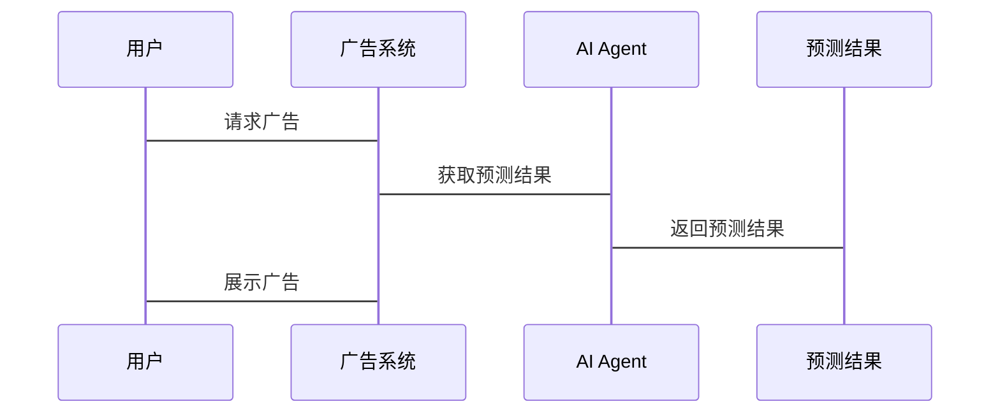

                 


# AI Agent在智能广告效果预测中的应用

> 关键词：AI Agent, 智能广告, 广告效果预测, 机器学习, 数据分析

> 摘要：本文详细探讨了AI Agent在智能广告效果预测中的应用，从核心概念、算法原理到系统架构、项目实战，结合实际案例分析，深入剖析了AI Agent在广告效果预测中的技术细节和实际应用。文章内容涵盖AI Agent的背景介绍、核心概念与联系、常用算法及其应用、系统分析与架构设计、项目实战、最佳实践与小结，旨在为读者提供全面的技术解读和实践指导。

---

## 第一部分：背景介绍

### 第1章：问题背景与核心概念

#### 1.1 问题背景

在当今数字营销时代，广告效果预测已成为企业提升广告投放效率和 ROI（投资回报率）的核心任务。传统的广告效果预测方法依赖于简单的统计分析和规则引擎，存在预测精度低、实时性差、难以应对复杂场景等问题。随着人工智能技术的快速发展，AI Agent（人工智能代理）作为一种能够实时感知、决策和优化的智能体，为广告效果预测提供了新的解决方案。

#### 1.2 核心概念与要素

##### 1.2.1 AI Agent的定义
AI Agent是一种能够感知环境、自主决策并执行任务的智能系统，具备以下核心特征：
- **自主性**：无需外部干预，自主完成任务。
- **反应性**：能够实时感知环境变化并做出响应。
- **目标导向**：基于目标优化决策。

##### 1.2.2 广告效果预测的定义
广告效果预测是通过分析用户行为、广告特征和历史数据，预测广告在未来一段时间内的表现（如点击率、转化率等），从而优化广告投放策略。

##### 1.2.3 核心要素
- **用户行为数据**：用户的点击、浏览、购买等行为数据。
- **广告内容特征**：广告文案、关键词、视觉元素等。
- **效果指标**：点击率（CTR）、转化率（CVR）、展示量（ impressions）等。

---

## 第二部分：核心概念与联系

### 第2章：AI Agent的原理与属性

#### 2.1 核心原理

AI Agent通过以下方式实现广告效果预测：
1. **数据采集**：实时采集用户行为数据和广告特征。
2. **特征工程**：对数据进行清洗、特征提取和转换。
3. **模型训练**：基于机器学习算法训练预测模型。
4. **实时推理**：根据实时数据生成预测结果并优化广告策略。

#### 2.2 属性特征对比

| **属性**       | **传统广告预测系统**               | **AI Agent**                         |
|----------------|------------------------------------|---------------------------------------|
| 决策方式       | 基于规则引擎，决策静态化           | 基于机器学习模型，决策动态化         |
| 实时性         | 低，依赖预处理数据                 | 高，支持实时数据处理                 |
| 可扩展性       | 低，难以应对复杂场景               | 高，支持多维度特征和复杂场景         |
| 模型更新频率   | 低，定期更新模型                   | 高，支持实时模型迭代                 |

#### 2.3 实体关系图

```mermaid
er
actor 用户
actor 广告系统
actor 效果预测系统
actor AI Agent
database 用户行为数据
database 广告内容
database 预测结果
database 广告效果
```

---

## 第三部分：算法原理讲解

### 第3章：常用算法及其应用

#### 3.1 线性回归

##### 算法原理
线性回归是一种简单且常用的回归算法，适用于广告效果预测中的线性关系建模。

##### Mermaid流程图
```mermaid
graph LR
    A[开始] -> B[数据预处理]
    B -> C[特征选择]
    C -> D[模型训练]
    D -> E[模型评估]
    E -> F[结束]
```

##### Python代码示例
```python
import numpy as np
from sklearn.linear_model import LinearRegression

# 示例数据
X = np.array([[1], [2], [3], [4], [5]])
y = np.array([2, 4, 5, 4, 6])

# 模型训练
model = LinearRegression()
model.fit(X, y)

# 预测
print(model.predict([[6]]))  # 输出：[[7.5]]
```

##### 数学模型
线性回归的数学模型可以表示为：
$$y = \beta_0 + \beta_1x + \epsilon$$
其中，$\beta_0$ 是截距，$\beta_1$ 是回归系数，$\epsilon$ 是误差项。

---

## 第四部分：系统分析与架构设计

### 第4章：系统分析与架构设计

#### 4.1 问题场景介绍

广告效果预测系统需要实时处理海量数据，支持多维度特征分析，并能够快速生成预测结果以优化广告投放策略。

#### 4.2 系统功能设计

##### 4.2.1 领域模型


##### 4.2.2 系统架构


#### 4.3 接口设计与交互流程

##### 4.3.1 接口设计
- **输入接口**：用户行为数据、广告内容特征。
- **输出接口**：预测结果、优化建议。

##### 4.3.2 交互流程


---

## 第五部分：项目实战

### 第5章：项目实战

#### 5.1 环境安装

```bash
pip install numpy scikit-learn matplotlib
```

#### 5.2 核心代码实现

##### 5.2.1 数据预处理
```python
import pandas as pd
from sklearn.preprocessing import StandardScaler

# 加载数据
data = pd.read_csv('ad_data.csv')

# 特征选择
features = data[['用户ID', '广告ID', '关键词']]
target = data['点击率']

# 数据标准化
scaler = StandardScaler()
features_scaled = scaler.fit_transform(features)
```

##### 5.2.2 模型训练与评估
```python
from sklearn.model_selection import train_test_split
from sklearn.metrics import accuracy_score

# 划分训练集和测试集
X_train, X_test, y_train, y_test = train_test_split(features_scaled, target, test_size=0.2)

# 模型训练
model = LinearRegression()
model.fit(X_train, y_train)

# 模型评估
y_pred = model.predict(X_test)
print(accuracy_score(y_test, y_pred))
```

##### 5.2.3 案例分析
- 数据来源：广告投放数据，包括用户行为、广告内容、点击率等。
- 数据处理：清洗数据，提取特征，标准化处理。
- 模型训练：使用线性回归模型进行训练。
- 模型评估：计算预测准确率，分析模型表现。

#### 5.3 项目小结

通过实际案例分析，展示了AI Agent在广告效果预测中的应用，验证了模型的有效性和实用性。

---

## 第六部分：最佳实践与小结

### 第6章：最佳实践

#### 6.1 注意事项

- 数据隐私与安全：确保用户数据的隐私保护。
- 模型迭代：定期更新模型，适应数据变化。
- 系统优化：优化系统性能，提高实时响应能力。

#### 6.2 小结

AI Agent通过实时感知、动态决策和优化，显著提升了广告效果预测的精度和效率。本文通过理论分析、算法实现和实际案例，全面解读了AI Agent在智能广告中的应用。

#### 6.3 扩展阅读

- 《机器学习实战》
- 《深入理解人工智能》
- 《广告技术与数据科学》

---

## 作者信息

作者：AI天才研究院/AI Genius Institute & 禅与计算机程序设计艺术/Zen And The Art of Computer Programming

