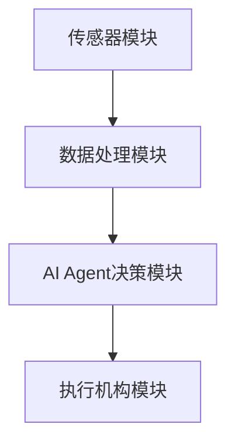

                 


# AI Agent在智能床垫中的体温调节

> 关键词：AI Agent, 智能床垫, 体温调节, 算法原理, 系统架构, 项目实战

> 摘要：本文将详细探讨AI Agent在智能床垫中的体温调节应用。首先，介绍AI Agent和智能床垫的基本概念及背景。接着，深入分析AI Agent在体温调节中的核心算法原理，包括数据采集、分析与决策过程。然后，从系统架构的角度，阐述智能床垫的实现方案。最后，通过项目实战，展示如何将AI Agent应用于智能床垫的体温调节系统中，并总结经验和最佳实践。

---

# 第1章: AI Agent与智能床垫概述

## 1.1 AI Agent的基本概念

### 1.1.1 什么是AI Agent
AI Agent（人工智能代理）是指能够感知环境、做出决策并采取行动以实现目标的智能实体。它可以是一个软件程序，也可以是一个硬件设备，通过传感器和执行器与环境交互。

### 1.1.2 AI Agent的核心特征
1. **自主性**：能够在没有外部干预的情况下运行。
2. **反应性**：能够根据环境的变化实时调整行为。
3. **目标导向**：通过设定目标来指导决策和行动。
4. **学习能力**：能够通过数据和经验不断优化自身性能。

### 1.1.3 AI Agent的应用场景
- 智能家居
- 医疗健康
- 自动驾驶
- 机器人控制

---

## 1.2 智能床垫的基本原理

### 1.2.1 智能床垫的功能介绍
智能床垫是一种结合了物联网和人工智能技术的床垫，能够根据用户的睡眠需求自动调节温度、硬度等参数，以提供更舒适的睡眠环境。

### 1.2.2 智能床垫的组成结构
1. **传感器模块**：采集用户的体温、心率、体动等数据。
2. **数据处理模块**：对传感器数据进行分析和处理。
3. **AI Agent决策模块**：根据数据生成调节指令。
4. **执行机构**：根据指令调整床垫的温度、硬度等参数。

### 1.2.3 智能床垫的工作流程
1. 传感器采集用户数据。
2. 数据处理模块分析数据，生成用户睡眠报告。
3. AI Agent根据报告生成调节指令。
4. 执行机构执行指令，调整床垫参数。

---

## 1.3 体温调节的重要性

### 1.3.1 人体温度调节的基本原理
人体通过产热和散热来维持体温平衡。体温调节对睡眠质量、身体健康和舒适度有重要影响。

### 1.3.2 温度对睡眠质量的影响
- 过高的温度会导致身体不适，影响入睡。
- 过低的温度会导致寒冷感，影响深度睡眠。
- 适宜的温度有助于提高睡眠质量。

### 1.3.3 智能床垫在体温调节中的作用
智能床垫通过实时监测体温并自动调节，为用户提供舒适的睡眠环境。

---

## 1.4 本章小结

---

# 第2章: AI Agent在智能床垫中的应用背景

## 2.1 智能家居的发展趋势

### 2.1.1 智能家居的定义与特点
智能家居是指通过物联网技术将家庭设备连接起来，实现智能化管理。其特点包括：便捷性、舒适性、安全性。

### 2.1.2 智能家居的市场现状
随着技术的进步和消费者需求的增加，智能家居市场快速增长。

### 2.1.3 智能家居的未来发展方向
智能化、个性化、互联互通是未来智能家居的发展趋势。

---

## 2.2 智能床垫的市场需求

### 2.2.1 人口老龄化与健康需求
随着人口老龄化，人们对健康睡眠的需求增加。

### 2.2.2 消费者对智能产品的接受度
消费者对智能化产品的接受度越来越高。

### 2.2.3 健康睡眠市场的潜力
健康睡眠市场具有巨大的商业潜力。

---

## 2.3 AI技术在智能家居中的应用

### 2.3.1 AI技术的基本概念
AI技术是指模拟人类智能的技术，包括学习、推理、决策等能力。

### 2.3.2 AI在智能家居中的主要应用领域
- 智能音箱
- 智能灯光
- 智能安防

### 2.3.3 AI Agent在智能床垫中的独特优势
AI Agent能够实时感知用户需求，提供个性化的睡眠调节服务。

---

## 2.4 本章小结

---

# 第3章: AI Agent与智能床垫的核心概念

## 3.1 AI Agent的基本原理

### 3.1.1 AI Agent的感知与决策机制
AI Agent通过传感器感知环境，通过算法进行决策。

### 3.1.2 AI Agent的学习与优化能力
AI Agent能够通过机器学习算法优化自身性能。

### 3.1.3 AI Agent的交互方式
AI Agent可以通过语音、触控或App进行交互。

---

## 3.2 智能床垫的温度调节系统

### 3.2.1 温度调节的基本原理
通过传感器采集温度数据，AI Agent根据数据生成调节指令。

### 3.2.2 温度调节的核心算法
温度调节算法包括PID控制、模糊控制等。

### 3.2.3 温度调节的实现方式
通过电热器、制冷装置等设备实现温度调节。

---

## 3.3 AI Agent与智能床垫的结合方式

### 3.3.1 数据采集与分析
AI Agent通过传感器采集用户体温、环境温度等数据。

### 3.3.2 AI Agent的决策过程
AI Agent根据数据生成调节指令。

### 3.3.3 系统的反馈与优化
系统根据反馈优化调节策略。

---

## 3.4 本章小结

---

# 第4章: AI Agent在智能床垫中的算法原理

## 4.1 温度调节算法的基本原理

### 4.1.1 温度调节的目标与约束条件
目标：维持适宜的睡眠温度。约束条件：节能、安全、舒适。

### 4.1.2 温度调节的核心算法
PID控制算法：
$$ PID = K_p \cdot e + K_i \cdot \int e \, dt + K_d \cdot \frac{de}{dt} $$
其中，$e$ 是误差，$K_p$、$K_i$、$K_d$ 是比例、积分、微分系数。

### 4.1.3 算法的优化与改进
根据实际效果调整参数，提高调节精度。

---

## 4.2 AI Agent的决策算法

### 4.2.1 决策算法的原理
AI Agent通过机器学习模型分析数据，生成决策指令。

### 4.2.2 常见的决策算法
- 支持向量机（SVM）
- 神经网络（ANN）
- 随机森林（Random Forest）

---

## 4.3 算法实现的步骤

### 4.3.1 数据采集
通过传感器采集温度、湿度等数据。

### 4.3.2 数据预处理
对数据进行清洗、归一化处理。

### 4.3.3 模型训练
使用机器学习算法训练模型。

### 4.3.4 模型部署
将模型部署到智能床垫系统中，实时进行温度调节。

---

## 4.4 本章小结

---

# 第5章: 智能床垫系统的架构设计

## 5.1 系统架构的总体设计

### 5.1.1 系统架构的分层
- 传感器层：负责数据采集。
- 数据处理层：负责数据存储和分析。
- AI Agent决策层：负责生成调节指令。
- 执行层：负责执行调节指令。

### 5.1.2 系统架构的优缺点
优点：模块化设计，便于维护和扩展。缺点：需要协调各模块之间的通信。

---

## 5.2 系统功能设计

### 5.2.1 系统功能模块
- 传感器模块
- 数据处理模块
- AI Agent决策模块
- 执行机构模块

### 5.2.2 功能模块的交互流程
传感器采集数据 -> 数据处理模块 -> AI Agent生成指令 -> 执行机构执行。

---

## 5.3 系统架构的实现方案

### 5.3.1 系统架构图（Mermaid）


### 5.3.2 系统接口设计
- 传感器接口：与温度、湿度传感器相连。
- 数据接口：与云端或本地数据库相连。
- 用户接口：与手机App或控制面板相连。

---

## 5.4 本章小结

---

# 第6章: 项目实战——智能床垫的AI Agent实现

## 6.1 项目环境安装

### 6.1.1 硬件设备
- 温度传感器（如DS18B20）
- 微处理器（如Raspberry Pi）
- 执行机构（如加热垫、制冷设备）

### 6.1.2 软件环境
- Python编程语言
- TensorFlow机器学习框架
- MQTT通信协议

---

## 6.2 系统核心实现源代码

### 6.2.1 数据采集模块
```python
import time
import board
import adafruit_dht

dht_SENSOR = adafruit_dht.DHT22(board.D4)
```

### 6.2.2 数据处理模块
```python
def process_data(temperature, humidity):
    # 数据预处理逻辑
    return temperature, humidity
```

### 6.2.3 AI Agent决策模块
```python
import numpy as np
from sklearn.ensemble import RandomForestRegressor

model = RandomForestRegressor(n_estimators=100)
model.fit(X_train, y_train)
```

### 6.2.4 执行机构控制模块
```python
import paho.mqtt.client as mqtt

def on_connect(client, userdata, flags, rc):
    print("Connected with result code " + str(rc))

client = mqtt.Client()
client.on_connect = on_connect
client.connect("localhost", 1883, 60)
client.publish("bedroom/temperature", str(target_temp))
```

---

## 6.3 项目实战案例分析

### 6.3.1 案例背景
假设用户睡眠时的环境温度为25°C，用户体温为36.5°C。

### 6.3.2 数据采集与处理
传感器采集到温度24°C，湿度60%。

### 6.3.3 AI Agent决策
模型预测需要将温度调整为26°C。

### 6.3.4 系统执行
执行机构启动加热垫，将温度提升到26°C。

---

## 6.4 本章小结

---

# 第7章: 最佳实践与总结

## 7.1 最佳实践

### 7.1.1 系统设计
- 模块化设计，便于维护和扩展。
- 确保数据安全，防止隐私泄露。

### 7.1.2 代码实现
- 选择合适的算法，避免过度复杂。
- 代码注释清晰，便于团队协作。

### 7.1.3 系统优化
- 定期更新模型，提高调节精度。
- 优化通信协议，降低延迟。

---

## 7.2 项目小结

通过本项目，我们实现了AI Agent在智能床垫中的体温调节功能。系统能够实时采集数据，通过算法生成调节指令，并通过执行机构实现温度调节。

---

## 7.3 注意事项

### 7.3.1 数据采集的准确性
传感器的精度和稳定性直接影响调节效果。

### 7.3.2 系统的安全性
确保系统不会因为故障导致危险情况发生。

### 7.3.3 用户体验
界面设计要简洁易用，避免复杂操作。

---

## 7.4 拓展阅读

### 7.4.1 推荐书籍
- 《机器学习实战》
- 《Python机器学习》

### 7.4.2 技术博客
- [AI Agent技术博客](#)
- [智能床垫技术博客](#)

---

# 作者：AI天才研究院/AI Genius Institute & 禅与计算机程序设计艺术 /Zen And The Art of Computer Programming

---

**本文由AI天才研究院原创，转载请注明出处。**

