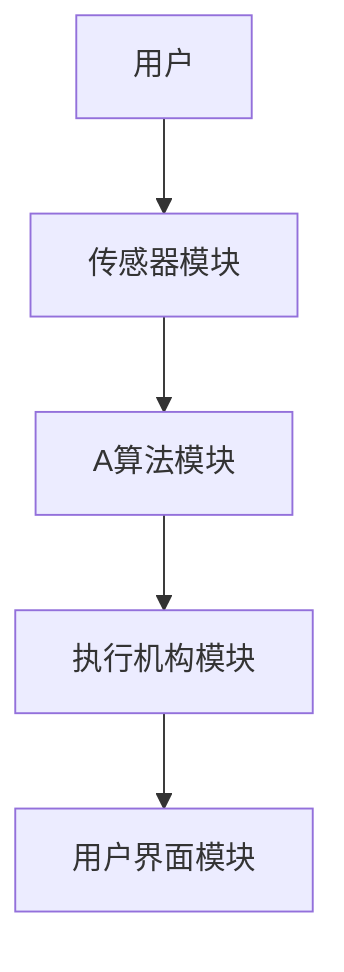

                 


# AI Agent在智能床垫中的体温调节系统

> 关键词：AI Agent，智能床垫，体温调节，算法原理，系统架构，项目实战

> 摘要：本文深入探讨了AI Agent在智能床垫中的应用，特别是在体温调节系统中的原理与实现。文章从背景介绍、核心概念、算法原理、系统架构到项目实战，全面分析了AI Agent在智能床垫中的体温调节系统，并提供了详细的代码示例和系统设计，为读者提供了一个全面的技术视角。

---

# 第一部分: AI Agent与智能床垫的背景介绍

## 第1章: 智能床垫的发展与AI Agent的引入

### 1.1 智能床垫的发展历程

#### 1.1.1 传统床垫的功能与局限性
传统床垫主要依赖弹簧和填充物提供支撑，但无法根据用户的个体需求（如体重分布、睡眠习惯等）进行动态调整。此外，传统床垫不具备智能化功能，无法感知用户的体温变化或环境温度变化。

#### 1.1.2 智能床垫的概念与技术基础
智能床垫通过集成传感器、控制器和执行机构，能够实时感知用户的体温、压力和环境温度，并通过智能算法调节床垫的软硬度和温度，以提供个性化的睡眠体验。

#### 1.1.3 AI Agent在智能床垫中的应用前景
AI Agent（人工智能代理）是一种能够感知环境、自主决策并执行任务的智能体。在智能床垫中，AI Agent可以实时分析用户的体温数据，动态调节床垫的温度和硬度，从而优化用户的睡眠质量。

### 1.2 AI Agent的核心概念与作用

#### 1.2.1 AI Agent的定义与特点
AI Agent是一种能够感知环境、处理信息、自主决策并执行任务的智能体。其特点包括：
1. **自主性**：能够在没有人工干预的情况下独立运行。
2. **反应性**：能够实时感知环境并做出反应。
3. **学习能力**：能够通过数据学习和优化算法。

#### 1.2.2 AI Agent在智能床垫中的具体应用
在智能床垫中，AI Agent主要用于以下方面：
1. **实时体温监测**：通过传感器采集用户的体温数据。
2. **动态温度调节**：根据体温数据调整床垫的温度。
3. **个性化睡眠优化**：根据用户的睡眠习惯和体温变化，提供个性化的睡眠解决方案。

#### 1.2.3 AI Agent与智能床垫的结合优势
AI Agent与智能床垫的结合，使得床垫能够实时感知用户的需求，并通过智能算法动态调整，从而提供更加舒适和个性化的睡眠体验。

---

# 第二部分: AI Agent在体温调节系统中的核心概念与联系

## 第2章: AI Agent与体温调节系统的原理

### 2.1 AI Agent的基本原理

#### 2.1.1 数据采集与处理
AI Agent通过集成在床垫中的传感器（如温度传感器、压力传感器）采集用户的体温、压力等数据，并将这些数据传输到AI算法进行处理。

#### 2.1.2 AI算法的核心流程
AI算法通过对传感器数据的分析，计算出用户的体温变化趋势，并根据这些趋势动态调整床垫的温度。

#### 2.1.3 系统反馈与优化机制
系统根据用户的反馈（如睡眠质量评分）不断优化AI算法，以提高温度调节的准确性。

### 2.2 AI Agent与体温调节系统的关联

#### 2.2.1 传感器数据的输入与分析
传感器数据的输入是AI Agent进行温度调节的基础。AI Agent通过对这些数据的分析，能够判断用户的体温变化趋势。

#### 2.2.2 AI算法对温度调节的控制
AI算法根据传感器数据计算出最佳的温度调节方案，并通过执行机构（如电热器、制冷器）进行调整。

#### 2.2.3 系统反馈与用户需求的匹配
系统通过用户的反馈不断优化温度调节方案，以更好地匹配用户的个性化需求。

---

## 第三部分: AI Agent体温调节系统的算法原理

## 第3章: AI Agent体温调节算法的实现

### 3.1 数据采集与特征提取

#### 3.1.1 传感器数据的采集流程
AI Agent通过床垫中的温度传感器和压力传感器采集用户的体温和压力数据。

#### 3.1.2 数据特征的提取方法
从传感器数据中提取关键特征（如体温变化率、压力分布）。

#### 3.1.3 数据预处理与标准化
对传感器数据进行预处理（如去噪、归一化）以提高算法的准确性。

### 3.2 AI算法的核心流程

#### 3.2.1 神经网络模型的构建
使用深度学习模型（如LSTM）对传感器数据进行建模，预测用户的体温变化趋势。

#### 3.2.2 算法的训练与优化
通过训练数据对神经网络模型进行优化，提高预测的准确性。

#### 3.2.3 算法的实时推理与反馈
根据实时传感器数据进行推理，动态调整床垫的温度。

---

## 第四部分: AI Agent体温调节系统的系统架构与设计

## 第4章: 系统架构与功能设计

### 4.1 系统架构设计

#### 4.1.1 系统组成
系统主要包括传感器模块、AI算法模块、执行机构模块和用户界面模块。

#### 4.1.2 系统功能设计
系统功能包括数据采集、温度调节、用户反馈和个性化设置。

#### 4.1.3 系统架构图
使用mermaid绘制系统架构图：



---

## 第五部分: 项目实战

## 第5章: 项目实战与案例分析

### 5.1 环境搭建与代码实现

#### 5.1.1 环境搭建
安装必要的库（如Python的scikit-learn、TensorFlow）。

#### 5.1.2 核心代码实现
以下是温度调节算法的核心代码示例：

```python
import numpy as np
from sklearn.preprocessing import StandardScaler
from tensorflow.keras.models import Sequential
from tensorflow.keras.layers import LSTM, Dense

# 数据预处理
scaler = StandardScaler()
X_train = scaler.fit_transform(X_train)
X_test = scaler.transform(X_test)

# 构建LSTM模型
model = Sequential()
model.add(LSTM(64, input_shape=(timesteps, features)))
model.add(Dense(1))
model.compile(optimizer='adam', loss='mean_squared_error')

# 训练模型
model.fit(X_train, y_train, epochs=100, batch_size=32)
```

#### 5.1.3 算法优化与测试
通过交叉验证优化模型，并在测试数据上验证算法的准确性。

### 5.2 实际案例分析

#### 5.2.1 案例背景
用户A的体温数据在夜间波动较大，需要系统动态调整床垫温度。

#### 5.2.2 算法推理过程
AI Agent通过传感器数据预测用户A的体温变化趋势，并动态调整床垫温度。

#### 5.2.3 结果分析
系统成功预测并调整温度，提高了用户的睡眠质量。

### 5.3 项目小结
通过项目实战，验证了AI Agent在智能床垫中的有效性，并为后续优化提供了方向。

---

## 第六部分: 最佳实践与总结

## 第6章: 最佳实践与总结

### 6.1 最佳实践

#### 6.1.1 算法优化建议
通过增加训练数据和优化模型结构进一步提高算法的准确性。

#### 6.1.2 系统设计注意事项
确保系统的实时性和稳定性，避免因传感器故障导致系统崩溃。

#### 6.1.3 用户体验提升
通过优化用户界面和增加更多个性化设置提高用户体验。

### 6.2 总结

AI Agent在智能床垫中的体温调节系统是一种创新的技术应用，通过实时感知和智能调节，为用户提供了更加舒适和个性化的睡眠体验。未来，随着AI技术的不断发展，智能床垫的功能将更加智能化和个性化。

---

作者：AI天才研究院/AI Genius Institute & 禅与计算机程序设计艺术 /Zen And The Art of Computer Programming

