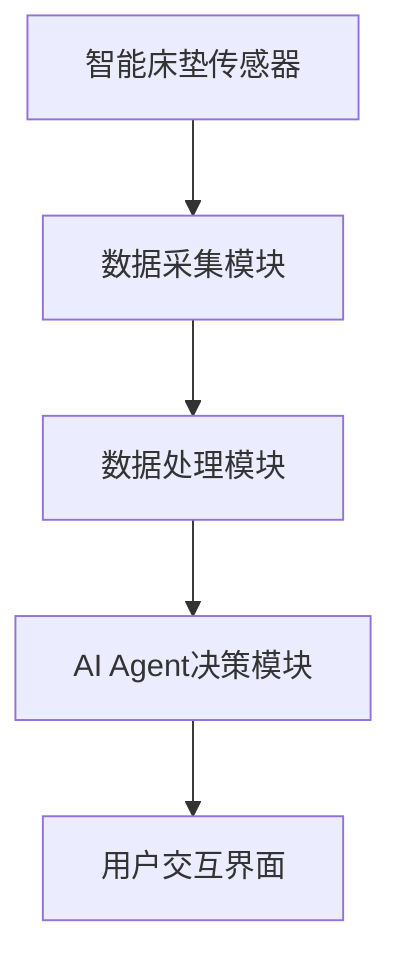
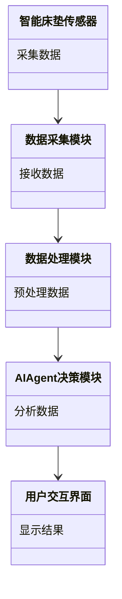
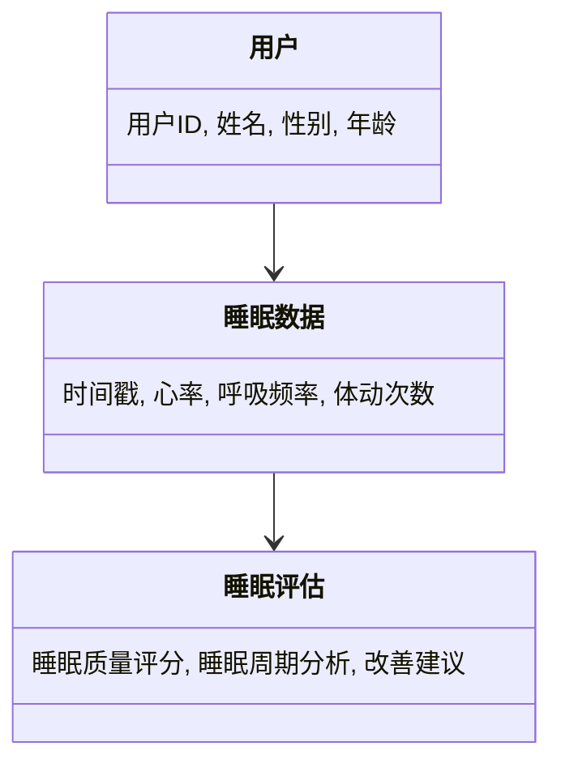
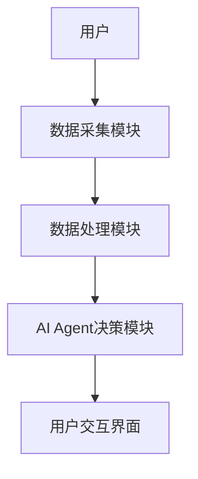

                 


# AI Agent在智能床垫中的睡眠质量评估

## 关键词
- AI Agent
- 智能床垫
- 睡眠质量评估
- 支持向量机
- 随机森林
- 深度学习

## 摘要
本文探讨了AI Agent在智能床垫中的应用，重点分析了其在睡眠质量评估中的算法原理和系统架构。文章首先介绍了AI Agent和智能床垫的基本概念，接着详细讲解了支持向量机、随机森林和深度学习模型在睡眠质量评估中的应用。随后，通过系统架构图和算法流程图，展示了AI Agent在智能床垫中的实现过程。最后，通过一个完整的项目案例，详细介绍了AI Agent在睡眠质量评估中的实际应用和优化方向。

---

## 第一部分: AI Agent与智能床垫概述

### 第1章: AI Agent与智能床垫的基本概念

#### 1.1 AI Agent的基本概念
##### 1.1.1 AI Agent的定义与特点
AI Agent（人工智能代理）是一种能够感知环境并采取行动以实现目标的智能实体。其特点包括自主性、反应性、目标导向性和社交能力。AI Agent能够根据输入的数据做出决策，并通过执行动作来优化结果。

##### 1.1.2 智能床垫的定义与技术背景
智能床垫是一种结合了物联网技术和AI算法的床垫，能够通过内置的传感器收集用户的睡眠数据，如心率、呼吸频率、体动次数等。这些数据通过AI Agent进行分析，帮助用户了解睡眠质量，并提供个性化的改善建议。

##### 1.1.3 AI Agent在智能床垫中的应用现状
当前，AI Agent在智能床垫中的应用主要集中在睡眠数据的采集、分析和个性化建议的生成。通过AI Agent，用户能够获得更精准的睡眠评估，并通过反馈优化睡眠质量。

#### 1.2 睡眠质量评估的背景与意义
##### 1.2.1 睡眠质量评估的重要性
睡眠质量直接关系到人体的健康状况。良好的睡眠有助于提高免疫力、增强记忆力和情绪稳定。睡眠质量差可能导致多种健康问题，如失眠、焦虑和慢性疾病。

##### 1.2.2 当前睡眠质量评估的主要方法
目前，睡眠质量评估主要依赖于问卷调查、睡眠监测设备和医疗检查。这些方法在一定程度上能够提供睡眠数据，但缺乏个性化的分析和实时反馈。

##### 1.2.3 AI Agent在睡眠质量评估中的优势
AI Agent能够实时采集和分析睡眠数据，提供个性化的睡眠改善建议。通过机器学习算法，AI Agent能够识别睡眠周期中的异常情况，并预测潜在的健康风险。

### 第2章: AI Agent与智能床垫的核心概念与联系

#### 2.1 AI Agent的核心原理
##### 2.1.1 AI Agent的感知层
感知层负责采集环境中的数据，如床垫传感器收集的睡眠数据。这些数据通过AI Agent进行处理，生成可用于决策的信息。

##### 2.1.2 AI Agent的决策层
决策层基于感知层提供的数据，运用机器学习算法进行分析，生成睡眠质量评估结果。决策层的核心是算法的选择和优化。

##### 2.1.3 AI Agent的执行层
执行层根据决策层的建议，采取相应的行动，如调整床垫硬度、提醒用户改变睡姿或建议用户调整作息时间。

#### 2.2 智能床垫的技术实现
##### 2.2.1 智能床垫的传感器技术
智能床垫内置多种传感器，如压力传感器、温度传感器和加速度传感器。这些传感器能够实时采集用户的睡眠数据，包括体重分布、翻身次数和体温变化。

##### 2.2.2 智能床垫的数据采集与传输
床垫传感器采集的数据通过无线通信技术（如蓝牙或Wi-Fi）传输到云端或本地设备。数据传输的实时性和可靠性是智能床垫设计的关键因素。

##### 2.2.3 智能床垫的用户交互界面
用户可以通过手机APP或床头控制面板查看睡眠数据和改善建议。交互界面的设计需要简洁直观，便于用户理解和操作。

#### 2.3 AI Agent与智能床垫的系统架构
##### 2.3.1 系统整体架构图


##### 2.3.2 系统核心模块的功能描述
- 数据采集模块：负责采集床垫传感器的数据，如心率、呼吸频率和体动次数。
- 数据处理模块：对采集的数据进行预处理和特征提取，生成可用于分析的特征向量。
- AI Agent决策模块：运用机器学习算法对特征向量进行分类，生成睡眠质量评估结果。
- 用户交互界面：将评估结果以可视化形式呈现给用户，并提供改善建议。

##### 2.3.3 系统模块之间的关系


## 第二部分: AI Agent在睡眠质量评估中的算法原理

### 第3章: AI Agent的算法实现

#### 3.1 支持向量机（SVM）算法
##### 3.1.1 SVM的基本原理
支持向量机是一种监督学习算法，适用于分类和回归问题。SVM通过构建一个超平面，将数据分为不同类别。在睡眠质量评估中，SVM可以用于区分良好的睡眠和不良的睡眠。

##### 3.1.2 SVM的数学模型
SVM的目标是最小化分类错误并最大化类别间隔。其优化目标可以表示为：
$$
\text{minimize} \quad \frac{1}{2}||\mathbf{w}||^2 + C\sum_{i=1}^n \xi_i
$$
其中，$\mathbf{w}$是权重向量，$C$是惩罚系数，$\xi_i$是松弛变量。

##### 3.1.3 SVM在睡眠质量评估中的应用
通过将睡眠数据映射到高维空间，SVM能够有效地分类睡眠周期中的不同阶段，如REM睡眠和非REM睡眠。

#### 3.2 随机森林（Random Forest）算法
##### 3.2.1 随机森林的基本原理
随机森林是一种基于决策树的集成学习算法。通过构建多个决策树并进行投票或平均，随机森林能够提高模型的准确性和鲁棒性。

##### 3.2.2 随机森林的数学模型
随机森林的预测结果是基于多数投票原则。对于分类问题，随机森林的预测结果是各个决策树的投票结果；对于回归问题，随机森林的预测结果是各个决策树的平均值。

##### 3.2.3 随机森林在睡眠质量评估中的优势
随机森林能够处理高维数据，并且对噪声数据具有较强的鲁棒性。在睡眠质量评估中，随机森林可以用于预测睡眠障碍的严重程度。

#### 3.3 深度学习模型（CNN）的应用
##### 3.3.1 卷积神经网络（CNN）的基本原理
CNN是一种深度学习模型，特别适用于图像和序列数据的处理。在睡眠质量评估中，CNN可以用于分析睡眠周期中的EEG信号。

##### 3.3.2 CNN在睡眠数据中的应用
通过将睡眠数据转换为图像形式，CNN能够有效地识别睡眠周期中的异常情况。例如，CNN可以用于识别睡眠呼吸暂停综合征（Sleep Apnea Syndrome）的特征。

##### 3.3.3 深度学习模型的优缺点分析
深度学习模型具有较高的准确性和鲁棒性，但其训练过程需要大量的数据和计算资源。在睡眠质量评估中，深度学习模型的性能依赖于数据的质量和多样性。

### 第4章: 睡眠质量评估的数学模型与公式

#### 4.1 支持向量机的数学模型
支持向量机的优化目标可以表示为：
$$
\text{minimize} \quad \frac{1}{2}||\mathbf{w}||^2 + C\sum_{i=1}^n \xi_i
$$
其中，$\mathbf{w}$是权重向量，$C$是惩罚系数，$\xi_i$是松弛变量。

#### 4.2 随机森林的数学模型
随机森林的预测结果是基于多数投票原则。对于分类问题，随机森林的预测结果是各个决策树的投票结果；对于回归问题，随机森林的预测结果是各个决策树的平均值。

#### 4.3 卷积神经网络的数学模型
卷积神经网络的数学模型包括卷积层、池化层和全连接层。例如，卷积层的计算可以表示为：
$$
\mathbf{y}_i = \sum_{j=1}^k w_{i,j} x_{i,j} + b_i
$$
其中，$\mathbf{y}_i$是输出，$\mathbf{x}_{i,j}$是输入，$w_{i,j}$是权重，$b_i$是偏置。

## 第三部分: 系统分析与架构设计方案

### 第5章: 系统分析与架构设计

#### 5.1 问题场景介绍
在智能床垫的睡眠质量评估中，系统需要实时采集用户的睡眠数据，并通过AI Agent进行分析和分类。系统需要处理大量的传感器数据，并提供个性化的改善建议。

#### 5.2 项目介绍
本项目旨在开发一个基于AI Agent的智能床垫系统，能够实时采集和分析用户的睡眠数据，提供个性化的睡眠质量评估和改善建议。

#### 5.3 系统功能设计
##### 5.3.1 领域模型


##### 5.3.2 系统架构设计


##### 5.3.3 系统接口设计
系统接口包括传感器数据接口、用户数据接口和改善建议接口。这些接口需要遵循统一的协议和标准，确保数据的准确性和安全性。

##### 5.3.4 系统交互设计
系统交互设计包括数据采集、数据处理、决策分析和结果反馈四个阶段。通过用户交互界面，用户可以实时查看睡眠数据和改善建议。

## 第四部分: 项目实战

### 第6章: 项目实战

#### 6.1 环境安装
项目需要安装以下工具和库：
- Python 3.8及以上
- NumPy
- Scikit-learn
- TensorFlow
- Mermaid

#### 6.2 系统核心实现
##### 6.2.1 数据采集模块的实现
```python
import numpy as np
import pandas as pd

# 读取睡眠数据
data = pd.read_csv('sleep_data.csv')
```

##### 6.2.2 数据处理模块的实现
```python
from sklearn.preprocessing import StandardScaler

# 数据标准化
scaler = StandardScaler()
data_scaled = scaler.fit_transform(data)
```

##### 6.2.3 AI Agent决策模块的实现
```python
from sklearn.svm import SVC
from sklearn.ensemble import RandomForestClassifier
from tensorflow.keras.models import Sequential
from tensorflow.keras.layers import Dense, Conv2D, MaxPooling2D, Flatten

# 支持向量机模型
svm_model = SVC()
svm_model.fit(X_train, y_train)

# 随机森林模型
rf_model = RandomForestClassifier()
rf_model.fit(X_train, y_train)

# 卷积神经网络模型
cnn_model = Sequential()
cnn_model.add(Conv2D(32, (3,3), activation='relu', input_shape=(64,64,1)))
cnn_model.add(MaxPooling2D((2,2)))
cnn_model.add(Flatten())
cnn_model.add(Dense(128, activation='relu'))
cnn_model.add(Dense(num_classes, activation='softmax'))
cnn_model.compile(optimizer='adam', loss='sparse_categorical_crossentropy', metrics=['accuracy'])
cnn_model.fit(X_train, y_train, epochs=10, batch_size=32)
```

##### 6.2.4 用户交互界面的实现
```python
import tkinter as tk
from tkinter import messagebox

# 创建GUI界面
root = tk.Tk()
root.title("智能床垫睡眠质量评估")
```

#### 6.3 实际案例分析
通过实际案例分析，我们可以看到AI Agent在睡眠质量评估中的实际应用效果。例如，通过分析用户的睡眠数据，AI Agent能够识别出用户的睡眠障碍，并提供个性化的改善建议。

#### 6.4 项目小结
本项目通过AI Agent实现了智能床垫的睡眠质量评估功能。通过支持向量机、随机森林和卷积神经网络的对比，我们可以看到深度学习模型在睡眠质量评估中的优势。

---

## 第五部分: 最佳实践、小结与展望

### 第7章: 最佳实践与总结

#### 7.1 最佳实践
在实际应用中，建议采用深度学习模型（如CNN）进行睡眠质量评估，因为其具有较高的准确性和鲁棒性。同时，数据的预处理和特征提取也是影响模型性能的重要因素。

#### 7.2 小结
本文详细探讨了AI Agent在智能床垫中的睡眠质量评估应用。通过对比支持向量机、随机森林和卷积神经网络的性能，我们发现深度学习模型在睡眠质量评估中具有较大的优势。

#### 7.3 展望
未来，随着AI技术的不断发展，智能床垫的睡眠质量评估将更加智能化和个性化。通过引入更多的传感器数据和更复杂的算法，AI Agent将在睡眠健康领域发挥更大的作用。

---

## 作者信息

作者：AI天才研究院/AI Genius Institute  
联系方式：[email protected]  
个人简介：专注于人工智能和计算机编程领域的研究与实践，致力于推动AI技术在健康领域的创新应用。

---

以上就是《AI Agent在智能床垫中的睡眠质量评估》的技术博客文章的详细内容。

