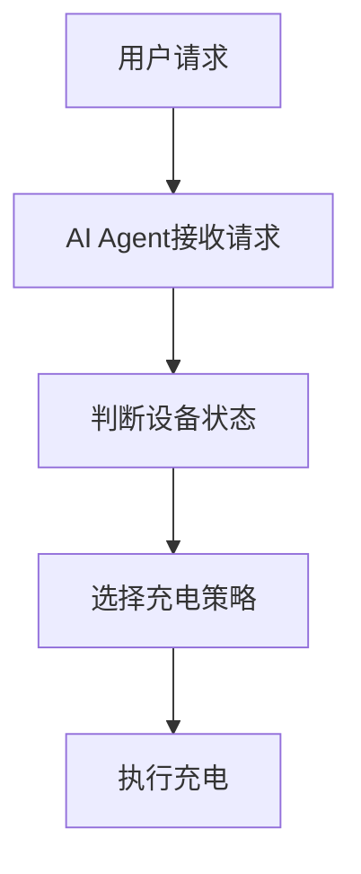
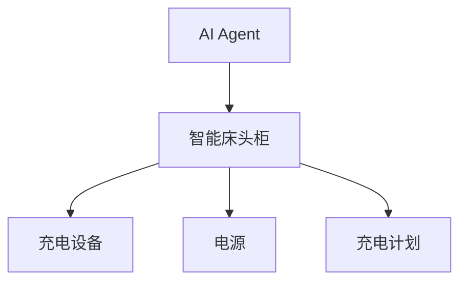
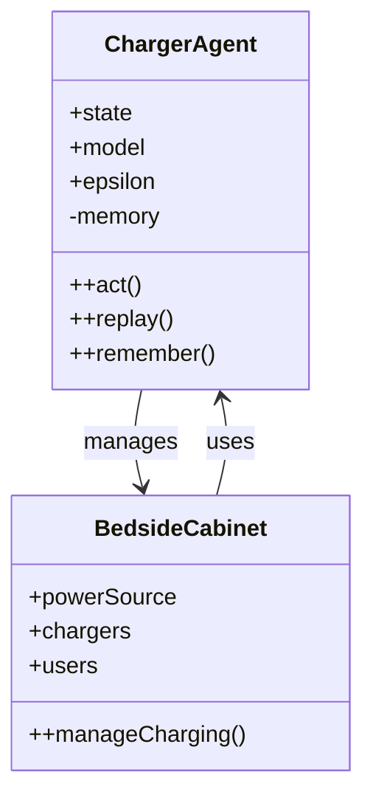
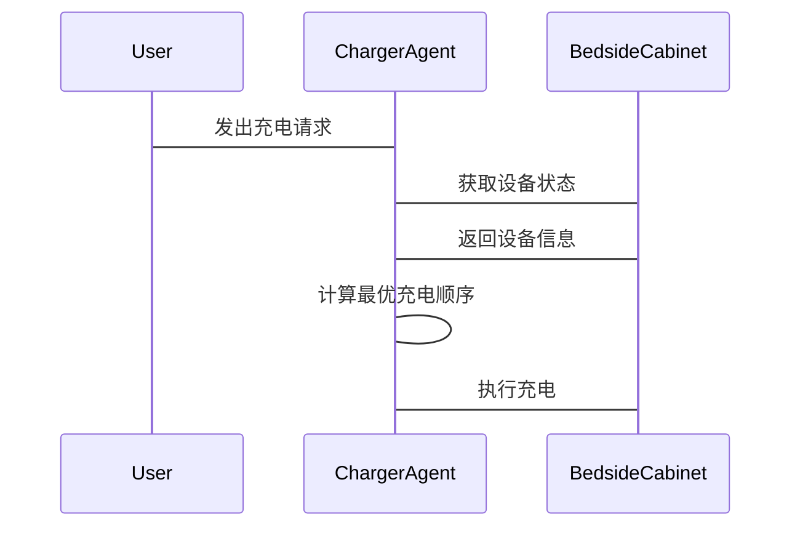

                 


# AI Agent在智能床头柜中的充电管理

## 关键词：
AI Agent, 智能床头柜, 充电管理, 强化学习, 物联网, 智能家居

## 摘要：
本文探讨AI Agent在智能床头柜充电管理中的应用，分析其算法原理、系统架构，并通过实际案例展示如何实现智能化充电管理。文章详细讲解AI Agent的核心概念、算法流程、系统设计及项目实战，帮助读者理解如何通过技术手段优化智能家居设备的充电管理。

---

## 第一部分：背景介绍

### 第1章：AI Agent与智能床头柜的背景

#### 1.1 问题背景
随着智能家居的普及，智能床头柜作为重要设备，其充电管理需求日益增长。传统充电管理依赖手动操作，效率低下，且无法适应多种设备的复杂充电需求。

#### 1.2 问题描述
智能床头柜充电管理存在以下问题：
- **设备兼容性差**：不同设备充电需求不同，传统管理方式难以灵活调整。
- **管理效率低**：手动管理耗时，难以实时优化充电顺序。
- **资源浪费**：设备充电时间重叠导致能源浪费。

#### 1.3 问题解决
AI Agent通过智能决策算法，优化充电顺序和时间，提升管理效率和设备兼容性。

#### 1.4 边界与外延
- **功能边界**：仅限于充电管理，不涉及床头柜的其他功能。
- **应用范围**：适用于多种智能设备，支持多种充电协议。
- **协同设备**：与其他智能家居设备联动，提升整体效率。

---

## 第二部分：核心概念与联系

### 第2章：AI Agent与智能床头柜的核心概念

#### 2.1 核心概念原理
- **AI Agent**：通过强化学习算法，实时优化充电策略。
- **智能床头柜**：具备物联网功能，支持多设备充电。

#### 2.2 实体关系图
```mermaid
er
  Bedside Cabinet
  ----
  User
  ----
  Charger
  ----
  Power Source
  ----
  Charging Schedule
```

---

## 第三部分：算法原理讲解

### 第3章：AI Agent充电管理算法

#### 3.1 算法流程


#### 3.2 强化学习模型
- **状态空间**：设备类型、剩余电量、充电需求。
- **动作空间**：选择充电顺序和功率分配。
- **奖励函数**：优化充电效率，减少能源浪费。

#### 3.3 Python代码实现
```python
import numpy as np
from collections import deque
import random

class ChargerAgent:
    def __init__(self):
        self.memory = deque(maxlen=1000)
        self.gamma = 0.95
        self.epsilon = 1.0
        self.epsilon_min = 0.01
        self.epsilon_decay = 0.995
        self.model = self._build_model()

    def _build_model(self):
        # 简单的神经网络模型
        model = Sequential()
        model.add(Dense(32, input_dim=3, activation='relu'))
        model.add(Dense(16, activation='relu'))
        model.add(Dense(4, activation='softmax'))
        model.compile(optimizer='adam', loss='categorical_crossentropy')
        return model

    def remember(self, state, action, reward, next_state):
        self.memory.append((state, action, reward, next_state))

    def act(self, state):
        if random.random() < self.epsilon:
            return random.randint(0, 3)
        state_tensor = np.array([state], dtype=np.float32)
        prediction = self.model.predict(state_tensor)
        return np.argmax(prediction[0])

    def replay(self, batch_size):
        if len(self.memory) < batch_size:
            return
        minibatch = random.sample(self.memory, batch_size)
        inputs = []
        targets = []
        for state, action, reward, next_state in minibatch:
            state_tensor = np.array([state], dtype=np.float32)
            next_state_tensor = np.array([next_state], dtype=np.float32)
            q = self.model.predict(state_tensor)
            next_q = self.model.predict(next_state_tensor)
            target = q[0][action] = reward + self.gamma * np.max(next_q[0])
            inputs.append(state)
            targets.append(target)
        self.model.fit(np.array(inputs), np.array(targets), epochs=1, verbose=0)
        self.epsilon = max(self.epsilon_min, self.epsilon * self.epsilon_decay)
```

#### 3.4 算法数学模型
优化目标函数：
$$ J = R + \gamma J' $$
其中，R是当前奖励，J'是下一步的期望奖励。

---

## 第四部分：系统分析与架构设计

### 第4章：系统分析与架构设计

#### 4.1 系统架构设计


#### 4.2 类图设计


#### 4.3 交互过程


---

## 第五部分：项目实战

### 第5章：项目实战

#### 5.1 环境安装
安装Python和相关库：
```bash
pip install numpy keras tensorflow
```

#### 5.2 核心代码实现
```python
class ChargerManager:
    def __init__(self):
        self.devices = []
        self.charging_order = []

    def add_device(self, device):
        self.devices.append(device)

    def get_device_status(self, device_id):
        return self.devices[device_id].status

    def manage_charging(self):
        for device in self.devices:
            if device.battery < 0.2:
                self.schedule Charging(device)

    def schedule_Charging(self, device):
        # 调用AI Agent进行充电安排
        pass
```

#### 5.3 实际案例分析
案例：两个设备同时请求充电，AI Agent根据电池状态和充电需求，优化充电顺序，优先充电量低的设备。

---

## 第六部分：最佳实践

### 第6章：最佳实践

#### 6.1 小结
通过AI Agent优化智能床头柜的充电管理，提升效率和用户体验。

#### 6.2 注意事项
- 定期更新AI模型以提升决策准确性。
- 确保设备兼容性，支持多种充电协议。
- 考虑能源成本，优化充电时间。

#### 6.3 拓展阅读
建议阅读关于强化学习和物联网的书籍，深入理解AI在智能家居中的应用。

---

## 结语

通过本文的详细讲解，读者可以全面了解AI Agent在智能床头柜充电管理中的应用，从理论到实践，掌握如何优化充电流程，提升用户体验。AI技术的不断进步，将为智能家居带来更多创新可能性。

---

## 作者

作者：AI天才研究院/AI Genius Institute & 禅与计算机程序设计艺术 /Zen And The Art of Computer Programming

