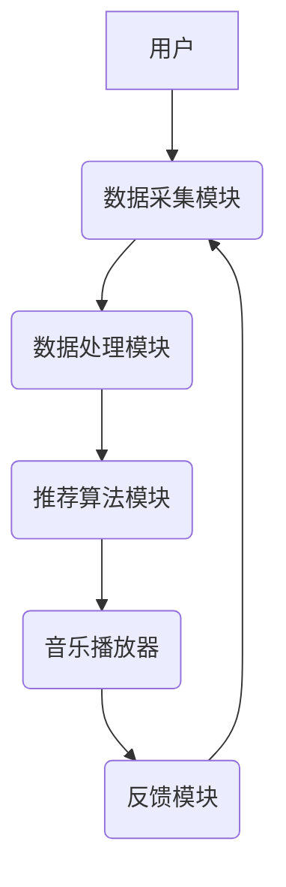

                 


# AI Agent在智能床头柜中的助眠音乐定制

## 关键词：AI Agent, 助眠音乐, 智能床头柜, 音乐推荐算法, 系统架构设计

## 摘要：  
本文探讨了AI Agent在智能床头柜中的助眠音乐定制应用。通过分析现代人的睡眠问题和助眠音乐的需求，提出了一种基于AI Agent的音乐推荐解决方案。文章详细讲解了AI Agent的核心原理、音乐推荐算法、系统架构设计，并通过实际案例展示了如何通过技术手段实现个性化的助眠音乐定制。本文旨在为开发者和用户提供一个全面的技术视角，帮助他们理解并应用AI Agent在智能床头柜中的实际场景。

---

## 第1章：问题背景与需求分析

### 1.1 现代人睡眠问题的现状
现代社会节奏加快，压力增大，睡眠问题日益普遍。根据世界卫生组织的数据，全球约有30%的人存在睡眠障碍。助眠音乐作为一种非侵入性的解决方案，逐渐受到关注。

### 1.2 助眠音乐定制的核心需求
- **个性化需求**：每个人的睡眠习惯和音乐偏好不同，需要个性化的音乐推荐。
- **实时反馈**：根据用户的实时反馈（如心率、睡眠质量）动态调整音乐播放。
- **无缝集成**：与智能床头柜无缝集成，提供便捷的用户体验。

### 1.3 AI Agent在睡眠辅助中的潜力
AI Agent能够实时感知用户需求，结合大数据分析，为用户提供个性化的助眠音乐推荐。通过学习用户的听音乐习惯和睡眠数据，AI Agent能够不断优化推荐算法，提高推荐的准确性和效果。

---

## 第2章：AI Agent的核心原理与实现

### 2.1 AI Agent的基本概念
AI Agent是一种智能代理，能够感知环境、理解用户需求，并根据需求做出决策和行动。在助眠音乐定制中，AI Agent主要负责接收用户输入、分析数据、推荐音乐。

### 2.2 助眠音乐定制的核心需求
- **用户需求分析**：通过问卷调查、历史数据等方式，获取用户的音乐偏好、睡眠习惯等信息。
- **音乐推荐模型**：基于用户数据，构建音乐推荐模型，实现个性化推荐。

### 2.3 AI Agent的实现流程
1. **数据采集**：通过智能床头柜的传感器采集用户数据（如心率、睡眠周期）。
2. **数据分析**：利用机器学习算法分析数据，提取用户的音乐偏好。
3. **音乐推荐**：基于分析结果，生成个性化助眠音乐列表。
4. **实时调整**：根据用户的实时反馈，动态调整音乐播放。

---

## 第3章：基于AI Agent的音乐推荐算法

### 3.1 协同过滤算法
协同过滤是一种基于用户相似性的推荐算法。通过分析用户的听音乐历史，找到与目标用户相似的用户，推荐他们喜欢的音乐。

#### 3.1.1 协同过滤的实现步骤
1. **构建用户-音乐矩阵**：记录用户对音乐的评分。
2. **计算相似度**：使用余弦相似度计算用户之间的相似度。
3. **生成推荐列表**：根据相似用户的评分，生成推荐列表。

#### 3.1.2 协同过滤的代码实现
```python
import numpy as np

# 用户-音乐矩阵
user_music_matrix = np.array([
    [5, 3, 0, 1],
    [4, 0, 2, 1],
    [3, 4, 5, 0],
    [2, 3, 1, 5]
])

# 计算余弦相似度
def cosine_similarity(matrix):
    norm = np.linalg.norm(matrix, axis=1).reshape(-1, 1)
    normalized_matrix = matrix / norm
    similarity = np.dot(normalized_matrix, normalized_matrix.T)
    return similarity

similarity_matrix = cosine_similarity(user_music_matrix)
print(similarity_matrix)
```

---

## 第4章：系统架构设计

### 4.1 系统功能设计
- **数据采集模块**：采集用户的睡眠数据和音乐偏好。
- **数据处理模块**：对数据进行清洗和预处理。
- **推荐算法模块**：基于处理后的数据，生成音乐推荐列表。
- **用户交互模块**：与用户进行实时交互，动态调整音乐播放。

### 4.2 系统架构设计图


---

## 第5章：项目实战

### 5.1 环境安装
- **Python**：安装Python 3.8及以上版本。
- **依赖库**：安装`pandas`, `numpy`, `scikit-learn`。

### 5.2 核心功能实现
```python
from sklearn.neighbors import NearestNeighbors

# 示例数据集
X = np.array([[1, 2], [2, 3], [3, 4], [4, 5], [5, 6]])

# 训练最近邻模型
model = NearestNeighbors(n_neighbors=2)
model.fit(X)

# 查询最近邻
distances, indices = model.kneighbors([3, 4])
print(indices)
```

---

## 第6章：最佳实践与小结

### 6.1 最佳实践
- **数据质量**：确保数据的准确性和完整性。
- **模型优化**：定期更新模型，提高推荐准确率。
- **用户体验**：提供简洁直观的用户界面，优化交互体验。

### 6.2 项目小结
本文详细介绍了AI Agent在智能床头柜中的助眠音乐定制应用。通过分析问题背景、核心概念、算法原理和系统架构，展示了如何利用AI技术实现个性化的助眠音乐推荐。未来，随着技术的不断发展，AI Agent在睡眠辅助中的应用将更加广泛和深入。

---

## 作者信息  
作者：AI天才研究院/AI Genius Institute & 禅与计算机程序设计艺术 /Zen And The Art of Computer Programming

