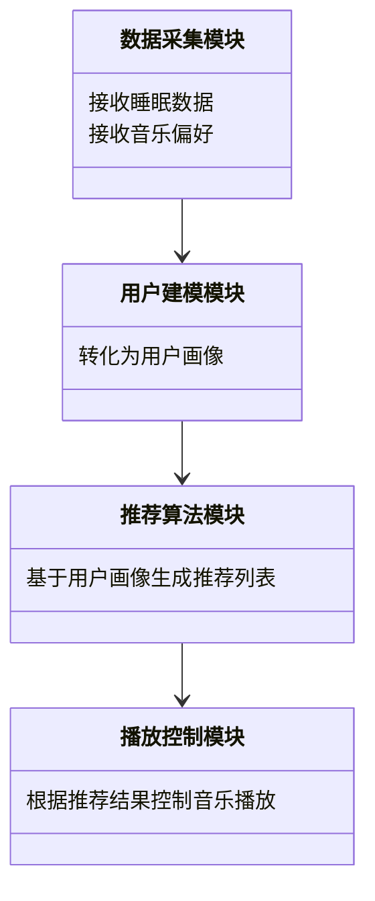
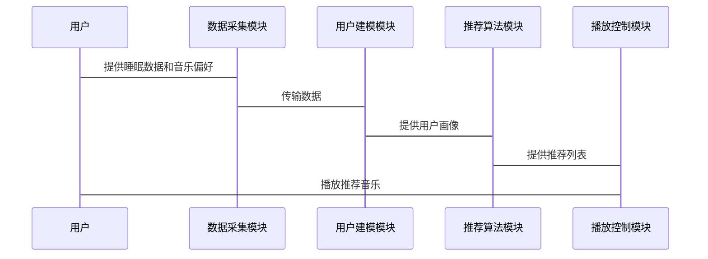

                 


# AI Agent在智能床头柜中的助眠音乐选择

## 关键词：AI Agent, 智能床头柜, 助眠音乐, 推荐系统, 个性化体验

## 摘要：  
本文探讨了如何利用AI Agent技术在智能床头柜中实现个性化的助眠音乐选择。通过分析用户睡眠数据和音乐偏好，结合协同过滤和基于内容的推荐算法，构建了一个智能化的音乐推荐系统。文章详细介绍了系统架构、算法原理、实现步骤和实际案例，展示了如何通过技术手段提升用户的睡眠质量。

---

# 第1章: 背景介绍与问题描述

## 1.1 睡眠问题的普遍性与解决方案  
现代社会节奏快、压力大，睡眠问题日益普遍。传统的助眠方法（如固定音乐列表）难以满足个性化需求，而AI Agent能够通过数据分析实现精准推荐。

## 1.2 AI Agent在智能家居中的应用  
AI Agent作为智能设备的核心，能够感知环境、分析数据并采取行动。在智能床头柜中，AI Agent通过收集用户的睡眠数据和音乐偏好，动态调整音乐推荐。

## 1.3 助眠音乐选择的核心问题  
助眠音乐的选择需要考虑用户的生理特征、心理状态和环境因素。传统方法缺乏个性化，而AI Agent能够通过数据驱动的方式实现精准推荐。

## 1.4 系统架构与核心要素  
- **数据采集模块**：收集用户的睡眠数据（心率、体温等）和音乐偏好（听过的音乐、喜好类型等）。
- **用户建模模块**：将数据转化为用户画像，用于后续推荐。
- **推荐算法模块**：基于用户画像生成推荐列表。
- **播放控制模块**：根据推荐结果控制音乐的播放。

---

# 第2章: AI Agent的核心原理

## 2.1 AI Agent的基本原理  
AI Agent通过感知环境、分析数据并采取行动来实现目标。在助眠音乐推荐中，AI Agent需要分析用户的睡眠数据和音乐偏好，动态调整推荐结果。

## 2.2 协同过滤与基于内容的推荐算法  
- **协同过滤**：基于用户相似性进行推荐，适用于已有大量用户数据的情况。
- **基于内容的推荐**：分析音乐的特征（如音调、节奏、时长等）进行推荐，适用于新用户或冷启动问题。

## 2.3 推荐算法的数学模型  
协同过滤的相似度计算公式：  
$$ sim(i, j) = \frac{\sum_{k=1}^{n} (r_{i,k} - \bar{r_i})(r_{j,k} - \bar{r_j})}{\sqrt{\sum_{k=1}^{n} (r_{i,k} - \bar{r_i})^2} \cdot \sqrt{\sum_{k=1}^{n} (r_{j,k} - \bar{r_j})^2}}} $$  
其中，$r_{i,k}$表示用户i对物品k的评分，$\bar{r_i}$表示用户i的平均评分。

---

# 第3章: 系统架构与设计

## 3.1 系统架构设计  
系统采用微服务架构，包括数据采集、用户建模、推荐算法和播放控制四个模块。各模块通过RESTful API进行通信。

## 3.2 领域模型设计  
使用Mermaid类图展示系统模块之间的关系：  


## 3.3 接口设计与交互流程  
使用Mermaid序列图展示系统交互流程：  


---

# 第4章: 项目实战与代码实现

## 4.1 环境安装  
安装Python和相关库（如numpy、pandas、scikit-learn）。

## 4.2 核心代码实现  
```python
import numpy as np
from sklearn.metrics.pairwise import cosine_similarity

# 示例数据：用户评分矩阵
ratings = np.array([
    [4, 3, 0],
    [5, 1, 3],
    [0, 5, 2],
    [3, 0, 4],
])

# 计算用户相似度矩阵
similarity_matrix = cosine_similarity(ratings)

# 推荐算法实现
def get_recommendations(user_id, similarity_matrix, ratings):
    user_ratings = ratings[user_id]
    similar_users = np.argsort(-similarity_matrix[user_id])
    recommended_items = []
    for user in similar_users:
        recommended_items.extend(np.where(user_ratings == 0)[0])
    return recommended_items

# 示例推荐结果
user_id = 0
recommendations = get_recommendations(user_id, similarity_matrix, ratings)
print("推荐结果：", recommendations)
```

## 4.3 实际案例分析  
以用户A为例，系统根据其睡眠数据和音乐偏好推荐助眠音乐。通过分析，用户A对慢节奏的古典音乐反应较好，推荐列表中包括贝多芬的《月光奏鸣曲》和巴赫的《G弦上的咏叹调》。

---

# 第5章: 最佳实践与总结

## 5.1 性能优化建议  
- 使用分布式架构提高推荐实时性。
- 优化数据存储结构，提升查询效率。

## 5.2 用户体验设计  
- 提供个性化设置，让用户自定义音乐偏好。
- 提供反馈机制，允许用户调整推荐结果。

## 5.3 数据隐私保护  
- 对用户数据进行加密处理。
- 确保数据传输的安全性。

## 5.4 未来发展方向  
- 结合可穿戴设备，进一步提升数据采集的准确性。
- 研究更先进的推荐算法，如深度学习模型。

---

# 小结  
本文详细介绍了AI Agent在智能床头柜中的助眠音乐选择过程，从背景介绍到系统设计，再到代码实现，全面展示了如何通过技术手段提升用户的睡眠质量。通过本文的讲解，读者可以深入了解AI Agent的核心原理和实际应用，为未来的智能化睡眠解决方案提供参考。

---

# 注意事项  
- 数据隐私保护是系统设计中的重要环节，必须确保用户数据的安全性。
- 算法的可解释性也是一个关键问题，需要在设计过程中充分考虑。

---

# 拓展阅读  
1.《集体智慧编程》——推荐系统的经典书籍。
2.《机器学习实战》——深入理解推荐算法的数学原理。

---

作者：AI天才研究院 & 禅与计算机程序设计艺术

