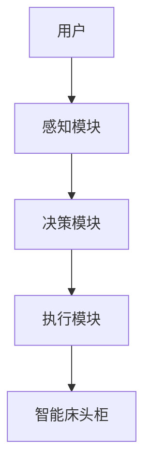
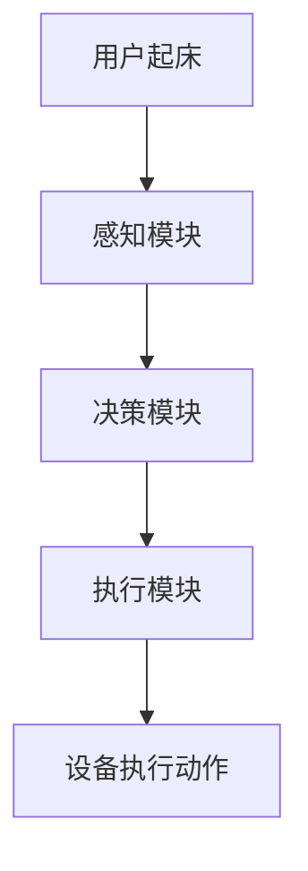

                 


# AI Agent在智能床头柜中的晨间仪式规划

> 关键词：AI Agent, 智能床头柜, 晨间仪式, 智能家居, 智能助手, 强化学习, 个性化服务

> 摘要：本文探讨了AI Agent在智能床头柜中的应用，特别是在晨间仪式规划方面。通过分析AI Agent的核心概念、算法原理和系统架构，结合实际项目实战，详细阐述了如何利用强化学习算法实现智能化的晨间仪式规划。本文还提供了系统的功能设计、接口设计和交互流程图，展示了AI Agent在智能床头柜中的实际应用场景和优化方法。

---

# 第1章: AI Agent与智能床头柜概述

## 1.1 AI Agent的基本概念

### 1.1.1 AI Agent的定义与特点
AI Agent（人工智能代理）是一种能够感知环境、做出决策并执行动作的智能系统。其特点包括自主性、反应性、目标导向和学习能力。AI Agent能够通过传感器获取环境信息，利用算法进行分析和决策，并通过执行器与环境交互。

### 1.1.2 AI Agent的核心功能与应用场景
AI Agent的核心功能包括感知、决策和执行。其应用场景广泛，包括智能家居、自动驾驶、智能助手等领域。在智能床头柜中，AI Agent主要用于优化用户的晨间仪式，提升用户体验。

### 1.1.3 AI Agent在智能床头柜中的作用
在智能床头柜中，AI Agent通过感知用户的睡眠状态、时间信息和环境数据，优化用户的晨间仪式流程。例如，它可以自动调节灯光、播放音乐、提醒用户起床，并根据用户的习惯调整早餐准备时间。

---

## 1.2 晨间仪式规划的背景与需求

### 1.2.1 晨间仪式的基本构成
晨间仪式通常包括起床、洗漱、用餐、锻炼等活动。这些活动需要在有限的时间内高效完成，因此对智能辅助的需求日益增加。

### 1.2.2 智能床头柜的功能需求
智能床头柜需要具备以下功能：睡眠监测、时间管理、设备控制、用户交互和个性化服务。通过AI Agent的协调，智能床头柜能够实现这些功能的自动化和智能化。

### 1.2.3 用户行为分析与个性化需求
用户的晨间习惯各不相同，例如有些人喜欢早起后立即运动，有些人则喜欢先喝一杯温水。AI Agent需要通过数据采集和分析，了解用户的个性化需求，并制定个性化的晨间仪式规划。

---

## 1.3 智能床头柜与AI Agent的结合

### 1.3.1 智能床头柜的硬件构成
智能床头柜通常配备多种传感器，如光线传感器、温度传感器、声音传感器等，以及执行器，如LED灯、音响、插座等。

### 1.3.2 AI Agent在智能床头柜中的应用价值
AI Agent能够通过整合床头柜的传感器数据，优化用户的晨间仪式流程。例如，当AI Agent检测到用户起床后，它可以自动启动咖啡机、调节室温，并播放背景音乐。

### 1.3.3 晨间仪式规划的智能化提升
通过AI Agent的决策和执行能力，晨间仪式的规划变得更加智能化。例如，AI Agent可以根据用户的睡眠质量调整唤醒时间，并根据天气情况建议穿衣搭配。

---

## 1.4 本章小结
本章介绍了AI Agent的基本概念及其在智能床头柜中的应用价值。通过分析晨间仪式的背景与需求，阐述了AI Agent如何通过智能化的规划提升用户体验。

---

# 第2章: AI Agent的核心概念与原理

## 2.1 AI Agent的核心概念

### 2.1.1 状态空间与动作空间
状态空间是系统在某一时刻的所有可能状态的集合。动作空间是系统在某一状态下可以执行的所有动作的集合。例如，在晨间仪式规划中，状态可以是“用户已经起床”，动作可以是“启动咖啡机”。

### 2.1.2 奖励机制与目标函数
奖励机制是强化学习中的关键部分，用于指导AI Agent的学习方向。目标函数是AI Agent需要优化的指标，例如最大化用户的满意度或最小化完成时间。

### 2.1.3 知识库与推理引擎
知识库存储了AI Agent所需的所有背景知识，例如用户的习惯和偏好。推理引擎则是基于知识库进行逻辑推理的核心模块。

---

## 2.2 AI Agent的感知与决策机制

### 2.2.1 感知模块的功能与实现
感知模块负责采集环境数据，例如时间、光线、声音等。通过传感器和API接口，AI Agent可以获取这些数据，并进行初步处理。

### 2.2.2 决策模块的算法选择
决策模块需要选择合适的算法来优化决策过程。强化学习是一种常用的方法，例如Q-learning算法。

### 2.2.3 执行模块的实现方式
执行模块负责将决策结果转化为具体动作，例如通过API调用智能床头柜的执行器。

---

## 2.3 AI Agent的算法原理

### 2.3.1 强化学习算法的基本原理
强化学习是一种基于奖励机制的机器学习方法。AI Agent通过与环境交互，不断尝试不同的动作，以最大化累积奖励。

### 2.3.2 Q-learning算法的实现流程
Q-learning算法通过维护一个Q表，记录每个状态下每个动作的Q值。AI Agent通过探索和利用策略，不断更新Q表，最终找到最优策略。

### 2.3.3 策略网络的构建与优化
策略网络是一种基于深度学习的强化学习方法。通过神经网络，AI Agent可以直接输出最优动作，无需维护Q表。

---

## 2.4 本章小结
本章详细介绍了AI Agent的核心概念与算法原理，特别是强化学习算法在晨间仪式规划中的应用。

---

# 第3章: AI Agent在晨间仪式规划中的应用

## 3.1 晨间仪式的场景分析

### 3.1.1 用户起床前的准备阶段
AI Agent需要在用户起床前完成一系列准备工作，例如调节室温、准备早餐等。

### 3.1.2 起床后的日常习惯
用户的日常习惯可能包括锻炼、阅读等，AI Agent需要根据用户的习惯进行个性化安排。

### 3.1.3 不同用户的个性化需求
不同用户的晨间习惯差异很大，AI Agent需要通过数据采集和分析，制定个性化的规划。

---

## 3.2 AI Agent的感知与数据采集

### 3.2.1 睡眠数据的采集与分析
AI Agent可以通过智能床垫等设备采集用户的睡眠数据，分析用户的睡眠质量。

### 3.2.2 时间信息的获取与处理
AI Agent需要获取当前时间，并结合用户的习惯，确定最佳唤醒时间。

### 3.2.3 用户行为的识别与预测
通过分析用户的行为数据，AI Agent可以预测用户的下一步动作，并进行相应准备。

---

## 3.3 AI Agent的决策与执行

### 3.3.1 决策逻辑的构建与优化
AI Agent需要根据当前状态和目标，选择最优动作。例如，当用户起床后，AI Agent可以选择播放音乐或启动咖啡机。

### 3.3.2 执行指令的生成与传递
AI Agent通过API调用智能床头柜的执行器，完成决策指令的执行。

### 3.3.3 系统反馈的处理与调整
AI Agent需要根据系统的反馈不断优化决策策略，例如根据用户的满意度调整唤醒时间。

---

## 3.4 本章小结
本章详细分析了AI Agent在晨间仪式规划中的应用场景和实现方法，特别是感知与决策模块的作用。

---

# 第4章: AI Agent的算法实现与优化

## 4.1 算法实现的基本框架

### 4.1.1 强化学习算法的实现流程
强化学习算法的实现流程包括环境初始化、状态感知、动作选择、执行动作、获取反馈、更新策略等步骤。

### 4.1.2 Q-learning算法的实现代码
以下是Q-learning算法的Python实现代码示例：

```python
import numpy as np
import random

class AI_Agent:
    def __init__(self, state_space, action_space):
        self.state_space = state_space
        self.action_space = action_space
        self.Q = np.zeros((state_space, action_space))
    
    def perceive(self, state):
        return state
    
    def choose_action(self, state, epsilon=0.1):
        if random.random() < epsilon:
            return random.randint(0, self.action_space-1)
        else:
            return np.argmax(self.Q[state])
    
    def update_Q(self, state, action, reward, next_state, alpha=0.1):
        self.Q[state][action] += alpha * (reward + np.max(self.Q[next_state]) - self.Q[state][action])

# 示例用法
agent = AI_Agent(5, 3)
state = 2
action = agent.choose_action(state)
reward = 1
next_state = 3
agent.update_Q(state, action, reward, next_state)
```

---

### 4.1.3 策略网络的优化方法
策略网络的优化可以通过梯度下降等方法实现，例如使用Adam优化器优化神经网络的权重。

---

## 4.2 算法优化与实验分析

### 4.2.1 算法优化策略
为了提高AI Agent的决策效率，可以采用经验回放、目标网络等优化策略。

### 4.2.2 算法实验与结果分析
通过实验验证不同算法在晨间仪式规划中的效果，例如比较Q-learning和策略网络的性能差异。

---

## 4.3 本章小结
本章详细介绍了AI Agent的算法实现与优化方法，特别是强化学习算法在晨间仪式规划中的应用。

---

# 第5章: AI Agent的系统分析与架构设计

## 5.1 系统整体架构设计

### 5.1.1 系统模块划分
智能床头柜系统可以划分为感知模块、决策模块和执行模块。

### 5.1.2 系统功能设计
系统功能包括睡眠监测、时间管理、设备控制、用户交互和个性化服务。

### 5.1.3 系统架构图
以下是系统架构的Mermaid图：



---

## 5.2 接口设计与交互流程

### 5.2.1 系统接口设计
系统需要设计设备控制接口、数据采集接口和用户交互接口。

### 5.2.2 交互流程图
以下是交互流程的Mermaid图：



---

## 5.3 本章小结
本章详细分析了智能床头柜系统的整体架构设计和接口设计，为后续的实现奠定了基础。

---

# 第6章: AI Agent的项目实战

## 6.1 项目环境搭建

### 6.1.1 开发环境安装
需要安装Python、TensorFlow、Keras等开发工具。

### 6.1.2 硬件设备配置
需要配置智能床头柜的硬件设备，例如智能床垫、音响、插座等。

---

## 6.2 核心代码实现

### 6.2.1 数据预处理代码
以下是数据预处理的Python代码示例：

```python
import pandas as pd

# 读取数据
data = pd.read_csv('sleep_data.csv')
# 数据清洗
data = data.dropna()
# 数据标准化
data = (data - data.mean()) / data.std()
```

### 6.2.2 模型训练代码
以下是模型训练的Python代码示例：

```python
import tensorflow as tf
from tensorflow.keras import layers

# 构建模型
model = tf.keras.Sequential([
    layers.Dense(32, activation='relu'),
    layers.Dense(1, activation='sigmoid')
])
# 编译模型
model.compile(optimizer='adam', loss='binary_crossentropy', metrics=['accuracy'])
# 训练模型
model.fit(x_train, y_train, epochs=10, batch_size=32)
```

---

## 6.3 实际案例分析

### 6.3.1 案例背景与数据准备
以某用户为例，分析其睡眠数据和晨间习惯。

### 6.3.2 系统实现与结果展示
展示AI Agent在该用户案例中的实现过程和结果，例如优化后的晨间仪式流程。

### 6.3.3 问题与解决方案
分析实现过程中遇到的问题，并提出解决方案，例如数据隐私保护和系统稳定性测试。

---

## 6.4 本章小结
本章通过实际项目实战，展示了AI Agent在智能床头柜中的具体应用，包括环境搭建、代码实现和案例分析。

---

# 第7章: 总结与展望

## 7.1 总结

### 7.1.1 核心成果
本文详细探讨了AI Agent在智能床头柜中的应用，特别是在晨间仪式规划方面。

### 7.1.2 关键技术总结
总结了AI Agent的核心概念、算法原理和系统架构设计。

### 7.1.3 成果意义
本文的研究成果为智能家居领域的智能化优化提供了新的思路和方法。

---

## 7.2 展望

### 7.2.1 研究方向
未来可以进一步研究多用户支持、与其他智能家居设备的联动等问题。

### 7.2.2 技术发展趋势
随着AI技术的不断发展，AI Agent在智能家居中的应用将更加广泛和智能化。

---

## 7.3 最佳实践 tips

### 7.3.1 数据隐私保护
在实际应用中，需要特别注意用户的隐私保护。

### 7.3.2 系统稳定性测试
在系统上线前，需要进行全面的稳定性测试，确保系统的可靠性。

### 7.3.3 用户体验优化
根据用户的反馈，不断优化系统功能和用户体验。

---

## 7.4 本章小结
本章总结了本文的核心成果，并展望了未来的研究方向和技术发展趋势。

---

# 作者信息

作者：AI天才研究院/AI Genius Institute & 禅与计算机程序设计艺术 /Zen And The Art of Computer Programming

---

感谢您的阅读！希望这篇文章能为您提供有价值的信息和启发。如需进一步探讨或合作，请随时与我联系。

