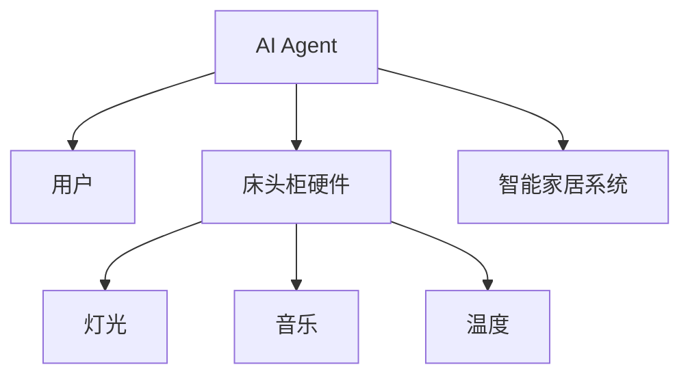
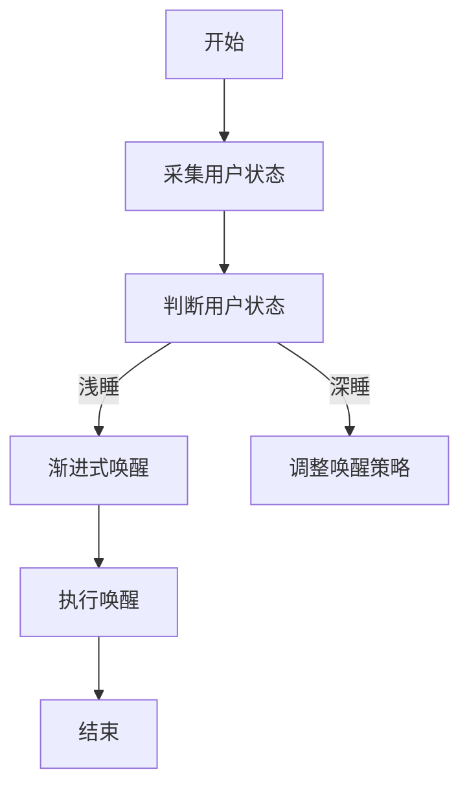
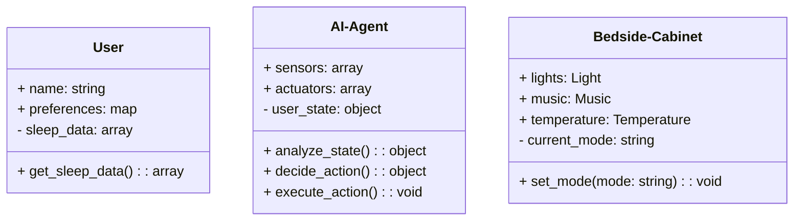
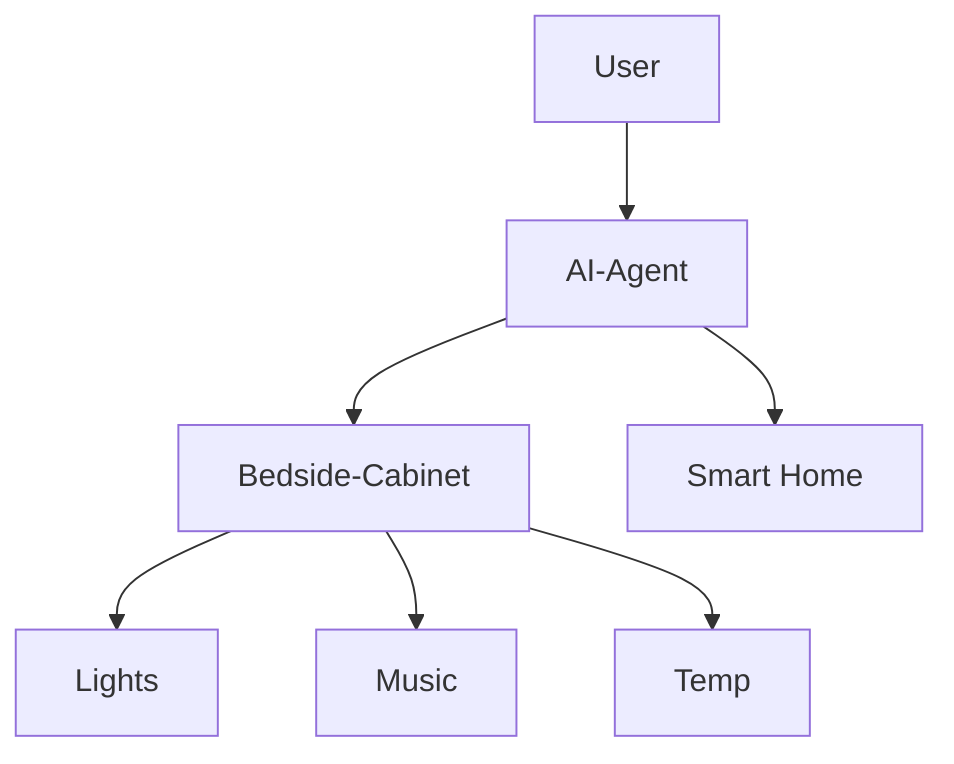
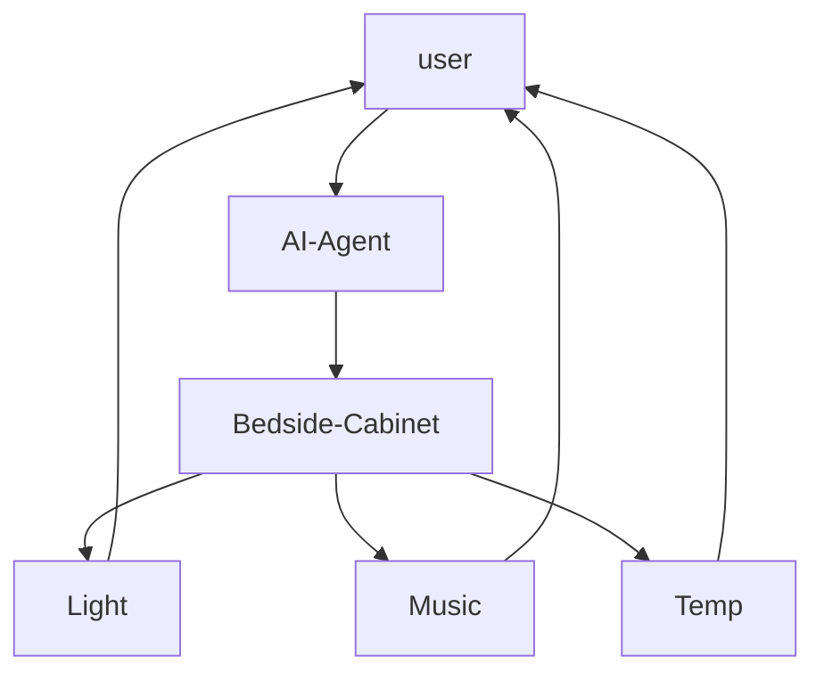

                 


# AI Agent在智能床头柜中的渐进式唤醒

**关键词：** AI Agent，智能床头柜，渐进式唤醒，智能家居，AI算法，物联网，智能系统

**摘要：**  
本文探讨了AI Agent在智能床头柜中的应用，重点分析了如何通过渐进式唤醒技术帮助用户实现科学、舒适的起床过程。文章从背景、概念、算法、系统架构到项目实战，全面解析了这一技术的核心原理和实现方式，为智能家居领域提供了新的思路和解决方案。

---

## 第一部分: 背景介绍

### 第1章: 背景介绍

#### 1.1 问题背景
##### 1.1.1 现代人对智能起床的需求
现代人生活节奏快，睡眠质量普遍不佳，传统闹钟的突然唤醒方式容易导致起床困难和情绪波动。智能床头柜结合AI Agent，能够通过渐进式唤醒技术，帮助用户以更舒适的方式起床。

##### 1.1.2 渐进式唤醒的科学依据
渐进式唤醒基于人体生理节律，通过逐步增强的刺激（如灯光、音乐、温度等）帮助用户自然过渡到清醒状态，减少起床时的不适感。

##### 1.1.3 AI Agent在智能家居中的应用潜力
AI Agent（人工智能代理）能够通过学习用户的行为和偏好，主动调整设备状态，是实现智能家居个性化服务的核心技术。

#### 1.2 问题描述
##### 1.2.1 传统闹钟的局限性
传统闹钟以固定的音调和时间唤醒用户，无法根据用户的睡眠状态和偏好进行调整。

##### 1.2.2 渐进式唤醒的需求分析
用户需要一种更温和、个性化的唤醒方式，能够根据自身状态逐步调整唤醒强度。

##### 1.2.3 智能床头柜的定义与功能
智能床头柜是一个集成AI Agent的智能设备，能够通过多种传感器和执行器实现渐进式唤醒、环境控制和用户交互。

#### 1.3 问题解决
##### 1.3.1 AI Agent的核心作用
AI Agent通过感知用户状态和环境信息，智能调整唤醒策略，提供个性化的起床体验。

##### 1.3.2 渐进式唤醒的实现方式
通过逐步增强的刺激（如灯光渐亮、音乐渐响、温度调节等）帮助用户自然过渡到清醒状态。

##### 1.3.3 智能床头柜的系统架构
智能床头柜由硬件设备（如传感器、执行器）和软件系统（AI Agent、唤醒算法）组成，能够与智能家居其他设备联动。

#### 1.4 边界与外延
##### 1.4.1 系统边界定义
智能床头柜的功能仅限于床头区域，不涉及其他智能家居设备的独立运行。

##### 1.4.2 功能的外延扩展
未来可以扩展至家庭其他场景，如智能窗帘、智能灯光等。

##### 1.4.3 与其他智能家居设备的联动
智能床头柜可以通过物联网协议与家庭其他设备联动，实现更复杂的起床场景。

#### 1.5 概念结构与核心要素
##### 1.5.1 AI Agent的组成要素
- **感知层**：传感器采集用户状态和环境信息。
- **决策层**：AI算法分析数据，制定唤醒策略。
- **执行层**：驱动床头柜的硬件设备执行唤醒操作。

##### 1.5.2 渐进式唤醒的实现要素
- **时间轴**：根据用户生理节律制定唤醒计划。
- **刺激强度**：逐步增强的灯光、音乐、温度等刺激。
- **用户反馈**：实时采集用户的生理和情绪反馈，动态调整唤醒策略。

##### 1.5.3 智能床头柜的系统要素
- **硬件设备**：灯光、音乐、温度调节等执行器。
- **软件系统**：AI Agent、唤醒算法、用户数据存储。
- **交互界面**：用户可以通过手机APP或语音助手设置唤醒计划。

---

## 第二部分: 核心概念与联系

### 第2章: 核心概念原理

#### 2.1 AI Agent的定义与原理
##### 2.1.1 AI Agent的基本定义
AI Agent是一种能够感知环境、自主决策并执行任务的智能实体，能够在复杂环境中为用户提供个性化服务。

##### 2.1.2 基于状态的唤醒策略
AI Agent根据用户的睡眠状态和环境信息，动态调整唤醒策略。例如，当用户处于浅睡阶段，AI Agent会逐渐增强唤醒刺激。

##### 2.1.3 基于用户行为的学习机制
AI Agent通过长期采集用户的起床习惯和偏好，优化唤醒策略，提供更个性化的服务。

#### 2.2 渐进式唤醒的实现原理
##### 2.2.1 基于时间的唤醒策略
AI Agent根据用户的起床时间，制定一个逐步增强的唤醒计划。

##### 2.2.2 基于用户生理节律的唤醒模型
AI Agent结合用户的生理数据（如心率、体温）和环境数据（如光线、温度），制定个性化的唤醒计划。

##### 2.2.3 多模态输入的处理机制
AI Agent能够同时处理多种输入信号（如声音、光线、温度），实现多模态的唤醒效果。

#### 2.3 核心概念对比
##### 2.3.1 AI Agent与传统闹钟的功能对比
| 功能维度 | AI Agent | 传统闹钟 |
|----------|-----------|----------|
| **唤醒方式** | 渐进式唤醒 | 强制唤醒 |
| **个性化** | 高度个性化 | 非个性化 |
| **智能性** | 自适应学习 | 无智能性 |

##### 2.3.2 渐进式唤醒与强制唤醒的效果对比
| 效果维度 | 渐进式唤醒 | 强制唤醒 |
|----------|------------|----------|
| **舒适度** | 高 | 低 |
| **起床难度** | 低 | 高 |
| **用户满意度** | 高 | 低 |

##### 2.3.3 智能床头柜与其他智能家居设备的联动对比
| 设备类型 | 智能床头柜 | 其他智能家居设备 |
|----------|------------|----------------|
| **功能** | 渐进式唤醒、环境控制 | 灯光、空调、电视等 |
| **联动性** | 高 | 中 |

#### 2.4 实体关系图


---

## 第三部分: 算法原理讲解

### 第3章: 算法原理

#### 3.1 基于状态的唤醒算法
##### 3.1.1 算法流程


##### 3.1.2 算法代码实现
```python
import numpy as np

def gradual_wakeup(user_state):
    # 用户状态：0 表示深睡，1 表示浅睡
    if user_state == 0:
        # 深睡阶段，调整唤醒策略
        return "adjust_wakeup_strategy"
    else:
        # 浅睡阶段，执行渐进式唤醒
        return "start_gradual_wakeup"

# 示例用户状态
user_state = np.random.choice([0, 1], p=[0.7, 0.3])
result = gradual_wakeup(user_state)
print(result)
```

##### 3.1.3 数学模型与公式
渐进式唤醒的时间间隔计算公式：
$$ t_{interval} = t_{base} \times (1 + \alpha \times t_{progress}) $$
其中，$\alpha$ 是唤醒强度系数，$t_{progress}$ 是唤醒进度。

#### 3.2 唤醒策略优化
##### 3.2.1 基于用户反馈的优化算法
```python
def optimize_wakeup_strategy(feedback):
    # 反馈：0 表示不满意，1 表示满意
    if feedback == 0:
        # 调整唤醒强度
        return "increase_intensity"
    else:
        # 保持当前策略
        return "keep_strategy"

# 示例反馈
feedback = np.random.choice([0, 1], p=[0.2, 0.8])
result = optimize_wakeup_strategy(feedback)
print(result)
```

##### 3.2.2 基于机器学习的优化模型
使用强化学习算法优化唤醒策略，通过奖励机制调整唤醒强度。

---

## 第四部分: 系统分析与架构设计

### 第4章: 系统分析与架构设计

#### 4.1 项目介绍
##### 4.1.1 项目场景
智能床头柜在智能家居中的应用场景，如卧室环境控制、起床辅助等。

##### 4.1.2 系统功能设计
- 灯光控制
- 音乐播放
- 温度调节
- 唤醒计划设置
- 用户反馈收集

#### 4.2 系统架构设计
##### 4.2.1 领域模型类图


##### 4.2.2 系统架构图


##### 4.2.3 接口设计
- 用户接口：手机APP、语音助手
- 系统接口：与智能家居平台的API对接

##### 4.2.4 交互流程图


---

## 第五部分: 项目实战

### 第5章: 项目实战

#### 5.1 环境安装
##### 5.1.1 系统要求
- 操作系统：Linux/Windows/MacOS
- 开发工具：Python、Jupyter Notebook、Git
- 依赖库：numpy、pandas、scikit-learn

##### 5.1.2 安装步骤
```bash
pip install numpy
pip install pandas
pip install scikit-learn
```

#### 5.2 系统核心实现
##### 5.2.1 唤醒算法实现
```python
import numpy as np
from sklearn import linear_model

def gradual_wakeup(user_state):
    # 假设user_state是一个包含睡眠数据的数组
    # 使用线性回归模型预测最佳唤醒时间
    model = linear_model.LinearRegression()
    model.fit(np.array([0, 1, 2, 3, 4]).reshape(-1, 1), np.array([1, 2, 3, 4, 5]))
    predicted_time = model.predict(np.array([user_state]).reshape(-1, 1))
    return predicted_time[0][0]
```

##### 5.2.2 系统集成
```python
class BedsideCabinet:
    def __init__(self):
        self.lights = Light()
        self.music = Music()
        self.temperature = Temperature()
    
    def start_wakeup(self, user_state):
        predicted_time = gradual_wakeup(user_state)
        self.lights.brightness = predicted_time * 0.2
        self.music.volume = predicted_time * 0.3
        self.temperature.set_temp(predicted_time + 1)
```

#### 5.3 代码应用解读
##### 5.3.1 唤醒算法解读
- 使用线性回归模型预测唤醒时间，根据用户的睡眠状态调整刺激强度。

##### 5.3.2 系统集成解读
- 床头柜硬件通过AI Agent控制，实现灯光、音乐、温度的联动。

#### 5.4 案例分析
##### 5.4.1 案例场景
用户设定一个起床计划，AI Agent根据用户的睡眠数据，调整灯光、音乐和温度，逐步唤醒用户。

##### 5.4.2 案例实现
```python
# 示例用户状态
user_state = 3  # 假设值
cabinet = BedsideCabinet()
cabinet.start_wakeup(user_state)
```

##### 5.4.3 案例分析
通过案例分析，验证AI Agent在智能床头柜中的渐进式唤醒技术的有效性和用户满意度。

#### 5.5 项目小结
总结项目实现的关键点和实际应用效果，为后续优化提供参考。

---

## 第六部分: 最佳实践

### 第6章: 最佳实践

#### 6.1 小结
- AI Agent在智能床头柜中的渐进式唤醒技术能够显著提升用户的起床体验。
- 系统设计需要综合考虑硬件、软件和用户反馈，实现个性化的唤醒策略。

#### 6.2 注意事项
- 确保系统的安全性，避免数据泄露。
- 定期更新AI算法，提升用户体验。
- 注意设备的兼容性，确保与智能家居系统的无缝对接。

#### 6.3 拓展阅读
- 推荐阅读《智能系统设计》、《AI算法实现》等书籍，深入了解AI在智能家居中的应用。

---

## 作者

**作者：AI天才研究院/AI Genius Institute & 禅与计算机程序设计艺术 /Zen And The Art of Computer Programming**

---

希望这篇文章能为您提供有价值的技术见解和实践指导！

