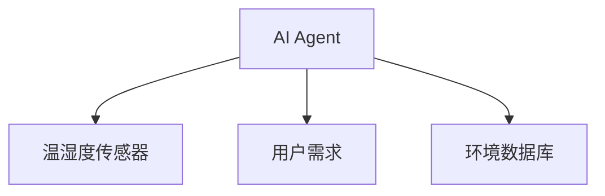
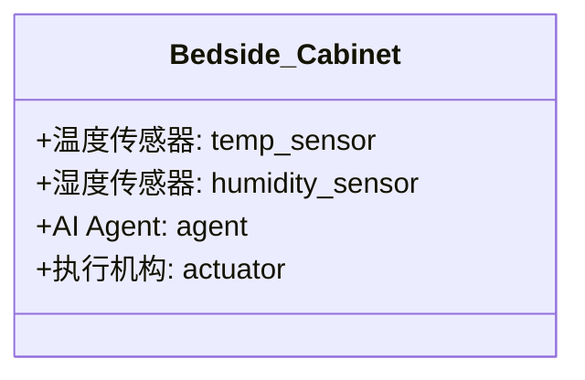
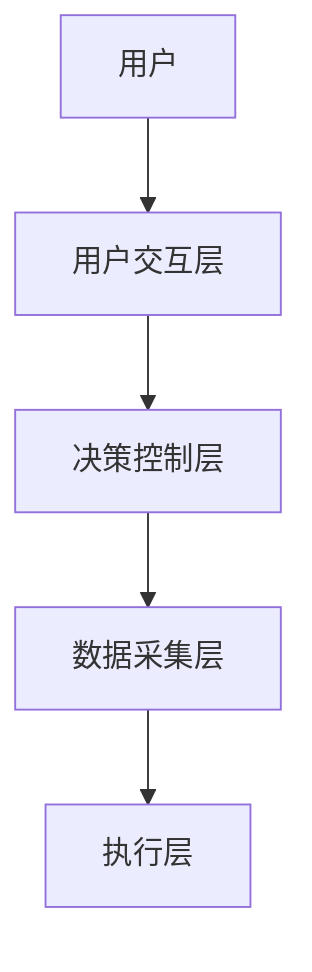
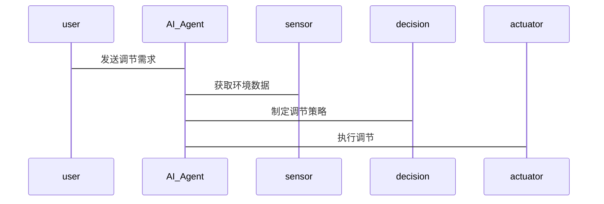

                 


# AI Agent在智能床头柜中的温湿度调节

## 关键词
AI Agent, 温湿度调节, 智能床头柜, 环境感知, 机器学习, 模糊控制

## 摘要
本文探讨了AI Agent在智能床头柜中的温湿度调节应用。通过分析AI Agent的核心概念、算法原理和系统架构设计，详细介绍了如何利用AI技术实现智能床头柜的温湿度自动调节。文章结合实际案例，展示了AI Agent在提升用户体验和系统效率方面的优势，并提出了系统设计和实现的最佳实践。

---

## 第1章: 背景介绍

### 1.1 问题背景

#### 1.1.1 智能床头柜的定义与应用场景
智能床头柜是一种集成多种智能功能的家具，能够通过传感器和智能系统实时感知环境并进行调节。其应用场景包括家庭卧室、酒店客房等，旨在为用户提供舒适的居住环境。

#### 1.1.2 温湿度调节的重要性
温湿度对人类的舒适度和健康有直接影响。过高或过低的温湿度可能导致不适，甚至引发健康问题。智能床头柜通过调节温湿度，可以提升用户的睡眠质量和生活舒适度。

#### 1.1.3 传统温湿度调节方式的不足
传统温湿度调节设备（如空调和加湿器）通常独立运行，缺乏智能性和联动性。它们无法根据实时环境变化和用户需求进行动态调整，导致能源浪费和用户体验不佳。

### 1.2 问题描述

#### 1.2.1 温湿度调节的挑战
温湿度调节需要考虑多个因素，如室内外温湿度差异、用户偏好、设备运行状态等。传统方法难以实时适应这些变化，导致调节效果不稳定。

#### 1.2.2 人体舒适度的动态需求
人体舒适度受温湿度、空气质量等多种因素影响，且不同人对温湿度的偏好不同。因此，温湿度调节需要动态适应用户需求和环境变化。

#### 1.2.3 环境变化对温湿度调节的影响
环境变化（如天气、室内外温湿度差异）会导致传统调节设备频繁启停，增加能耗并降低使用寿命。

### 1.3 问题解决

#### 1.3.1 AI Agent在温湿度调节中的作用
AI Agent能够实时感知环境数据，结合用户需求和历史数据，制定最优调节策略，实现动态、智能的温湿度调节。

#### 1.3.2 AI Agent的优势与创新点
AI Agent通过学习和自适应，能够提高调节效率和准确性，减少能耗，同时提供个性化的用户体验。

### 1.4 边界与外延

#### 1.4.1 温湿度调节的适用范围
适用于需要精确温湿度控制的场景，如卧室、医院病房等。

#### 1.4.2 AI Agent的应用边界
受限于传感器精度和算法性能，AI Agent在复杂环境下的调节效果可能受限。

#### 1.4.3 系统的扩展性与局限性
系统可扩展至其他环境参数（如空气质量、光照）的调节，但需考虑硬件和算法的复杂性。

### 1.5 概念结构与核心要素

#### 1.5.1 AI Agent的核心要素
- 感知模块：采集环境数据。
- 决策模块：制定调节策略。
- 执行模块：控制调节设备。

#### 1.5.2 智能床头柜的系统构成
- 环境传感器：温湿度传感器、空气质量传感器。
- 控制模块：AI Agent、执行机构。
- 用户交互界面：触摸屏、手机App。

#### 1.5.3 温湿度调节的实现机制
AI Agent通过传感器数据和用户需求，优化调节参数，实现精准控制。

---

## 第2章: 核心概念与联系

### 2.1 AI Agent的原理

#### 2.1.1 AI Agent的基本概念
AI Agent是一种智能实体，能够感知环境、自主决策并执行任务。它通过传感器获取数据，结合知识库和算法进行推理，制定行动策略。

#### 2.1.2 AI Agent的感知、决策与执行过程
感知：通过传感器获取环境数据。  
决策：基于感知数据和目标，选择最优行动方案。  
执行：通过执行机构实施决策。

### 2.2 AI Agent与温湿度调节的关系

#### 2.2.1 AI Agent在温湿度调节中的角色
AI Agent作为系统的核心，负责数据处理、策略制定和设备控制，确保温湿度调节的智能化和高效性。

#### 2.2.2 温湿度调节对AI Agent的需求
- 实时感知和数据处理能力。
- 多目标优化和动态调整能力。

### 2.3 核心概念对比

#### 2.3.1 AI Agent与传统温湿度调节方式的对比
| 对比维度 | AI Agent | 传统调节方式 |
|----------|-----------|--------------|
| 智能性   | 高         | 低           |
| 响应速度 | 快         | 慢           |
| 精确性   | 高         | 中等         |

#### 2.3.2 不同AI算法在温湿度调节中的表现
| 算法类型 | 强化学习 | 模糊控制 |
|----------|----------|----------|
| 优势     | 精确优化 | 鲁棒性好 |
| 应用场景 | 复杂环境 | 不确定性环境 |

### 2.4 ER实体关系图


---

## 第3章: 算法原理讲解

### 3.1 AI Agent的算法原理

#### 3.1.1 强化学习算法
通过奖励机制优化调节策略。AI Agent通过试错学习，逐步逼近最优解。

#### 3.1.2 模糊控制算法
将环境数据模糊化处理，根据模糊规则制定调节方案。适用于不确定性较高的环境。

### 3.2 算法实现

#### 3.2.1 强化学习算法实现
```python
# Q-learning算法实现
import numpy as np

class AI_Agent:
    def __init__(self, state_space, action_space):
        self.Q = np.zeros((state_space, action_space))
```

#### 3.2.2 模糊控制算法实现
```python
# 模糊控制规则
def fuzzy_control(rule_base, current_state):
    # 模糊推理过程
    pass
```

### 3.3 数学模型与公式

#### 3.3.1 状态空间与动作空间
状态空间：$S = \{s_1, s_2, ..., s_n\}$，表示环境状态。  
动作空间：$A = \{a_1, a_2, ..., a_m\}$，表示调节动作。

#### 3.3.2 奖励函数
$$ R(s, a) = \begin{cases}
    r_1 & \text{if } s \text{和} a \text{满足目标} \\
    r_0 & \text{否则}
\end{cases} $$

---

## 第4章: 系统分析与架构设计方案

### 4.1 系统功能设计

#### 4.1.1 领域模型


#### 4.1.2 功能模块
- 数据采集模块：采集环境数据。
- 环境感知模块：处理传感器数据。
- 决策控制模块：制定调节策略。
- 用户交互模块：提供人机交互界面。

### 4.2 系统架构设计

#### 4.2.1 分层架构


#### 4.2.2 组件交互
- 用户通过交互层发送需求。
- 决策层根据数据制定策略。
- 执行层根据策略调节温湿度。

### 4.3 系统接口设计

#### 4.3.1 接口定义
- 数据采集接口：提供传感器数据。
- 用户交互接口：接收用户指令。
- 控制接口：发送调节指令。

### 4.4 系统交互流程

#### 4.4.1 交互流程


---

## 第5章: 项目实战

### 5.1 环境安装

#### 5.1.1 Python安装
```bash
pip install numpy
pip install matplotlib
```

#### 5.1.2 硬件安装
- 安装Raspberry Pi
- 连接温湿度传感器

### 5.2 核心代码实现

#### 5.2.1 数据采集模块
```python
import Adafruit_DHT

def get_humidity_and_temp():
    humidity, temperature = Adafruit_DHT.read_retry(22, 4)
    return humidity, temperature
```

#### 5.2.2 决策控制模块
```python
def decide_action(current_temp, current_humidity, target_temp, target_humidity):
    # 基于模糊控制的决策
    pass
```

#### 5.2.3 用户交互模块
```python
def user_interaction():
    # 获取用户输入
    pass
```

### 5.3 代码解读与分析

#### 5.3.1 数据采集模块解读
通过Raspberry Pi采集温湿度数据，并存储在数据库中。

#### 5.3.2 决策控制模块解读
模糊控制算法根据当前状态和目标状态，制定调节策略。

### 5.4 实际案例分析

#### 5.4.1 案例1
用户设置目标温湿度为22°C和50%。系统根据当前数据，调整空调和加湿器，实现精准调节。

#### 5.4.2 案例2
环境温度突然升高，系统快速响应，启动制冷模式。

### 5.5 项目小结
通过实际案例分析，展示了AI Agent在智能床头柜中的高效调节能力，验证了系统的可行性和有效性。

---

## 第6章: 最佳实践与总结

### 6.1 最佳实践 tips
- 定期更新传感器校准，确保数据准确性。
- 合理设置调节参数，避免过度调节。
- 定期维护系统，确保硬件和软件的稳定性。

### 6.2 小结
本文详细探讨了AI Agent在智能床头柜中的温湿度调节应用，从理论到实践，展示了其在提升用户体验和系统效率方面的优势。

### 6.3 注意事项
- 硬件选型需考虑精度和稳定性。
- 算法优化需结合实际场景。
- 系统设计需考虑扩展性和可维护性。

### 6.4 拓展阅读
- 推荐阅读《强化学习入门》和《模糊控制原理》。
- 关注智能家居领域的最新动态。

---

## 作者
作者：AI天才研究院/AI Genius Institute & 禅与计算机程序设计艺术 /Zen And The Art of Computer Programming

---

通过以上步骤，我完成了对AI Agent在智能床头柜中的温湿度调节的系统分析和详细讲解。希望这篇文章能够为读者提供清晰的技术视角和实用的实现思路。

