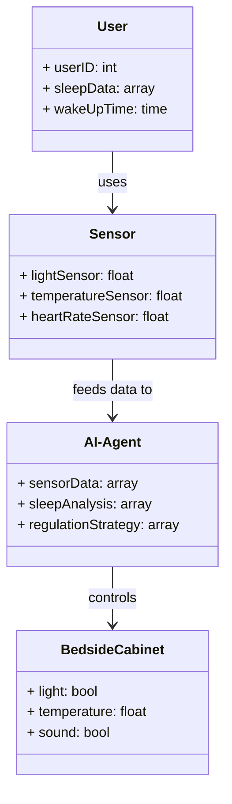
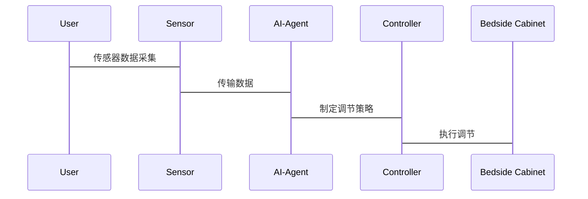

                 


# AI Agent在智能床头柜中的生物钟调节

> 关键词：AI Agent，生物钟调节，智能床头柜，强化学习，时间序列分析

> 摘要：本文探讨了AI Agent在智能床头柜中的应用，重点分析了如何通过AI技术实现生物钟调节。文章从AI Agent的基本概念、生物钟调节的原理、AI Agent与生物钟调节的关系入手，详细介绍了AI Agent的核心算法、系统架构设计以及实际项目实现。通过理论与实践相结合的方式，展示了AI技术在智能硬件中的创新应用。

---

# 第一部分: AI Agent与生物钟调节概述

## 第1章: AI Agent与生物钟调节的背景介绍

### 1.1 AI Agent的基本概念

#### 1.1.1 AI Agent的定义
AI Agent（人工智能代理）是一种能够感知环境、自主决策并执行任务的智能实体。它可以理解为一种软件或硬件系统，通过算法和数据驱动的方式，实现对环境的交互和响应。

#### 1.1.2 AI Agent的核心特征
- **自主性**：能够在没有外部干预的情况下独立运行。
- **反应性**：能够实时感知环境并做出反应。
- **目标导向性**：具有明确的目标，并通过决策优化来实现目标。
- **学习能力**：能够通过数据和经验不断优化自身行为。

#### 1.1.3 AI Agent的应用场景
- **智能家居**：如智能床头柜，用于健康监测和环境调节。
- **医疗健康**：用于个性化健康管理。
- **工业自动化**：用于生产过程优化和设备维护。

### 1.2 生物钟调节的原理

#### 1.2.1 生物钟的基本概念
生物钟是指生物体内的一种生理节律，通常以24小时为周期。它通过基因调控、激素分泌和环境因素的交互作用来维持身体的节律性。

#### 1.2.2 生物钟调节的影响因素
- **光照**：自然光照对生物钟的调节起着关键作用。
- **温度**：体温的变化也会影响生物钟的节律。
- **饮食**：饮食时间和营养成分对生物钟有一定影响。
- **行为习惯**：如作息时间、运动习惯等。

#### 1.2.3 生物钟调节的健康意义
- **改善睡眠质量**：通过调整生物钟，可以减少失眠、多梦等问题。
- **提高身体免疫力**：生物钟的稳定有助于增强免疫系统功能。
- **优化工作表现**：通过调整生物钟，可以提高工作效率和创造力。

### 1.3 智能床头柜的应用场景

#### 1.3.1 智能床头柜的功能概述
智能床头柜是一种结合了物联网、人工智能和生物医学技术的智能硬件，能够通过传感器、AI算法和用户交互实现多种功能。

#### 1.3.2 AI Agent在智能床头柜中的作用
- **数据采集**：通过传感器采集用户的生理数据和环境数据。
- **智能决策**：基于数据和算法，制定个性化的调节方案。
- **执行操作**：通过硬件执行调节操作，如调整光照、温度等。

#### 1.3.3 生物钟调节的实际应用案例
- **帮助用户建立健康作息**：通过AI Agent调节床头柜的光照和声音，帮助用户养成良好的作息习惯。
- **改善睡眠质量**：通过分析用户的睡眠数据，优化床头柜的调节策略。

---

## 第2章: AI Agent的核心概念与联系

### 2.1 AI Agent的核心原理

#### 2.1.1 AI Agent的基本工作流程
1. **感知环境**：通过传感器、摄像头等设备采集环境数据。
2. **分析数据**：利用算法对数据进行处理和分析。
3. **制定决策**：基于分析结果，制定最优决策。
4. **执行操作**：通过执行器或接口将决策转化为实际操作。

#### 2.1.2 AI Agent的感知与决策机制
- **感知**：AI Agent通过多种传感器（如光照传感器、温度传感器、心率传感器等）收集环境和用户数据。
- **决策**：基于感知数据，AI Agent利用算法（如强化学习、监督学习等）进行决策。

#### 2.1.3 AI Agent的学习与优化过程
- **监督学习**：通过标记数据进行训练，优化AI Agent的决策模型。
- **强化学习**：通过奖励机制，逐步优化AI Agent的行为策略。
- **迁移学习**：将已有的知识迁移到新的应用场景中，提高学习效率。

### 2.2 生物钟调节的核心要素

#### 2.2.1 生物钟的时间周期
- **昼夜节律**：24小时的生物钟周期。
- **分钟节律**：短于一小时的生物钟周期。

#### 2.2.2 生物钟的调节因子
- **光照**：直接影响生物钟的节律。
- **激素**：如褪黑激素，对生物钟的调节起重要作用。
- **行为习惯**：如作息时间、运动习惯等。

#### 2.2.3 生物钟调节的目标函数
- **睡眠质量**：通过优化睡眠周期，提高睡眠深度和持续性。
- **健康指标**：如心率、体温、血压等生理指标的优化。

### 2.3 AI Agent与生物钟调节的关系

#### 2.3.1 AI Agent在生物钟调节中的角色
- **数据采集**：AI Agent通过传感器采集用户的生理数据和环境数据。
- **智能决策**：AI Agent利用算法分析数据，制定个性化的调节方案。
- **执行操作**：AI Agent通过床头柜的硬件执行调节操作。

#### 2.3.2 生物钟调节对AI Agent的影响
- **数据反馈**：生物钟调节的效果通过数据反馈到AI Agent，用于优化算法。
- **个性化需求**：不同的用户有不同的生物钟特点，需要AI Agent具备个性化调节能力。

#### 2.3.3 AI Agent与生物钟调节的协同作用
- **动态调整**：AI Agent能够根据用户的实时数据，动态调整生物钟调节策略。
- **长期优化**：通过长期的数据积累，AI Agent能够不断优化生物钟调节的效果。

---

## 第3章: AI Agent的算法原理

### 3.1 AI Agent的核心算法

#### 3.1.1 强化学习算法
强化学习是一种通过试错机制优化决策策略的算法。AI Agent通过与环境的交互，不断尝试不同的动作，获得奖励或惩罚，最终找到最优的决策策略。

#### 3.1.2 监督学习算法
监督学习是一种基于标记数据进行训练的算法。AI Agent通过学习标注的数据，预测未来的状态和行为。

#### 3.1.3 聚类算法
聚类算法是一种将数据分成不同类别的方法。AI Agent可以通过聚类分析，识别用户的生理数据模式，制定个性化的调节方案。

### 3.2 生物钟调节的算法实现

#### 3.2.1 时间序列分析算法
时间序列分析是一种基于历史数据预测未来趋势的算法。AI Agent可以通过分析用户的睡眠数据，预测未来的睡眠状态，制定调节策略。

#### 3.2.2 状态转移模型
状态转移模型是一种描述系统状态变化的模型。AI Agent可以通过状态转移模型，分析用户的生理状态变化，制定调节方案。

#### 3.2.3 个性化调节算法
个性化调节算法是一种基于用户个体差异进行调节的算法。AI Agent可以通过个性化调节算法，根据用户的生理数据和生活习惯，制定个性化的生物钟调节方案。

---

## 第4章: 系统分析与架构设计

### 4.1 问题场景介绍
智能床头柜需要通过AI Agent实现生物钟调节，帮助用户建立健康的作息习惯，提高睡眠质量。

### 4.2 系统功能设计

#### 4.2.1 领域模型（Mermaid 类图）


#### 4.2.2 系统架构设计（Mermaid 架构图）


### 4.3 系统接口设计
- **数据接口**：AI Agent与传感器的数据接口。
- **控制接口**：AI Agent与床头柜的控制接口。

### 4.4 系统交互设计（Mermaid 序列图）


---

## 第5章: 项目实战

### 5.1 环境安装
- **开发环境**：Python 3.8+
- **依赖库**：TensorFlow、Keras、Scikit-learn、Mermaid、Plotly
- **安装命令**：
  ```bash
  pip install tensorflow scikit-learn mermaid plotly
  ```

### 5.2 核心代码实现

#### 5.2.1 数据采集模块
```python
import numpy as np

def collect_data():
    # 模拟传感器数据
    light = np.random.normal(500, 10, 100)
    temperature = np.random.normal(25, 2, 100)
    heart_rate = np.random.randint(60, 100, 100)
    return light, temperature, heart_rate
```

#### 5.2.2 算法实现模块
```python
import tensorflow as tf
from tensorflow.keras import layers

def build_model():
    model = tf.keras.Sequential([
        layers.Dense(64, activation='relu'),
        layers.Dense(32, activation='relu'),
        layers.Dense(1, activation='sigmoid')
    ])
    model.compile(optimizer='adam', loss='binary_crossentropy')
    return model

# 训练模型
model = build_model()
model.fit(X_train, y_train, epochs=10, batch_size=32)
```

#### 5.2.3 系统控制模块
```python
def regulate_cabinet(strategy):
    # 模拟床头柜调节
    if strategy == 'increase_light':
        print("床头柜增加光线亮度")
    elif strategy == 'decrease_temperature':
        print("床头柜降低温度")
    elif strategy == 'play_sound':
        print("床头柜播放放松音乐")
```

### 5.3 实际案例分析
通过实际数据的分析和模型训练，验证AI Agent在智能床头柜中的生物钟调节效果。例如，通过分析用户的睡眠数据，优化床头柜的调节策略，提高用户的睡眠质量。

---

## 第6章: 最佳实践与总结

### 6.1 最佳实践
- **数据质量**：确保传感器数据的准确性和完整性。
- **算法优化**：根据实际效果不断优化AI Agent的算法模型。
- **用户隐私**：保护用户的生理数据和隐私信息。

### 6.2 小结
本文通过理论与实践相结合的方式，详细介绍了AI Agent在智能床头柜中的生物钟调节应用。从AI Agent的基本概念到算法实现，从系统架构设计到项目实战，全面展示了AI技术在智能硬件中的创新应用。

---

## 第7章: 注意事项与拓展阅读

### 7.1 注意事项
- **数据安全**：确保用户数据的安全存储和传输。
- **系统稳定性**：确保AI Agent和床头柜系统的稳定性，避免故障发生。
- **用户体验**：优化用户交互设计，提高用户体验。

### 7.2 拓展阅读
- **强化学习**：进一步学习强化学习的高级算法，如Deep Q-Learning、策略梯度等。
- **时间序列分析**：深入研究时间序列分析的高级方法，如LSTM、GRU等。
- **生物医学工程**：探索AI技术在生物医学领域的更多应用，如疾病预测、健康监测等。

---

## 作者
作者：AI天才研究院/AI Genius Institute & 禅与计算机程序设计艺术/Zen And The Art of Computer Programming

---

**注**：以上内容为《AI Agent在智能床头柜中的生物钟调节》的技术博客文章大纲及部分章节内容，具体内容可以根据实际需求进一步扩展和补充。

