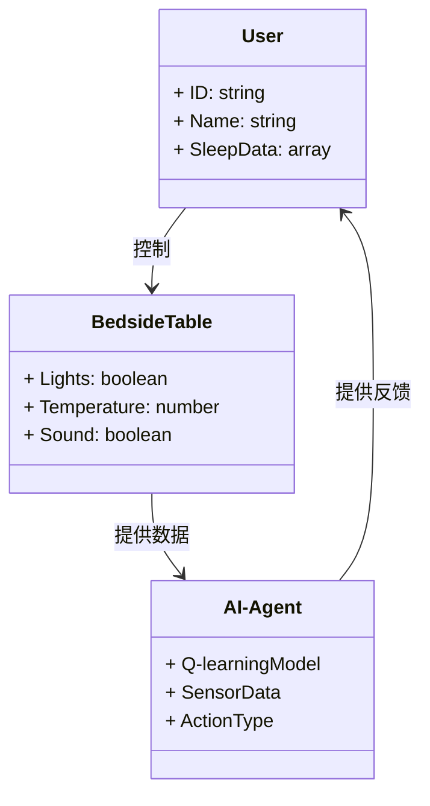
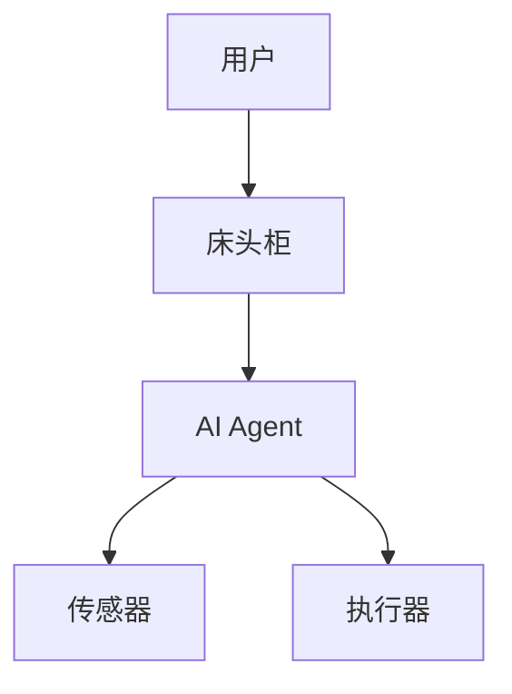

                 


# AI Agent在智能床头柜中的生物钟调节

> 关键词：AI Agent, 生物钟调节, 智能床头柜, 强化学习, 系统架构设计

> 摘要：本文探讨了AI Agent在智能床头柜中的生物钟调节应用，分析了AI Agent的核心概念、算法原理、系统架构设计以及实际应用场景。通过强化学习算法和系统设计，展示了如何利用AI技术优化生物钟调节过程，为用户打造智能化、个性化的健康睡眠解决方案。

---

# 第一部分: AI Agent与生物钟调节概述

# 第1章: AI Agent与生物钟调节的背景介绍

## 1.1 AI Agent的基本概念

### 1.1.1 AI Agent的定义
AI Agent（人工智能代理）是指能够感知环境、做出决策并执行动作的智能系统。它能够根据环境反馈不断优化自身行为，以实现特定目标。

### 1.1.2 AI Agent的核心特征
- **自主性**：能够独立运行，无需人工干预。
- **反应性**：能够实时感知环境变化并做出反应。
- **学习能力**：通过数据和反馈不断优化自身行为。
- **适应性**：能够根据环境变化调整策略。

### 1.1.3 AI Agent与传统自动化的区别
| 特性 | AI Agent | 传统自动化 |
|------|-----------|------------|
| 决策方式 | 基于学习和优化 | 基于固定规则 |
| 灵活性 | 高 | 低 |
| 适应性 | 强 | 弱 |

## 1.2 生物钟调节的重要性

### 1.2.1 生物钟的基本原理
生物钟是人体内一种复杂的调节系统，控制着许多生理过程，包括睡眠、觉醒、体温和激素分泌等。

### 1.2.2 生物钟紊乱的危害
- **睡眠障碍**：导致失眠或多梦，影响睡眠质量。
- **健康问题**：长期紊乱可能导致免疫力下降、焦虑、抑郁等问题。
- **工作效率**：生物钟紊乱会影响专注力和工作效率。

### 1.2.3 生物钟调节的常见方法
- **药物治疗**：通过药物调整睡眠节律。
- **光疗**：利用光照调节生物钟。
- **行为疗法**：通过调整作息习惯改善生物钟。

## 1.3 AI Agent在生物钟调节中的应用

### 1.3.1 AI Agent如何实现生物钟调节
AI Agent通过感知用户的行为和环境数据，结合强化学习算法，优化生物钟调节策略。

### 1.3.2 智能床头柜的功能与作用
智能床头柜集成了多种传感器和执行器，能够实时监测用户的状态，并通过AI Agent进行智能调节。

### 1.3.3 AI Agent在床头柜中的具体应用场景
- **睡眠监测**：通过传感器监测用户的睡眠状态。
- **智能调节**：根据用户状态自动调节床头柜的灯光、温度和声音。
- **个性化设置**：为不同用户提供个性化的生物钟调节方案。

## 1.4 本章小结
本章介绍了AI Agent的基本概念、生物钟调节的重要性以及AI Agent在床头柜中的具体应用。通过AI Agent和传统方法的对比，强调了AI技术在生物钟调节中的优势。

---

# 第二部分: AI Agent的核心概念与生物钟调节的联系

# 第2章: AI Agent的核心概念与原理

## 2.1 AI Agent的感知、决策与执行

### 2.1.1 感知层：数据采集与分析
AI Agent通过多种传感器（如光线、温度、声音等）采集环境数据，并通过算法进行分析。

### 2.1.2 决策层：算法与模型
AI Agent基于感知层的数据，利用强化学习等算法生成决策。

### 2.1.3 执行层：指令输出与反馈
AI Agent根据决策层的指令，通过执行器（如LED灯、空调等）调整环境，并收集反馈信息。

## 2.2 生物钟调节的核心要素

### 2.2.1 生物钟的时间周期
生物钟的时间周期通常为24小时，但也可能因人而异。

### 2.2.2 生物钟调节的关键因素
- **光线**：光照强度和时间影响生物钟。
- **温度**：体温变化也会影响生物钟。
- **行为习惯**：作息时间、运动习惯等。

### 2.2.3 生物钟调节的目标与指标
目标是让用户拥有更好的睡眠质量，指标包括入睡时间、觉醒次数、睡眠时长等。

## 2.3 AI Agent与生物钟调节的结合

### 2.3.1 AI Agent如何感知生物钟状态
AI Agent通过传感器采集用户的生理数据（如心率、体温）和环境数据（如光线、温度）。

### 2.3.2 AI Agent如何优化生物钟调节
通过强化学习算法，AI Agent不断优化生物钟调节策略，以达到最佳效果。

### 2.3.3 生物钟调节的闭环反馈机制
AI Agent通过实时反馈不断调整策略，形成闭环调节机制。

## 2.4 本章小结
本章详细介绍了AI Agent的核心概念和生物钟调节的原理，重点分析了AI Agent在生物钟调节中的作用。

---

# 第三部分: AI Agent的算法原理与数学模型

# 第3章: AI Agent的算法原理

## 3.1 强化学习在AI Agent中的应用

### 3.1.1 强化学习的基本原理
强化学习是一种通过试错机制优化决策的算法，AI Agent通过与环境交互，不断优化策略。

### 3.1.2 Q-learning算法的实现
Q-learning是一种经典的强化学习算法，通过Q值表记录状态-动作对的期望奖励。

### 3.1.3 强化学习在生物钟调节中的应用
AI Agent通过Q-learning算法，优化生物钟调节策略。

## 3.2 强化学习的数学模型

### 3.2.1 Q-learning算法的数学公式
$$ Q(s,a) = Q(s,a) + \alpha [r + \gamma \max Q(s',a') - Q(s,a)] $$
其中：
- $s$ 是当前状态
- $a$ 是当前动作
- $r$ 是奖励
- $\gamma$ 是折扣因子
- $\alpha$ 是学习率

### 3.2.2 状态、动作和奖励的定义
- **状态**：用户的生理数据和环境数据。
- **动作**：调节床头柜的灯光、温度等。
- **奖励**：睡眠质量的提升。

## 3.3 强化学习的实现步骤

### 3.3.1 状态空间的定义
通过传感器采集用户的生理数据和环境数据，形成状态空间。

### 3.3.2 动作空间的定义
根据床头柜的功能，定义可执行的动作。

### 3.3.3 奖励函数的设计
根据睡眠质量设计奖励函数，奖励函数的目标是优化睡眠质量。

## 3.4 本章小结
本章详细介绍了强化学习算法在AI Agent中的应用，重点分析了Q-learning算法的数学模型和实现步骤。

---

# 第四部分: 系统分析与架构设计方案

# 第4章: 系统分析与架构设计方案

## 4.1 系统功能设计

### 4.1.1 领域模型设计
通过领域模型（mermaid类图）展示系统的核心功能模块。



### 4.1.2 系统功能模块
- **数据采集模块**：采集用户的生理数据和环境数据。
- **AI处理模块**：通过强化学习算法优化调节策略。
- **执行模块**：根据AI Agent的决策执行调节动作。

## 4.2 系统架构设计

### 4.2.1 系统架构图


### 4.2.2 系统接口设计
- **输入接口**：用户输入调节需求。
- **输出接口**：床头柜输出调节结果。
- **通信接口**：AI Agent与床头柜之间的数据交互。

## 4.3 本章小结
本章通过系统功能设计和架构设计，展示了AI Agent在智能床头柜中的具体实现方式。

---

# 第五部分: 项目实战

# 第5章: 项目实战

## 5.1 环境安装

### 5.1.1 Python安装
安装Python 3.8及以上版本。

### 5.1.2 TensorFlow安装
通过pip安装TensorFlow：
```bash
pip install tensorflow
```

### 5.1.3 Raspberry Pi安装
安装Raspberry Pi系统，用于连接床头柜的硬件设备。

## 5.2 系统核心实现

### 5.2.1 核心代码
```python
import numpy as np
import tensorflow as tf

# 定义Q-learning模型
class QLearningAgent:
    def __init__(self, state_size, action_size, learning_rate=0.1, gamma=0.9):
        self.state_size = state_size
        self.action_size = action_size
        self.learning_rate = learning_rate
        self.gamma = gamma
        self.Q = np.zeros((state_size, action_size))

    def act(self, state):
        return np.argmax(self.Q[state, :])

    def learn(self, state, action, reward, next_state):
        target = reward + self.gamma * np.max(self.Q[next_state, :])
        self.Q[state, action] += self.learning_rate * (target - self.Q[state, action])

# 初始化模型
state_size = 5  # 状态数
action_size = 3  # 动作数
agent = QLearningAgent(state_size, action_size)
```

### 5.2.2 代码解读
- **QLearningAgent类**：实现Q-learning算法。
- **act方法**：根据当前状态选择动作。
- **learn方法**：通过强化学习更新Q值表。

## 5.3 实际案例分析

### 5.3.1 案例背景
用户睡眠质量差，希望通过床头柜调节生物钟。

### 5.3.2 调节过程
1. AI Agent采集用户数据。
2. 通过Q-learning算法优化调节策略。
3. 执行调节动作（如调整灯光亮度）。
4. 根据反馈优化策略。

## 5.4 本章小结
本章通过项目实战，展示了AI Agent在智能床头柜中的具体实现过程，包括环境安装、核心代码实现和实际案例分析。

---

# 第六部分: 最佳实践

# 第6章: 最佳实践

## 6.1 小结
通过本文的介绍，读者可以全面了解AI Agent在智能床头柜中的生物钟调节应用。

## 6.2 注意事项
- **数据隐私**：注意保护用户数据隐私。
- **设备兼容性**：确保床头柜与AI Agent的兼容性。
- **用户体验**：优化用户体验，确保用户接受度。

## 6.3 扩展阅读
- **强化学习**：深入学习强化学习算法。
- **生物钟调节**：研究更多生物钟调节方法。
- **智能硬件**：了解智能硬件的设计与实现。

## 6.4 本章小结
本章总结了AI Agent在智能床头柜中的应用，并提出了实际应用中的注意事项和扩展阅读方向。

---

# 作者信息

作者：AI天才研究院/AI Genius Institute & 禅与计算机程序设计艺术 /Zen And The Art of Computer Programming

---

本文通过系统化的分析和详细的技术实现，展示了AI Agent在智能床头柜中的生物钟调节应用。通过强化学习算法和系统设计，为用户提供了智能化、个性化的健康睡眠解决方案。

