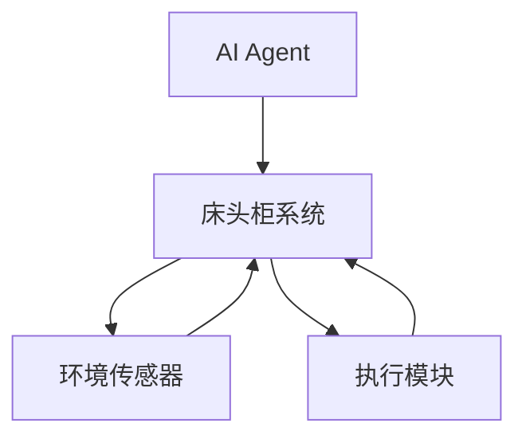
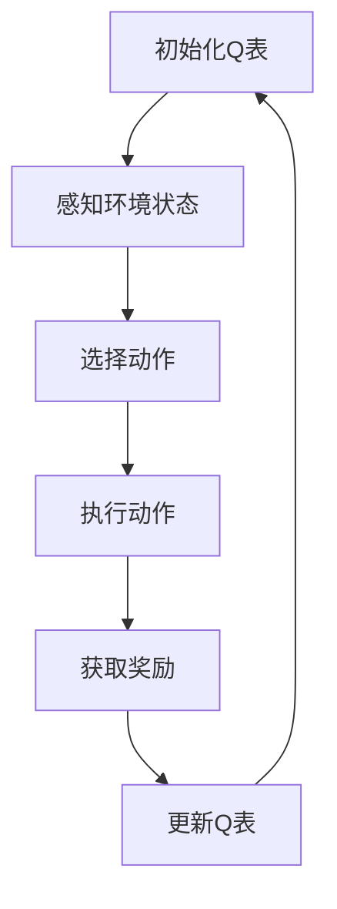
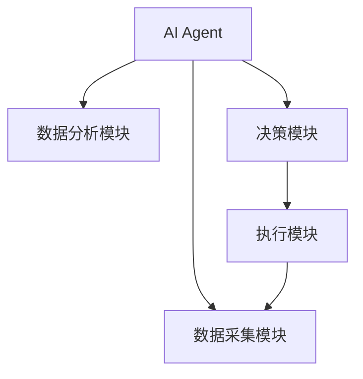
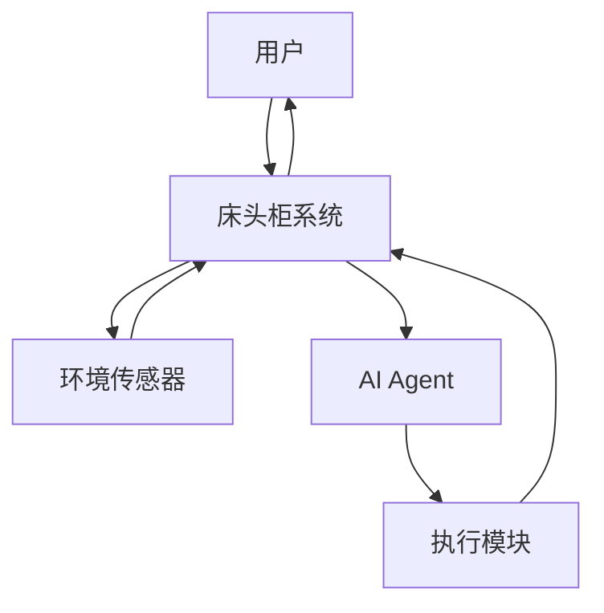

                 


# AI Agent在智能床头柜中的睡眠环境优化

> 关键词：AI Agent，智能床头柜，睡眠环境优化，强化学习，智能家居

> 摘要：本文详细探讨了AI Agent在智能床头柜中的应用，通过分析睡眠环境优化的核心问题，介绍了AI Agent的基本概念、算法原理及系统架构设计，结合实际案例展示了AI Agent如何通过数据采集、分析与决策优化睡眠环境。最后，总结了AI Agent在智能床头柜中的应用前景与挑战。

---

## 第1章: 睡眠环境优化的背景与问题

### 1.1 睡眠健康的重要性
睡眠是人体健康的重要组成部分，直接影响人的精力、情绪和免疫功能。现代生活节奏快、压力大，许多人面临睡眠质量下降的问题。良好的睡眠环境能够显著改善睡眠质量，进而提升整体健康水平。

### 1.2 智能床头柜的发展现状
智能床头柜作为一种智能家居设备，集成多种传感器和智能控制模块，能够实时监测环境数据（如温度、湿度、光照、噪音等）并进行调节。当前市场上的智能床头柜主要具备以下功能：
- 环境数据监测
- 灯光调节
- 噪音控制
- 空气质量优化

### 1.3 AI Agent在睡眠环境优化中的应用背景
随着AI技术的快速发展，AI Agent（智能体）逐渐应用于智能家居领域。AI Agent能够通过感知环境数据、学习用户习惯，主动优化睡眠环境，提供个性化的睡眠解决方案。AI Agent的核心优势在于其自主决策能力和学习能力，能够根据实时数据和用户反馈不断优化睡眠环境。

### 1.4 睡眠环境优化的核心问题
睡眠环境优化的核心问题包括：
- 如何实时感知并分析睡眠环境数据？
- 如何根据数据制定最优的环境调节策略？
- 如何通过反馈机制持续优化睡眠环境？

---

## 第2章: AI Agent与智能床头柜的核心概念

### 2.1 AI Agent的基本定义与特性
AI Agent是一种智能实体，能够感知环境、自主决策并执行任务。其核心特性包括：
- **智能性**：能够理解和分析环境数据。
- **自主性**：无需人工干预，自主执行任务。
- **反应性**：能够实时感知环境变化并做出反应。
- **学习性**：通过数据学习优化决策策略。

### 2.2 智能床头柜的系统架构
智能床头柜的系统架构通常包括以下模块：
- **数据采集模块**：包括温度、湿度、光照、噪音等传感器。
- **数据处理模块**：对采集的数据进行分析和处理。
- **AI决策模块**：基于数据生成环境调节策略。
- **执行模块**：根据决策模块的指令调节环境参数。

### 2.3 AI Agent在智能床头柜中的实现机制
AI Agent在智能床头柜中的实现机制如下：
1. **数据采集**：通过传感器获取环境数据。
2. **数据分析**：利用机器学习算法分析数据，识别影响睡眠的关键因素。
3. **决策推理**：基于分析结果生成环境调节策略。
4. **执行反馈**：根据决策结果调节环境，并收集反馈数据以优化决策模型。

### 2.4 核心概念对比分析
以下是AI Agent与传统床头柜功能的对比分析：

| 功能特性            | 传统床头柜            | AI Agent优化床头柜       |
|---------------------|-----------------------|--------------------------|
| 数据采集            | 无传感器，手动调节    | 集成多种传感器，自动采集  |
| 数据分析            | 无数据分析能力        | 基于AI进行数据处理与分析  |
| 决策推理            | 无自主决策能力        | 基于强化学习优化决策策略  |
| 执行反馈            | 无反馈机制           | 具备反馈机制，持续优化环境 |

**实体关系图**：



---

## 第3章: AI Agent的算法原理与实现

### 3.1 睡眠环境优化的算法选择
在睡眠环境优化中，强化学习是一种非常适合的算法。强化学习通过试错的方式不断优化决策策略，适用于动态变化的环境。

### 3.2 基于强化学习的睡眠优化算法
强化学习的基本原理是通过状态、动作和奖励来优化决策策略。以下是睡眠优化的强化学习模型构建步骤：

1. **状态空间**：定义影响睡眠环境的状态，如温度、湿度、光照、噪音等。
2. **动作空间**：定义床头柜可以执行的动作，如调节温度、关闭灯光、启动白噪音机等。
3. **奖励函数**：定义奖励机制，根据睡眠质量（如心率、呼吸频率、翻身次数等）给予奖励。

### 3.3 算法实现的数学模型
以下是强化学习的数学模型：

$$
Q(s, a) = r + \gamma \max_{a'} Q(s', a')
$$

其中：
- $s$ 表示当前状态
- $a$ 表示当前动作
- $r$ 表示奖励
- $\gamma$ 表示折扣因子
- $Q(s, a)$ 表示状态-动作对的期望回报

### 3.4 算法实现的代码示例
以下是基于强化学习的睡眠优化算法的Python代码示例：

```python
import numpy as np

class SleepOptimizer:
    def __init__(self, state_space_size, action_space_size):
        self.state_space_size = state_space_size
        self.action_space_size = action_space_size
        self.Q = np.zeros((state_space_size, action_space_size))
        self.learning_rate = 0.1
        self.gamma = 0.9

    def act(self, state):
        # 根据Q值选择动作
        return np.argmax(self.Q[state, :])

    def learn(self, state, action, reward, next_state):
        # Q-Learning更新公式
        self.Q[state, action] += self.learning_rate * (reward + self.gamma * np.max(self.Q[next_state, :]) - self.Q[state, action])
```

### 3.5 算法实现的流程图
以下是算法实现的流程图：



---

## 第4章: 系统分析与架构设计

### 4.1 睡眠环境优化系统的需求分析
睡眠环境优化系统的需求分析包括：
- 用户需求：个性化睡眠需求，如不同人群对温度、湿度的需求差异。
- 功能需求：环境数据采集、分析、决策、执行。
- 性能需求：实时性、准确性、稳定性。

### 4.2 系统功能设计
以下是系统的功能模块划分：

- **数据采集模块**：负责采集环境数据。
- **数据分析模块**：对数据进行预处理和特征提取。
- **AI决策模块**：基于强化学习算法生成决策。
- **执行模块**：根据决策结果调节环境参数。

### 4.3 系统架构设计
以下是系统的架构图：



### 4.4 系统接口设计
系统接口设计包括：
- 数据采集接口：与传感器通信。
- 决策接口：与AI Agent交互。
- 执行接口：控制床头柜执行模块。

### 4.5 系统交互流程图
以下是系统交互流程图：



---

## 第5章: 项目实战

### 5.1 环境安装与配置
- 安装Python和相关库（如numpy、scikit-learn）。
- 配置床头柜传感器和执行模块。

### 5.2 核心功能实现
以下是核心功能实现的代码示例：

```python
import numpy as np
import time

class SleepOptimizer:
    def __init__(self, state_space_size, action_space_size):
        self.state_space_size = state_space_size
        self.action_space_size = action_space_size
        self.Q = np.zeros((state_space_size, action_space_size))
        self.learning_rate = 0.1
        self.gamma = 0.9

    def act(self, state):
        return np.argmax(self.Q[state, :])

    def learn(self, state, action, reward, next_state):
        self.Q[state, action] += self.learning_rate * (reward + self.gamma * np.max(self.Q[next_state, :]) - self.Q[state, action])

# 初始化环境
state_space_size = 10
action_space_size = 5
optimizer = SleepOptimizer(state_space_size, action_space_size)

# 模拟环境数据
current_state = 0
action = optimizer.act(current_state)
reward = 1
next_state = action

optimizer.learn(current_state, action, reward, next_state)
```

### 5.3 实际案例分析
以下是一个实际案例分析：

1. **数据采集**：床头柜传感器采集到当前温度为25°C，湿度为60%，噪音水平为40dB。
2. **数据分析**：分析发现噪音水平偏高，可能影响睡眠质量。
3. **决策推理**：AI Agent决定启动白噪音机以降低噪音。
4. **执行反馈**：白噪音机启动后，噪音水平降低到20dB，睡眠质量提升。

### 5.4 项目总结
通过实际案例分析可以看出，AI Agent能够有效优化睡眠环境，提升睡眠质量。但在实际应用中，仍需考虑数据精度、算法优化和用户体验等问题。

---

## 第6章: 最佳实践与总结

### 6.1 小结
AI Agent在智能床头柜中的应用为睡眠环境优化提供了新的思路。通过强化学习算法，AI Agent能够自主优化睡眠环境，提升睡眠质量。

### 6.2 注意事项
- 数据采集的准确性直接影响决策的准确性。
- 算法的优化需要结合实际场景进行调整。
- 用户隐私和数据安全需高度重视。

### 6.3 拓展阅读
- 《强化学习入门》
- 《智能家居系统设计》
- 《睡眠医学与健康》

---

## 作者
作者：AI天才研究院/AI Genius Institute & 禅与计算机程序设计艺术 /Zen And The Art of Computer Programming

---

以上是文章的完整内容，涵盖从背景分析到系统实现的各个方面，结合理论与实践，详细展示了AI Agent在智能床头柜中的应用与优化睡眠环境的过程。

