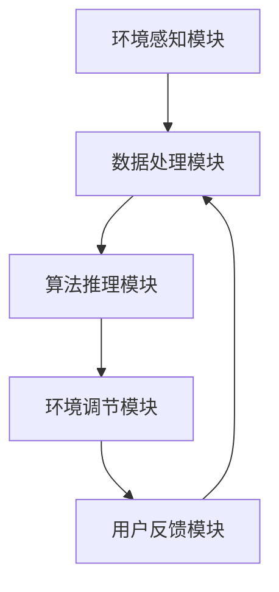

                 

# AI Agent在智能床头柜中的睡眠环境调节

## 关键词：AI Agent, 智能床头柜, 睡眠环境, 睡眠健康, 时间序列分析, 强化学习, 系统架构

## 摘要：  
本文详细探讨了AI Agent在智能床头柜中的应用，重点分析了如何通过AI技术优化睡眠环境调节。从AI Agent的核心概念到数学模型，从系统架构设计到项目实战，系统性地阐述了如何利用AI技术实现智能床头柜的智能化睡眠环境调节。通过时间序列分析和强化学习算法，结合系统化的架构设计，展示了如何构建一个高效、智能的睡眠环境调节系统。

---

## 第一章：AI Agent与智能床头柜的背景介绍

### 1.1 AI Agent的基本概念  
#### 1.1.1 什么是AI Agent  
AI Agent（人工智能代理）是一种能够感知环境、自主决策并执行任务的智能实体。它通过传感器获取信息，利用知识库和推理机制进行分析，最终做出决策并执行动作。  

#### 1.1.2 AI Agent的核心特点  
| 特性 | 描述 |
|------|------|
| 智能性 | 具备感知、推理和学习能力 |
| 自主性 | 能够自主决策和执行任务 |
| 交互性 | 能够与环境和用户进行实时交互 |
| 可扩展性 | 支持多种场景和功能扩展 |

#### 1.1.3 AI Agent与传统智能设备的区别  
- **传统智能设备**：基于预设程序执行固定任务，无法自主学习或优化。  
- **AI Agent**：具备自主决策能力，能够根据环境反馈动态调整行为。  

### 1.2 智能床头柜的功能与应用场景  
#### 1.2.1 智能床头柜的功能模块  
- **环境感知模块**：采集温度、湿度、光线、噪音等环境数据。  
- **睡眠监测模块**：监测用户的睡眠状态，如REM、浅睡眠、深睡眠阶段。  
- **环境调节模块**：根据数据调整灯光、空调、加湿器等设备。  
- **用户反馈模块**：收集用户的偏好和反馈，优化调节策略。  

#### 1.2.2 睡眠环境调节的重要性  
- 睡眠质量直接影响健康，优化睡眠环境是提升生活质量的关键。  
- 通过AI Agent实现个性化睡眠调节，满足不同用户的需求。  

#### 1.2.3 智能床头柜的应用场景  
- **家庭场景**：个性化睡眠调节，提升家庭成员的睡眠质量。  
- **酒店场景**：为客人提供舒适的睡眠环境，提升服务质量。  
- **医疗场景**：帮助患者改善睡眠，辅助治疗相关疾病。  

### 1.3 AI Agent在睡眠环境调节中的作用  
#### 1.3.1 AI Agent如何优化睡眠环境  
- 通过感知环境数据，结合用户偏好，动态调整睡眠环境参数。  
- 利用历史数据和机器学习模型预测最佳睡眠环境配置。  

#### 1.3.2 AI Agent在睡眠健康中的价值  
- 提供个性化睡眠建议，帮助用户改善睡眠质量。  
- 监测睡眠健康状况，及时发现异常并预警。  

#### 1.3.3 未来发展趋势  
- AI Agent将更加智能化，能够实时学习和优化睡眠调节策略。  
- 多设备协同工作，构建智能睡眠生态系统。  

---

## 第二章：AI Agent的核心概念与原理  

### 2.1 AI Agent的核心概念  
#### 2.1.1 知识表示  
知识表示是AI Agent理解环境和用户需求的基础。常用的知识表示方法包括：  
- **规则表示法**：通过预设规则描述环境和用户行为。  
- **语义网络**：通过节点和边表示概念及其关系。  
- **概率图模型**：通过概率关系描述不确定性知识。  

#### 2.1.2 感知与推理  
- **感知**：通过传感器获取环境数据，如温度、湿度、光照强度等。  
- **推理**：基于知识库和推理规则，从感知数据中提取有用信息。  

#### 2.1.3 决策与执行  
- **决策**：根据推理结果和用户反馈，制定最优调节策略。  
- **执行**：通过控制设备（如空调、加湿器）实现环境调节。  

### 2.2 AI Agent的感知与推理机制  
#### 2.2.1 数据采集与处理  
- 数据采集：通过传感器获取环境数据和用户行为数据。  
- 数据清洗：去除噪声数据，确保数据质量。  

#### 2.2.2 知识库构建  
- 知识库是AI Agent理解和推理的基础，包括：  
  - 环境参数的正常范围。  
  - 用户的睡眠偏好和习惯。  
  - 睡眠环境调节的最佳实践。  

#### 2.2.3 推理算法  
- **规则推理**：基于预设规则进行推理，适用于确定性场景。  
- **概率推理**：基于概率模型进行推理，适用于不确定性场景。  

### 2.3 AI Agent的决策与执行流程  
#### 2.3.1 决策模型  
- 基于环境数据和用户反馈，生成调节策略。  

#### 2.3.2 执行策略  
- 通过控制设备执行调节动作，如调整灯光亮度、调节空调温度等。  

#### 2.3.3 反馈机制  
- 收集用户反馈，优化调节策略，形成闭环控制系统。  

---

## 第三章：AI Agent的数学模型与算法原理  

### 3.1 时间序列分析模型  
#### 3.1.1 ARIMA模型  
ARIMA（自回归积分滑动平均模型）是一种常用的时间序列预测模型。其数学表达式为：  
$$ ARIMA(p, d, q) $$  
其中，$p$ 是自回归阶数，$d$ 是差分阶数，$q$ 是滑动平均阶数。  

#### 3.1.2 LSTM网络  
LSTM（长短期记忆网络）是一种基于深度学习的时间序列预测模型。其核心思想是通过记忆单元（Memory Cell）保存长期信息，避免传统RNN的梯度消失问题。  

#### 3.1.3 模型选择与优化  
- 根据数据特征选择合适的模型。  
- 通过交叉验证和网格搜索优化模型参数。  

### 3.2 睡眠数据分析与建模  
#### 3.2.1 数据预处理  
- 数据清洗：去除噪声数据。  
- 数据标准化：将数据归一化处理，便于模型训练。  

#### 3.2.2 特征提取  
- 提取关键特征，如睡眠阶段、环境参数、用户行为等。  

#### 3.2.3 模型训练与验证  
- 使用训练数据训练模型，通过验证集评估模型性能。  

### 3.3 基于强化学习的决策算法  
#### 3.3.1 强化学习基础  
强化学习是一种通过试错机制学习策略的方法。其核心要素包括：  
- **状态（State）**：环境的当前状态。  
- **动作（Action）**：AI Agent采取的动作。  
- **奖励（Reward）**：动作带来的反馈，用于指导学习。  

#### 3.3.2 状态空间与动作空间  
- **状态空间**：所有可能的环境状态。  
- **动作空间**：AI Agent可以执行的所有动作。  

#### 3.3.3 奖励机制设计  
- 设计合理的奖励机制，引导AI Agent做出最优决策。  

---

## 第四章：系统架构与设计  

### 4.1 系统整体架构  
#### 4.1.1 分层架构设计  
- **数据采集层**：负责采集环境数据和用户反馈。  
- **数据处理层**：对数据进行清洗和特征提取。  
- **算法层**：运行时间序列分析和强化学习算法。  
- **控制层**：根据算法结果控制设备执行调节动作。  

#### 4.1.2 模块划分  
- **环境感知模块**：采集环境数据。  
- **睡眠监测模块**：监测用户的睡眠状态。  
- **环境调节模块**：根据算法结果调节环境参数。  
- **用户反馈模块**：收集用户的偏好和反馈。  

#### 4.1.3 交互流程  
- 用户进入睡眠状态，系统开始监测环境和睡眠数据。  
- AI Agent根据数据生成调节策略，控制设备执行。  
- 用户反馈调节效果，系统优化策略。  

### 4.2 数据采集与处理模块  
#### 4.2.1 传感器数据采集  
- 使用温湿度传感器、光照传感器、噪音传感器等采集环境数据。  

#### 4.2.2 数据清洗与预处理  
- 去除异常数据，填充缺失值。  

### 4.3 系统架构设计  
#### 4.3.1 系统功能设计  
- **环境感知**：采集环境数据。  
- **睡眠监测**：监测用户的睡眠状态。  
- **环境调节**：根据数据调节环境参数。  
- **用户反馈**：收集用户的偏好和反馈。  

#### 4.3.2 系统架构图  

### 4.4 接口设计与交互流程  
#### 4.4.1 系统接口设计  
- **环境感知接口**：提供环境数据采集接口。  
- **算法推理接口**：提供数据处理和算法推理接口。  
- **设备控制接口**：提供设备控制接口，如调整灯光亮度、空调温度等。  

#### 4.4.2 交互流程  
- 用户进入睡眠状态，系统开始监测环境和睡眠数据。  
- AI Agent根据数据生成调节策略，控制设备执行。  
- 用户反馈调节效果，系统优化策略。  

---

## 第五章：项目实战  

### 5.1 环境搭建  
#### 5.1.1 硬件设备  
- 温湿度传感器、光照传感器、噪音传感器等。  
- 灯光控制器、空调控制器等设备。  

#### 5.1.2 软件工具  
- Python编程语言。  
- TensorFlow或PyTorch深度学习框架。  
- 数据可视化工具，如Matplotlib。  

### 5.2 核心实现  
#### 5.2.1 数据采集与处理  
- 使用Python脚本采集环境数据并进行预处理。  

#### 5.2.2 时间序列分析模型实现  
- 使用ARIMA模型或LSTM网络进行睡眠数据分析与建模。  

#### 5.2.3 强化学习算法实现  
- 设计强化学习算法，实现环境调节策略优化。  

### 5.3 系统集成与测试  
#### 5.3.1 系统集成  
- 将各个模块集成到一个完整的系统中。  

#### 5.3.2 系统测试  
- 测试系统功能，确保各模块协同工作。  

### 5.4 案例分析  
#### 5.4.1 实际案例  
- 通过实际案例展示系统如何优化睡眠环境。  

#### 5.4.2 性能分析  
- 分析系统的性能指标，如调节响应时间、调节准确率等。  

---

## 第六章：总结与展望  

### 6.1 总结  
本文详细探讨了AI Agent在智能床头柜中的应用，从理论到实践，系统性地阐述了如何利用AI技术实现睡眠环境的智能化调节。通过时间序列分析和强化学习算法，结合系统化的架构设计，展示了如何构建一个高效、智能的睡眠环境调节系统。  

### 6.2 展望  
未来，AI Agent在睡眠环境调节中的应用将更加智能化和个性化。随着技术的进步，AI Agent将能够更好地理解和满足用户的睡眠需求，为用户提供更加优质的睡眠体验。  

### 6.3 最佳实践 tips  
- 在实际应用中，建议结合用户的实际需求，灵活调整系统参数。  
- 定期更新模型，确保系统的调节效果。  

### 6.4 注意事项  
- 在系统设计中，需要充分考虑数据安全和隐私保护。  
- 系统的可扩展性设计，以便未来功能扩展。  

### 6.5 拓展阅读  
- 推荐阅读《深度学习》（Deep Learning, Ian Goodfellow等著），了解深度学习的基础知识。  
- 推荐阅读《强化学习：理论与算法》（Reinforcement Learning: Theory and Algorithms），深入理解强化学习的核心原理。  

---

## 作者：AI天才研究院 & 禅与计算机程序设计艺术  
本文作者是AI天才研究院和“禅与计算机程序设计艺术”团队，致力于人工智能与计算机程序设计的研究与实践，专注于将复杂的AI技术转化为易于理解和应用的知识体系。

