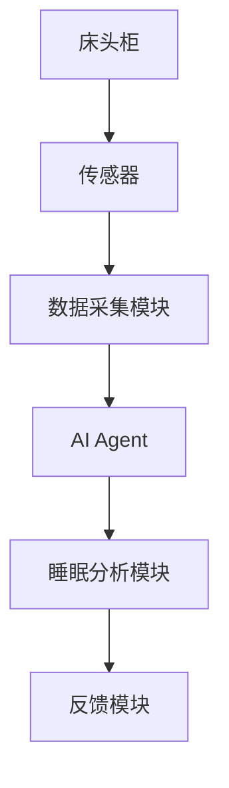
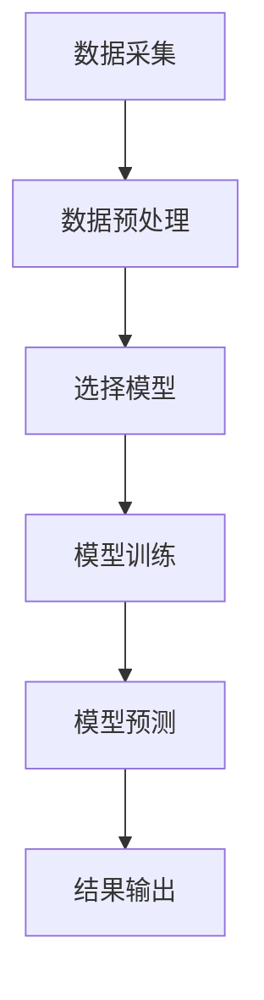

                 


# AI Agent在智能床头柜中的睡眠质量报告

## 关键词：AI Agent，智能床头柜，睡眠质量，物联网，数据采集，机器学习，智能交互

## 摘要：  
本文深入探讨了AI Agent在智能床头柜中的应用，结合睡眠质量分析的场景，详细介绍了AI Agent的核心原理、算法实现、系统架构设计以及实际应用案例。通过分析睡眠数据，结合物联网技术和机器学习算法，AI Agent能够实时监测和优化睡眠环境，为用户提供个性化的睡眠改善方案。本文旨在帮助读者理解AI Agent在智能床头柜中的技术实现及其在睡眠健康领域的应用价值。

---

## 第1章: 睡眠健康与AI Agent概述

### 1.1 睡眠健康的重要性  
睡眠是人体健康的重要组成部分，直接影响人的精力、情绪和身体机能。现代人面临的工作压力和生活方式变化导致睡眠问题日益普遍。通过智能设备监测和改善睡眠质量，已成为提升健康水平的重要手段。  

#### 1.1.1 睡眠质量与人体健康的关系  
睡眠质量直接影响人体的免疫系统、记忆力和情绪调节能力。长期睡眠不足会导致注意力不集中、记忆力减退以及各种慢性疾病的发生率增加。  

#### 1.1.2 睡眠问题的普遍性与解决方案  
根据世界卫生组织的统计，全球约有27%的人存在睡眠障碍。传统的睡眠改善方法（如药物治疗）存在副作用，而智能化的睡眠改善方案（如AI Agent）能够通过非侵入式的方式提供实时监测和个性化建议。  

#### 1.1.3 智能床头柜的定义与应用场景  
智能床头柜是一种结合了物联网和人工智能技术的智能家居设备，能够通过传感器采集睡眠数据，并通过AI算法优化睡眠环境。其主要应用场景包括家庭、酒店和医疗康复中心。  

### 1.2 AI Agent的基本概念  
AI Agent是一种能够感知环境、做出决策并执行任务的智能实体。在智能床头柜中，AI Agent的核心功能是通过数据采集、分析和反馈，优化睡眠环境。  

#### 1.2.1 什么是AI Agent  
AI Agent（人工智能代理）是一种能够通过与环境交互来实现特定目标的智能系统。它可以是一个软件程序，也可以是一个嵌入硬件的模块。  

#### 1.2.2 AI Agent的核心功能与特点  
AI Agent的核心功能包括感知、决策和执行。其特点在于实时性、个性化和非侵入性。  

#### 1.2.3 AI Agent在睡眠质量改善中的作用  
AI Agent能够通过传感器采集睡眠数据，分析用户的睡眠模式，并通过调整床头柜的功能（如光线、温度、声音）来优化睡眠环境。  

### 1.3 技术背景与用户需求  
智能床头柜的开发离不开物联网和人工智能技术的支持。用户的实际需求包括实时监测、个性化建议和便捷的交互方式。  

#### 1.3.1 智能家居的发展趋势  
智能家居市场的快速发展为AI Agent的应用提供了广阔的舞台。床头柜作为卧室中重要的家具，其智能化改造具有重要意义。  

#### 1.3.2 用户对睡眠改善的实际需求  
用户希望通过智能设备获得更高质量的睡眠，包括实时监测、个性化建议和便捷的交互方式。  

#### 1.3.3 AI Agent在智能床头柜中的技术实现  
AI Agent在智能床头柜中的技术实现包括数据采集、算法分析和反馈控制。  

---

## 第2章: AI Agent的核心原理与系统架构  

### 2.1 AI Agent的核心原理  
AI Agent的核心原理包括感知、决策和执行三个模块。  

#### 2.1.1 AI Agent的感知模块  
感知模块通过传感器采集睡眠数据，包括心率、呼吸频率和环境参数（如温度、湿度）。  

#### 2.1.2 AI Agent的决策模块  
决策模块基于机器学习算法对数据进行分析，生成优化睡眠环境的建议。  

#### 2.1.3 AI Agent的执行模块  
执行模块通过床头柜的硬件设备（如LED灯、风扇）调整睡眠环境。  

### 2.2 AI Agent与智能床头柜的结合  
AI Agent与智能床头柜的结合需要考虑实体关系和系统架构。  

#### 2.2.1 智能床头柜的功能模块  
智能床头柜的功能模块包括数据采集模块、AI Agent模块和反馈控制模块。  

#### 2.2.2 AI Agent在床头柜中的实体关系图  


---

## 第3章: 睡眠质量预测算法原理  

### 3.1 基于时间序列的睡眠质量预测  
时间序列分析是一种常用的机器学习方法，适用于睡眠数据的预测任务。  

#### 3.1.1 时间序列预测模型的流程图  


#### 3.1.2 算法实现的Python代码  
```python
import pandas as pd
from sklearn.model_selection import train_test_split
from sklearn.

