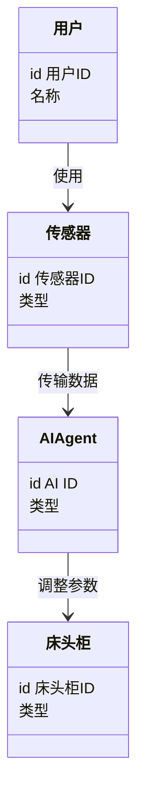

                 


# AI Agent在智能床头柜中的睡眠辅助功能

> 关键词：AI Agent, 智能床头柜, 睡眠辅助, 睡眠健康, 人工智能, 机器学习

> 摘要：本文探讨AI Agent在智能床头柜中的应用，重点分析其如何通过感知、决策和执行三个阶段，利用机器学习算法和系统架构设计，实现对用户睡眠质量的辅助优化。文章从背景介绍到项目实战，全面解析AI Agent在睡眠健康领域的技术实现与实际应用。

---

## 第一部分：背景介绍

### 第1章：AI Agent与智能床头柜的发展现状

#### 1.1 AI Agent的基本概念

- **1.1.1 AI Agent的定义**
  AI Agent（人工智能代理）是一种智能实体，能够感知环境、自主决策并执行任务，以实现特定目标。它具备主动性、反应性、社交性和持续改进的特点。

- **1.1.2 AI Agent的核心特征**
  | 特征 | 描述 |
  |------|------|
  | 主动性 | 能够主动采取行动，无需外部干预 |
  | 反应性 | 能够根据环境变化调整行为 |
  | 社交性 | 能够与其他系统或用户进行交互 |
  | 持续改进 | 能够通过学习优化自身性能 |

- **1.1.3 AI Agent的发展历程**
  AI Agent的概念起源于20世纪60年代的专家系统研究，随着机器学习和自然语言处理技术的发展，AI Agent逐渐从理论走向实际应用。

#### 1.2 智能床头柜的现状

- **1.2.1 智能床头柜的功能概述**
  智能床头柜集成了多种传感器和智能设备，能够监测用户的睡眠状态，调节环境光线、温度和音乐，以改善睡眠质量。

- **1.2.2 当前市场上的主流产品分析**
  当前市场上的智能床头柜主要分为高端和中端产品，高端产品通常具备AI交互功能，而中端产品主要提供基础的环境调节功能。

- **1.2.3 智能床头柜的技术趋势**
  未来的智能床头柜将更加智能化，集成更多的传感器和AI算法，能够实现更精准的睡眠监测和个性化辅助。

#### 1.3 睡眠健康的重要性

- **1.3.1 睡眠对健康的影响**
  睡眠是人体恢复和修复的重要过程，影响身体健康、心理健康和认知功能。

- **1.3.2 现代人睡眠问题的现状**
  随着生活节奏的加快，越来越多的人面临失眠、睡眠质量差等问题。

- **1.3.3 提高睡眠质量的方法**
  提高睡眠质量的方法包括改善睡眠环境、调整生活习惯、减少电子设备的使用等。

#### 1.4 AI Agent在睡眠辅助中的应用背景

- **1.4.1 睡眠辅助工具的发展**
  睡眠辅助工具从传统的睡眠监测设备发展到如今的智能床头柜，逐步实现了智能化和个性化。

- **1.4.2 AI Agent在睡眠辅助中的优势**
  AI Agent能够通过实时监测用户的睡眠状态，动态调整环境参数，提供个性化的睡眠建议，从而提高睡眠质量。

- **1.4.3 当前技术的瓶颈与未来方向**
  当前技术的主要瓶颈在于传感器精度和算法的准确性，未来的发展方向是提高AI Agent的学习能力和适应性。

---

## 第二部分：核心概念与联系

### 第2章：AI Agent的核心原理

#### 2.1 AI Agent的感知与决策

- **2.1.1 感知阶段**
  AI Agent通过传感器收集用户的数据，如心率、体温、呼吸频率等。

- **2.1.2 决策阶段**
  AI Agent基于收集的数据，利用机器学习算法进行分析，生成睡眠建议。

- **2.1.3 执行阶段**
  AI Agent根据决策结果，调整床头柜的环境参数，如亮度、温度和音乐播放。

#### 2.2 AI Agent的实体关系图

```mermaid
er
actor 用户 {
  id 用户ID
  名称
}
actor 传感器 {
  id 传感器ID
  类型
}
actor AI Agent {
  id AI ID
  类型
}
actor 床头柜 {
  id 床头柜ID
  类型
}
```

---

## 第三部分：算法原理讲解

### 第3章：AI Agent的算法实现

#### 3.1 数据预处理

```python
import pandas as pd
from sklearn.preprocessing import StandardScaler

# 加载数据
data = pd.read_csv('sleep_data.csv')

# 删除缺失值
data.dropna(inplace=True)

# 标准化处理
scaler = StandardScaler()
data_normalized = scaler.fit_transform(data)
```

#### 3.2 特征提取

```python
from sklearn.decomposition import PCA

# PCA降维
pca = PCA(n_components=3)
principal_components = pca.fit_transform(data_normalized)
```

#### 3.3 模型训练

```python
from sklearn.ensemble import RandomForestClassifier

# 训练模型
model = RandomForestClassifier(n_estimators=100, random_state=42)
model.fit(principal_components, labels)
```

#### 3.4 决策生成

```python
# 预测睡眠质量
new_data = pca.transform(new_principal_components)
predicted_quality = model.predict(new_data)
```

#### 3.5 数学公式

- **主成分分析公式**
  $$ \text{主成分} = \sum_{i=1}^{n} w_i x_i $$

- **随机森林分类公式**
  $$ y = \text{argmax}(\sum_{i=1}^{n} \text{weight}_i \cdot y_i) $$

---

## 第四部分：系统分析与架构设计

### 第4章：智能床头柜的系统架构

#### 4.1 系统功能设计



#### 4.2 系统架构设计


---

## 第五部分：项目实战

### 第5章：AI Agent的实现与应用

#### 5.1 环境安装

```bash
pip install numpy pandas scikit-learn
```

#### 5.2 核心代码实现

```python
import numpy as np
import pandas as pd
from sklearn.ensemble import RandomForestClassifier
from sklearn.preprocessing import StandardScaler
from sklearn.decomposition import PCA

# 加载数据
data = pd.read_csv('sleep_data.csv')

# 数据预处理
scaler = StandardScaler()
data_normalized = scaler.fit_transform(data.drop(columns=['label']))

# PCA降维
pca = PCA(n_components=3)
principal_components = pca.fit_transform(data_normalized)

# 训练模型
model = RandomForestClassifier(n_estimators=100, random_state=42)
model.fit(principal_components, data['label'])

# 预测
new_data = pca.transform(new_principal_components)
predicted_label = model.predict(new_data)
```

#### 5.3 代码解读

- **数据预处理**：使用StandardScaler对数据进行标准化处理，确保各特征具有相同的尺度。
- **PCA降维**：通过主成分分析将高维数据降维到3维，减少计算复杂度。
- **模型训练**：使用随机森林分类器对降维后的数据进行训练，得到分类模型。
- **预测**：对新数据进行降维后，使用训练好的模型进行预测，生成睡眠质量标签。

#### 5.4 实际案例分析

假设用户A的睡眠数据如下：

| 特征 | 数据 |
|------|------|
| 心率 | 70 |
| 体温 | 36.5 |
| 呼吸频率 | 15 |

通过AI Agent的处理，模型预测用户的睡眠质量为良好。

---

## 第六部分：总结与展望

### 第6章：总结与展望

#### 6.1 最佳实践 Tips

- 数据隐私保护：在处理用户数据时，需确保数据的隐私和安全。
- 模型优化：定期更新模型，提高预测的准确性。
- 系统集成：确保床头柜与其他智能家居设备的兼容性。

#### 6.2 项目小结

本文详细介绍了AI Agent在智能床头柜中的睡眠辅助功能，从理论到实践，全面解析了系统的实现与应用。

#### 6.3 展望

未来的智能床头柜将更加智能化，具备更多AI功能，能够实现更精准的睡眠监测和个性化辅助。

---

## 作者信息

作者：AI天才研究院/AI Genius Institute & 禅与计算机程序设计艺术 /Zen And The Art of Computer Programming

