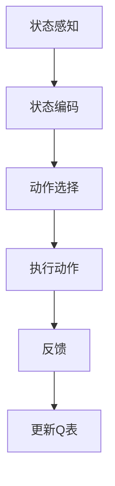
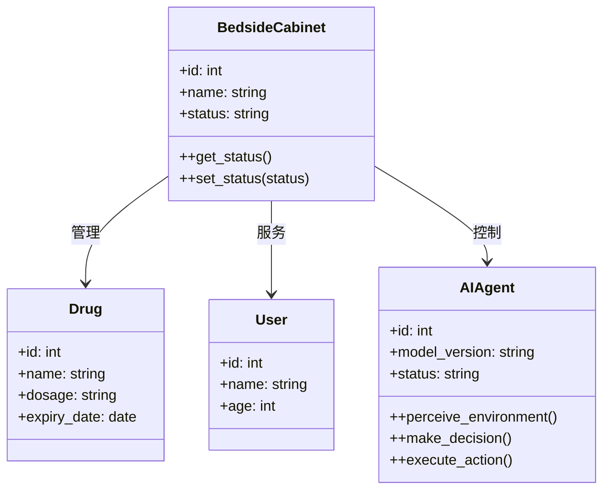
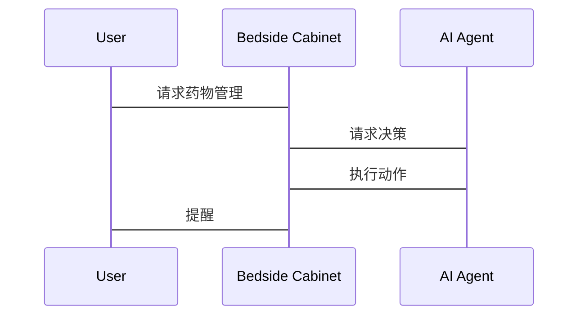

                 


# AI Agent在智能床头柜中的药物管理

> 关键词：AI Agent, 智能床头柜, 药物管理, 系统架构, 项目实战

> 摘要：本文详细探讨了AI Agent在智能床头柜中的药物管理应用，从背景介绍、核心概念、算法原理、系统架构到项目实战，全面分析了该系统的设计与实现。通过结合理论与实践，本文为读者提供了深刻的技术见解。

---

## 第一章：背景介绍

### 1.1 问题背景

#### 1.1.1 老龄化社会与慢性病管理需求
随着全球老龄化进程加快，慢性病患者数量急剧增加。传统的药物管理模式存在效率低、易出错等问题，难以满足患者的需求。

#### 1.1.2 智能家居与医疗健康结合的趋势
智能家居技术的快速发展为医疗健康管理提供了新的可能性。智能床头柜作为智能家居的一部分，可以集成多种传感器和智能设备，为药物管理提供支持。

#### 1.1.3 药物管理痛点与优化空间
传统药物管理存在以下问题：
- 药物存储不当导致药品过期或失效。
- 药品取出和服用时间难以精确控制。
- 药物管理缺乏智能化，无法实时监控和提醒。

### 1.2 问题描述

#### 1.2.1 智能床头柜的功能定位
智能床头柜是一个集成AI Agent的智能设备，能够实现药物存储、管理、提醒和监控功能。

#### 1.2.2 药物管理的核心问题
- 药物存储的智能化管理。
- 药物服用时间的精准提醒。
- 药物管理的实时监控与反馈。

#### 1.2.3 用户需求与痛点分析
用户主要需求包括：
- 自动化的药物存储和管理。
- 智能提醒和通知。
- 实时监控和健康反馈。

### 1.3 问题解决

#### 1.3.1 AI Agent的核心作用
AI Agent通过感知环境、分析数据、决策并执行动作，实现对药物管理的智能化控制。

#### 1.3.2 智能床头柜的解决方案
智能床头柜通过集成AI Agent，实现药物的智能化存储、管理和提醒功能。

#### 1.3.3 药物管理流程优化
AI Agent优化了药物管理流程，实现了从存储到服用的全程智能化管理。

### 1.4 边界与外延

#### 1.4.1 系统边界定义
智能床头柜系统的边界包括：
- 药物存储模块。
- AI Agent控制模块。
- 用户交互界面。

#### 1.4.2 功能的外延扩展
- 药物管理系统的扩展功能包括健康监测、医疗数据上传等。

#### 1.4.3 系统与外部环境的交互
系统通过物联网与家庭医疗设备、云端数据平台进行交互。

### 1.5 核心要素组成

#### 1.5.1 AI Agent的关键组件
- 状态感知模块。
- 决策模块。
- 执行模块。

#### 1.5.2 智能床头柜的功能模块
- 药物存储模块。
- 传感器模块。
- 用户交互模块。

#### 1.5.3 药物管理系统的构成
- 药物存储单元。
- 药物管理单元。
- 数据处理单元。

---

## 第二章：核心概念与联系

### 2.1 AI Agent的原理

#### 2.1.1 AI Agent的基本概念
AI Agent是一种智能体，能够感知环境、做出决策并执行动作。

#### 2.1.2 AI Agent的核心算法
AI Agent的核心算法包括：
- 状态空间表示。
- 动作空间定义。
- 策略函数。

#### 2.1.3 AI Agent与传统算法的对比
AI Agent与传统算法的主要区别在于其智能化和自适应能力。

### 2.2 核心概念属性对比

#### 2.2.1 AI Agent与传统软件的对比
- AI Agent具有学习和自适应能力，而传统软件不具备。

#### 2.2.2 AI Agent与规则引擎的对比
AI Agent能够处理复杂场景，而规则引擎仅能处理简单规则。

#### 2.2.3 AI Agent与机器学习模型的对比
AI Agent结合了机器学习模型和规则引擎的特点。

### 2.3 ER实体关系图
```mermaid
er
    Bedside Cabinet {
        id
        name
        status
    }
    Drug {
        id
        name
        dosage
        expiry_date
    }
    User {
        id
        name
        age
    }
    AI Agent {
        id
        model_version
        status
    }
    Bedside Cabinet --> Drug: 管理
    Bedside Cabinet --> User: 服务
    Bedside Cabinet --> AI Agent: 控制
```

---

## 第三章：算法原理讲解

### 3.1 算法原理概述

#### 3.1.1 状态空间定义
状态空间包括床头柜的状态、药品的状态、用户的状态。

#### 3.1.2 动作空间定义
动作空间包括药品存入、取出、提醒等操作。

#### 3.1.3 策略函数
策略函数定义了AI Agent在不同状态下的决策规则。

### 3.2 算法实现

#### 3.2.1 Q-learning算法
Q-learning算法用于AI Agent的决策过程。

#### 3.2.2 算法流程图


#### 3.2.3 Python代码实现
```python
import numpy as np

# 状态空间
state_space = ['drug_available', 'drug_unavailable']

# 动作空间
action_space = ['take_drug', 'no_action']

# Q表初始化
Q = np.zeros(len(state_space), len(action_space))

# Q-learning算法
def q_learning(state):
    # 选择动作
    action = np.argmax(Q[state])
    # 执行动作
    # ...
    # 更新Q表
    # ...
```

### 3.3 数学模型与公式

#### 3.3.1 Q-learning更新公式
$$ Q(s,a) = Q(s,a) + \alpha (r + \gamma \max Q(s',a') - Q(s,a)) $$

#### 3.3.2 状态转移概率
$$ P(s' | s, a) = \text{概率从状态s转移到状态s'，执行动作a} $$

---

## 第四章：系统分析与架构设计

### 4.1 问题场景介绍

#### 4.1.1 项目介绍
本项目旨在设计一个基于AI Agent的智能床头柜药物管理系统。

#### 4.1.2 系统功能设计
- 药物存储与管理。
- AI Agent控制。
- 用户交互。

#### 4.1.3 领域模型


### 4.2 系统架构设计

#### 4.2.1 系统架构图


#### 4.2.2 系统接口设计
- Bedside Cabinet与AI Agent的接口。
- AI Agent与用户交互的接口。

#### 4.2.3 系统交互流程图


---

## 第五章：项目实战

### 5.1 环境安装

#### 5.1.1 系统要求
- 操作系统：Linux/Windows/MacOS
- Python版本：3.6+
- 依赖库：numpy, matplotlib, scikit-learn

#### 5.1.2 安装步骤
```bash
pip install numpy matplotlib scikit-learn
```

### 5.2 核心代码实现

#### 5.2.1 AI Agent核心代码
```python
class AIAgent:
    def __init__(self):
        self.Q = np.zeros((len(state_space), len(action_space)))

    def perceive_environment(self):
        # 返回当前状态
        pass

    def make_decision(self, state):
        return np.argmax(self.Q[state])

    def execute_action(self, action):
        # 执行动作并返回反馈
        pass

    def update_Q(self, state, action, reward, next_state):
        self.Q[state, action] += 0.1 * (reward + 0.9 * np.max(self.Q[next_state]) - self.Q[state, action])
```

#### 5.2.2 系统交互代码
```python
class BedsideCabinet:
    def __init__(self):
        self.drugs = []
        self.status = 'idle'

    def add_drug(self, drug):
        self.drugs.append(drug)

    def remove_drug(self):
        if self.drugs:
            self.drugs.pop(0)

    def get_status(self):
        return self.status

    def set_status(self, status):
        self.status = status
```

### 5.3 代码解读与分析

#### 5.3.1 AI Agent代码解读
AI Agent通过Q-learning算法实现药物管理决策。

#### 5.3.2 系统交互代码解读
Bedside Cabinet通过传感器和用户输入实现与AI Agent的交互。

### 5.4 实际案例分析

#### 5.4.1 案例背景
用户需要按时服用慢性病药物，智能床头柜通过AI Agent实现药物管理。

#### 5.4.2 案例分析
AI Agent根据用户数据和传感器反馈，实现药物的智能管理。

### 5.5 项目小结

#### 5.5.1 核心代码实现
- AI Agent的Q-learning算法实现。
- Bedside Cabinet的药物管理功能实现。

#### 5.5.2 系统测试
- 功能测试：药物存取、提醒功能。
- 性能测试：系统稳定性、响应速度。

#### 5.5.3 项目总结
通过本项目，我们成功实现了AI Agent在智能床头柜中的药物管理应用。

---

## 第六章：最佳实践

### 6.1 小结

#### 6.1.1 核心思想总结
AI Agent通过智能化管理实现药物的精准控制。

#### 6.1.2 关键技术总结
- Q-learning算法。
- 系统架构设计。
- 系统交互设计。

### 6.2 注意事项

#### 6.2.1 系统设计注意事项
- 系统稳定性。
- 数据安全性。

#### 6.2.2 项目实施注意事项
- 代码规范。
- 测试充分性。

#### 6.2.3 用户使用注意事项
- 设备维护。
- 数据隐私保护。

### 6.3 拓展阅读

#### 6.3.1 推荐书籍
- 《强化学习（Deep Reinforcement Learning）》
- 《智能系统设计与实现》

#### 6.3.2 推荐博客
- AI Agent技术博客
- 智能家居技术博客

---

## 作者：AI天才研究院/AI Genius Institute & 禅与计算机程序设计艺术 /Zen And The Art of Computer Programming

---

通过以上思考步骤，我们可以清晰地看到，AI Agent在智能床头柜中的药物管理是一个复杂但极具价值的项目。通过本文的详细讲解，读者可以深入了解该系统的实现细节和应用价值。

